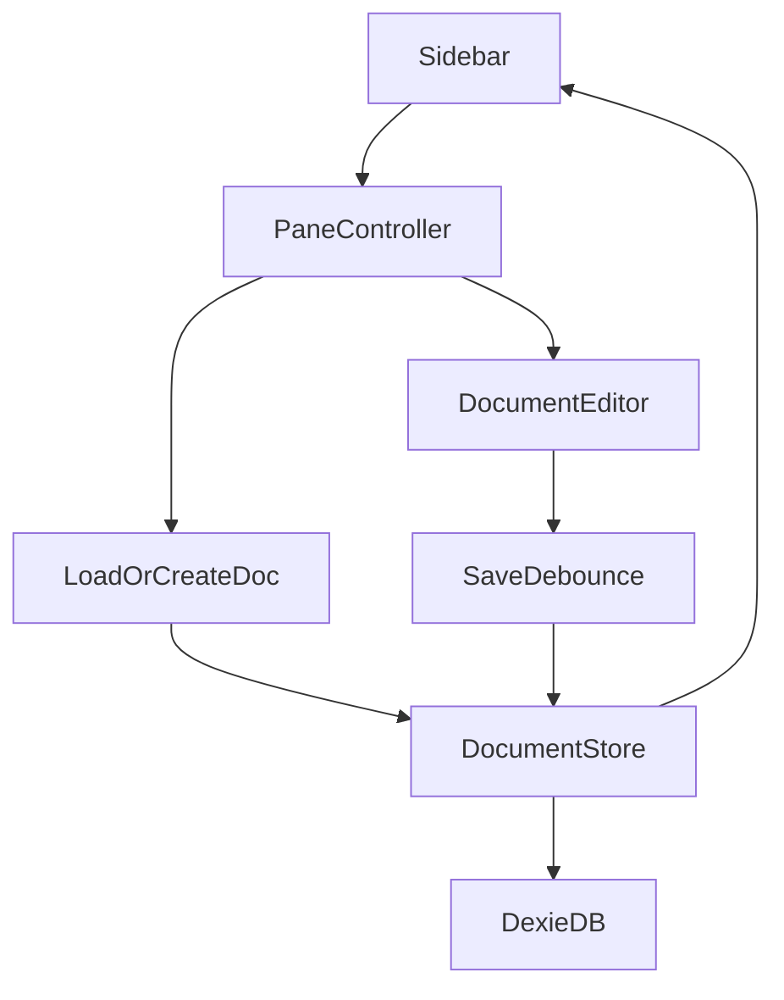

# design.md

artifact_id: 77c0ad5d-1112-4d37-8d39-c58b082f4f1e

## Overview

Implement a minimal TipTap editor for creating and editing documents stored locally (Dexie) with existing DB utilities. Integrate with the existing multi-pane abstraction used for chats so a pane can show either a chat thread or a document. Scope is intentionally small: one simple schema, one list view, one editor component, basic formatting.

## Architecture

High-Level Flow:

1. User clicks "New Document" or selects an existing one from sidebar.
2. Active pane context switches to mode = 'document' with documentId.
3. Pane loads document via `documents` module (create or fetch) and instantiates `<DocumentEditor>` (TipTap instance).
4. User edits; editor emits debounced updates -> save pipeline -> Dexie write -> update updated_at.
5. Sidebar list reacts (live query or explicit refresh) and reorders document position.



## Components / Modules

1. documents.ts (DB API) - implement minimal CRUD (create, get, list, update). Already stubbed; will follow patterns in other db modules.
2. DocumentStore (lightweight composable) - reactive cache per id, handles save debounce & status state.
3. DocumentEditor.vue - wraps TipTap editor, toolbar, title input, status indicator. Emits changes.
4. SidebarDocumentsList.vue - lists documents (id, title, updated_at). Integrates into existing sidebar region.
5. Pane integration - extend pane state with `mode: 'chat' | 'doc'` and `documentId?` (mutually exclusive with threadId). Update logic in `ChatPageShell.vue` minimal patch.

## Data Model

TypeScript interface:

```ts
export interface DocumentRecord {
    id: string;
    title: string; // fallback 'Untitled'
    content: any; // TipTap JSON
    created_at: number; // seconds
    updated_at: number; // seconds
    deleted: boolean;
    clock: number; // optimistic concurrency (reuse pattern)
}
```

Persistence decisions:

-   Store `content` as JSON string in Dexie (like other data) or direct object; keep consistent with existing modules (likely object). For simplicity: object.
-   Update path: every debounced change increments `clock` and sets updated_at.

## Simple documents.ts API (planned)

```ts
import { db } from './client';
import { newId, nowSec } from './util';

export async function createDocument(
    partial?: Partial<DocumentRecord>
): Promise<DocumentRecord> {
    /* fill defaults */
}
export async function getDocument(
    id: string
): Promise<DocumentRecord | undefined> {
    /* db.get */
}
export async function listDocuments(limit = 100): Promise<DocumentRecord[]> {
    /* order by updated_at desc */
}
export async function updateDocument(
    id: string,
    patch: Partial<Pick<DocumentRecord, 'title' | 'content'>>
): Promise<DocumentRecord | undefined> {
    /* merge & save */
}
```

Error strategy: catch, rethrow with prefix 'Document:' or return undefined for not found.

## DocumentStore Composable

Responsibilities:

-   Provide reactive map: id -> { record, status: 'idle'|'saving'|'saved'|'error', lastError? }
-   Expose load(id), create(), setTitle(id,title), applyContentPatch(id, docJSON).
-   Debounce: internal timer per id (single setTimeout). Delay 750ms after last mutation.
-   Immediate flush method for pane close.

Pseudo:

```ts
const docs = reactive(new Map<string, DocState>());
function ensure(id) { /* init state */ }
function scheduleSave(id) { clearTimeout(t); t=setTimeout(()=>flush(id), 750); }
async function flush(id) { status='saving'; try { await updateDocument(...); status='saved'; } catch(e){ status='error'; lastError=e; } }
```

## Editor Component (DocumentEditor.vue)

Props: { documentId: string }
Hooks:

-   on mount: load via DocumentStore
-   watch doc state -> update TipTap content if id changes
-   TipTap extensions: StarterKit (paragraph, heading, bold, italic, code, lists, hr, history)
-   Toolbar buttons: call chain() API
-   Title input: v-model -> debounced store.setTitle
-   Status text: computed from store state

Prevent loop: Only set editor content if incoming record.content JSON differs (deep compare of version field or JSON stringify length). Keep simple: compare stringified once cached.

## Pane Integration Changes

Add to PaneState:

```ts
interface PaneState {
    id: string;
    mode: 'chat' | 'doc';
    threadId: string; // used when mode==='chat'
    documentId?: string; // used when mode==='doc'
    messages: ChatMessage[];
    // ... existing
}
```

Helpers:

-   openDocumentInPane(paneIndex, docId) sets mode & clears chat-specific arrays.
-   newDocumentInPane(paneIndex) -> create then open.
    URL routing: Keep unchanged: URLs still /chat or /chat/<threadId>. Documents do not yet get deep links (out of scope minimal). If needed later we can map /doc/<id>.

## Sidebar Integration

Add documents list under a simple divider. Each item click -> openDocumentInPane(activePaneIndex, id).

## Error Handling

-   Wrap each DB call in try/catch; toast on error.
-   Editor shows inline fallback: if record can't load, show message & retry button.

## Testing Strategy (Lightweight)

-   Unit: DocumentStore debounce flush logic (simulate rapid patches).
-   Unit: createDocument sets defaults (title fallback, timestamps non-zero).
-   Smoke manual: create, edit, rename, open second pane with chat + doc, ensure independent states.

(No heavy automated integration tests for now—scope minimal.)

## Performance

-   Single TipTap instance per open document pane. Usually <= 1-2.
-   Debounce saves to avoid write storm.
-   Avoid deep cloning large JSON on every keystroke (TipTap handles internal state). We only snapshot JSON when scheduling save.

## Open Questions (Deferred)

-   Full text search indexing documents (later).
-   Sharing / export (later).
-   Deep linking for documents (later).
