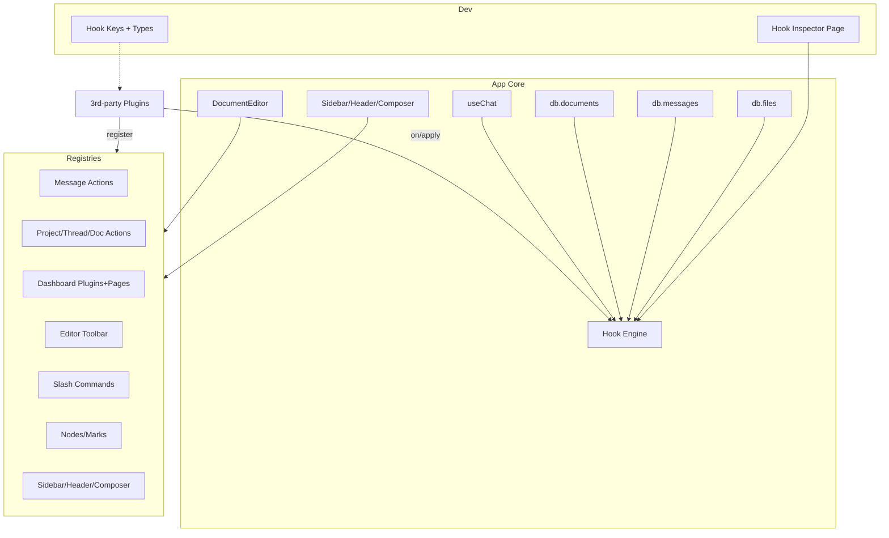

artifact_id: 0a2de7f6-64b0-4b76-9c28-7fd576232772

# Extensibility & Plugin Surface Unification — Design

## Overview

This design unifies and expands the extension surface using the existing hooks engine and UI registries. We standardize hook namespaces, publish typed keys/payloads, add message lifecycle hooks, and introduce editor/UI registries that mirror established patterns (message actions, project tree, dashboard plugins). We also add a minimal plugin capability model and a developer Hook Inspector.

Guiding principles:

-   Minimal surface, maximal leverage. Prefer filters/actions over invasive APIs.
-   Mirror existing patterns: HMR-safe global registries with reactive projections and default order 200.
-   Strong typing at the boundaries: exported payload types and key unions.
-   Backward-compatible: only additive hook keys; preserve existing names.

## Architecture

### Core components

-   Hook engine: already implemented (`app/utils/hooks.ts`, client singleton + server-per-request providers).
-   Hook map/types: new `app/utils/hook-keys.ts` exporting `HookKey` union and payload interfaces.
-   Message lifecycle: reinforce calls inside `app/composables/useAi.ts` (present) and add missing `complete/error` stream actions.
-   Registries: new composables mirroring existing ones.
    -   Editor: `useEditorToolbar.ts`, `useEditorSlashCommands.ts`, `useEditorNodes.ts`.
    -   UI chrome: `useSidebarSections.ts`, `useHeaderActions.ts`, `useComposerActions.ts`.
    -   Thread history: already present (`useThreadHistoryActions.ts`) — verify export usage and docs.
-   Capability manifest: extend `useDashboardPlugins.ts` types with optional `capabilities: string[]` and light client-side guards.
-   Hook Inspector: dashboard page leveraging `hooks._diagnostics`.

## Components and Interfaces

### Hook keys and payloads (TypeScript)

File: `app/utils/hook-keys.ts`

-   Export `type HookKey = 'ui.chat.message:filter:outgoing' | 'ui.chat.message:filter:incoming' | 'ai.chat.send:action:before' | 'ai.chat.send:action:after' | 'ai.chat.stream:action:delta' | 'ai.chat.stream:action:reasoning' | 'ai.chat.stream:action:complete' | 'ai.chat.stream:action:error' | ...` (include existing pane/thread/db hooks).
-   Export payload types:
    -   `ChatOutgoingPayload = string | false` (filter return contract)
    -   `AiSendBefore = { threadId?: string; modelId: string; user: { id: string; length: number }; assistant: { id: string; streamId: string }; messagesCount?: number }`
    -   `AiStreamDeltaCtx = { threadId?: string; assistantId: string; streamId: string; deltaLength: number; totalLength: number; chunkIndex: number }`
    -   `AiStreamReasoningCtx = { threadId?: string; assistantId: string; streamId: string; reasoningLength: number }`
    -   `AiStreamCompleteCtx = { threadId?: string; assistantId: string; streamId: string; totalLength: number; reasoningLength?: number; fileHashes?: string | null }`
    -   `AiStreamErrorCtx = { threadId?: string; streamId?: string; error?: unknown; aborted?: boolean }`
    -   Existing DB hooks: re-export narrowed types for `db.messages.*`, `db.documents.*`, `db.files.*`, `db.threads.*` for doc linkage.

Provide helper wrappers (optional) for `hooks.on<K extends HookKey>(k: K, fn: ...)` to narrow types in app code examples without changing engine internals.

### Editor registries

Files:

-   `app/composables/ui-extensions/editor/useEditorToolbar.ts`
    -   Interface:
        -   `EditorToolbarButton { id: string; icon: string; tooltip?: string; order?: number; isActive?: (editor: any) => boolean; onClick: (editor: any) => void | Promise<void>; visible?: (editor: any) => boolean; }`
    -   API: `registerEditorToolbarButton`, `unregisterEditorToolbarButton`, `useEditorToolbarButtons(editorRef)` returning ordered, visible buttons.
-   `app/composables/ui-extensions/editor/useEditorSlashCommands.ts`
    -   `SlashCommand { id: string; label: string; keywords?: string[]; order?: number; run: (editor: any, query: string) => void | Promise<void>; }`
    -   Registry APIs and computed projection filtered by current query.
-   `app/composables/ui-extensions/editor/useEditorNodes.ts`
    -   `EditorNode { id: string; extension: any; order?: number }` and similar `EditorMark`.
    -   APIs to list registered nodes/marks for editor initialization.

### UI chrome registries

Files:

-   `app/composables/ui-extensions/chrome/useSidebarSections.ts`
    -   `SidebarSection { id: string; order?: number; component: Component | () => Promise<any>; position?: 'top' | 'bottom' }`
    -   Additionally `SidebarFooterAction` if we want discrete controls.
-   `app/composables/ui-extensions/chrome/useHeaderActions.ts`
    -   `HeaderAction { id: string; icon: string; tooltip?: string; order?: number; handler: (ctx: { route?: any }) => void | Promise<void> }`
-   `app/composables/ui-extensions/chrome/useComposerActions.ts`
    -   `ComposerAction { id: string; icon: string; label?: string; tooltip?: string; order?: number; handler: (ctx: { threadId?: string; inputRef?: HTMLTextAreaElement | null }) => void | Promise<void> }`

All mirror the pattern in `useMessageActions.ts`: global singleton Map, reactive list, `register/unregister`, `use*()` sorted projection.

### Capability manifest

-   Extend `DashboardPlugin` in `useDashboardPlugins.ts` with:
    -   `capabilities?: string[]` (free-form strings; document core ones: `canReadMessages`, `canWriteDocs`, `canSend`, `canReadFiles`).
-   Provide `hasCapability(pluginId: string, cap: string): boolean` helper.
-   Soft guards at entry points (e.g., send/retry/document write) check active plugin context when action originates from plugin UI hooks (see Pane Plugin API context if present). If no plugin context, no gating applied. Keep minimal to avoid regressions.

### Hook Inspector Page

-   Register a dashboard plugin `devtools` with a page `hook-inspector`.
-   Page logic:
    -   Read `useHooks()._diagnostics` to display:
        -   Total callbacks for actions/filters.
        -   A list of hook names with counts and simple stats: avg, p95 (approximate via sorted durations), max.
        -   Error counts.
    -   Options: clear timings (reset internal arrays), toggle auto-refresh.

## Data Models

No persistent schema changes required. Capability manifests live in memory within dashboard plugin registry. Editor registries are in-memory.

## Error Handling

-   Use existing `reportError/err` utilities for guard failures or plugin handler exceptions.
-   Hooks engine already captures errors per-callback and increments diagnostics; Hook Inspector will surface counts.
-   Filters may veto by returning `false` or an empty string where documented; send path must respect this and skip append/network with a toast.

## Testing Strategy

-   Unit tests:
    -   Registries: register/unregister/order/HMR safety.
    -   Hook map helper types (compile-time) and basic runtime smoke for critical hooks.
    -   Message lifecycle: simulate stream events and assert hook calls ordering and payloads.
-   Integration tests:
    -   Send flow with `ui.chat.message:filter:outgoing` veto and transform.
    -   Document create/update filters and actions.
    -   File creation filters (size/mime allowlist) and soft delete actions.
-   E2E (lightweight):
    -   Editor toolbar button displays and invokes onClick.
    -   Slash command appears for keyword and executes.
    -   Header/Sidebar actions render in correct order.

## Technical Assumptions

-   Tech stack stays Nuxt 3 + Vue, TypeScript, Dexie-based client DB.
-   Editor is TipTap; APIs accept `any` for Editor instance to avoid hard dep coupling.
-   No server deployment changes required.
