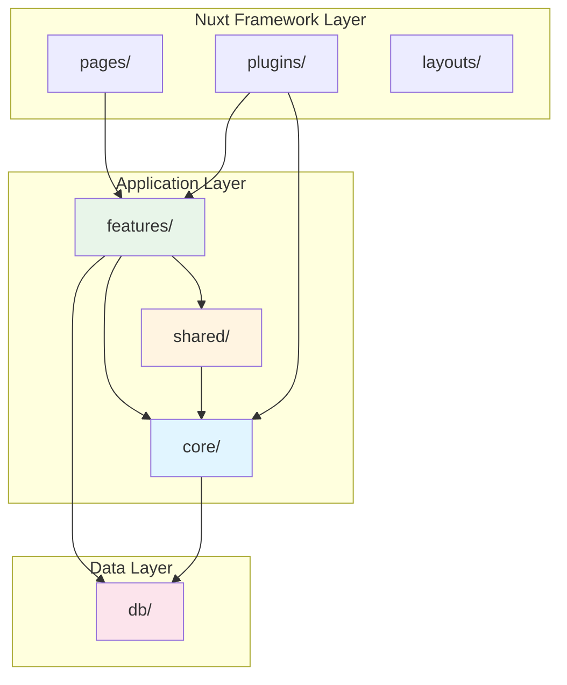

# Design: Feature-First Architecture Refactoring

## Overview

This document provides the technical design for restructuring the or3-chat codebase from a flat Nuxt structure to a feature-first architecture. The refactoring reorganizes code into three primary layers—`core/`, `shared/`, and `features/`—while preserving Nuxt's auto-import capabilities and routing conventions.

**Key Principles**:

1. **Feature Locality**: Related code (components, composables, utils) lives together
2. **Clear Boundaries**: Core infrastructure, shared utilities, and feature code are separated
3. **Nuxt Compatibility**: All Nuxt conventions (pages, plugins, auto-imports) are preserved
4. **Zero Regression**: Existing functionality remains unchanged
5. **Incremental Migration**: Changes can be validated at each step

---

## Architecture

### High-Level System Flow



### Directory Structure

```
app/
├── core/                          # Cross-cutting infrastructure
│   ├── hooks/                     # Hook engine
│   │   ├── hook-keys.ts
│   │   ├── hook-types.ts
│   │   ├── hooks.ts
│   │   ├── typed-hooks.ts
│   │   ├── useHooks.ts
│   │   └── index.ts               # Public API
│   ├── auth/                      # Authentication & model service
│   │   ├── models-service.ts
│   │   ├── openrouter-auth.ts
│   │   ├── openrouter-build.ts
│   │   ├── useOpenrouter.ts
│   │   ├── useUserApiKey.ts
│   │   └── index.ts
│   ├── theme/                     # Theme system
│   │   ├── theme-apply.ts
│   │   ├── theme-defaults.ts
│   │   ├── theme-types.ts
│   │   ├── useThemeSettings.ts
│   │   └── index.ts
│   ├── search/                    # Orama search
│   │   ├── orama.ts
│   │   └── index.ts
│   └── state/                     # Global state (if any)
│       └── index.ts
│
├── shared/                        # Reusable, feature-agnostic code
│   ├── components/
│   │   ├── FatalErrorBoundary.vue
│   │   ├── PageShell.vue
│   │   ├── ResizableSidebarLayout.vue
│   │   └── RetroGlassBtn.vue
│   ├── composables/
│   │   ├── useObservedElementSize.ts
│   │   ├── usePreviewCache.ts
│   │   └── useStreamAccumulator.ts
│   ├── utils/
│   │   ├── errors.ts
│   │   ├── hash.ts
│   │   ├── capability-guards.ts
│   │   └── files/
│   │       ├── attachments.ts
│   │       └── files-constants.ts
│   └── types/
│       ├── editor-hooks.d.ts
│       ├── pane-plugin-api.d.ts
│       └── ...
│
├── features/                      # Feature modules (vertical slices)
│   ├── chat/
│   │   ├── components/
│   │   │   ├── ChatContainer.vue
│   │   │   ├── ChatMessage.vue
│   │   │   ├── VirtualMessageList.vue
│   │   │   └── ...
│   │   ├── composables/
│   │   │   ├── useAi.ts
│   │   │   ├── useAiSettings.ts
│   │   │   ├── useMessageEditing.ts
│   │   │   └── ...
│   │   └── utils/
│   │       ├── openrouterStream.ts
│   │       ├── uiMessages.ts
│   │       └── ...
│   ├── documents/
│   ├── editor/
│   ├── dashboard/
│   ├── sidebar/
│   ├── images/
│   ├── threads/
│   └── projects/
│
├── pages/                         # Nuxt routes (thin wrappers)
│   ├── index.vue
│   ├── chat/
│   │   ├── index.vue
│   │   └── [id].vue
│   └── ...
│
├── plugins/                       # Nuxt plugin entrypoints
│   ├── hooks.client.ts
│   ├── theme.client.ts
│   └── ...
│
├── components/                    # Global atoms only
├── composables/                   # Global bridges/shims
└── ...

db/                                # Data layer (moved from app/db)
├── client.ts
├── schema.ts
├── threads.ts
└── index.ts
```

---

## Core Components and Interfaces

### 1. Core Layer (`app/core/`)

The core layer provides cross-cutting infrastructure used by multiple features.

#### Hook System (`core/hooks/`)

**Purpose**: Centralized event/hook system for extensibility.

```typescript
// core/hooks/index.ts
export { useHooks } from './useHooks';
export { defineHook, defineTypedHook } from './typed-hooks';
export type { HookKeys, HookPayloads } from './hook-types';
export { hookRegistry } from './hooks';
```

**Key Interfaces**:

```typescript
// core/hooks/hook-types.ts
export interface HookPayloads {
    'chat:message:send': { content: string; threadId: string };
    'chat:message:received': { message: Message };
    'editor:save': { content: string; documentId: string };
    'theme:changed': { theme: ThemeConfig };
    // ... all hook definitions
}

export type HookKeys = keyof HookPayloads;

// core/hooks/useHooks.ts
export interface HookSystem {
    on<K extends HookKeys>(
        key: K,
        handler: (payload: HookPayloads[K]) => void | Promise<void>
    ): () => void;

    emit<K extends HookKeys>(key: K, payload: HookPayloads[K]): Promise<void>;

    once<K extends HookKeys>(
        key: K,
        handler: (payload: HookPayloads[K]) => void | Promise<void>
    ): () => void;
}
```

#### Authentication (`core/auth/`)

**Purpose**: OpenRouter integration, model catalog, user API key management.

```typescript
// core/auth/index.ts
export { useOpenrouter } from './useOpenrouter';
export { useUserApiKey } from './useUserApiKey';
export { modelsService } from './models-service';
export { buildOpenRouterRequest } from './openrouter-build';
```

**Key Interfaces**:

```typescript
// core/auth/models-service.ts
export interface ModelInfo {
    id: string;
    name: string;
    context_length: number;
    pricing: { prompt: string; completion: string };
    architecture?: { modality: string };
}

export interface ModelsService {
    fetchModels(): Promise<ModelInfo[]>;
    getModel(id: string): ModelInfo | undefined;
    searchModels(query: string): ModelInfo[];
}

// core/auth/useUserApiKey.ts
export interface UserApiKeyComposable {
    apiKey: Ref<string | null>;
    setApiKey(key: string): Promise<void>;
    clearApiKey(): Promise<void>;
    hasApiKey: ComputedRef<boolean>;
}
```

#### Theme System (`core/theme/`)

**Purpose**: Theme configuration, application, and persistence.

```typescript
// core/theme/index.ts
export { applyTheme } from './theme-apply';
export { defaultTheme } from './theme-defaults';
export { useThemeSettings } from './useThemeSettings';
export type { ThemeConfig, ThemeMode } from './theme-types';
```

**Key Interfaces**:

```typescript
// core/theme/theme-types.ts
export type ThemeMode =
    | 'light'
    | 'dark'
    | 'light-hc'
    | 'dark-hc'
    | 'light-mc'
    | 'dark-mc';

export interface ThemeConfig {
    mode: ThemeMode;
    customColors?: Record<string, string>;
    fontFamily?: string;
}

// core/theme/useThemeSettings.ts
export interface ThemeSettingsComposable {
    currentTheme: Ref<ThemeConfig>;
    setTheme(config: ThemeConfig): Promise<void>;
    toggleMode(): void;
    resetToDefaults(): void;
}
```

#### Search (`core/search/`)

**Purpose**: Orama search index initialization and management.

```typescript
// core/search/index.ts
export { initializeOrama, searchThreads, searchDocuments } from './orama';
export type { SearchResult } from './orama';
```

---

### 2. Shared Layer (`app/shared/`)

The shared layer provides reusable components and utilities with no feature-specific knowledge.

#### Shared Components

```typescript
// shared/components/FatalErrorBoundary.vue
export interface ErrorBoundaryProps {
    fallback?: Component;
    onError?: (error: Error) => void;
}

// shared/components/ResizableSidebarLayout.vue
export interface ResizableSidebarProps {
    minWidth?: number;
    maxWidth?: number;
    defaultWidth?: number;
    side?: 'left' | 'right';
}
```

#### Shared Composables

```typescript
// shared/composables/useObservedElementSize.ts
export interface ElementSizeComposable {
    width: Ref<number>;
    height: Ref<number>;
    observe(element: HTMLElement): void;
    unobserve(): void;
}

// shared/composables/useStreamAccumulator.ts
export interface StreamAccumulatorComposable {
    accumulated: Ref<string>;
    append(chunk: string): void;
    reset(): void;
    isStreaming: Ref<boolean>;
}

// shared/composables/usePreviewCache.ts
export interface PreviewCacheComposable {
    get(key: string): string | undefined;
    set(key: string, value: string): void;
    clear(): void;
    has(key: string): boolean;
}
```

#### Shared Utilities

```typescript
// shared/utils/errors.ts
export class AppError extends Error {
    constructor(
        message: string,
        public code: string,
        public context?: Record<string, unknown>
    ) {
        super(message);
        this.name = 'AppError';
    }
}

export function handleError(error: unknown): AppError {
    if (error instanceof AppError) return error;
    if (error instanceof Error) {
        return new AppError(error.message, 'UNKNOWN_ERROR');
    }
    return new AppError('An unknown error occurred', 'UNKNOWN_ERROR');
}

// shared/utils/capability-guards.ts
export function hasFileSystemAccess(): boolean;
export function hasIndexedDB(): boolean;
export function hasServiceWorker(): boolean;
```

---

### 3. Features Layer (`app/features/`)

Each feature is a vertical slice containing all code needed for that feature.

#### Chat Feature (`features/chat/`)

**Purpose**: Chat interface, message streaming, AI interaction.

```typescript
// features/chat/composables/useAi.ts
export interface AiComposable {
    sendMessage(content: string, options?: SendOptions): Promise<void>;
    streamMessage(
        content: string,
        options?: StreamOptions
    ): AsyncGenerator<string>;
    isGenerating: Ref<boolean>;
    currentModel: Ref<string>;
    setModel(modelId: string): void;
}

// features/chat/utils/openrouterStream.ts
export interface StreamOptions {
    model: string;
    messages: Message[];
    temperature?: number;
    maxTokens?: number;
    onChunk?: (chunk: string) => void;
    onComplete?: () => void;
    onError?: (error: Error) => void;
}

export async function* streamOpenRouterResponse(
    options: StreamOptions
): AsyncGenerator<string>;

// features/chat/utils/uiMessages.ts
export interface UiMessage {
    id: string;
    role: 'user' | 'assistant' | 'system';
    content: string;
    timestamp: number;
    attachments?: Attachment[];
    isStreaming?: boolean;
}

export function toUiMessage(dbMessage: DbMessage): UiMessage;
export function fromUiMessage(uiMessage: UiMessage): DbMessage;
```

#### Documents Feature (`features/documents/`)

**Purpose**: Document management and editing.

```typescript
// features/documents/composables/useDocumentsList.ts
export interface DocumentsListComposable {
    documents: Ref<Document[]>;
    loadDocuments(): Promise<void>;
    createDocument(title: string): Promise<Document>;
    deleteDocument(id: string): Promise<void>;
    searchDocuments(query: string): Document[];
}

// features/documents/composables/usePaneDocuments.ts
export interface PaneDocumentsComposable {
    openDocument(id: string, paneId: string): void;
    closeDocument(paneId: string): void;
    getActiveDocument(paneId: string): Document | null;
}
```

#### Editor Feature (`features/editor/`)

**Purpose**: Tiptap editor integration, autocomplete, toolbar.

```typescript
// features/editor/composables/useEditorNodes.ts
export interface EditorNodesComposable {
    registerNode(name: string, node: Node): void;
    unregisterNode(name: string): void;
    getNode(name: string): Node | undefined;
}

// features/editor/plugins/EditorAutocomplete/TiptapExtension.ts
export const AutocompleteExtension = Extension.create({
    name: 'autocomplete',
    addProseMirrorPlugins() {
        return [autocompletePlugin()];
    },
});
```

#### Dashboard Feature (`features/dashboard/`)

**Purpose**: Settings pages, workspace backup, multi-pane management.

```typescript
// features/dashboard/composables/useMultiPane.ts
export interface MultiPaneComposable {
    panes: Ref<Pane[]>;
    activePane: Ref<string | null>;
    createPane(type: PaneType): Pane;
    closePane(id: string): void;
    setActivePane(id: string): void;
}

// features/dashboard/composables/useWorkspaceBackup.ts
export interface WorkspaceBackupComposable {
    exportWorkspace(): Promise<Blob>;
    importWorkspace(file: File): Promise<void>;
    isExporting: Ref<boolean>;
    isImporting: Ref<boolean>;
}
```

---

### 4. Data Layer (`db/`)

The database layer is moved from `app/db/` to `db/` at the project root and aliased as `@db/*`.

```typescript
// db/index.ts
export { db } from './client';
export * from './schema';
export {
    threadsTable,
    getThread,
    createThread,
    updateThread,
    deleteThread,
} from './threads';
export {
    messagesTable,
    getMessage,
    createMessage,
    updateMessage,
    deleteMessage,
} from './messages';
export {
    documentsTable,
    getDocument,
    createDocument,
    updateDocument,
    deleteDocument,
} from './documents';
export {
    projectsTable,
    getProject,
    createProject,
    updateProject,
    deleteProject,
} from './projects';
```

**Key Interfaces**:

```typescript
// db/schema.ts
export interface Thread {
    id: string;
    title: string;
    createdAt: number;
    updatedAt: number;
    projectId?: string;
}

export interface Message {
    id: string;
    threadId: string;
    role: 'user' | 'assistant' | 'system';
    content: string;
    timestamp: number;
    model?: string;
}

export interface Document {
    id: string;
    title: string;
    content: string;
    createdAt: number;
    updatedAt: number;
}

export interface Project {
    id: string;
    name: string;
    parentId?: string;
    createdAt: number;
}
```

---

## Configuration Changes

### Nuxt Configuration (`nuxt.config.ts`)

```typescript
import { resolve } from 'pathe';

export default defineNuxtConfig({
    compatibilityDate: '2025-07-15',
    devtools: { enabled: true },
    modules: ['@nuxt/ui', '@nuxt/fonts', '@vite-pwa/nuxt'],
    srcDir: 'app',
    css: ['~/assets/css/main.css'],

    // 1. Component auto-registration
    components: [
        { path: '~/components', pathPrefix: false }, // Global atoms
        { path: '~/shared/components', pathPrefix: false }, // Shared components
        { path: '~/features', pathPrefix: true, extensions: ['.vue'] }, // Feature components
    ],

    // 2. Auto-import composables & utils
    imports: {
        dirs: [
            'composables', // Global bridges
            'shared/composables',
            'shared/utils',
            'core/hooks',
            'core/auth',
            'core/theme',
            'core/search',
            'core/state',
            'features/chat/composables',
            'features/chat/utils',
            'features/documents/composables',
            'features/editor/composables',
            'features/dashboard/composables',
            'features/sidebar/composables',
            'features/threads/composables',
            'features/projects/composables',
            'features/images/composables',
        ],
    },

    // 3. Path aliases
    alias: {
        '@core': resolve('./app/core'),
        '@shared': resolve('./app/shared'),
        '@features': resolve('./app/features'),
        '@db': resolve('./db'),
    },

    // 4. TypeScript configuration
    typescript: {
        tsConfig: {
            compilerOptions: {
                baseUrl: '.',
                paths: {
                    '@core/*': ['./app/core/*'],
                    '@shared/*': ['./app/shared/*'],
                    '@features/*': ['./app/features/*'],
                    '@db/*': ['./db/*'],
                },
            },
        },
    },

    // ... rest of existing config (fonts, nitro, pwa, etc.)
});
```

### Vitest Configuration (`vitest.config.ts`)

```typescript
import { defineConfig } from 'vitest/config';
import { resolve } from 'pathe';
import vue from '@vitejs/plugin-vue';

export default defineConfig({
    plugins: [vue()],
    test: {
        globals: true,
        environment: 'jsdom',
        setupFiles: ['./tests/setup.ts'],
    },
    resolve: {
        alias: {
            '@core': resolve('./app/core'),
            '@shared': resolve('./app/shared'),
            '@features': resolve('./app/features'),
            '@db': resolve('./db'),
            '~': resolve('./app'),
        },
    },
});
```

---

## Migration Strategy

### Phase 1: Preparation

1. Create new directory structure (`core/`, `shared/`, `features/`, `db/`)
2. Create barrel `index.ts` files in each module
3. Update `nuxt.config.ts` with new paths and aliases
4. Update `vitest.config.ts` with new aliases
5. Commit configuration changes

### Phase 2: Core Layer Migration

1. Move hook system files to `app/core/hooks/`
2. Move theme files to `app/core/theme/`
3. Move auth/OpenRouter files to `app/core/auth/`
4. Move Orama search to `app/core/search/`
5. Update imports in moved files to use `@core/*` aliases
6. Test: `nuxi typecheck`, `bun run dev`
7. Commit core layer changes

### Phase 3: Shared Layer Migration

1. Move generic components to `app/shared/components/`
2. Move generic composables to `app/shared/composables/`
3. Move generic utils to `app/shared/utils/`
4. Move type definitions to `app/shared/types/`
5. Update imports in moved files to use `@shared/*` aliases
6. Test: `nuxi typecheck`, `bun run dev`
7. Commit shared layer changes

### Phase 4: Database Layer Migration

1. Move `app/db/` to `db/` at project root
2. Create `db/index.ts` barrel export
3. Update all imports from `~/db/*` to `@db/*`
4. Test: `nuxi typecheck`, `bun run dev`
5. Commit database layer changes

### Phase 5: Features Layer Migration (per feature)

For each feature (chat, documents, editor, dashboard, sidebar, images, threads, projects):

1. Create feature directory structure
2. Move components to `features/{feature}/components/`
3. Move composables to `features/{feature}/composables/`
4. Move utils to `features/{feature}/utils/`
5. Move plugins (if any) to `features/{feature}/plugins/`
6. Update imports within feature to use relative paths or `@features/*`
7. Update imports from other parts of codebase to use `@features/{feature}/*`
8. Test: `nuxi typecheck`, `bun run dev`, feature-specific manual testing
9. Commit feature migration

**Feature Migration Order** (by dependency):

1. `threads/` (low dependencies)
2. `projects/` (low dependencies)
3. `documents/` (depends on editor)
4. `editor/` (standalone)
5. `chat/` (depends on threads, uses editor)
6. `sidebar/` (depends on threads, projects, documents)
7. `dashboard/` (depends on multiple features)
8. `images/` (standalone)

### Phase 6: Plugin Updates

1. Update each plugin in `app/plugins/` to import from new locations
2. Ensure plugins delegate to `@core/*` or `@features/*` appropriately
3. Test: `bun run dev`, verify all plugins register correctly
4. Commit plugin updates

### Phase 7: Test Migration

1. Reorganize `tests/` to mirror `app/` structure
2. Update test imports to use new aliases
3. Run full test suite: `bun run test`
4. Fix any failing tests
5. Commit test reorganization

### Phase 8: Cleanup

1. Remove empty directories from old structure
2. Remove `app/composables/` if now empty (or keep minimal bridges)
3. Remove `app/components/` if now empty (or keep global atoms)
4. Update any remaining relative imports to use aliases
5. Run final validation: `nuxi typecheck`, `bun run build`, `bun run test`
6. Commit cleanup

---

## Error Handling

### Import Resolution Errors

**Scenario**: TypeScript cannot resolve `@core/*`, `@shared/*`, etc.

**Detection**: `nuxi typecheck` fails with "Cannot find module" errors.

**Recovery**:

1. Verify `nuxt.config.ts` has correct `alias` and `typescript.tsConfig.compilerOptions.paths`
2. Restart TypeScript server in IDE
3. Delete `.nuxt/` and rebuild: `rm -rf .nuxt && nuxi prepare`
4. Check that files exist at expected paths

### Auto-Import Failures

**Scenario**: Components or composables are not auto-imported.

**Detection**: Build fails with "Component not found" or "Undefined variable" errors.

**Recovery**:

1. Verify `nuxt.config.ts` has correct `components` and `imports.dirs` arrays
2. Check that file naming follows Nuxt conventions (PascalCase for components, camelCase for composables)
3. Restart dev server: `bun run dev`
4. Check `.nuxt/imports.d.ts` and `.nuxt/components.d.ts` for registered items

### Circular Dependency Errors

**Scenario**: Feature A imports from Feature B, which imports from Feature A.

**Detection**: Build warnings or runtime errors about circular dependencies.

**Recovery**:

1. Identify the circular dependency chain
2. Extract shared logic to `shared/` layer
3. Use barrel exports to control public API and break cycles
4. Consider using dependency injection or event-based communication (hooks)

### Plugin Registration Failures

**Scenario**: Plugin fails to register or throws error during initialization.

**Detection**: Dev server fails to start or runtime error on app load.

**Recovery**:

1. Check plugin file for correct import paths
2. Verify delegated code in `@core/*` or `@features/*` exists and exports correctly
3. Check plugin order (some plugins may depend on others)
4. Add error handling and logging to plugin to identify issue

---

## Testing Strategy

### Unit Testing

**Scope**: Individual functions, composables, and utilities.

**Approach**:

-   Test files co-located in `tests/` mirroring `app/` structure
-   Use Vitest with `jsdom` environment
-   Mock external dependencies (database, API calls)
-   Test pure functions in `shared/utils/` and `features/*/utils/`
-   Test composables in isolation with mock refs

**Example**:

```typescript
// tests/shared/streamAccumulator.test.ts
import { describe, it, expect } from 'vitest';
import { useStreamAccumulator } from '@shared/composables/useStreamAccumulator';

describe('useStreamAccumulator', () => {
    it('should accumulate chunks', () => {
        const { accumulated, append } = useStreamAccumulator();
        append('Hello');
        append(' ');
        append('World');
        expect(accumulated.value).toBe('Hello World');
    });
});
```

### Integration Testing

**Scope**: Feature workflows involving multiple components and composables.

**Approach**:

-   Test feature-level interactions (e.g., sending a message in chat)
-   Use `@vue/test-utils` to mount components
-   Mock database layer with in-memory implementations
-   Test hook system integration

**Example**:

```typescript
// tests/chat/ChatContainer.test.ts
import { describe, it, expect, vi } from 'vitest';
import { mount } from '@vue/test-utils';
import ChatContainer from '@features/chat/components/ChatContainer.vue';

describe('ChatContainer', () => {
    it('should send message when form submitted', async () => {
        const sendMessage = vi.fn();
        const wrapper = mount(ChatContainer, {
            global: {
                provide: {
                    sendMessage,
                },
            },
        });

        await wrapper.find('input').setValue('Hello');
        await wrapper.find('form').trigger('submit');

        expect(sendMessage).toHaveBeenCalledWith('Hello');
    });
});
```

### End-to-End Testing

**Scope**: Critical user workflows across the entire application.

**Approach**:

-   Manual testing of key features after each migration phase
-   Automated E2E tests (if added in future) using Playwright or Cypress
-   Test in both development and production builds

**Critical Workflows**:

1. Create new chat thread and send message
2. Upload file attachment to message
3. Switch between threads in sidebar
4. Create and edit document
5. Change theme in dashboard
6. Export and import workspace backup
7. Search threads and documents

### Regression Testing

**Scope**: Ensure no existing functionality is broken.

**Approach**:

-   Run full test suite after each migration phase
-   Compare test results to pre-refactoring baseline
-   Manual smoke testing of all features
-   Monitor for console errors or warnings

**Acceptance Criteria**:

-   100% of existing tests pass
-   No new console errors in development
-   No new TypeScript errors
-   All routes load successfully
-   All plugins register without errors

---

## Performance Considerations

### Build Performance

**Potential Impact**: More directories and barrel exports could increase build time.

**Mitigation**:

-   Use barrel exports sparingly (only for public APIs)
-   Avoid deep re-export chains
-   Monitor build times at each phase
-   Use Vite's build analyzer to identify bottlenecks

**Measurement**:

```bash
# Before refactoring
time bun run build

# After each phase
time bun run build

# Compare results
```

### Runtime Performance

**Potential Impact**: Additional indirection through barrel exports could affect tree-shaking.

**Mitigation**:

-   Ensure barrel exports use named exports (not `export *`)
-   Verify tree-shaking with bundle analyzer
-   Test production build size before and after

**Measurement**:

```bash
# Build and analyze bundle
bun run build
npx vite-bundle-visualizer
```

### Auto-Import Performance

**Potential Impact**: More auto-import directories could slow down dev server startup.

**Mitigation**:

-   Only include necessary directories in `imports.dirs`
-   Use specific paths rather than wildcards where possible
-   Monitor dev server startup time

**Measurement**:

```bash
# Measure dev server startup
time bun run dev
# (Ctrl+C after "ready in X ms")
```

---

## Rollback Plan

### Immediate Rollback (Critical Issue)

If a critical issue is discovered that blocks development:

1. **Revert Git Branch**:

    ```bash
    git checkout main
    git branch -D feature-first-refactor
    ```

2. **Restore Dependencies**:

    ```bash
    bun install
    ```

3. **Verify Functionality**:
    ```bash
    bun run dev
    bun run test
    ```

### Partial Rollback (Phase-Specific Issue)

If an issue is discovered in a specific phase:

1. **Identify Last Good Commit**:

    ```bash
    git log --oneline
    ```

2. **Revert to Last Good Commit**:

    ```bash
    git reset --hard <commit-hash>
    ```

3. **Re-attempt Phase with Fixes**:
    - Analyze what went wrong
    - Apply fixes
    - Re-test before proceeding

### Data Safety

**Database**: No database schema changes are made, so no data migration or rollback is needed.

**User Settings**: Theme and API key settings are stored in IndexedDB and are not affected by code reorganization.

**Workspace Backups**: Users can export workspace before and after refactoring for safety.

---

## Documentation Updates

### Architecture Guide

Create `docs/architecture/feature-first-structure.md`:

```markdown
# Feature-First Architecture

## Overview

This codebase uses a feature-first architecture...

## Directory Structure

-   `app/core/`: Cross-cutting infrastructure
-   `app/shared/`: Reusable components and utilities
-   `app/features/`: Feature modules
-   `db/`: Data layer

## Adding New Code

-   New feature? Create `features/{feature}/`
-   Shared utility? Add to `shared/utils/`
-   Infrastructure? Add to `core/`

## Import Conventions

-   Use `@core/*` for core imports
-   Use `@shared/*` for shared imports
-   Use `@features/*` for feature imports
-   Use `@db/*` for database imports
```

### Contributing Guide

Update `CONTRIBUTING.md`:

```markdown
## Code Organization

### Where to Put New Code

-   **New Feature**: Create a new directory in `app/features/`
-   **Shared Component**: Add to `app/shared/components/`
-   **Shared Utility**: Add to `app/shared/utils/`
-   **Infrastructure**: Add to appropriate `app/core/` subdirectory

### Import Rules

1. Always use path aliases (`@core/*`, `@shared/*`, `@features/*`, `@db/*`)
2. Avoid cross-feature imports (use `shared/` or `core/` instead)
3. Use relative imports only within the same feature/module

### Testing

-   Place tests in `tests/` mirroring the `app/` structure
-   Use the same path aliases in tests
```

---

## Success Metrics

### Quantitative Metrics

1. **Build Time**: Should not increase by more than 10%
2. **Bundle Size**: Should not increase (may decrease with better tree-shaking)
3. **Test Pass Rate**: 100% of existing tests pass
4. **Type Errors**: Zero TypeScript errors after migration
5. **Dev Server Startup**: Should not increase by more than 10%

### Qualitative Metrics

1. **Code Discoverability**: Developers can find feature code faster
2. **Maintainability**: Easier to modify features without affecting others
3. **Onboarding**: New developers understand structure more quickly
4. **Consistency**: Codebase follows consistent patterns

### Validation Checklist

-   [ ] All routes load successfully
-   [ ] All plugins register without errors
-   [ ] All components render correctly
-   [ ] All composables work as expected
-   [ ] All tests pass
-   [ ] `nuxi typecheck` passes
-   [ ] `bun run build` succeeds
-   [ ] Production build works correctly
-   [ ] No console errors in development
-   [ ] No console errors in production
-   [ ] Hot module replacement works
-   [ ] Auto-imports work in IDE
-   [ ] Type checking works in IDE

---

## Conclusion

This design provides a comprehensive plan for refactoring the or3-chat codebase to a feature-first architecture while maintaining full Nuxt compatibility. The phased migration approach allows for incremental validation and easy rollback if issues arise. The new structure will improve code organization, maintainability, and developer experience without sacrificing any existing functionality.
