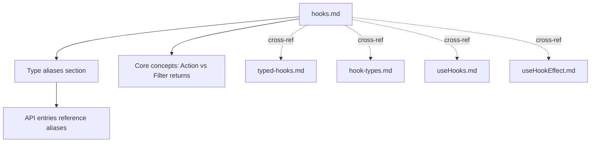

# design.md

## Overview

We’ll introduce canonical TypeScript aliases for hook callbacks in the docs and reference them across hook-related pages. This is a documentation-only change intended to standardize expectations for action vs filter return values. No code or type definitions in the app are modified.

## Architecture and flow



### Core components

-   hooks.md (canonical source)

    -   Adds a “Type aliases” section.
    -   Adds a short “Action vs Filter returns” paragraph.
    -   Updates API entries to reference the aliases where signatures are discussed.

-   Related pages (consumers)
    -   `typed-hooks.md`, `hook-types.md`, `useHooks.md`, `useHookEffect.md` each get a concise note linking back to the aliases.

## Interfaces (TypeScript snippets for documentation)

These are documentation-level aliases to be shown in code fences:

```ts
// Canonical docs-only aliases
export type ActionHandler = (...args: any[]) => void | Promise<void>;

export type FilterHandler<TIn, TOut = TIn> = (
    value: TIn,
    ...args: any[]
) => TOut | Promise<TOut>;
```

Where referenced:

-   Action APIs (addAction, doAction, on(kind='action')) should mention `ActionHandler`.
-   Filter APIs (addFilter, applyFilters, applyFiltersSync) should mention `FilterHandler` and describe the chaining behavior.

## Data model

No runtime data changes. This introduces only text and code-fence samples in Markdown.

## Error handling

-   Table pipes must be escaped in Markdown tables: `|` becomes `\\|` when inside a table cell.
-   Keep code fences as TypeScript blocks to ensure syntax highlighting and readability.

## Testing strategy

-   Unit-level: N/A (docs-only). Optional: a markdown linter step could be added later.
-   Integration (manual QA):
    -   Build the site and visually inspect the Hooks pages to confirm tables render and links resolve.
    -   Verify that every referenced page includes the short cross-reference note.
-   E2E (visual): Quick smoke by loading the documentation shell locally and verifying navigation and anchors.

## Performance and scalability

-   No runtime code. Build time impact negligible.

## Rollout plan

1. Commit planning docs (this file plus requirements and tasks).
2. Edit `hooks.md` to add aliases and returns guidance; update API entries.
3. Add cross-reference notes to the four related pages.
4. Build and verify rendering.

## Alternatives considered

-   Embedding full generic signatures inline everywhere: rejected due to duplication and brittleness.
-   Adding real exported types in the codebase: out-of-scope for docs-only change.
