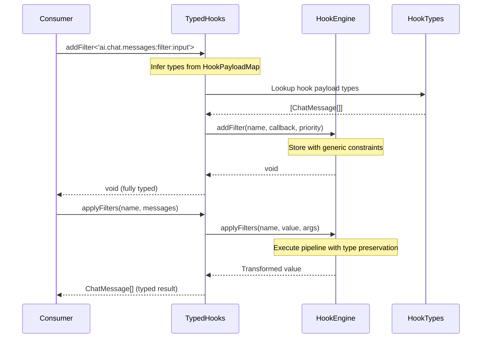

# Technical Design: Fix All `any` Types in Hooks System

## Overview

This document provides the technical design for eliminating all `any` types from the hooks system while maintaining backward compatibility and runtime behavior. The hooks system is a foundational WordPress-style plugin architecture that provides filters (value transformation) and actions (side effects) across the OR3 Chat application.

The current implementation uses `any` types extensively (50+ occurrences) to enable flexibility, but this comes at the cost of type safety. This design shows how to replace `any` with proper generic types, conditional types, and type constraints to achieve both flexibility and safety.

---

## Architecture

### Current System Overview

```
┌─────────────────────────────────────────────────────────────┐
│                      Consumers                               │
│  (Components, Composables, Plugins using hooks)              │
└───────────────────────┬─────────────────────────────────────┘
                        │
                        ▼
┌─────────────────────────────────────────────────────────────┐
│                  typed-hooks.ts                              │
│          (Type safety bridge - currently broken)             │
│              ALL calls cast to `any` ❌                      │
└───────────────────────┬─────────────────────────────────────┘
                        │
                        ▼
┌─────────────────────────────────────────────────────────────┐
│                     hooks.ts                                 │
│            (Core engine - untyped runtime)                   │
│   AnyFn = (...args: any[]) => any ❌                         │
└───────────────────────┬─────────────────────────────────────┘
                        │
                        ▼
┌─────────────────────────────────────────────────────────────┐
│                  hook-types.ts                               │
│            (Type definitions - `any` fallbacks)              │
│   Event payloads use `any`, fallbacks use `any` ❌           │
└─────────────────────────────────────────────────────────────┘
```

### Target System Overview

```
┌─────────────────────────────────────────────────────────────┐
│                      Consumers                               │
│          Full type inference & autocomplete ✅               │
└───────────────────────┬─────────────────────────────────────┘
                        │
                        ▼
┌─────────────────────────────────────────────────────────────┐
│                  typed-hooks.ts                              │
│          (Type safety bridge - ZERO casts) ✅                │
│              Direct pass-through to engine                   │
└───────────────────────┬─────────────────────────────────────┘
                        │
                        ▼
┌─────────────────────────────────────────────────────────────┐
│                     hooks.ts                                 │
│            (Core engine - generic runtime) ✅                │
│   HookCallback<TArgs, TReturn> with generics                 │
└───────────────────────┬─────────────────────────────────────┘
                        │
                        ▼
┌─────────────────────────────────────────────────────────────┐
│                  hook-types.ts                               │
│        (Type definitions - `never`/`unknown` fallbacks) ✅   │
│   Generic event payloads, precise type inference            │
└─────────────────────────────────────────────────────────────┘
```

### Component Interaction Flow



---

## Core Components

### 1. Hook Engine (hooks.ts)

#### 1.1 Generic Function Types

**Current Implementation**:
```typescript
// Line 11
type AnyFn = (...args: any[]) => any;
```

**New Implementation**:
```typescript
// Generic callback type preserving parameter and return types
type HookCallback<TArgs extends unknown[] = unknown[], TReturn = unknown> = 
  (...args: TArgs) => TReturn | Promise<TReturn>;

// For internal use where we need to store callbacks with unknown signatures
type CallbackEntry<TArgs extends unknown[] = unknown[], TReturn = unknown> = {
  fn: HookCallback<TArgs, TReturn>;
  priority: number;
  id: number;
  name: string;
};
```

**Rationale**: Using generic type parameters allows the engine to preserve type information while remaining flexible. Constraints use `unknown` instead of `any` to force explicit type handling.

---

#### 1.2 Filter APIs

**Current Implementation**:
```typescript
// Lines 59-60
applyFilters: <T>(name: string, value: T, ...args: any[]) => Promise<T>;
applyFiltersSync: <T>(name: string, value: T, ...args: any[]) => T;
```

**New Implementation**:
```typescript
export interface HookEngine {
  // Filters - generic version for backward compatibility
  applyFilters: <T = unknown>(
    name: string,
    value: T,
    ...args: unknown[]
  ) => Promise<T>;
  
  applyFiltersSync: <T = unknown>(
    name: string,
    value: T,
    ...args: unknown[]
  ) => T;
  
  addFilter: <TArgs extends unknown[] = unknown[], TReturn = unknown>(
    name: string,
    fn: HookCallback<TArgs, TReturn>,
    priority?: number,
    acceptedArgs?: number
  ) => void;
  
  removeFilter: <TArgs extends unknown[] = unknown[], TReturn = unknown>(
    name: string,
    fn: HookCallback<TArgs, TReturn>,
    priority?: number
  ) => void;
}
```

**Type Flow**:
```typescript
// Example usage
const filtered = await hooks.applyFilters<string>(
  'ui.chat.message:filter:outgoing',
  originalMessage
); // filtered is typed as string

// Callback registration
hooks.addFilter<[string], string>(
  'ui.chat.message:filter:outgoing',
  (message: string) => message.trim()
);
```

---

#### 1.3 Action APIs

**Current Implementation**:
```typescript
// Lines 74-75
doAction: (name: string, ...args: any[]) => Promise<void>;
doActionSync: (name: string, ...args: any[]) => void;
```

**New Implementation**:
```typescript
export interface HookEngine {
  // Actions
  doAction: (name: string, ...args: unknown[]) => Promise<void>;
  doActionSync: (name: string, ...args: unknown[]) => void;
  
  addAction: <TArgs extends unknown[] = unknown[]>(
    name: string,
    fn: HookCallback<TArgs, void>,
    priority?: number,
    acceptedArgs?: number
  ) => void;
  
  removeAction: <TArgs extends unknown[] = unknown[]>(
    name: string,
    fn: HookCallback<TArgs, void>,
    priority?: number
  ) => void;
}
```

**Rationale**: Actions don't return values, so `TReturn` is always `void`. Arguments use `unknown[]` to maintain flexibility while being more type-safe than `any[]`.

---

#### 1.4 Internal Pipeline Functions

**Current Implementation**:
```typescript
// Lines 242, 244, 294, 296
async function runFilterPipeline(
  callbacks: CallbackEntry[],
  name: string,
  args: any[],
  priority: number,
  initialValue?: any
): Promise<any> {
  // ...
}
```

**New Implementation**:
```typescript
async function callAsync<TValue = unknown>(
  cbs: CallbackEntry[],
  name: string,
  args: unknown[],
  isFilter: boolean,
  initialValue?: TValue
): Promise<TValue | void> {
  const firstPriority = cbs.length > 0 ? cbs[0]!.priority : DEFAULT_PRIORITY;
  currentPriorityStack.push(firstPriority);
  
  try {
    let value: TValue | unknown = initialValue;
    for (const { fn, priority } of cbs) {
      if (currentPriorityStack.length)
        currentPriorityStack[currentPriorityStack.length - 1] = priority;
      
      const start = performance?.now?.() ?? Date.now();
      try {
        if (isFilter) {
          // For filters, thread value through pipeline
          value = await fn(value, ...args);
        } else {
          // For actions, just execute
          await fn(...args);
        }
      } catch (err) {
        console.error(`[hooks] Error in ${isFilter ? 'filter' : 'action'} "${name}":`, err);
        recordError(name);
      } finally {
        const end = performance?.now?.() ?? Date.now();
        recordTiming(name, end - start);
      }
    }
    return isFilter ? (value as TValue) : undefined;
  } finally {
    currentPriorityStack.pop();
  }
}

// Sync version
function callSync<TValue = unknown>(
  cbs: CallbackEntry[],
  name: string,
  args: unknown[],
  isFilter: boolean,
  initialValue?: TValue
): TValue | void {
  // Similar implementation but synchronous
}
```

**Rationale**: Generic `TValue` preserves the type of the value being filtered. Return type is conditional based on `isFilter` flag.

---

#### 1.5 Global Hooks Access

**Current Implementation**:
```typescript
// Line 464
const g = globalThis as any;
```

**New Implementation**:
```typescript
// Augment global type
declare global {
  var __NUXT_HOOKS__: HookEngine | undefined;
}

// In HMR cleanup
if (import.meta.hot) {
  import.meta.hot.dispose(() => {
    const g = globalThis;
    if (g.__NUXT_HOOKS__?._diagnostics) {
      g.__NUXT_HOOKS__._diagnostics.timings = {};
      g.__NUXT_HOOKS__._diagnostics.errors = {};
    }
  });
}
```

**Rationale**: Properly typing the global augmentation removes need for `as any` cast.

---

### 2. Hook Type Definitions (hook-types.ts)

#### 2.1 Generic Event Payloads

**Current Implementation**:
```typescript
// Lines 230, 242, 291
interface HookEvent {
  value: any;
}

interface ActionPayload {
  data: any;
}

interface FilterPayload {
  data: any;
}
```

**New Implementation**:
```typescript
// Generic event interface
interface HookEvent<TValue = unknown> {
  value: TValue;
  metadata?: {
    timestamp: number;
    source?: string;
    hookName?: string;
  };
}

// Generic action payload
interface ActionPayload<TData = unknown> {
  data: TData;
  context?: Record<string, unknown>;
}

// Generic filter payload
interface FilterPayload<TData = unknown> {
  data: TData;
  original?: TData; // for comparison/rollback
}
```

**Usage Example**:
```typescript
// Specific usage with concrete types
type ChatMessageEvent = HookEvent<ChatMessage[]>;
type ModelSelectPayload = FilterPayload<string>;
```

---

#### 2.2 Hook Payload Fallbacks

**Current Implementation**:
```typescript
// Line 488
'ai.chat.messages:filter:input': [any[]];

// Lines 540, 545-546
? [{ query?: any }]
: [any]
: [any];

// Line 593
: any[];

// Lines 601, 623, 650
: any
```

**New Implementation**:
```typescript
import type { ChatMessage, ToolCall } from '~/utils/chat/types';

// Specific hook definitions
export type CoreHookPayloadMap = {
  // Use specific types from existing type definitions
  'ai.chat.messages:filter:input': [ChatMessage[]];
  
  // For query objects, use proper type or unknown
  'db.messages.search:filter:input': [{ query?: string }];
  
  // Use never for impossible/undefined hooks
  // Use unknown for truly dynamic data
};

// Conditional type with better fallbacks
type DbFilterPayloadFor<K extends DbFilterHookName> =
  K extends `db.${string}.${infer Op}:filter:${infer Phase}`
    ? Phase extends 'input'
      ? Op extends 'create' | 'upsert'
        ? [InferDbEntity<K>]
        : Op extends 'update'
        ? [DbUpdatePayload<InferDbEntity<K>>]
        : Op extends 'get'
        ? [string]
        : Op extends 'search' | 'byProject' | 'children'
        ? [{ query?: string }] // More specific than `any`
        : [never] // Use never instead of any for unhandled cases
      : Phase extends 'output'
      ? [InferDbEntity<K> | InferDbEntity<K>[]]
      : [never]
    : [never]; // Use never for unmatched patterns
```

**Rationale**: 
- Use `never` for impossible cases (forces explicit handling)
- Use `unknown` for truly dynamic data (requires type narrowing)
- Use specific types like `ChatMessage[]` when known
- Import existing types rather than redefining

---

#### 2.3 Type Utility Improvements

**Current Implementation**:
```typescript
// Line 653
export type Tail<T extends any[]> = T extends [any, ...infer Rest] ? Rest : [];

// Line 694
: T extends (...args: any[]) => any
```

**New Implementation**:
```typescript
// Tail utility with unknown constraint
export type Tail<T extends unknown[]> = 
  T extends [unknown, ...infer Rest] ? Rest : [];

// Function type check with unknown
export type IsFunction<T> = T extends (...args: unknown[]) => unknown
  ? true
  : false;

// Extract function parameters safely
export type FunctionParams<T> = 
  T extends (...args: infer P) => unknown
    ? P extends unknown[]
      ? P
      : never
    : never;

// Extract function return type safely
export type FunctionReturn<T> = 
  T extends (...args: unknown[]) => infer R
    ? R
    : never;
```

**Rationale**: Using `unknown` in constraints makes the utilities more type-safe while remaining flexible.

---

### 3. Typed Hook Bridge (typed-hooks.ts)

#### 3.1 Remove All Type Casts

**Current Implementation (BROKEN)**:
```typescript
// Lines 152-176 - mass casting defeats type safety
export function createTypedHookEngine(engine: HookEngine): TypedHookEngine {
  return {
    addAction: (name, callback, priority) =>
      engine.addAction(name as any, callback as any, priority),
    doAction: (name, ...args) =>
      engine.doAction(name as any, ...(args as any)),
    applyFilters: (name, value, ...args) =>
      engine.applyFilters(name as any, value as any, ...(args as any)) as any,
    // ... etc, all with `as any` casts ❌
  };
}
```

**New Implementation (FIXED)**:
```typescript
import type { HookEngine } from '~/core/hooks/hooks';
import type {
  ActionHookName,
  FilterHookName,
  HookName,
  InferHookCallback,
  InferHookParams,
  InferHookReturn,
  HookPayloadMap,
} from '~/core/hooks/hook-types';

// Tail utility for extracting args after value
type Tail<T extends unknown[]> = T extends [unknown, ...infer Rest] ? Rest : [];

/**
 * Typed wrapper around HookEngine with full type inference.
 * Zero type casts - if casts are needed, the engine types are wrong.
 */
export interface TypedHookEngine {
  // Actions (registration)
  addAction<K extends ActionHookName>(
    name: K,
    callback: InferHookCallback<K>,
    priority?: number
  ): void;

  removeAction<K extends ActionHookName>(
    name: K,
    callback: InferHookCallback<K>,
    priority?: number
  ): void;

  // Actions (execution)
  doAction<K extends ActionHookName>(
    name: K,
    ...args: InferHookParams<K>
  ): Promise<void>;

  doActionSync<K extends ActionHookName>(
    name: K,
    ...args: InferHookParams<K>
  ): void;

  // Filters (registration)
  addFilter<K extends FilterHookName>(
    name: K,
    callback: InferHookCallback<K>,
    priority?: number
  ): void;

  removeFilter<K extends FilterHookName>(
    name: K,
    callback: InferHookCallback<K>,
    priority?: number
  ): void;

  // Filters (execution)
  applyFilters<K extends FilterHookName>(
    name: K,
    value: InferHookParams<K>[0],
    ...args: Tail<InferHookParams<K>>
  ): Promise<InferHookReturn<K>>;

  applyFiltersSync<K extends FilterHookName>(
    name: K,
    value: InferHookParams<K>[0],
    ...args: Tail<InferHookParams<K>>
  ): InferHookReturn<K>;

  // Unified API
  on<K extends HookName>(
    name: K,
    callback: InferHookCallback<K>,
    opts?: { kind?: 'action' | 'filter'; priority?: number }
  ): () => void;

  off(disposer: () => void): void;

  onceAction<K extends ActionHookName>(
    name: K,
    callback: InferHookCallback<K>,
    priority?: number
  ): () => void;

  // Utilities
  hasAction(name?: ActionHookName): boolean | number;
  hasFilter(name?: FilterHookName): boolean | number;
  removeAllCallbacks(priority?: number): void;
  currentPriority(): number | false;

  readonly _engine: HookEngine;
  readonly _diagnostics: HookEngine['_diagnostics'];
}

/**
 * Create a typed wrapper around an existing HookEngine.
 * NO TYPE CASTS - types flow through naturally.
 */
export function createTypedHookEngine(engine: HookEngine): TypedHookEngine {
  return {
    // Actions - NO CASTS ✅
    addAction: (name, callback, priority) => {
      // Type inference handles this naturally
      engine.addAction(name, callback, priority);
    },
    
    removeAction: (name, callback, priority) => {
      engine.removeAction(name, callback, priority);
    },
    
    doAction: async (name, ...args) => {
      await engine.doAction(name, ...args);
    },
    
    doActionSync: (name, ...args) => {
      engine.doActionSync(name, ...args);
    },

    // Filters - NO CASTS ✅
    addFilter: (name, callback, priority) => {
      engine.addFilter(name, callback, priority);
    },
    
    removeFilter: (name, callback, priority) => {
      engine.removeFilter(name, callback, priority);
    },
    
    applyFilters: async (name, value, ...args) => {
      return await engine.applyFilters(name, value, ...args);
    },
    
    applyFiltersSync: (name, value, ...args) => {
      return engine.applyFiltersSync(name, value, ...args);
    },

    // Unified - NO CASTS ✅
    on: (name, callback, opts) => {
      const kind = opts?.kind ?? (name.includes(':filter:') ? 'filter' : 'action');
      return engine.on(name, callback, { ...opts, kind });
    },
    
    off: (disposer) => engine.off(disposer),
    
    onceAction: (name, callback, priority) => {
      return engine.onceAction(name, callback, priority);
    },

    // Utilities - NO CASTS ✅
    hasAction: (name) => engine.hasAction(name),
    hasFilter: (name) => engine.hasFilter(name),
    removeAllCallbacks: (priority) => engine.removeAllCallbacks(priority),
    currentPriority: () => engine.currentPriority(),

    // Direct access
    _engine: engine,
    _diagnostics: engine._diagnostics,
  };
}
```

**Rationale**: If the underlying engine types are correct, NO type casts should be necessary. The typed wrapper simply narrows the engine's generic types based on the hook name.

---

### 4. Hook Keys (hook-keys.ts)

#### 4.1 Specific Hook Payload Types

**Current Implementation**:
```typescript
// Line 102
'ai.chat.messages:filter:input': [any[]];
```

**New Implementation**:
```typescript
import type { ChatMessage } from '~/utils/chat/types';
import type { HookEngine, OnOptions } from './hooks';

// In HookPayloads interface
export interface HookPayloads {
  // Use imported ChatMessage type
  'ai.chat.messages:filter:input': [ChatMessage[]];
  
  // Other hooks remain the same or get specific types
  'ui.chat.message:filter:outgoing': [string];
  'ui.chat.message:filter:incoming': [string, string | undefined];
  'ai.chat.model:filter:select': [string];
  'files.attach:filter:input': [FilesAttachInputPayload | false];
  
  // ... other hooks
}
```

---

#### 4.2 Remove Casts in Helper Functions

**Current Implementation**:
```typescript
// Line 117
return hooks.on(key, fn as any, opts);
```

**New Implementation**:
```typescript
type KnownKey = keyof HookPayloads & KnownHookKey;

export function typedOn(hooks: HookEngine) {
  return {
    // NO CAST - types align naturally ✅
    on<K extends KnownKey>(
      key: K,
      fn: (...args: HookPayloads[K]) => void | Promise<void>,
      opts?: OnOptions
    ) {
      return hooks.on(key, fn, opts);
    },
  } as const;
}
```

**Rationale**: If hook keys and payloads are properly typed in `hook-types.ts`, no casting is needed here.

---

## Data Models

### Hook Callback Entry

```typescript
interface CallbackEntry<
  TArgs extends unknown[] = unknown[],
  TReturn = unknown
> {
  fn: HookCallback<TArgs, TReturn>;
  priority: number;
  id: number; // insertion order tiebreaker
  name: string; // original pattern (may include wildcards)
}
```

### Hook Payload Map

```typescript
export type HookPayloadMap = {
  // Action hooks - parameters tuple, return void
  [K in ActionHookName]: K extends keyof CoreHookPayloadMap
    ? CoreHookPayloadMap[K]
    : K extends DbActionHookName
    ? DbActionPayloadFor<K>
    : unknown[];
    
  // Filter hooks - parameters tuple, return first parameter type
  [K in FilterHookName]: K extends keyof CoreHookPayloadMap
    ? CoreHookPayloadMap[K]
    : K extends DbFilterHookName
    ? DbFilterPayloadFor<K>
    : unknown[];
};
```

### Type Inference Utilities

```typescript
// Extract callback parameters for a hook
export type InferHookParams<K extends HookName> = 
  K extends keyof HookPayloadMap
    ? HookPayloadMap[K]
    : unknown[];

// Extract callback return type
export type InferHookReturn<K extends HookName> =
  K extends FilterHookName
    ? K extends keyof HookPayloadMap
      ? HookPayloadMap[K][0]
      : unknown
    : void;

// Full callback signature
export type InferHookCallback<K extends HookName> = (
  ...args: InferHookParams<K>
) => InferHookReturn<K> | Promise<InferHookReturn<K>>;
```

---

## Error Handling

### Type Error Messages

```typescript
// Validate hook names with suggestions
export type ValidateHookName<K> = K extends HookName
  ? K
  : `Invalid hook name: ${Extract<K, string>}. Did you mean: ${SuggestSimilar<K>}`;

// Suggest similar hooks by prefix
export type SuggestSimilar<K> = K extends `${infer Prefix}.${string}`
  ? Extract<HookName, `${Prefix}.${string}`>
  : HookName;

// Callback signature mismatch errors
export type CallbackMismatch<Expected, Got> =
  `Callback signature mismatch. Expected ${TypeName<Expected>}, got ${TypeName<Got>}`;
```

### Runtime Error Handling

Runtime error handling remains unchanged - errors in callbacks are caught, logged, and recorded in diagnostics without breaking the pipeline.

```typescript
try {
  if (isFilter) {
    value = await fn(value, ...args);
  } else {
    await fn(...args);
  }
} catch (err) {
  console.error(`[hooks] Error in ${isFilter ? 'filter' : 'action'} "${name}":`, err);
  recordError(name);
  // Continue with next callback
}
```

---

## Testing Strategy

### 1. Type Tests

Create type-level tests that verify compile-time behavior:

```typescript
// app/core/hooks/__tests__/types.test-d.ts
import { describe, expectTypeOf, test } from 'vitest';
import type { TypedHookEngine } from '../typed-hooks';
import type { ChatMessage } from '~/utils/chat/types';

describe('Hook Type Safety', () => {
  test('addFilter enforces correct callback signature', () => {
    const hooks = createTypedHookEngine(engine);
    
    // Should compile - correct signature
    hooks.addFilter(
      'ai.chat.messages:filter:input',
      (messages: ChatMessage[]) => messages
    );
    
    // Should NOT compile - wrong type
    // @ts-expect-error - number is not assignable to ChatMessage[]
    hooks.addFilter(
      'ai.chat.messages:filter:input',
      (num: number) => num
    );
  });

  test('applyFilters returns correct type', () => {
    const hooks = createTypedHookEngine(engine);
    
    const result = hooks.applyFilters(
      'ai.chat.messages:filter:input',
      []
    );
    
    // result should be Promise<ChatMessage[]>
    expectTypeOf(result).toEqualTypeOf<Promise<ChatMessage[]>>();
  });

  test('doAction enforces correct argument types', () => {
    const hooks = createTypedHookEngine(engine);
    
    // Should compile
    hooks.doAction('ui.pane.active:action', {
      pane: {} as any,
      index: 0,
    });
    
    // Should NOT compile - missing required fields
    // @ts-expect-error
    hooks.doAction('ui.pane.active:action', { index: 0 });
  });
});
```

### 2. Unit Tests

Verify runtime behavior hasn't changed:

```typescript
// app/core/hooks/__tests__/hooks.test.ts
import { describe, test, expect } from 'vitest';
import { createHookEngine } from '../hooks';

describe('Hook Engine Runtime', () => {
  test('filters transform values correctly', async () => {
    const hooks = createHookEngine();
    
    hooks.addFilter('test.filter', (value: string) => value.toUpperCase());
    hooks.addFilter('test.filter', (value: string) => value + '!');
    
    const result = await hooks.applyFilters('test.filter', 'hello');
    expect(result).toBe('HELLO!');
  });

  test('actions execute in priority order', async () => {
    const hooks = createHookEngine();
    const order: number[] = [];
    
    hooks.addAction('test.action', () => order.push(2), 20);
    hooks.addAction('test.action', () => order.push(1), 10);
    hooks.addAction('test.action', () => order.push(3), 30);
    
    await hooks.doAction('test.action');
    expect(order).toEqual([1, 2, 3]);
  });

  test('callback errors are caught and logged', async () => {
    const hooks = createHookEngine();
    const consoleSpy = vi.spyOn(console, 'error').mockImplementation();
    
    hooks.addAction('test.action', () => {
      throw new Error('Test error');
    });
    
    // Should not throw
    await expect(hooks.doAction('test.action')).resolves.toBeUndefined();
    expect(consoleSpy).toHaveBeenCalled();
  });
});
```

### 3. Integration Tests

Test typed hooks with real hook consumers:

```typescript
// app/core/hooks/__tests__/integration.test.ts
describe('Typed Hooks Integration', () => {
  test('chat message filters work with real types', async () => {
    const hooks = createTypedHookEngine(createHookEngine());
    
    const messages: ChatMessage[] = [
      { role: 'user', content: 'Hello' },
      { role: 'assistant', content: 'Hi there!' },
    ];
    
    hooks.addFilter('ai.chat.messages:filter:input', (msgs) => {
      // TypeScript knows msgs is ChatMessage[]
      return msgs.filter(m => m.role !== 'system');
    });
    
    const filtered = await hooks.applyFilters(
      'ai.chat.messages:filter:input',
      messages
    );
    
    expect(filtered).toHaveLength(2);
  });
});
```

### 4. Performance Tests

Verify type inference doesn't slow down builds:

```bash
# Measure TypeScript compilation time
time npx tsc --noEmit

# Should complete in < 2 seconds for the hooks system
# If slower, optimize conditional types or use type caching
```

---

## Migration Strategy

### Phase 1: Foundation (Week 1)
1. Update `hooks.ts`:
   - Replace `AnyFn` with `HookCallback<TArgs, TReturn>`
   - Update `CallbackEntry` to be generic
   - Change `args: any[]` to `args: unknown[]`
   - Fix global type declaration
2. Run tests to ensure no runtime breakage

### Phase 2: Type Definitions (Week 1-2)
1. Update `hook-types.ts`:
   - Make event/payload interfaces generic
   - Replace `any` fallbacks with `never`/`unknown`
   - Import `ChatMessage` and other specific types
   - Update type utilities (`Tail`, function checks)
2. Add type tests to verify inference

### Phase 3: Remove Casts (Week 2)
1. Update `typed-hooks.ts`:
   - Remove all `as any` casts
   - If casts are still needed, go back to Phase 1/2
2. Update `hook-keys.ts`:
   - Use `ChatMessage[]` for message filter
   - Remove cast in `typedOn` function
3. Verify all tests pass

### Phase 4: Validation (Week 2-3)
1. Run full test suite
2. Run type checker on entire codebase
3. Verify IDE performance
4. Update documentation
5. Create migration guide if needed

---

## Performance Considerations

### Type Inference Optimization

```typescript
// ❌ Slow - deeply nested conditional types
type SlowInfer<K> = K extends A ? B extends C ? D extends E ? F : G : H : I;

// ✅ Fast - cache intermediate results
type FastInfer<K> = K extends A ? CheckB<K> : I;
type CheckB<K> = K extends B ? CheckC<K> : H;
type CheckC<K> = K extends C ? F : G;
```

### Avoid Excessive Type Instantiations

```typescript
// ❌ Creates many type instantiations
hooks.addFilter<[string, number, boolean], string>(...);

// ✅ Let TypeScript infer from usage
hooks.addFilter('hook.name', (s: string, n: number, b: boolean) => s);
```

---

## Security Considerations

### Type Safety as Security

Replacing `any` with proper types prevents several security issues:

1. **Type Confusion Attacks**: Can't pass unexpected types to callbacks
2. **Injection Attacks**: Strong typing makes it harder to inject malicious payloads
3. **Null/Undefined Bugs**: `unknown` forces explicit null checks

### Runtime Validation (Optional Enhancement)

While not required for this task, runtime validation can be added later:

```typescript
import { z } from 'zod';

// Define schemas for critical hooks
const ChatMessageSchema = z.array(z.object({
  role: z.enum(['user', 'assistant', 'system', 'tool']),
  content: z.string(),
  // ... other fields
}));

// Opt-in validation
hooks.addFilter(
  'ai.chat.messages:filter:input',
  (messages) => {
    if (process.env.NODE_ENV === 'development') {
      ChatMessageSchema.parse(messages); // Validates in dev
    }
    return messages;
  }
);
```

---

## Rollback Plan

If issues arise:

1. **Revert Commits**: Each phase is a separate commit, can revert individually
2. **Feature Flag**: Wrap new types in conditional compilation:
   ```typescript
   type HookCallback = typeof USE_NEW_TYPES extends true
     ? <TArgs extends unknown[]>(...args: TArgs) => unknown
     : (...args: any[]) => any;
   ```
3. **Gradual Migration**: Keep old untyped engine alongside new typed engine

---

## Success Metrics

1. ✅ **Zero `any` usages** in all 4 hook files
2. ✅ **Zero type casts** in `typed-hooks.ts`
3. ✅ **100% test pass rate** (runtime behavior unchanged)
4. ✅ **< 2s type check time** for hooks system
5. ✅ **Autocomplete works** for all hook names and payloads
6. ✅ **Clear error messages** when types don't match

---

## References

- Planning Document: `planning/type-safety-review/03-HIGH-core-hooks-system.md`
- TypeScript Handbook: Conditional Types, Generics, Template Literal Types
- Existing Types: `app/utils/chat/types.ts`
- Hook Engine: `app/core/hooks/hooks.ts`
