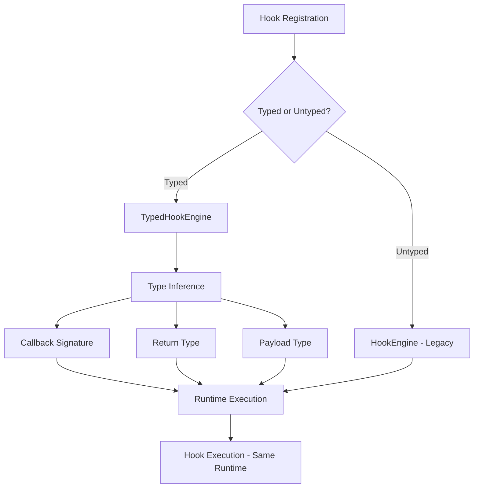

# Hook & Plugin Type System Enhancement — Design

## Overview

This design transforms the hook system from a loosely-typed, string-based API into a fully type-safe, developer-friendly system with complete TypeScript inference. The approach uses advanced TypeScript features (conditional types, mapped types, template literals) to provide amazing DX while maintaining 100% backward compatibility.

**Key Principles**:

-   Zero runtime overhead (types only)
-   Backward compatible (existing code works unchanged)
-   Typed by default (upgrade existing composables; no duplicate APIs)
-   Incremental adoption (migrate file by file where needed)
-   Extensible (easy to add new hooks)
-   Performant (no TS compiler slowdown)

## Architecture

### High-Level Flow



### Type System Layers

1. **Core Type Definitions** (`app/utils/hook-types.ts`)

    - Hook payload interfaces
    - Hook name unions
    - Type utilities

2. **Typed Engine Wrapper** (`app/utils/typed-hooks.ts`)

    - Type-safe wrapper around HookEngine
    - Conditional types for inference
    - Overloaded signatures

3. **Composables (typed-by-default)**

    - Existing `useHooks()` now returns a typed wrapper of the runtime engine (no behavior change)
    - Existing `useHookEffect()` infers callback types from the hook name and cleans up as before
    - Optional: separate typed composables can be added later if desired, but are not required

4. **Legacy Compatibility** (existing files)
    - Keep all existing APIs intact
    - No deprecations needed for composables; behavior is identical with improved types
    - Provide augmentation pattern and docs for custom hooks

## Components and Interfaces

### 1. Enhanced Hook Type Definitions

**File**: `app/utils/hook-types.ts`

```typescript
// ============================================================================
// PAYLOAD INTERFACES
// ============================================================================

// Chat & AI Hooks
export interface AiSendBeforePayload {
    threadId?: string;
    modelId: string;
    user: { id: string; length: number };
    assistant: { id: string; streamId: string };
    messagesCount?: number;
}

export interface AiSendAfterPayload {
    threadId?: string;
    request?: { modelId?: string; userId?: string };
    response?: { assistantId?: string; length?: number };
    timings?: {
        startedAt: number;
        endedAt: number;
        durationMs: number;
    };
    aborted?: boolean;
}

export interface AiStreamDeltaPayload {
    delta: string;
    context: {
        threadId?: string;
        assistantId: string;
        streamId: string;
        deltaLength: number;
        totalLength: number;
        chunkIndex: number;
    };
}

// Pane Hooks
export interface PaneState {
    id: string;
    mode: 'chat' | 'doc';
    threadId?: string;
    documentId?: string;
    messages: any[];
    validating?: boolean;
}

export interface UiPaneActivePayload {
    pane: PaneState;
    index: number;
    previousIndex?: number;
}

export interface UiPaneMsgSentPayload {
    pane: PaneState;
    message: {
        id: string;
        threadId?: string;
        length?: number;
        fileHashes?: string | null;
    };
}

// DB Hooks - Generic Entity Payloads
export interface DbCreatePayload<T = any> {
    entity: T;
    tableName: string;
}

export interface DbUpdatePayload<T = any> {
    existing: T;
    updated: T;
    patch: Partial<T>;
    tableName: string;
}

export interface DbDeletePayload<T = any> {
    entity: T;
    id: string;
    tableName: string;
}

// Specific DB Entity Types
export interface MessageEntity {
    id: string;
    thread_id: string;
    role: 'user' | 'assistant' | 'system';
    data: any;
    index: number;
    created_at: number;
    updated_at?: number;
}

export interface ThreadEntity {
    id: string;
    project_id?: string;
    title?: string;
    created_at: number;
    updated_at?: number;
}

// ... more entity types

// ============================================================================
// HOOK NAME TYPES
// ============================================================================

// Action hooks (return void)
export type ActionHookName =
    | 'ai.chat.send:action:before'
    | 'ai.chat.send:action:after'
    | 'ai.chat.stream:action:delta'
    | 'ai.chat.stream:action:reasoning'
    | 'ai.chat.stream:action:complete'
    | 'ai.chat.stream:action:error'
    | 'ai.chat.retry:action:before'
    | 'ai.chat.retry:action:after'
    | 'ui.pane.active:action'
    | 'ui.pane.blur:action'
    | 'ui.pane.switch:action'
    | 'ui.pane.open:action:after'
    | 'ui.pane.close:action:before'
    | 'ui.pane.thread:action:changed'
    | 'ui.pane.doc:action:changed'
    | 'ui.pane.doc:action:saved'
    | 'ui.pane.msg:action:sent'
    | 'ui.pane.msg:action:received'
    | 'ui.sidebar.select:action:before'
    | 'ui.sidebar.select:action:after'
    | 'ui.chat.new:action:after'
    | 'app.init:action:after'
    | DbActionHookName;

// Filter hooks (return transformed value)
export type FilterHookName =
    | 'ui.chat.message:filter:outgoing'
    | 'ui.chat.message:filter:incoming'
    | 'ai.chat.model:filter:select'
    | 'ai.chat.messages:filter:input'
    | 'ui.pane.thread:filter:select'
    | 'ui.pane.doc:filter:select'
    | 'files.attach:filter:input'
    | DbFilterHookName;

// DB hook patterns
export type DbEntity =
    | 'messages'
    | 'threads'
    | 'documents'
    | 'files'
    | 'projects'
    | 'posts'
    | 'prompts'
    | 'attachments'
    | 'kv';
export type DbOperation = 'create' | 'upsert' | 'update' | 'delete' | 'get';
export type DbPhase = 'before' | 'after';
export type DbDeleteType = 'soft' | 'hard';

export type DbActionHookName =
    | `db.${DbEntity}.${DbOperation}:action:${DbPhase}`
    | `db.${DbEntity}.delete:action:${DbDeleteType}:${DbPhase}`;

export type DbFilterHookName =
    | `db.${DbEntity}.${DbOperation}:filter:input`
    | `db.${DbEntity}.${DbOperation}:filter:output`;

// All hook names
export type HookName = ActionHookName | FilterHookName | (string & {});

// ============================================================================
// HOOK PAYLOAD MAPPING
// ============================================================================

export interface HookPayloadMap {
    // AI/Chat Actions
    'ai.chat.send:action:before': [AiSendBeforePayload];
    'ai.chat.send:action:after': [AiSendAfterPayload];
    'ai.chat.stream:action:delta': [string, AiStreamDeltaPayload['context']];
    'ai.chat.stream:action:reasoning': [
        string,
        {
            threadId?: string;
            assistantId: string;
            streamId: string;
            reasoningLength: number;
        }
    ];
    'ai.chat.stream:action:complete': [
        {
            threadId?: string;
            assistantId: string;
            streamId: string;
            totalLength: number;
            reasoningLength?: number;
            fileHashes?: string | null;
        }
    ];
    'ai.chat.stream:action:error': [
        {
            threadId?: string;
            streamId?: string;
            error?: unknown;
            aborted?: boolean;
        }
    ];
    'ai.chat.retry:action:before': [
        {
            threadId?: string;
            originalUserId: string;
            originalAssistantId?: string;
            triggeredBy: 'user' | 'assistant';
        }
    ];
    'ai.chat.retry:action:after': [
        {
            threadId?: string;
            originalUserId: string;
            originalAssistantId?: string;
            newUserId?: string;
            newAssistantId?: string;
        }
    ];

    // Pane Actions
    'ui.pane.active:action': [PaneState, number, number | undefined];
    'ui.pane.blur:action': [PaneState, number];
    'ui.pane.switch:action': [PaneState, number];
    'ui.pane.open:action:after': [PaneState, number];
    'ui.pane.close:action:before': [PaneState, number];
    'ui.pane.thread:action:changed': [PaneState, string | '', string, number];
    'ui.pane.doc:action:changed': [PaneState, string | '', string];
    'ui.pane.doc:action:saved': [PaneState, string];
    'ui.pane.msg:action:sent': [PaneState, UiPaneMsgSentPayload['message']];
    'ui.pane.msg:action:received': [
        PaneState,
        UiPaneMsgSentPayload['message'] & { reasoningLength?: number }
    ];

    // Sidebar Actions
    'ui.sidebar.select:action:before': [{ kind: 'chat' | 'doc'; id: string }];
    'ui.sidebar.select:action:after': [{ kind: 'chat' | 'doc'; id: string }];
    'ui.chat.new:action:after': [];

    // App Actions
    'app.init:action:after': [any]; // NuxtApp

    // Chat Filters
    'ui.chat.message:filter:outgoing': [string];
    'ui.chat.message:filter:incoming': [string, string | undefined];
    'ai.chat.model:filter:select': [string];
    'ai.chat.messages:filter:input': [any[]];

    // Pane Filters
    'ui.pane.thread:filter:select': [string, PaneState, string];
    'ui.pane.doc:filter:select': [string, PaneState, string];

    // File Filters
    'files.attach:filter:input': [
        | {
              file: File;
              name: string;
              mime: string;
              size: number;
              kind: 'image' | 'pdf';
          }
        | false
    ];
}

// ============================================================================
// TYPE UTILITIES
// ============================================================================

// Extract callback parameters for a hook
export type InferHookParams<K extends HookName> = K extends keyof HookPayloadMap
    ? HookPayloadMap[K]
    : any[];

// Extract callback return type
export type InferHookReturn<K extends HookName> = K extends FilterHookName
    ? K extends keyof HookPayloadMap
        ? HookPayloadMap[K][0] // First param is the value for filters
        : any
    : void | Promise<void>;

// Full callback signature
export type InferHookCallback<K extends HookName> = (
    ...args: InferHookParams<K>
) => InferHookReturn<K> | Promise<InferHookReturn<K>>;

// Check if hook is action or filter
export type IsAction<K extends HookName> = K extends ActionHookName
    ? true
    : false;
export type IsFilter<K extends HookName> = K extends FilterHookName
    ? true
    : false;

// Extract just the payload (first param for filters, all params for actions)
export type ExtractHookPayload<K extends HookName> =
    K extends keyof HookPayloadMap ? HookPayloadMap[K][0] : any;

// Wildcard hook support - union of all matching hooks
export type MatchingHooks<Pattern extends string> = Extract<
    HookName,
    `${Pattern}`
>;

// For DB hooks, infer entity type
export type InferDbEntity<K extends string> = K extends `db.messages.${string}`
    ? MessageEntity
    : K extends `db.threads.${string}`
    ? ThreadEntity
    : any;
```

### 2. Typed Hook Engine Wrapper

**File**: `app/utils/typed-hooks.ts`

```typescript
import type { HookEngine, OnOptions } from './hooks';
import type {
    HookName,
    ActionHookName,
    FilterHookName,
    InferHookCallback,
    InferHookParams,
    InferHookReturn,
} from './hook-types';

/**
 * Typed wrapper around HookEngine providing full type inference.
 * This is a zero-cost abstraction - all types are erased at runtime.
 */
export interface TypedHookEngine {
    // ========================================================================
    // ACTIONS - Type-safe action registration and execution
    // ========================================================================

    /**
     * Register an action hook with full type inference
     * @example
     * hooks.addAction('ai.chat.send:action:before', (payload) => {
     *   // payload is automatically typed as AiSendBeforePayload
     *   console.log(payload.modelId);
     * });
     */
    addAction<K extends ActionHookName>(
        name: K,
        callback: InferHookCallback<K>,
        priority?: number
    ): void;

    /**
     * Remove an action hook
     */
    removeAction<K extends ActionHookName>(
        name: K,
        callback: InferHookCallback<K>,
        priority?: number
    ): void;

    /**
     * Execute an action hook (async)
     */
    doAction<K extends ActionHookName>(
        name: K,
        ...args: InferHookParams<K>
    ): Promise<void>;

    /**
     * Execute an action hook (sync)
     */
    doActionSync<K extends ActionHookName>(
        name: K,
        ...args: InferHookParams<K>
    ): void;

    // ========================================================================
    // FILTERS - Type-safe filter registration and execution
    // ========================================================================

    /**
     * Register a filter hook with full type inference
     * @example
     * hooks.addFilter('ui.chat.message:filter:outgoing', (text) => {
     *   // text is automatically typed as string
     *   return text.trim();
     * });
     */
    addFilter<K extends FilterHookName>(
        name: K,
        callback: InferHookCallback<K>,
        priority?: number
    ): void;

    /**
     * Remove a filter hook
     */
    removeFilter<K extends FilterHookName>(
        name: K,
        callback: InferHookCallback<K>,
        priority?: number
    ): void;

    /**
     * Apply filters (async) with type inference
     */
    applyFilters<K extends FilterHookName>(
        name: K,
        value: InferHookParams<K>[0],
        ...args: Tail<InferHookParams<K>>
    ): Promise<InferHookReturn<K>>;

    /**
     * Apply filters (sync) with type inference
     */
    applyFiltersSync<K extends FilterHookName>(
        name: K,
        value: InferHookParams<K>[0],
        ...args: Tail<InferHookParams<K>>
    ): InferHookReturn<K>;

    // ========================================================================
    // UNIFIED API - Works with both actions and filters
    // ========================================================================

    /**
     * Register a hook (action or filter) with automatic type inference
     * @example
     * hooks.on('ai.chat.send:action:before', (payload) => {
     *   // Automatically typed based on hook name
     * }, { kind: 'action', priority: 5 });
     */
    on<K extends HookName>(
        name: K,
        callback: InferHookCallback<K>,
        opts?: OnOptions & {
            kind?: K extends ActionHookName ? 'action' : 'filter';
        }
    ): () => void;

    /**
     * Remove a hook registration
     */
    off(disposer: () => void): void;

    /**
     * Register a one-time action hook
     */
    onceAction<K extends ActionHookName>(
        name: K,
        callback: InferHookCallback<K>,
        priority?: number
    ): () => void;

    // ========================================================================
    // UTILITIES
    // ========================================================================

    hasAction<K extends ActionHookName>(
        name?: K,
        fn?: InferHookCallback<K>
    ): boolean | number;
    hasFilter<K extends FilterHookName>(
        name?: K,
        fn?: InferHookCallback<K>
    ): boolean | number;
    removeAllCallbacks(priority?: number): void;
    currentPriority(): number | false;

    // Access to underlying engine for advanced use cases
    readonly _engine: HookEngine;
    readonly _diagnostics: HookEngine['_diagnostics'];
}

// Utility type to get all but first element of tuple
type Tail<T extends any[]> = T extends [any, ...infer Rest] ? Rest : [];

/**
 * Create a typed wrapper around a HookEngine instance.
 * This is a zero-cost abstraction at runtime.
 */
export function createTypedHookEngine(engine: HookEngine): TypedHookEngine {
    return {
        // Actions
        addAction: (name, callback, priority) =>
            engine.addAction(name, callback as any, priority),
        removeAction: (name, callback, priority) =>
            engine.removeAction(name, callback as any, priority),
        doAction: (name, ...args) => engine.doAction(name, ...args),
        doActionSync: (name, ...args) => engine.doActionSync(name, ...args),

        // Filters
        addFilter: (name, callback, priority) =>
            engine.addFilter(name, callback as any, priority),
        removeFilter: (name, callback, priority) =>
            engine.removeFilter(name, callback as any, priority),
        applyFilters: (name, value, ...args) =>
            engine.applyFilters(name, value, ...args) as any,
        applyFiltersSync: (name, value, ...args) =>
            engine.applyFiltersSync(name, value, ...args) as any,

        // Unified
        on: (name, callback, opts) => engine.on(name, callback as any, opts),
        off: (disposer) => engine.off(disposer),
        onceAction: (name, callback, priority) =>
            engine.onceAction(name, callback as any, priority),

        // Utilities
        hasAction: (name, fn) => engine.hasAction(name, fn as any),
        hasFilter: (name, fn) => engine.hasFilter(name, fn as any),
        removeAllCallbacks: (priority) => engine.removeAllCallbacks(priority),
        currentPriority: () => engine.currentPriority(),

        // Direct access
        _engine: engine,
        _diagnostics: engine._diagnostics,
    };
}
```

### 3. Typed Composables

**File**: `app/composables/useTypedHooks.ts`

```typescript
import { useNuxtApp } from '#app';
import type { HookEngine } from '../utils/hooks';
import {
    createTypedHookEngine,
    type TypedHookEngine,
} from '../utils/typed-hooks';

let cachedTypedEngine: TypedHookEngine | null = null;

/**
 * Get a fully typed hooks interface with automatic type inference.
 *
 * @example
 * const hooks = useTypedHooks();
 *
 * // Callback is automatically typed!
 * hooks.on('ai.chat.send:action:before', (payload) => {
 *   console.log(payload.modelId); // TypeScript knows this exists
 * });
 *
 * // Filter return type is enforced
 * const result = await hooks.applyFilters(
 *   'ui.chat.message:filter:outgoing',
 *   userInput
 * ); // result is typed as string
 */
export function useTypedHooks(): TypedHookEngine {
    const nuxtApp = useNuxtApp();
    const engine = nuxtApp.$hooks as HookEngine;

    // Cache the typed wrapper to avoid recreating it
    if (!cachedTypedEngine || cachedTypedEngine._engine !== engine) {
        cachedTypedEngine = createTypedHookEngine(engine);
    }

    return cachedTypedEngine;
}
```

**File**: `app/composables/useTypedHookEffect.ts`

```typescript
import { onBeforeUnmount } from 'vue';
import { useTypedHooks } from './useTypedHooks';
import type {
    HookName,
    InferHookCallback,
    ActionHookName,
    FilterHookName,
} from '../utils/hook-types';
import type { OnOptions } from '../utils/hooks';

/**
 * Register a typed hook with automatic cleanup on unmount and HMR.
 * The callback is automatically typed based on the hook name!
 *
 * @example
 * // In a Vue component
 * useTypedHookEffect('ai.chat.send:action:before', (payload) => {
 *   // payload is automatically typed as AiSendBeforePayload
 *   console.log(payload.modelId);
 * });
 *
 * @example
 * // With a filter
 * useTypedHookEffect(
 *   'ui.chat.message:filter:outgoing',
 *   (text) => text.trim(), // text is typed as string
 *   { kind: 'filter', priority: 5 }
 * );
 */
export function useTypedHookEffect<K extends HookName>(
    name: K,
    callback: InferHookCallback<K>,
    opts?: OnOptions & {
        kind?: K extends ActionHookName
            ? 'action'
            : K extends FilterHookName
            ? 'filter'
            : 'action' | 'filter';
    }
): () => void {
    const hooks = useTypedHooks();
    const disposer = hooks.on(name, callback, opts);

    // Component lifecycle cleanup
    onBeforeUnmount(() => hooks.off(disposer));

    // HMR cleanup
    if (import.meta.hot) {
        import.meta.hot.dispose(() => hooks.off(disposer));
    }

    return disposer;
}
```

### 4. Migration Utilities

**File**: `app/utils/hook-migration.ts`

```typescript
/**
 * Utilities to help migrate from untyped to typed hooks
 */

import type { HookEngine } from './hooks';
import type { TypedHookEngine } from './typed-hooks';

/**
 * Check if a hook name is valid (exists in type system)
 */
export function isValidHookName(name: string): boolean {
    // This could be enhanced with runtime validation
    return typeof name === 'string' && name.length > 0;
}

/**
 * Get suggestions for a potentially misspelled hook name
 */
export function suggestHookNames(input: string, allHooks: string[]): string[] {
    const lower = input.toLowerCase();
    return allHooks
        .filter((hook) => hook.toLowerCase().includes(lower))
        .slice(0, 5);
}

/**
 * Deprecation warning for old typedOn helper
 */
export function deprecatedTypedOn(hooks: HookEngine): any {
    console.warn(
        '[hooks] typedOn() is deprecated. Use useTypedHooks() instead for better type inference.'
    );
    // Return the old implementation for compatibility
    return {
        on: (key: string, fn: any, opts?: any) => hooks.on(key, fn, opts),
    };
}
```

## Data Models

### Hook Registry (Runtime - No Changes)

The runtime hook registry remains unchanged - this is purely a type-level enhancement:

```typescript
// Internal structure (unchanged)
interface CallbackEntry {
    fn: Function;
    priority: number;
    id: number;
    name: string;
}

// Maps remain the same
const actions = new Map<string, CallbackEntry[]>();
const filters = new Map<string, CallbackEntry[]>();
```

### Type Augmentation Pattern

For plugins to add custom hooks:

```typescript
// In a plugin file
declare module '~/utils/hook-types' {
    interface HookPayloadMap {
        'my-plugin:custom:action': [{ data: string }];
        'my-plugin:transform:filter': [number];
    }

    interface ActionHookName {
        'my-plugin:custom:action': 'my-plugin:custom:action';
    }

    interface FilterHookName {
        'my-plugin:transform:filter': 'my-plugin:transform:filter';
    }
}
```

## Error Handling

### Type-Level Error Messages

Use TypeScript's error messaging features:

```typescript
// Custom error messages for common mistakes
type ValidateHookName<K> = K extends HookName
    ? K
    : `❌ Invalid hook name. Did you mean one of: ${SuggestSimilar<K>}?`;

type SuggestSimilar<K> = K extends `${infer Prefix}.${string}`
    ? Extract<HookName, `${Prefix}.${string}`>
    : HookName;
```

### Runtime Validation (Development Only)

```typescript
if (import.meta.dev) {
    // Validate hook names in development
    const originalOn = engine.on;
    engine.on = (name, fn, opts) => {
        if (!isValidHookName(name)) {
            console.warn(`[hooks] Unknown hook name: "${name}"`);
            const suggestions = suggestHookNames(name, ALL_HOOK_NAMES);
            if (suggestions.length) {
                console.warn(`Did you mean: ${suggestions.join(', ')}?`);
            }
        }
        return originalOn.call(engine, name, fn, opts);
    };
}
```

## Testing Strategy

### Type Tests

Create type-level tests to ensure type inference works:

```typescript
// app/utils/__tests__/hook-types.test-d.ts
import { describe, it, expectTypeOf } from 'vitest';
import type { InferHookCallback, InferHookReturn } from '../hook-types';

describe('Hook Type Inference', () => {
    it('should infer action callback signature', () => {
        type Callback = InferHookCallback<'ai.chat.send:action:before'>;

        expectTypeOf<Callback>().parameters.toMatchTypeOf<
            [
                {
                    threadId?: string;
                    modelId: string;
                    // ... rest of payload
                }
            ]
        >();

        expectTypeOf<Callback>().returns.toMatchTypeOf<void | Promise<void>>();
    });

    it('should infer filter callback signature', () => {
        type Callback = InferHookCallback<'ui.chat.message:filter:outgoing'>;

        expectTypeOf<Callback>().parameters.toMatchTypeOf<[string]>();
        expectTypeOf<Callback>().returns.toMatchTypeOf<
            string | Promise<string>
        >();
    });

    it('should handle DB hooks', () => {
        type Callback = InferHookCallback<'db.messages.create:action:before'>;

        expectTypeOf<Callback>().parameters.toMatchTypeOf<[any]>(); // Generic entity
    });
});
```

### Integration Tests

Test that typed hooks work with real components:

```typescript
// app/composables/__tests__/useTypedHooks.test.ts
import { describe, it, expect, vi } from 'vitest';
import { useTypedHooks } from '../useTypedHooks';

describe('useTypedHooks', () => {
    it('should provide typed hook registration', async () => {
        const hooks = useTypedHooks();
        const callback = vi.fn();

        hooks.on('ai.chat.send:action:before', callback);

        await hooks.doAction('ai.chat.send:action:before', {
            modelId: 'test',
            user: { id: '1', length: 10 },
            assistant: { id: '2', streamId: 'stream-1' },
        });

        expect(callback).toHaveBeenCalled();
    });
});
```

## Performance Considerations

### Zero Runtime Overhead

-   All type information is erased during compilation
-   The typed wrapper is a thin proxy with no additional logic
-   No runtime type checking (only in dev mode for DX)
-   Same execution path as untyped hooks

### TypeScript Compiler Performance

-   Use type aliases to avoid recomputing complex types
-   Cache inferred types where possible
-   Limit depth of conditional type recursion
-   Use template literal types sparingly

### Bundle Size

-   Types add 0 bytes to production bundle
-   Development-only validation is tree-shaken in production
-   No additional dependencies required

## Migration Path

### Phase 1: Add Types (Non-Breaking)

1. Add `hook-types.ts` with all type definitions
2. Add `typed-hooks.ts` wrapper
3. Add `useTypedHooks` and `useTypedHookEffect` composables
4. Update documentation

### Phase 2: Gradual Adoption

1. Migrate core plugins to typed hooks
2. Update examples in docs
3. Add migration guide
4. Mark old `typedOn` as deprecated

### Phase 3: Full Migration (Optional)

1. Convert all plugins to typed hooks
2. Add ESLint rule to prefer typed hooks
3. Consider removing deprecated APIs in next major version

## Documentation Updates

### New Docs to Create

1. **Type System Guide** (`docs/hooks-type-system.md`)

    - Overview of typed hooks
    - Examples for all hook types
    - Custom hook registration
    - Troubleshooting

2. **Migration Guide** (`docs/hooks-migration.md`)

    - Step-by-step migration
    - Before/after examples
    - Common patterns
    - FAQ

3. **API Reference** (`docs/hooks-api-reference.md`)
    - All hook names with types
    - Payload interfaces
    - Type utilities
    - Advanced patterns

### Updates to Existing Docs

1. Update `docs/hooks.md` with typed examples
2. Add type information to hook map
3. Update plugin examples to use typed hooks
4. Add TypeScript tips section

## Future Enhancements

1. **VSCode Extension**: Custom extension for hook autocomplete and validation
2. **Hook Inspector UI**: DevTools panel showing registered hooks with types
3. **Runtime Type Validation**: Optional Zod/Valibot integration for runtime safety
4. **Hook Generator**: CLI tool to scaffold new hooks with types
5. **Performance Profiler**: Type-aware hook performance analysis
