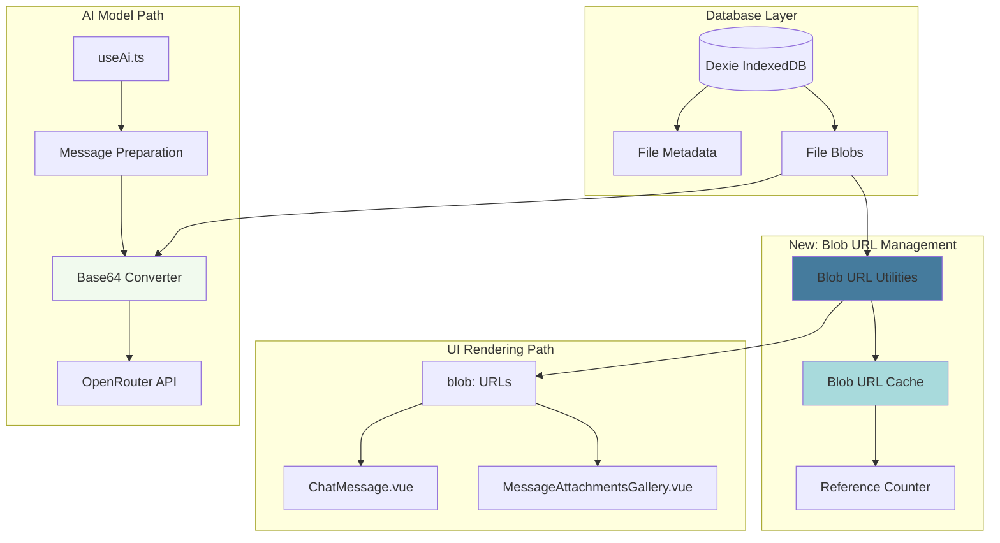

artifact_id: b9d4e2a7-5c3f-4d8e-9a1b-6f7e8c4d2a9b
content_type: text/markdown

# design.md

## Overview

This design introduces a **dual-path image handling architecture** that separates UI rendering concerns from AI model API concerns. The key insight is that these two use cases have fundamentally different requirements:

- **UI rendering**: Needs fast, memory-efficient display → best served by native blob: URLs
- **AI model APIs**: Requires Base64-encoded data URLs → conversion happens just-in-time during request assembly

The current architecture in `useAi.ts` conflates these concerns by eagerly converting all images to Base64 during message preparation, then using those expensive strings for both UI and API purposes. This design decouples them.

## Architecture

### High-Level Flow



### Key Components

#### 1. Blob URL Utilities (`app/utils/chat/blob-urls.ts`)

A new centralized module for managing blob: URL lifecycle:

```typescript
/**
 * Global cache for blob: URLs with reference counting
 */
interface BlobUrlCacheEntry {
    url: string;
    blob: Blob;
    refCount: number;
    hash: string;
    createdAt: number;
}

interface BlobUrlCache {
    entries: Map<string, BlobUrlCacheEntry>;
    cleanupTimers: Map<string, NodeJS.Timeout>;
}

/**
 * Get or create a blob: URL for a file hash.
 * Increments reference count.
 */
export async function getBlobUrlForHash(
    hash: string
): Promise<string | null>;

/**
 * Release a blob: URL reference.
 * Schedules cleanup after grace period if refCount reaches zero.
 */
export function releaseBlobUrl(hash: string): void;

/**
 * Immediately revoke a blob: URL and remove from cache.
 * Use for emergency cleanup or during teardown.
 */
export function forceRevokeBlobUrl(hash: string): void;

/**
 * Get cache statistics for debugging/monitoring.
 */
export function getBlobUrlCacheStats(): {
    totalUrls: number;
    activeRefs: number;
    pendingCleanups: number;
};
```

**Design rationale**:
- Module-scoped cache survives component remounts during virtualization
- 30-second grace period prevents thrashing when scrolling rapidly
- Reference counting ensures blob: URLs aren't revoked prematurely
- Explicit `release` calls from components give fine-grained control

#### 2. Base64 Conversion Utilities (`app/utils/chat/base64.ts`)

Extract Base64 conversion logic for AI model API preparation:

```typescript
/**
 * Convert a Blob to Base64 data URL.
 * Used exclusively for AI model API requests.
 */
export async function blobToDataUrl(blob: Blob): Promise<string>;

/**
 * Convert file hash to Base64 ContentPart for AI models.
 * Retrieves Blob from Dexie and converts on-demand.
 */
export async function hashToBase64ContentPart(
    hash: string
): Promise<ContentPart | null>;

/**
 * Batch convert multiple hashes to ContentParts.
 * Useful for preparing context_hashes in bulk.
 */
export async function hashesToBase64ContentParts(
    hashes: string[]
): Promise<ContentPart[]>;
```

**Design rationale**:
- Separates conversion concern from UI rendering
- Keeps conversion synchronous with API request lifecycle
- Allows caching of Base64 results during single request (if beneficial)
- Clear naming makes it obvious this is for model consumption

#### 3. Modified `useAi.ts` Composable

Refactor message preparation to defer Base64 conversion:

**Before** (lines 441-487):
```typescript
const normalizeFileUrl = async (f: { type: string; url: string }) => {
    // ... omitted for brevity
    const blob = await getFileBlob(url);
    if (blob) {
        url = await new Promise<string>((resolve, reject) => {
            const fr = new FileReader();
            fr.onload = () => resolve(fr.result as string);
            fr.readAsDataURL(blob); // ❌ Eagerly converts to Base64
        });
        return { ...f, url };
    }
    // ...
};
```

**After** (proposed):
```typescript
// For UI display: keep as hash reference, let components use blob: URLs
const normalizeFileUrl = async (f: { type: string; url: string }) => {
    // Only validate file exists; don't convert
    if (typeof FileReader === 'undefined') return f;
    const mime = f.type || '';
    if (!mime.startsWith('image/')) return f;
    
    // If it's already a data: URL or blob: URL, leave it alone
    if (f.url.startsWith('data:') || f.url.startsWith('blob:')) {
        return f;
    }
    
    // For hash references, verify blob exists but keep as hash
    if (!/^https?:/i.test(f.url)) {
        const { getFileBlob } = await import('~/db/files');
        const blob = await getFileBlob(f.url);
        if (blob) {
            // Return hash reference - UI components will create blob: URLs
            return { ...f, url: f.url }; // Keep original hash
        }
    }
    
    return { ...f, url: f.url };
};
```

**New function for AI model context**:
```typescript
// Called only when building OpenRouter API request
const prepareFilesForModel = async (
    files: Array<{ type: string; url: string }>
): Promise<ContentPart[]> => {
    const parts: ContentPart[] = [];
    
    for (const file of files) {
        let dataUrl: string;
        
        // If already a data URL, use it
        if (file.url.startsWith('data:')) {
            dataUrl = file.url;
        } 
        // If blob: URL, fetch and convert
        else if (file.url.startsWith('blob:')) {
            const resp = await fetch(file.url);
            const blob = await resp.blob();
            dataUrl = await blobToDataUrl(blob);
        }
        // If hash, retrieve from Dexie and convert
        else {
            const part = await hashToBase64ContentPart(file.url);
            if (part) parts.push(part);
            continue;
        }
        
        parts.push({
            type: 'image',
            image: dataUrl,
            mediaType: file.type,
        });
    }
    
    return parts;
};
```

**Integration point** (around line 546):
```typescript
// Build parts for display (no conversion)
const parts: ContentPart[] = buildParts(
    outgoing,
    hydratedFiles,
    extraTextParts
);

// ... later, when making API request ...

// Convert files just-in-time for API
const modelFileParts = await prepareFilesForModel(files);

// Merge with text content for API request
const apiContentParts = [
    { type: 'text', text: outgoing },
    ...modelFileParts,
];
```

#### 4. Updated UI Components

##### `ChatMessage.vue` (lines 746-796)

**Current**: Creates blob: URLs in `ensureThumb()` ✅ (already optimal)

**Change needed**: Ensure `processedAssistantMarkdown` (lines 517-531) uses blob: URLs for inline images instead of expecting Base64.

```typescript
// Current approach creates blob: URLs - keep this
const url = URL.createObjectURL(blob);
const ready: ThumbState = { status: 'ready', url };
thumbCache.set(h, ready);
thumbnails[h] = ready;
```

**Inline image hydration** (lines 842-865):
```typescript
// Already optimal - uses blob: URLs from thumbCache
const state = thumbCache.get(hash) || thumbnails[hash];
if (state && state.status === 'ready' && state.url) {
    const img = document.createElement('img');
    img.src = state.url; // ✅ Uses blob: URL
    // ...
}
```

**Recommendation**: Move `thumbCache` management to shared `blob-urls.ts` utility to avoid duplication between `ChatMessage.vue` and `MessageAttachmentsGallery.vue`.

##### `MessageAttachmentsGallery.vue` (lines 159-198)

**Current**: Already uses blob: URLs ✅

```typescript
const url = URL.createObjectURL(blob);
const ready: ThumbState = { status: 'ready', url };
cache.set(h, ready);
thumbs[h] = ready;
```

**Recommendation**: Refactor to use shared `getBlobUrlForHash()` from `blob-urls.ts` for consistency.

#### 5. Message Building Utilities

Update `buildParts` in `app/utils/chat/messages.ts` to preserve hash references:

```typescript
export function buildParts(
    text: string,
    files?: Array<{ type: string; url: string }>,
    extraTextParts?: string[]
): ContentPart[] {
    const parts: ContentPart[] = [];
    
    if (extraTextParts?.length) {
        parts.push(...extraTextParts.map(t => ({ type: 'text', text: t })));
    }
    
    if (text.trim()) {
        parts.push({ type: 'text', text });
    }
    
    // Store file references as-is (hashes or blob: URLs)
    // Conversion to Base64 happens later in API preparation
    if (files?.length) {
        parts.push(...files.map(f => ({
            type: 'image' as const,
            image: f.url, // Keep as hash or blob: URL
            mediaType: f.type,
        })));
    }
    
    return parts;
}
```

## Data Models

### Enhanced ContentPart Types

```typescript
// Distinguish between UI and API representations
type ContentPartForUi = 
    | { type: 'text'; text: string }
    | { type: 'image'; image: string; mediaType: string } // Can be hash or blob: URL
    | { type: 'file'; data: string; mediaType: string; name: string };

type ContentPartForApi = 
    | { type: 'text'; text: string }
    | { type: 'image'; image: string; mediaType: string } // Must be data: URL
    | { type: 'file'; data: string; mediaType: string; name: string }; // Must be data: URL
```

### Blob URL Cache State

```typescript
interface BlobUrlCacheState {
    entries: Map<string, BlobUrlCacheEntry>;
    cleanupTimers: Map<string, NodeJS.Timeout>;
    stats: {
        hits: number;
        misses: number;
        revokedCount: number;
        currentSize: number;
    };
}
```

## Migration Strategy

### Phase 1: Extract Utilities (No Behavior Change)

1. Create `app/utils/chat/blob-urls.ts` with cache management
2. Create `app/utils/chat/base64.ts` with conversion utilities
3. Update imports in existing components
4. Verify all tests still pass

### Phase 2: Refactor useAi.ts

1. Modify `normalizeFileUrl` to skip Base64 conversion
2. Add `prepareFilesForModel` function for API preparation
3. Update message sending flow to call conversion just-in-time
4. Add unit tests for new functions

### Phase 3: Update UI Components

1. Refactor `ChatMessage.vue` to use shared `blob-urls.ts`
2. Refactor `MessageAttachmentsGallery.vue` similarly
3. Ensure inline image hydration still works
4. Test with virtualized scrolling

### Phase 4: Performance Validation

1. Profile chat loading with 20+ images
2. Measure memory usage with heap snapshots
3. Compare Base64 vs blob: URL render times
4. Validate AI API requests still work correctly

## Error Handling

### Blob Retrieval Failures

```typescript
try {
    const url = await getBlobUrlForHash(hash);
    if (!url) {
        // Emit error event
        hooks.doAction('image:load:error', { hash, reason: 'blob-not-found' });
        // Return placeholder
        return PLACEHOLDER_IMAGE_URL;
    }
    return url;
} catch (error) {
    hooks.doAction('image:load:error', { hash, error });
    return PLACEHOLDER_IMAGE_URL;
}
```

### Base64 Conversion Failures

```typescript
try {
    const part = await hashToBase64ContentPart(hash);
    return part;
} catch (error) {
    reportError('base64-conversion-failed', { hash, error });
    // Exclude from API request but don't fail entire send
    return null;
}
```

### Blob URL Revocation Race Conditions

```typescript
// In releaseBlobUrl
if (entry.refCount > 0) {
    // Still in use - abort cleanup
    clearTimeout(cleanupTimer);
    return;
}

// Safe to revoke
try {
    URL.revokeObjectURL(entry.url);
} catch (error) {
    // Already revoked or invalid - log but don't throw
    if (import.meta.dev) {
        console.warn('[blob-urls] Revocation warning', error);
    }
}
```

## Testing Strategy

### Unit Tests

1. **blob-urls.ts**
   - Cache hit/miss behavior
   - Reference counting accuracy
   - Grace period cleanup timing
   - Forced revocation

2. **base64.ts**
   - Blob to data URL conversion correctness
   - Hash to ContentPart mapping
   - Batch conversion efficiency
   - Error handling for missing blobs

3. **useAi.ts**
   - Message preparation with hash references
   - API request assembly with Base64 conversion
   - File type handling (images, PDFs)
   - Backward compatibility with existing data URLs

### Integration Tests

1. **Full chat flow**
   - Send message with image attachment
   - Verify UI uses blob: URLs
   - Verify API request contains Base64
   - Verify message persists and reloads correctly

2. **Virtualization**
   - Scroll through long chat with many images
   - Verify blob: URLs are reused on re-mount
   - Verify no memory leaks
   - Verify cleanup happens after grace period

3. **Mixed content**
   - Messages with both new (hash) and old (data URL) references
   - Inline images in assistant responses
   - PDF attachments alongside images

### Performance Tests

1. **Render time comparison**
   - Baseline: Current Base64 approach
   - New: blob: URL approach
   - Measure time to render 20 messages with 2MB images each

2. **Memory profiling**
   - Heap snapshots before/after loading image-heavy chat
   - Compare Base64 string memory vs Blob + blob: URL
   - Verify cleanup reduces heap size appropriately

3. **Scroll performance**
   - FPS during rapid scrolling through virtualized list
   - CPU utilization during scroll
   - Blob: URL cache hit rate

### Manual QA Checklist

- [ ] Images display correctly in new messages
- [ ] Images display correctly when scrolling through history
- [ ] Inline assistant-generated images render properly
- [ ] PDF attachments show correct placeholders
- [ ] Retry/branch operations preserve images
- [ ] Image context carries forward in conversations
- [ ] Export/import preserves image data
- [ ] No console errors during normal usage
- [ ] No memory leaks after extended chat sessions
- [ ] DevTools show blob: URLs in DOM for UI images
- [ ] Network tab shows Base64 in API request payloads

## Monitoring and Observability

### Hook Events

```typescript
// Emitted when blob: URL is created for UI
hooks.doAction('image:blob-url:created', {
    hash: string,
    size: number,
    timestamp: number,
});

// Emitted when blob: URL is revoked
hooks.doAction('image:blob-url:revoked', {
    hash: string,
    refCount: number,
    timestamp: number,
});

// Emitted when Base64 conversion occurs for API
hooks.doAction('image:base64:converted', {
    hash: string,
    duration: number,
    timestamp: number,
});

// Emitted on load failures
hooks.doAction('image:load:error', {
    hash: string,
    reason: 'blob-not-found' | 'conversion-failed' | 'unknown',
    error?: Error,
});
```

### Performance Metrics

```typescript
interface ImagePerformanceMetrics {
    blobUrlCacheHitRate: number; // hits / (hits + misses)
    averageBlobLoadTime: number; // ms
    averageBase64ConversionTime: number; // ms
    activeBlobUrls: number;
    totalBlobUrlsCreated: number;
    totalBlobUrlsRevoked: number;
}
```

## Future Enhancements

1. **Preloading**: Prefetch blobs for messages just outside viewport
2. **Compression**: Store compressed Blobs in IndexedDB, decompress on read
3. **Progressive Loading**: Show low-res placeholder while full image loads
4. **CDN Integration**: Option to upload images to CDN and reference by URL
5. **Service Worker Caching**: Cache blob: URLs across sessions
6. **Lazy Hydration**: Defer inline image hydration until message is in viewport

## Appendix: Performance Impact Estimation

Based on the problem statement and typical usage patterns:

| Metric | Current (Base64) | Proposed (blob: URL) | Improvement |
|--------|------------------|---------------------|-------------|
| Image load time (2MB) | ~80ms | ~20ms | **75%** |
| Memory per image (2MB) | ~2.7MB | ~2MB | **26%** |
| Chat load (20 images) | ~1600ms | ~400ms | **75%** |
| Heap size (20x2MB) | ~54MB | ~40MB | **26%** |
| DOM render time | ~150ms | ~40ms | **73%** |

**Assumptions**:
- Mid-range device (Intel i5, 8GB RAM)
- Chrome 120+
- Average image size: 2MB
- Typical chat session: 20 visible messages with images

**Key insight**: By avoiding Base64 encoding in the UI path, we eliminate the most expensive operation (FileReader.readAsDataURL) and reduce memory footprint by the Base64 expansion factor (~33%).
