# Image Loading Optimization - Technical Design

## Overview

This document describes the technical architecture for optimizing image loading in the chat interface. The core strategy is to generate and store small thumbnails (~400px) at upload time, then load thumbnails first with full images on-demand.

---

## Architecture

```mermaid
flowchart TD
    subgraph Upload Flow
        A[User uploads image] --> B{Size > 400px?}
        B -->|Yes| C[Generate thumbnail]
        B -->|No| D[Skip thumbnail]
        C --> E[Store original in file_blobs]
        C --> F[Store thumbnail in file_thumbs]
        D --> E
        E --> G[Update file_meta with has_thumb flag]
    end

    subgraph Load Flow
        H[Thread opens] --> I[Extract all file_hashes]
        I --> J[prefetchThreadThumbnails]
        J --> K{In cache?}
        K -->|Yes| L[Return cached URL]
        K -->|No| M[Batch load from file_thumbs]
        M --> N{Has thumbnail?}
        N -->|Yes| O[Create blob URL]
        N -->|No| P[Fallback: load from file_blobs]
        O --> Q[Update cache]
        P --> Q
    end

    subgraph On-Demand Full Load
        R[User clicks thumbnail] --> S[Load from file_blobs]
        S --> T[Display full resolution]
    end
```



---

## Database Schema Changes

### New Table: `file_thumbs`

```typescript
// In db/client.ts
export interface FileThumbRow {
    hash: string;      // Same hash as file_blobs (primary key)
    blob: Blob;        // Thumbnail blob (JPEG/WebP, ~20-50KB typical)
}

// Add to Or3DB class
file_thumbs!: Table<FileThumbRow, string>;

// In schema stores
this.version(6).stores({
    // ... existing stores ...
    file_thumbs: 'hash',
});
```

### Updated FileMeta Schema

```typescript
// In db/schema.ts - add field
export const FileMetaSchema = z.object({
    // ... existing fields ...
    has_thumb: z.boolean().default(false),  // NEW: indicates thumbnail exists
});
```

---

## Core Components

### 1. Thumbnail Generator (`app/utils/images/thumbnail.ts`)

```typescript
export interface ThumbnailResult {
    blob: Blob;
    width: number;
    height: number;
}

export const THUMB_MAX_SIZE = 400;
export const THUMB_QUALITY = 0.8;

/**
 * Generate a thumbnail from an image blob.
 * Returns null if image is already small enough or generation fails.
 */
export async function generateThumbnail(
    blob: Blob,
    maxSize = THUMB_MAX_SIZE
): Promise<ThumbnailResult | null> {
    // Skip if already small
    const img = await createImageBitmap(blob);
    if (img.width <= maxSize && img.height <= maxSize) {
        img.close();
        return null;
    }

    // Calculate scaled dimensions
    const scale = maxSize / Math.max(img.width, img.height);
    const width = Math.round(img.width * scale);
    const height = Math.round(img.height * scale);

    // Use OffscreenCanvas if available, fallback to regular canvas
    const canvas = typeof OffscreenCanvas !== 'undefined'
        ? new OffscreenCanvas(width, height)
        : document.createElement('canvas');
    
    if (!(canvas instanceof OffscreenCanvas)) {
        canvas.width = width;
        canvas.height = height;
    }

    const ctx = canvas.getContext('2d');
    if (!ctx) {
        img.close();
        return null;
    }

    ctx.drawImage(img, 0, 0, width, height);
    img.close();

    // Prefer WebP, fallback to JPEG
    const outputType = blob.type === 'image/png' ? 'image/png' : 'image/webp';
    const outputBlob = canvas instanceof OffscreenCanvas
        ? await canvas.convertToBlob({ type: outputType, quality: THUMB_QUALITY })
        : await new Promise<Blob>((resolve) => {
            (canvas as HTMLCanvasElement).toBlob(
                (b) => resolve(b!),
                outputType,
                THUMB_QUALITY
            );
        });

    return { blob: outputBlob, width, height };
}
```

### 2. Thumbnail Storage (`app/db/thumbs.ts`)

```typescript
import { db } from './client';

/**
 * Store a thumbnail blob.
 */
export async function storeThumb(hash: string, blob: Blob): Promise<void> {
    await db.file_thumbs.put({ hash, blob });
}

/**
 * Get a single thumbnail by hash.
 */
export async function getThumb(hash: string): Promise<Blob | undefined> {
    const row = await db.file_thumbs.get(hash);
    return row?.blob;
}

/**
 * Bulk get thumbnails.
 */
export async function getThumbsBulk(hashes: string[]): Promise<Map<string, Blob>> {
    const unique = [...new Set(hashes.filter(Boolean))];
    if (!unique.length) return new Map();

    const rows = await db.file_thumbs.bulkGet(unique);
    const result = new Map<string, Blob>();
    for (let i = 0; i < unique.length; i++) {
        const row = rows[i];
        if (row?.blob) result.set(unique[i]!, row.blob);
    }
    return result;
}

/**
 * Check which hashes have thumbnails.
 */
export async function hasThumbsBulk(hashes: string[]): Promise<Set<string>> {
    const unique = [...new Set(hashes.filter(Boolean))];
    if (!unique.length) return new Set();

    // Use keys() for efficiency - don't load blobs
    const existing = await db.file_thumbs.where('hash').anyOf(unique).primaryKeys();
    return new Set(existing);
}
```

### 3. Updated File Creation (`app/db/files.ts`)

```typescript
import { generateThumbnail } from '~/utils/images/thumbnail';
import { storeThumb } from './thumbs';

export async function createOrRefFile(
    file: Blob,
    name: string
): Promise<FileMeta> {
    // ... existing hash computation and dedup logic ...

    // Generate thumbnail for images
    let hasThumb = false;
    if (mime.startsWith('image/') && mime !== 'image/svg+xml') {
        try {
            const thumb = await generateThumbnail(file);
            if (thumb) {
                await storeThumb(hash, thumb.blob);
                hasThumb = true;
            }
        } catch (e) {
            console.warn('[files] thumbnail generation failed', e);
        }
    }

    // ... existing storage logic ...
    // Add has_thumb to metadata
    const meta = { ...prepared, has_thumb: hasThumb };
    // ...
}
```

### 4. Updated Thumbnail Loader (`app/composables/core/useThumbnails.ts`)

```typescript
import { getThumbsBulk } from '~/db/thumbs';
import { getFileBlobsBulk, getFileMetaBulk } from '~/db/files';

async function flushPrefetch() {
    // ... existing setup ...

    const loadPromise = (async () => {
        try {
            // First, try to load thumbnails (small, fast)
            const [thumbMap, metaMap] = await Promise.all([
                getThumbsBulk(toLoad),
                getFileMetaBulk(toLoad),
            ]);

            // Identify which hashes need full blob fallback
            const needFullBlob: string[] = [];

            for (const h of toLoad) {
                const meta = metaMap.get(h);
                const thumb = thumbMap.get(h);

                if (meta?.kind === 'pdf') {
                    pdfMetaCache.set(h, { name: meta.name, kind: 'pdf' });
                    thumbCache.delete(h);
                    continue;
                }

                if (thumb) {
                    // Have thumbnail - use it
                    const url = URL.createObjectURL(thumb);
                    thumbCache.set(h, { status: 'ready', url });
                } else {
                    // No thumbnail - need full blob
                    needFullBlob.push(h);
                }
            }

            // Fallback: load full blobs for images without thumbnails
            if (needFullBlob.length > 0) {
                const blobMap = await getFileBlobsBulk(needFullBlob);
                for (const h of needFullBlob) {
                    const blob = blobMap.get(h);
                    if (blob) {
                        const url = URL.createObjectURL(blob);
                        thumbCache.set(h, { status: 'ready', url });
                    } else {
                        thumbCache.set(h, { status: 'error' });
                    }
                }
            }
        } catch (error) {
            // ... error handling ...
        }
    })();

    // ...
}
```

---

## Migration Strategy

### Background Thumbnail Generator

```typescript
// app/workers/thumb-generator.ts (or plugin)
import { db } from '~/db/client';
import { generateThumbnail } from '~/utils/images/thumbnail';
import { storeThumb } from '~/db/thumbs';

const BATCH_SIZE = 10;
const CONCURRENCY = 2;

export async function migrateExistingImages(): Promise<void> {
    // Find images without thumbnails
    const images = await db.file_meta
        .where('kind')
        .equals('image')
        .filter((m) => !m.has_thumb && !m.deleted)
        .limit(BATCH_SIZE)
        .toArray();

    if (!images.length) return;

    // Process in batches with limited concurrency
    const queue = [...images];
    const processing: Promise<void>[] = [];

    while (queue.length > 0 || processing.length > 0) {
        while (processing.length < CONCURRENCY && queue.length > 0) {
            const meta = queue.shift()!;
            const p = processOne(meta.hash).finally(() => {
                const idx = processing.indexOf(p);
                if (idx >= 0) processing.splice(idx, 1);
            });
            processing.push(p);
        }

        if (processing.length > 0) {
            await Promise.race(processing);
        }
    }
}

async function processOne(hash: string): Promise<void> {
    try {
        const blob = await db.file_blobs.get(hash);
        if (!blob?.blob) return;

        const thumb = await generateThumbnail(blob.blob);
        if (thumb) {
            await storeThumb(hash, thumb.blob);
            await db.file_meta.update(hash, { has_thumb: true });
        }
    } catch (e) {
        console.warn('[thumb-migration] failed for', hash, e);
    }
}
```

---

## Error Handling

| Scenario | Recovery |
|----------|----------|
| Thumbnail generation fails | Fall back to full image load |
| IndexedDB quota exceeded | Evict old thumbnails, warn user |
| OffscreenCanvas unavailable | Use regular canvas (main thread) |
| Corrupt image blob | Mark as error, show placeholder |
| Migration interrupted | Resume from last position on next load |

---

## Testing Strategy

### Unit Tests
- `generateThumbnail` with various image sizes and formats
- Bulk operations return correct data
- Cache hit/miss logic
- LRU eviction under memory pressure

### Integration Tests
- Full upload → thumbnail → load cycle
- Migration of existing images
- Thread open performance with N images

### Performance Tests
- Measure time to load thread with 4, 10, 20 thumbnails
- Compare thumbnail vs full blob load times
- Memory usage under sustained load

---

## Rollout Plan

1. **Phase 1**: Add `file_thumbs` table, thumbnail generation on new uploads
2. **Phase 2**: Update loader to prefer thumbnails
3. **Phase 3**: Background migration of existing images
4. **Phase 4**: Performance monitoring and tuning
