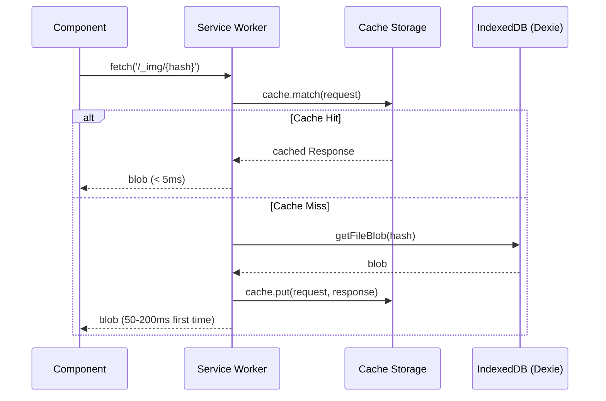
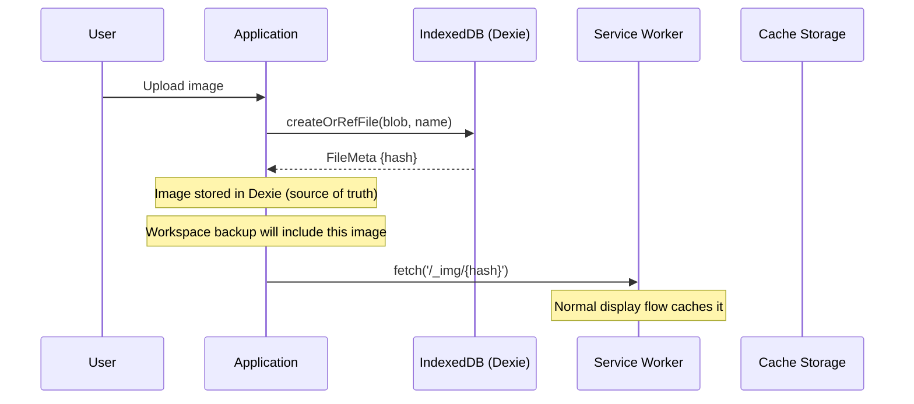
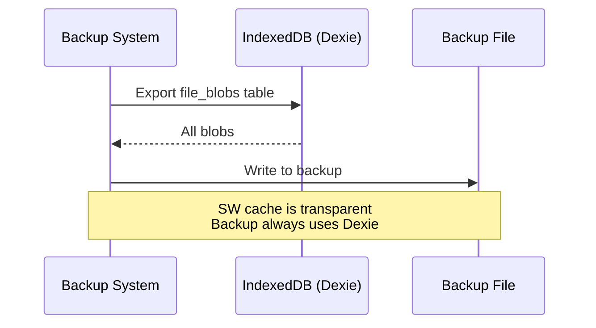

# Service Worker Image Cache - Technical Design

## Overview

This document describes a lightweight Service Worker (SW) cache layer for images that provides near-instant image loading while preserving Dexie as the authoritative source for workspace backups.

**Key Insight**: The current thumbnail approach still requires IndexedDB reads on every page load. A Service Worker cache bypasses IndexedDB entirely for cached images, providing true "instant" loading.

---

## Architecture

```
┌─────────────────────────────────────────────────────────────────────┐
│                           Browser                                    │
│  ┌─────────────────────────────────────────────────────────────────┐│
│  │                        Main Thread                               ││
│  │                                                                  ││
│  │   [Component] ──fetch('/_img/{hash}')──> [Service Worker]        ││
│  │        │                                        │                ││
│  │        │                                        ▼                ││
│  │        │                              ┌─────────────────┐        ││
│  │        │                              │  Cache Storage  │        ││
│  │        │                              │ (Cache API)     │        ││
│  │        │                              │                 │        ││
│  │        │                              │  Instant reads  │        ││
│  │        │                              │  No IndexedDB   │        ││
│  │        │                              └────────┬────────┘        ││
│  │        │                                       │                 ││
│  │        │  Cache Miss                  Cache Hit│                 ││
│  │        │     │                                 │                 ││
│  │        ▼     ▼                                 ▼                 ││
│  │   ┌─────────────────┐                 [Return blob]              ││
│  │   │   IndexedDB     │                                            ││
│  │   │ (Dexie - Source │                                            ││
│  │   │   of Truth)     │                                            ││
│  │   │                 │                                            ││
│  │   │ • file_blobs    │◄── Workspace backup reads from here        ││
│  │   │ • file_meta     │                                            ││
│  │   └─────────────────┘                                            ││
│  └─────────────────────────────────────────────────────────────────┘│
└─────────────────────────────────────────────────────────────────────┘
```

---

## Why Service Worker Cache?

| Approach | Read Latency | Memory Impact | Persistence |
|----------|-------------|---------------|-------------|
| IndexedDB (Dexie) | 50-500ms per blob | Low (disk-based) | Permanent |
| In-Memory Map | <1ms | High (RAM) | Session only |
| SW Cache API | <5ms | Low (disk-based) | Permanent |

The Cache API is:
- **Fast**: Optimized by browsers for HTTP responses, reads are near-instant
- **Disk-based**: Doesn't consume JavaScript heap memory
- **Lazy**: Only caches images that are actually viewed
- **Evictable**: Browser can evict under storage pressure (graceful degradation)

---

## Flow Diagrams

### Image Display Flow



### Upload Flow (No Change to Dexie)



### Workspace Backup Flow (Unchanged)



---

## Implementation

### 1. Service Worker Registration (`plugins/sw-register.client.ts`)

```typescript
export default defineNuxtPlugin(() => {
    if (typeof navigator === 'undefined' || !('serviceWorker' in navigator)) {
        return;
    }

    // Register SW only in production or when explicitly enabled
    if (import.meta.env.PROD || import.meta.env.VITE_ENABLE_SW) {
        navigator.serviceWorker.register('/sw.js', { scope: '/' })
            .then((reg) => {
                console.debug('[sw] registered', reg.scope);
            })
            .catch((err) => {
                console.warn('[sw] registration failed', err);
            });
    }
});
```

### 2. Service Worker (`public/sw.js`)

```javascript
const CACHE_NAME = 'or3-images-v1';
const IMAGE_PATH_PREFIX = '/_img/';

// Lightweight - only handles image requests
self.addEventListener('fetch', (event) => {
    const url = new URL(event.request.url);
    
    // Only intercept /_img/{hash} requests
    if (!url.pathname.startsWith(IMAGE_PATH_PREFIX)) {
        return; // Let other requests pass through
    }

    event.respondWith(handleImageRequest(event.request, url.pathname));
});

async function handleImageRequest(request, pathname) {
    const cache = await caches.open(CACHE_NAME);
    
    // Try cache first (instant)
    const cached = await cache.match(request);
    if (cached) {
        return cached;
    }
    
    // Cache miss - need to get from IndexedDB via main thread
    // Post message to get blob, then cache it
    const hash = pathname.slice(IMAGE_PATH_PREFIX.length);
    
    try {
        // Use BroadcastChannel to request blob from main thread
        const blob = await requestBlobFromMain(hash);
        
        if (!blob) {
            return new Response('Not found', { status: 404 });
        }
        
        // Create response and cache it
        const response = new Response(blob, {
            headers: {
                'Content-Type': blob.type || 'image/png',
                'Cache-Control': 'immutable',
            },
        });
        
        // Clone before caching (response can only be used once)
        cache.put(request, response.clone());
        
        return response;
    } catch (err) {
        console.error('[sw] image load failed', hash, err);
        return new Response('Error', { status: 500 });
    }
}

// Communication with main thread
const channel = new BroadcastChannel('or3-image-cache');
const pendingRequests = new Map();

channel.onmessage = (event) => {
    const { type, hash, blob, error } = event.data;
    if (type === 'blob-response') {
        const resolver = pendingRequests.get(hash);
        if (resolver) {
            pendingRequests.delete(hash);
            if (error) {
                resolver.reject(new Error(error));
            } else {
                resolver.resolve(blob);
            }
        }
    }
};

function requestBlobFromMain(hash) {
    return new Promise((resolve, reject) => {
        const timeout = setTimeout(() => {
            pendingRequests.delete(hash);
            reject(new Error('timeout'));
        }, 10000);
        
        pendingRequests.set(hash, {
            resolve: (blob) => {
                clearTimeout(timeout);
                resolve(blob);
            },
            reject: (err) => {
                clearTimeout(timeout);
                reject(err);
            },
        });
        
        channel.postMessage({ type: 'blob-request', hash });
    });
}

// Cache cleanup on activation
self.addEventListener('activate', (event) => {
    event.waitUntil(
        caches.keys().then((names) => {
            return Promise.all(
                names
                    .filter((name) => name.startsWith('or3-images-') && name !== CACHE_NAME)
                    .map((name) => caches.delete(name))
            );
        })
    );
});
```

### 3. Main Thread Bridge (`composables/core/useImageCacheBridge.ts`)

```typescript
import { getFileBlob } from '~/db/files';

let bridgeInitialized = false;
let channel: BroadcastChannel | null = null;

export function initImageCacheBridge() {
    if (bridgeInitialized || typeof BroadcastChannel === 'undefined') {
        return;
    }
    
    channel = new BroadcastChannel('or3-image-cache');
    
    channel.onmessage = async (event) => {
        const { type, hash } = event.data;
        
        if (type === 'blob-request') {
            try {
                const blob = await getFileBlob(hash);
                channel?.postMessage({
                    type: 'blob-response',
                    hash,
                    blob: blob || null,
                });
            } catch (err) {
                channel?.postMessage({
                    type: 'blob-response',
                    hash,
                    error: err instanceof Error ? err.message : 'unknown',
                });
            }
        }
    };
    
    bridgeInitialized = true;
}

export function destroyImageCacheBridge() {
    channel?.close();
    channel = null;
    bridgeInitialized = false;
}
```

### 4. Component Usage

```vue
<script setup lang="ts">
// Instead of loading blob and creating object URL:
// const blob = await getFileBlob(hash);
// const url = URL.createObjectURL(blob);

// Simply use the virtual URL - SW handles caching:
const imageUrl = computed(() => `/_img/${props.hash}`);
</script>

<template>
    
</template>
```

---

## Cache Management

### Automatic Eviction

The browser automatically manages Cache Storage under storage pressure:
- Chrome: Evicts when disk space is low (LRU within origin)
- Firefox: Similar behavior
- Safari: More aggressive eviction

### Manual Cache Control

```typescript
// Clear all cached images (e.g., on logout)
export async function clearImageCache(): Promise<void> {
    if (typeof caches === 'undefined') return;
    await caches.delete('or3-images-v1');
}

// Remove specific image from cache
export async function evictFromCache(hash: string): Promise<void> {
    if (typeof caches === 'undefined') return;
    const cache = await caches.open('or3-images-v1');
    await cache.delete(`/_img/${hash}`);
}

// Pre-warm cache for specific hashes (optional optimization)
export async function prewarmCache(hashes: string[]): Promise<void> {
    // Simply fetch each - SW will cache on miss
    await Promise.allSettled(
        hashes.map((hash) => fetch(`/_img/${hash}`))
    );
}
```

---

## Why This Approach is Lightweight

1. **Minimal SW Code**: ~50 lines of JavaScript, only handles `/_img/*` routes
2. **No Memory Overhead**: Cache API is disk-backed, not in JS heap
3. **Lazy Caching**: Only caches images that are actually displayed
4. **No Migration Needed**: Works immediately with existing Dexie data
5. **Graceful Degradation**: Falls back to direct Dexie read if SW unavailable
6. **No Duplicate Storage**: SW cache is separate from Dexie, browser manages eviction

---

## Comparison with Current Thumbnail Approach

| Aspect | Thumbnail Approach | SW Cache Approach |
|--------|-------------------|-------------------|
| First Load | Generate + store thumb | Fetch from Dexie, cache |
| Subsequent Load | Read thumb from IndexedDB | Read from Cache API (faster) |
| Storage Overhead | +20% (thumbnail copies) | Temporary (browser-managed) |
| Migration | Required for existing images | None needed |
| Backup Impact | Thumbs included in backup | No impact (separate cache) |
| Implementation | Schema change, new table | No schema change |
| Memory | Low | Very low |

---

## Hybrid Approach (Recommended)

The SW cache and thumbnail approaches are **complementary**:

1. **SW Cache**: Provides instant repeat access to any seen image
2. **Thumbnails**: Reduce initial payload size for first-time loads

```
First view of image:
  └─> SW cache miss
      └─> Load thumbnail from Dexie (small, fast)
          └─> Cache thumbnail in SW
              └─> Display

Second view of image:
  └─> SW cache hit (instant, < 5ms)
      └─> Display

User requests full image:
  └─> Load full blob from Dexie
      └─> Cache full blob in SW (optional, for frequently accessed images)
```

---

## Security Considerations

1. **Same-Origin Only**: SW only intercepts same-origin requests
2. **Hash Validation**: Hash format should be validated before Dexie lookup
3. **No Sensitive Data**: Image blobs don't contain credentials
4. **Cache Isolation**: Each origin has its own Cache Storage

---

## Testing Strategy

### Unit Tests
- SW registration succeeds
- Cache hit returns correct blob
- Cache miss triggers Dexie fetch
- BroadcastChannel communication works

### Integration Tests
- Image displays correctly via SW
- Cache persists across page reloads
- Workspace backup still includes images
- Cache eviction doesn't break display

### Performance Tests
- Measure cache hit latency (<5ms target)
- Measure cache miss latency (should match current)
- Memory usage over time (should not grow)

---

## Rollout Plan

1. **Phase 1**: Implement SW with fallback to current approach
2. **Phase 2**: Update components to use `/_img/{hash}` URLs
3. **Phase 3**: Monitor performance and cache hit rates
4. **Phase 4**: Consider hybrid with thumbnails for even faster first loads
