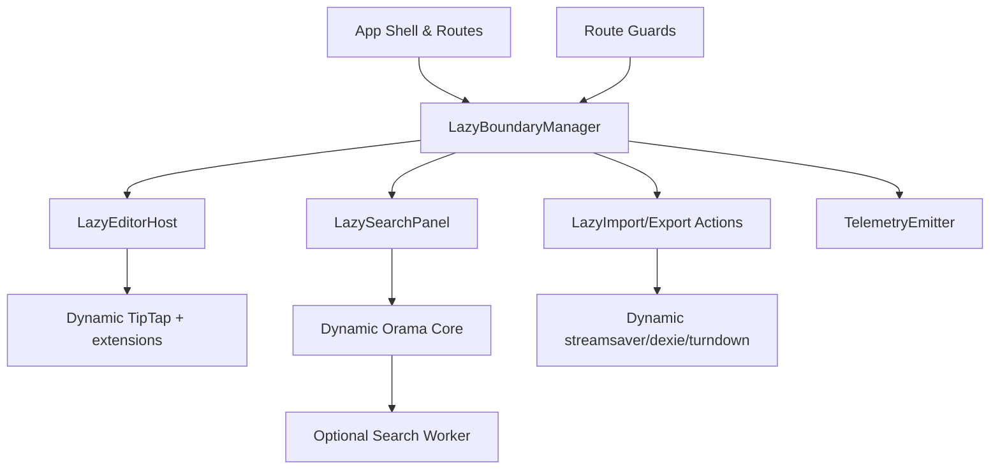

artifact_id: 7f5da3f5-e497-4f28-9fae-d2a989fc8a0b

# Lazy Boundary Design

## Overview

-   Objective: encapsulate heavy editor, search, and backup features behind dedicated lazy boundaries so core navigation hydrates with minimal JS.
-   Strategy: introduce `<LazyEditorHost>` and `<LazySearchPanel>` wrappers plus click-triggered loaders that dynamically import TipTap, Orama, streamsaver, dexie-export-import, and Turndown on demand.
-   Constraints: preserve autosave semantics, plugin APIs, keyboard shortcuts, and existing error handling once features load; keep server rendering stable by guarding client-only imports.

## Architecture



-   `LazyBoundaryManager`: composable maintaining a registry of boundary loaders, providing lifecycle hooks (`load`, `reset`, `getState`).
-   `LazyEditorHost`: lightweight Vue component rendering a suspense boundary and fallback skeleton until the editor module resolves.
-   `LazySearchPanel`: async component that mounts search UI, initializes Orama index, and optionally spawns a worker only when the panel opens.
-   `LazyImport/Export Actions`: click handlers that import backup utilities on demand and reuse cached promises.
-   `TelemetryEmitter`: shared helper emitting `lazy-boundary:loaded` and error events for monitoring.

## Components & Interfaces

```ts
export type LazyBoundaryKey =
    | 'editor-host'
    | 'editor-extensions'
    | 'docs-search-panel'
    | 'docs-search-worker'
    | 'workspace-export'
    | 'workspace-import';

type LazyBoundaryState = 'idle' | 'loading' | 'ready' | 'error';

interface LazyBoundaryDescriptor<T> {
    key: LazyBoundaryKey;
    loader: () => Promise<T>;
    onResolve?: (payload: T) => void;
}

interface LazyBoundaryController {
    state: Ref<Record<LazyBoundaryKey, LazyBoundaryState>>;
    load<T>(descriptor: LazyBoundaryDescriptor<T>): Promise<T>;
    reset(key: LazyBoundaryKey): void;
}

interface LazyTelemetryPayload {
    key: LazyBoundaryKey;
    ms: number;
    outcome: 'success' | 'failure';
    error?: unknown;
}
```

-   `useLazyBoundaries()` singleton exported from `app/composables/core/useLazyBoundaries.ts`; internally guards loaders with `defineAsyncComponent` and caches resolved modules.
-   `LazyEditorHost.vue`: wraps `Suspense` + `defineAsyncComponent` with loader delegating to `useLazyBoundaries().load({ key: 'editor-host', loader })`.
-   `EditorDynamicModule.ts`: exports factory `createDocumentEditor()` that imports `@tiptap/vue-3`, extensions, and plugin contributions lazily; returns a ready-to-mount component.
-   `LazySearchPanel.vue`: obtains Orama loader from `useLazyBoundaries()`, awaits `createSearchRuntime()` which sets up index + optional worker.
-   `workspaceBackupHandlers.ts`: exposes `loadExportToolchain()` and `loadImportToolchain()` that import `streamsaver`, `dexie-export-import`, and `turndown` only inside user-triggered flows.

### Lazy Editor Host Sketch

```ts
const DocumentEditor = defineAsyncComponent({
    loader: async () => {
        const [{ DocumentEditorRoot }, ext] = await Promise.all([
            import('~/components/documents/DocumentEditorRoot'),
            lazyBoundaries.load({ key: 'editor-extensions', loader: loadExtensions }),
        ]);
        return DocumentEditorRoot.withExtensions(ext);
    },
    suspensible: true,
    onError(error, _, retry) {
        emitTelemetry({ key: 'editor-host', ms: timer.stop(), outcome: 'failure', error });
        showToast('Failed to load editor');
        retry();
    },
});
```

-   `DocumentEditorRoot` exposes `.withExtensions()` helper so the lazy host can inject extensions after dynamic import resolves.
-   `loadExtensions()` iterates plugin registry, awaiting dynamic module factories registered via `registerEditorExtension(() => import(...))`.

### Lazy Search Panel Sketch

```ts
async function createSearchRuntime() {
    const [{ create, search }, workerLoader] = await Promise.all([
        import('@orama/orama'),
        lazyBoundaries.load({ key: 'docs-search-worker', loader: loadWorkerIfNeeded }),
    ]);
    const db = await initIndex(create);
    return { db, searchFn: (term: string) => search(db, { term, limit: 10 }) };
}

function loadWorkerIfNeeded() {
    if (!shouldUseWorker()) return Promise.resolve(null);
    return import('~/workers/orama.worker?worker');
}
```

-   Worker loader resolves to `null` in environments that do not support workers.
-   Search panel caches the runtime result so reopening the panel reuses the existing index and worker.

### Lazy Export/Import Handlers

```ts
async function handleExportClick() {
    const [{ streamWorkspaceExport }, streamSaverMod] = await Promise.all([
        import('~/utils/workspace-backup-stream'),
        lazyBoundaries.load({ key: 'workspace-export', loader: () => import('streamsaver') }),
    ]);

    const streamSaver = streamSaverMod?.default ?? null;
    return streamWorkspaceExport({ streamSaver });
}
```

-   Use shared `withLazyLoadingIndicator()` helper to reveal spinner if resolution exceeds 150 ms.
-   Import handlers memoize the modules using closures so repeated exports/imports reuse the same promise.

## Data & State

-   No schema or persistent data changes.
-   Lazy boundary states live in a Pinia store (or simple `reactive` map) keyed by `LazyBoundaryKey` for instrumentation.
-   Worker instance reference stored in module scope of `LazySearchPanel` to avoid duplicate workers.

## Error Handling

-   `useLazyBoundaries().load()` wraps each loader in a `try/catch`, returning `ServiceResult<T>`-style object for callers:
    ```ts
    type LazyResult<T> = ServiceResult<T, AppError>;
    ```
-   On failure, state flips to `error`, telemetry emits `outcome: 'failure'`, and the UI shows actionable messaging (retry button, support link).
-   Worker load failures fall back to main-thread indexing, ensuring search remains functional.
-   Export/import fallback uses `File` download via `URL.createObjectURL` if `streamsaver` fails to load.

## Testing Strategy

-   **Unit**: test `useLazyBoundaries()` state transitions, memoization, and telemetry emission using mocked loaders.
-   **Unit**: verify editor extension loader skips failing modules yet resolves remaining ones.
-   **Component**: mount `<LazyEditorHost>` with mocked dynamic imports to confirm skeleton, success, and error views.
-   **Component**: mount `<LazySearchPanel>` ensuring Orama is only imported after `open()` is triggered.
-   **Integration**: run Nuxt build analyzer snapshots to confirm chunk reductions and absence of TipTap/Orama in initial bundle.
-   **E2E**: simulate export/import clicks verifying dependencies load and UX remains responsive.
-   **Performance**: capture Web Vitals (FID/LCP) before vs. after to validate improvements and ensure telemetry logs appear with correct payloads.

