# Design

## Overview

Build one visible lifecycle over the existing acquisition, candidate, runtime, submission, and publication mechanisms. The change is primarily integration and product UX, with two bounded additions: a reproducible candidate receipt and an explicitly restricted local development admission path.

The user-facing model is simple:

1. **Developer:** Create candidate -> Test in local OR3 -> Submit the same files.
2. **Publisher/reviewer:** Validate -> Review -> Authorize signing -> Publish the same artifact.
3. **Installer:** Update -> Resolve any approval/setup -> Verify and install -> Confirm running.

Engineering delivery starts with client clarity, then development iteration, then publisher connection. These are independently useful increments, not a requirement to replace the entire pipeline at once.

## Architecture

```mermaid
flowchart LR
    Source[Source snapshot and pinned build inputs] --> Builder[SDK candidate builder]
    Builder --> Candidate[Immutable package + source + receipt]
    Candidate --> Local[Restricted local candidate admission]
    Local --> Runtime[Real OR3 worker and host registries]
    Runtime --> Evidence[Digest-bound local verification receipt]
    Candidate --> Submission[Existing marketplace submission revision]
    Evidence --> Submission
    Submission --> Review[Existing trusted validation and review]
    Review --> Publication[Existing publication intent and signer]
    Publication --> Release[Immutable signed release]
    Release --> Acquisition[Existing host acquisition operation]
    Acquisition --> Pointer[Managed instance package selection]
    Pointer --> Runtime
    Acquisition --> Status[Client lifecycle view]
    Runtime --> Status
```



Named components and ownership:

| Component | Responsibility | Existing home | Requirements |
| --- | --- | --- | --- |
| Lifecycle View | Present the next action and distinguish acquisition from runtime outcomes | `app/composables/marketplace/useMarketplace.ts`, existing marketplace components | R1, R2, R9 |
| Acquisition Service | Authoritatively install signed packages and enforce current preflight | `server/utils/plugins/acquisition/`, existing acquisition routes/contracts | R2, R3, R4 |
| Runtime Confirmation | Observe exact active package and contribution readiness in this browser/workspace | `app/composables/plugins/portable-client-runtime.ts`, `app/plugins/portable-clients.client.ts` | R1, R4 |
| Candidate Builder | Generate and verify immutable candidate files and provenance | `packages/plugin-sdk/src/cli/`, existing build/pack/inspect/conformance helpers | R5 |
| Local Admission | Admit an owner-selected candidate only into a dedicated development instance | Existing admin package-candidate, canary, pointer, and configuration modules; one restricted entry point | R3, R6 |
| Verification Receipt | Record what was checked against which candidate and host | SDK candidate receipt and existing local candidate/canary result boundaries | R5, R7 |
| Submission Flow | Bind publisher-supplied candidate metadata to the existing submission revision | Marketplace submission contracts/service and developer submission pages | R5, R7, R8 |
| Publication Flow | Preserve existing review/signer authority and resume exact publication intent | Marketplace reviews/publication/signer services and admin submission pages | R7, R8 |
| Diagnostic Projection | Export a bounded allowlist of lifecycle facts | Existing failure/status contracts and marketplace failure components | R4, R9 |

### Existing Mechanisms to Retain

- Acquisition stages already cover `requested`, `resolved`, `authorized`, `reserved`, `downloaded`, `verified`, `candidate-recorded`, `health-checked`, `promoted`, and `receipt-recorded`.
- Existing operations have durable status, revision protection, per-plugin runner locking, retry/cancel endpoints, and bounded history. Extend their projections rather than adding jobs or a coordinator.
- Candidate checks include a browser canary. An allocated worker or server-only health result cannot replace that check.
- Package promotion is instance-wide. Reuse enabled-workspace preflight and pointer compare-and-swap; do not introduce a workspace-local code pointer.
- Marketplace submission revisions, append-only evidence, review bindings, and publication intents already express the release lifecycle. Do not add a parallel candidate database/state machine.

## Components and Interfaces

The following TypeScript sketches describe the intended boundaries, not separate frameworks. Reuse existing digest, authority, error, and status types in implementation.

### Lifecycle View and Runtime Confirmation

```ts
type PackageIdentity = {
  pluginId: string;
  version: string;
  packageTreeSha256: string;
  manifestSha256: string;
};

type RuntimeObservation =
  | { state: 'not-observed' | 'disabled'; reason?: string }
  | { state: 'starting'; identity: PackageIdentity }
  | {
      state: 'running';
      identity: PackageIdentity;
      observedAt: string;
      degradedContributions: string[];
    }
  | { state: 'failed'; identity?: PackageIdentity; code: string };

type PluginLifecycleView = {
  selected: PackageIdentity | null;
  acquisition: AcquisitionStatusView | null; // Existing contract.
  runtime: RuntimeObservation; // Current browser/workspace only.
  activationTimedOut: boolean;
};
```

The view joins server-selected identity with current local runtime facts. It does not persist local "running" state as an instance-wide truth or advance durable acquisition stages from browser claims. Keep archive/release/source identities in expandable details; a matching version string alone is insufficient.

Current `useMarketplace.ts` requests reconciliation when an operation is completed. Extend that boundary to observe confirmation for at most 30 seconds, scoped to operation target, workspace, descriptor identity, and activation generation. Navigation or a workspace switch detaches the observer, not the durable operation. A late successful activation may update the visible status after timeout; it must not silently retry failed acquisition.

Emit readiness only after runtime bootstrap and the applicable sidebar, pane, and tool registrations have settled. Optional tool-discovery failure should be represented as a specific degraded contribution, not silently ignored or misreported as total activation failure. Required contribution failure prevents the full "Running" confirmation. Keep tools disabled by default where current policy requires it.

Use existing progress polling and operation recovery. The primary action is derived from authoritative stage/status: continue setup, review access, retry, open, or inspect failure. No synthetic percentages for worker confirmation. Authentication return links contain only validated relative routes and identifiers, never credentials.

### Candidate Builder and Verification Receipt

Add one SDK `candidate` command over existing validate/build/pack/inspect functions. It creates a new output directory and refuses to replace a frozen output. Consumption verifies existing files and does not run the build again.

```ts
type CandidateReceipt = {
  schemaVersion: 1;
  pluginId: string;
  version: string;
  profile: string;
  archiveSha256: string;
  packageTreeSha256: string;
  manifestSha256: string;
  sourceSha256: string;
  authoritySha256: string;
  buildProvenanceSha256: string;
  requiredHostFeatures: string[];
  source: { revision: string; dirty: boolean };
  build: {
    bunVersion: string;
    sdkVersion: string;
    sdkArtifactSha256: string;
    lockfileSha256: string;
    command: string;
  };
};

type DeveloperVerificationReceipt = {
  schemaVersion: 1;
  candidateReceiptSha256: string;
  hostBuild: string;
  hostFeatures: string[];
  scope: 'runtime-canary' | 'recorded-interaction-check';
  outcome: 'passed' | 'failed';
  recordedAt: string;
};
```

Package, source, and receipt are sibling outputs, avoiding a self-referential archive digest. Canonicalize the bounded receipt using the repository's existing canonical hashing conventions. Local paths, access tokens, environment values, and verification timestamps do not form the candidate's build identity. Dirty source must be included in the source snapshot and labeled; a Git SHA alone does not identify it.

Define `buildProvenanceSha256` over the canonical `source` and `build` objects, excluding the digest itself. The full candidate receipt separately binds that provenance to package/source bytes. A verification receipt's `hostBuild` identifies the tested host build, not just its semantic version; label development builds explicitly.

Record the actual SDK artifact bytes, including a permitted vendored development tarball, not only its package version. Release qualification applies the release guide's clean-checkout and dependency rules to these recorded inputs. A qualification build compares output with the frozen candidate; a mismatch requires a new candidate. It does not replace the tested archive.

Local canary evidence covers runtime admission only. Human or automated interaction checks are separately scoped and never inferred from a successful canary. Neither report is trusted reviewer evidence merely because its digests match.

### Local Admission

Expose one development-only owner flow in the existing plugin administration UI: select candidate files, inspect identity/authority, approve required access, run candidate checks, activate, and open the real plugin. Use ordinary authenticated browser uploads and existing admin mutation protections; do not add CLI-held marketplace credentials.

Propose a single opt-in flag, `OR3_PLUGIN_DEVELOPMENT=1`, subject to all of these independent checks:

- A development build is running and the server is bound to loopback. Production builds reject admission regardless of the flag.
- The instance was started with the dedicated development profile, with separate database/application data and extension directories. The setup path creates these explicit paths; it does not borrow the current production or everyday development instance's storage configuration.
- The request is from an authenticated, authorized owner, has a permitted same-origin mutation context, and satisfies direct loopback access checks. Do not infer eligibility from an untrusted forwarded header or a localhost URL alone.

Use a distinct, server-created local-admission provenance discriminator, never a fabricated marketplace signature or release. Feed the admitted bytes through the existing candidate validation/canary/promotion machinery. Keep the ordinary signed registry resolver and raw upload policy unchanged. Reuse existing candidate records for interruption recovery; there is no new durable acquisition engine for local files.

The local profile can replace a candidate of the same unpublished semantic version by explicit digest selection. Published catalog identity is never overwritten. The UI prominently displays development provenance and the selected digest. The ordinary app's registry, production package pointers, and user data are outside this instance.

### Submission and Publication Flow

Keep existing package/source upload reservations and submission endpoints. Add bounded optional candidate and developer-verification receipt payloads to the draft workflow. Validate their shape, recompute canonical hashes, compare artifact identities after uploads complete, and bind the receipts to that submission revision. Metadata supplied by a publisher remains untrusted.

Publisher pages show candidate identity, local verification scope, trusted validation results, review state, and next actor/action. Admin pages use the same identities with their existing role-specific controls. Submission, reviewer, and signer roles are not collapsed into one principal.

Use existing publication intents, lease/review/artifact binding, and reconciliation on retry. Preserve context across expired-session and recent-factor checks using same-origin return navigation. Never request or carry authentication codes through another app's session. After publication, show a compact immutable receipt and the supported staging install action; installation still belongs to the host and its administrator.

## Data Models

### Host

- Retain the existing filesystem operation records and their locking, revisions, stages, and bounded history. No new acquisition table, queue, or background job.
- Extend status/detail projections only where selected package identity or diagnostic fields are missing. Derive runtime observations from the current activation registry; keep them ephemeral.
- Store local candidate/provenance facts alongside existing candidate records in the dedicated development instance. Do not put development candidates in the signed release registry.
- Retain existing plugin storage unchanged. Candidate replacement is not a reset or data migration.

### Marketplace

- Retain `submissions`, `artifacts`, `submission_evidence`, `review_events`, `publication_intents`, and `releases` and their existing relationships.
- Add nullable, size-bounded `candidate_receipt_json` and `developer_verification_json` fields to `submissions` through an additive migration. This is revision-specific publisher metadata, not an approval record. Validate a combined maximum of 64 KiB before persistence.
- Extend revision-freezing enforcement so these fields cannot be changed after the draft identity freezes. Replacement metadata/artifacts use a new submission revision through the existing workflow.
- Reuse evidence `source_sha256` and `build_provenance_sha256`. Trusted runners independently report their inspected provenance; a publisher receipt does not populate trusted evidence by itself.
- Add no indexes: receipts are read with a submission by its existing key, not searched independently.
- Existing submissions without receipts remain readable and use the existing supported path; they are labeled as having no candidate verification receipt. Do not fabricate historical evidence or change immutable releases.

## Error Handling

Use existing structured failures (`code`, `stage`, `message`, `retryable`) and service error conventions. Map them to permitted UI actions, not to arbitrary response HTML or raw exception dumps.

| Failure | Visible outcome and recovery |
| --- | --- |
| Expired host, publisher, or signer session | Preserve authorized operation/submission context, request the relevant sign-in, resume after independent server authorization |
| Unsupported host feature/profile | Explain the required host capability; no download/promotion workaround |
| Additional grants or missing setup | Pause and direct the authorized actor to the existing review/setup flow |
| Network interruption before promotion | Recover the existing operation and offer retry when the service allows it |
| Digest, authority, provenance, or revision mismatch | Block the affected step; require matching artifacts or a new candidate/review |
| Promotion succeeded but receipt response was lost | Reconcile the durable operation and selected pointer before suggesting retry or failure |
| Installed package fails to activate | Show installed identity plus actual observed runtime state; retry reconciliation without reinstalling blindly |
| Workspace changes during activation | Discard stale local confirmation and observe the new workspace; do not cancel shared acquisition |
| Old package is revoked or cannot read current data | Do not offer automatic rollback; show repair/forward-update or supported backup recovery options |
| Ineligible development host | Reject admission and explain dedicated local setup; never suggest enabling ordinary raw uploads |

Diagnostic copying uses a positive allowlist and bounded strings. Export identifiers and error codes, not capability handles, tokens, signed URLs, cookies, task content, or raw logs. A failed update must not be translated into a generic success toast because an HTTP request itself completed.

## Testing Strategy

These are implementation gates, not commands to execute while preparing this plan.

- **Client unit/component tests (R1, R2, R4, R9):** Extend `useMarketplace`, installed/update/failure component tests, and portable runtime tests. Cover exact identity versus matching version, timeout, late confirmation, workspace/generation changes, disabled state, degraded optional tools, refresh/resume, and accessible recovery controls.
- **Acquisition integration tests (R2, R3, R4):** Extend existing acquisition-service, operation-store, route, package-candidate, pointer, and canary tests. Exercise stale grants/setup, all enabled workspaces, lost promotion responses, cancellation boundary, and failed candidate retention of the selected package.
- **SDK tests (R5, R7):** Verify frozen outputs, source snapshots, actual SDK artifact hashes, source/receipt tampering, deterministic receipt encoding, rebuild comparison, and explicit failure on a reused immutable output.
- **Development security tests (R3, R6):** Exercise development/production build, flag, profile, loopback, owner auth, mutation origin, and storage-root eligibility independently. Verify archive abuse protections and unchanged ordinary upload restrictions. Test replacement through the real worker/registries and persistence after reload.
- **Marketplace tests (R5, R7, R8):** Extend submission, review/publication, signer-binding, publication-integrity/operator-state/security tests. Cover receipt limits, digest mismatches, frozen metadata, old submissions, expired sessions, repeated publish, and interruption after signing/commit.
- **Real browser acceptance (R1-R9):** Use Chrome against actual OR3 instances, not a preview route. Test create candidate -> local admit -> actual sidebar/pane/tool use -> reload persistence -> replace candidate. Then test authorized staging submit/review/publish -> signed install -> exact running confirmation. Inspect desktop/mobile and light/dark status views, keyboard focus, failure recovery, and copied diagnostics.
- **Proportionate commands:** Use Bun targeted tests during coherent batches, then the affected host suites plus one typecheck. Isolation changes use the plugin-compatibility lane. SDK dependency/build changes require build/typecheck/affected tests. Marketplace auth/API/migration changes require `bun run check`; verify `check:env` before any authorized staging migration/deployment. Follow `docs/releasing.md` separately for any later SDK/package release.
- **Performance:** Reuse bounded polling and existing retained history. Assert no duplicate per-plugin runner, no accumulating reconciliation observers, and no per-poll announcement storm. No separate load system or cache is justified for this scope.

## Design Decisions

1. **Extend the existing lifecycle, do not replace it.** Durable host acquisition and marketplace publication already exist. A new coordinator would duplicate locks, authorization, and recovery rules.
2. **Separate installation from running.** Server completion cannot prove that the current browser activated the package. Keep both facts visible rather than changing server success based on a client timeout.
3. **Use a dedicated local instance.** A workspace-local version override conflicts with current instance-wide selection and creates a larger runtime/persistence problem. Dedicated data and extension roots keep the first implementation bounded and safe.
4. **Make local trust explicit and narrow.** Unsigned local admission is a development capability, not a relaxation of marketplace trust or the blocked raw-upload policy. Production rejects it independently of configuration.
5. **Build once, compare on qualification.** Rebuilding at submission time hides stale artifacts. A clean qualification may rebuild to establish reproducibility, but publication still consumes the frozen tested bytes and rejects differences.
6. **Persist receipt metadata on the submission revision.** Two bounded fields are sufficient; a new candidate table or event stream is not justified. Existing immutable evidence and publication records retain authority.
7. **No unconditional automatic rollback.** Keeping the previous pointer before promotion is safe; rolling code back after writes can be unsafe. Offer only recovery that existing policy and data compatibility can support.
8. **Keep security friction where it is meaningful.** Preserve explicit grants, trusted review, and recent signer authentication. Remove lost context, duplicate work, and ambiguous next steps rather than deleting security decisions.

## Risks & Mitigations

| Risk | Mitigation |
| --- | --- |
| Development admission leaks into a shared or production deployment | Independent build/profile/network/auth checks, isolated data roots, negative security tests, unchanged normal registry/upload routes |
| Runtime status falsely confirms old code | Match validated descriptor identity and workspace generation; readiness follows actual registrations; test stale callbacks and same-version/different-digest candidates |
| Candidate metadata is confused with trusted evidence | Separate publisher receipt fields from runner evidence, verify digests server-side, label provenance, preserve reviewer/signer authorization |
| Update recovery corrupts or loses plugin data | No storage clearing; no unconditional rollback; retain managed pre-promotion safety and test persistence across replacement/reload |
| Cross-repository scope delays useful improvements | Ship client status/recovery first, then local testing, then publisher connection; keep each phase independently gated and avoid new infrastructure |
