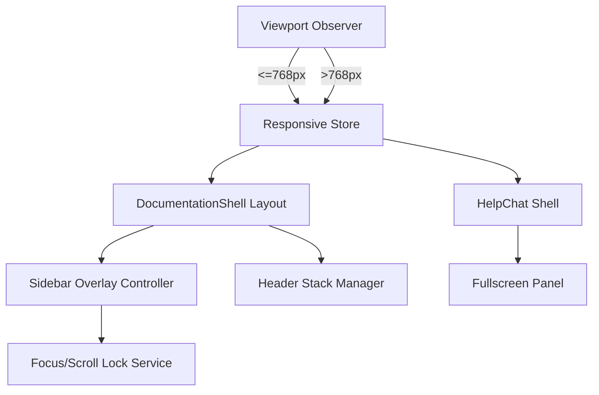

artifact_id: d610c1af-2b4f-4ebb-9a4e-3dd88954fc4d

# Mobile Optimization Design

## Overview

-   Scope: responsive updates to `app/components/DocumentationShell.vue` and `app/components/ui/HelpChat.vue`.
-   Objective: deliver adaptive layouts that prioritize content on ≤768px viewports without altering desktop UX.
-   Constraint: desktop mode (>768px) keeps the current markup, spacing, and interactions untouched.
-   Strategy: introduce breakpoint-aware layout primitives, overlay navigation, and full-screen help chat that only activate under the mobile breakpoint while preserving existing streaming and search flows.

## Architecture



-   `Viewport Observer`: hook or composable using `useBreakpoints` to emit mobile/desktop flags.
-   `Responsive Store`: computed refs controlling layout props (e.g., `isMobile`).
-   `DocumentationShell Layout`: conditionally renders stacked header, toggle button, and overlay sidebar (mobile only).
-   `Sidebar Overlay Controller`: manages open/close state, transitions, focus trapping, and scroll locking.
-   `HelpChat Shell`: adjusts dimensions and placement using the responsive flag.
-   `Focus/Scroll Lock Service`: utility to freeze background scrolling and restore focus after interactions.

## Components & Interfaces

```ts
interface ResponsiveState {
    isMobile: Ref<boolean>;
    isTablet: Ref<boolean>;
}

interface SidebarController {
    isOpen: Ref<boolean>;
    open: () => void;
    close: () => void;
    toggle: () => void;
}

interface ScrollLockHandle {
    lock: () => void;
    unlock: () => void;
}

interface HelpChatLayoutConfig {
    panelClass: ComputedRef<string>;
    launcherClass: ComputedRef<string>;
}
```

-   `useResponsiveState()`: wraps `useBreakpoints` (e.g., VueUse) with memoized refs for ≤768px.
-   `useSidebarController()`: encapsulates state, emits events, and handles focus restoration when closing.
-   `useScrollLock(target?: HTMLElement)`: adds/removes `overflow-hidden` on `body` and stores previous styles.
-   `useHelpChatLayout(responsive: ResponsiveState)`: returns computed class strings controlling width/height and positioning.

## Layout Behavior

### Documentation Shell

-   Add header stack logic that applies `flex-col` at mobile breakpoint, with adjusted gaps; retain current desktop flex row.
-   Replace static sidebar with `Teleport`-based overlay rendered to `body` only when `isMobile` is true; desktop renders existing sidebar as-is.
-   Overlay animation: use `Transition` with `translate-x-full` → `translate-x-0`, max duration 180ms.
-   Navigation toggle: icon button with `aria-expanded`, `aria-controls`, and label text (e.g., “Open navigation”); not rendered on desktop.
-   Focus trap: initial focus on first nav link; closing returns focus to toggle.
-   Scroll lock: `lock()` when overlay opens; `unlock()` on close, route change, or unmount.
-   Desktop fallback: if `isMobile` is false, bypass all overlay, scroll-lock, and toggle logic to ensure parity with today’s behavior.

#### Implementation Steps (docs shell)

1. Extend `<header>` container classes:
    - Append `flex-col gap-3 md:flex-row md:items-center` so stacking only occurs on mobile (`md` breakpoint mirrors existing desktop layout).
    - Ensure search input gets `w-full` on mobile and retains current width on desktop via `md:max-w-md`.
2. Introduce a new `sidebarOpen` ref inside `DocumentationShell.vue` scoped to mobile mode. Wire it to:
    ```ts
    const { isMobile } = useResponsiveState();
    const sidebarOpen = ref(false);
    watch(isMobile, (mobile) => {
        if (!mobile) sidebarOpen.value = false; // keep desktop static
    });
    ```
3. Replace the static `<aside>` with a conditional block:
    - For desktop (`!isMobile`), render the existing aside exactly as it is today.
    - For mobile, wrap the aside content with `<Teleport to="body">` + `<Transition>` and apply overlay classes (`fixed inset-0`, backdrop, panel width ~`80vw`).
4. Add a toggle button next to the logo only when `isMobile` is true:
    ```html
    <UButton
        v-if="isMobile"
        icon="i-heroicons-bars-3"
        aria-controls="docs-sidebar"
        :aria-expanded="sidebarOpen"
        @click="sidebarOpen = !sidebarOpen"
    />
    ```
5. Implement focus trapping using a lightweight utility:
    - On `sidebarOpen` transition to `true`, call `trap.activate()` targeting the overlay.
    - On close, deactivate trap and `focus()` the toggle button.
6. Hook the `useScrollLock()` helper to `sidebarOpen` so background scrolling freezes while the overlay is visible.
7. On `<NuxtLink>` click within the overlay, close the sidebar and allow navigation to complete before releasing scroll lock (use `nextTick` if needed).

### Help Chat

-   Mobile expanded state uses `fixed inset-0` and ensures input sticks to bottom with safe area padding.
-   Desktop retains existing sizing logic exactly; mobile uses conditional class computed from responsive state.
-   Prevent double scrollbars by making the conversation region `overflow-y-auto` and parent `flex` column.
-   Ensure launcher button repositions (bottom-right with margin) but remains above other fixed elements using `z-index` adjustments.

#### Implementation Steps (help chat)

1. Pull `const { isMobile } = useResponsiveState();` at the top of the script.
2. Convert existing class bindings for the chat panel to use a computed helper:
    ```ts
    const panelClass = computed(
        () =>
            isMobile.value && isExpanded.value
                ? 'fixed inset-0 z-50 flex flex-col bg-[var(--md-surface)]'
                : 'absolute bottom-0 right-0 ...' // current desktop classes
    );
    ```
    Apply `panelClass` to the chat wrapper.
3. When mobile + expanded, ensure the scroll container fills available height:
    - Add `class="flex-1 overflow-y-auto"` and set parent to `flex flex-col min-h-0`.
    - Include `pb-[env(safe-area-inset-bottom,16px)]` on the form so iOS safe areas are respected.
4. Move the launcher `<UButton>` into a computed wrapper that toggles between `fixed bottom-4 right-4` (desktop) and `fixed bottom-4 right-4 z-40` (mobile) to avoid overlay conflicts.
5. Guard fullscreen toggling: if `isMobile.value`, `toggleFullscreen()` should simply ensure `isExpanded.value = true` to prevent unexpected half-screen states.
6. Verify that closing the chat on mobile resets `isFullscreen` so desktop reopening behaves the same as today.

## Styling Guidelines

-   Tailwind media queries (`md:`) or CSS `@media` utilities ensure mobile-first definitions.
-   All new styles are additive and wrapped in mobile-only selectors to avoid modifying desktop appearance.
-   Shared spacing tokens: maintain 12–16px padding on mobile containers.
-   Typography: confirm `.prose-retro` scales to 16px base; apply overrides if necessary.
-   Use CSS custom properties already defined for theme colors to keep visual consistency.

## Data & State

-   No database or API schema changes.
-   State additions confined to Vue refs/composables inside target components.

## Error Handling

-   Sidebar controller guards: ensure `unlock()` runs in `onBeforeUnmount` to avoid stuck scroll lock.
-   Help chat: wrap viewport-dependent DOM access in `if (import.meta.client)` to avoid SSR mismatches.
-   Fallback classes: if responsive hook unavailable, default to desktop layout to avoid blank screens.

## Testing Strategy

-   **Unit**: verify `useResponsiveState`, `useSidebarController`, and `useScrollLock` behaviors (e.g., open/close transitions, scroll lock toggling).
-   **Component**: mount `DocumentationShell` in mobile viewport via `vi.mock` breakpoints; assert sidebar hidden, toggle visible, overlay opens/closes properly.
-   **Component**: mount `DocumentationShell` in desktop viewport to confirm sidebar remains visible and toggle is absent.
-   **E2E**: mobile viewport Cypress/Playwright scripts ensuring navigation works, overlay closes after link tap, help chat transitions to full screen, and focus order remains correct.
-   **Accessibility**: run Axe on mobile layout, confirm no new violations; keyboard navigation scenario validated.
-   **Performance**: capture Lighthouse mobile trace pre/post change to detect layout shift or main thread regressions; ensure animation frame budgets met.
-   **Regression**: snapshot desktop layout before/after changes to confirm pixel parity in key sections.
