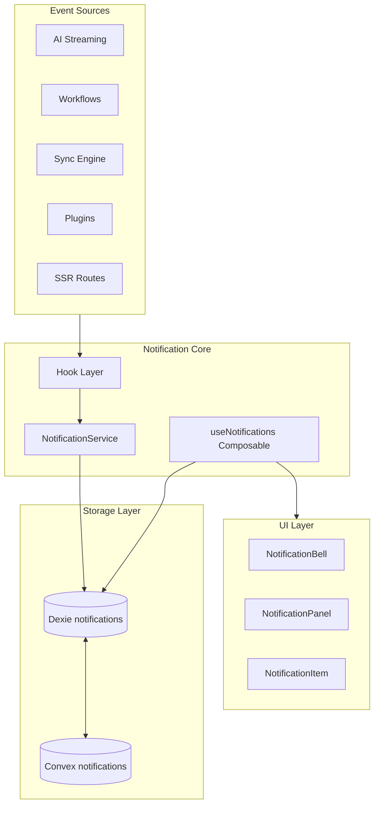
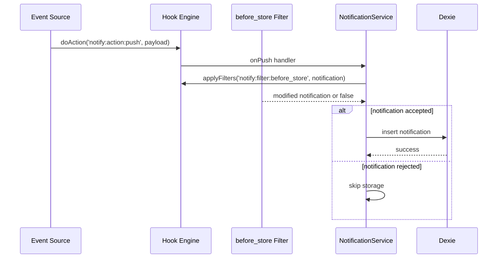

# design.md

artifact_id: a1b2c3d4-5678-90ab-cdef-notification02
date: 2026-01-21

## Overview

The Notification Center is a workspace-scoped, hook-driven system that captures, stores, and surfaces user notifications. It integrates with existing OR3 infrastructure (hooks, sync, Dexie) and prepares for future admin dashboard use cases.

---

## Architecture



### Core Components

| Component | Responsibility |
|-----------|----------------|
| `NotificationService` | Create, update, delete notifications; emit hooks |
| `useNotifications()` | Reactive composable for UI; queries Dexie |
| `NotificationBell.vue` | Icon with unread badge in sidebar |
| `NotificationPanel.vue` | Dropdown list of notifications |
| `NotificationItem.vue` | Single notification row with actions |

---

## Data Model

### Dexie Table: `notifications`

```typescript
// db/tables.ts
export interface Notification {
    id: string;                    // UUID
    workspace_id?: string;         // Populated by sync layer
    user_id: string;               // Creator/target user (for future multi-user)
    
    thread_id?: string;            // Optional: target thread
    document_id?: string;          // Optional: target document
    
    type: string;                  // e.g., 'ai.message.received', 'workflow.completed'
    title: string;                 // Display title
    body?: string;                 // Optional longer description
    
    actions?: NotificationAction[];// Serialized JSON
    
    read_at?: number;              // Timestamp when read (null = unread)
    deleted: boolean;              // Soft delete flag
    deleted_at?: number;
    created_at: number;
    updated_at: number;
    clock: number;                 // For LWW conflict resolution
}

export interface NotificationAction {
    id: string;
    label: string;
    kind: 'navigate' | 'callback';
    target?: {
        threadId?: string;
        documentId?: string;
        route?: string;
    };
    data?: Record<string, unknown>; // For callback payloads
}
```

### Dexie Schema

```typescript
// db/schema.ts (version bump)
notifications: '&id, user_id, [user_id+read_at], [user_id+created_at], [user_id+thread_id], type, deleted, clock'
```

### Indexes

| Index | Purpose |
|-------|---------|
| `&id` | Primary key |
| `user_id` | Filter by user |
| `[user_id+read_at]` | Unread count (where read_at = null) |
| `[user_id+created_at]` | Chronological list |
| `[user_id+thread_id]` | Thread-specific queries |

---

### Convex Table: `notifications`

```typescript
// convex/schema.ts
notifications: defineTable({
    workspace_id: v.id('workspaces'),
    id: v.string(),               // Dexie ID
    user_id: v.string(),          // Internal user ID
    
    thread_id: v.optional(v.string()),
    document_id: v.optional(v.string()),
    
    type: v.string(),
    title: v.string(),
    body: v.optional(v.string()),
    
    actions: v.optional(v.string()), // JSON serialized
    
    read_at: v.optional(v.number()),
    deleted: v.boolean(),
    deleted_at: v.optional(v.number()),
    created_at: v.number(),
    updated_at: v.number(),
    clock: v.number(),
})
    .index('by_workspace', ['workspace_id', 'updated_at'])
    .index('by_workspace_id', ['workspace_id', 'id'])
    .index('by_workspace_user', ['workspace_id', 'user_id', 'created_at'])
```

---

## Hooks

### New Hook Keys

```typescript
// app/core/hooks/hook-keys.ts additions
export type KnownHookKey =
    // ... existing ...
    | 'notify:action:push'
    | 'notify:action:read'
    | 'notify:action:clicked'
    | 'notify:action:cleared'
    | 'notify:filter:before_store';
```

### Hook Payload Types

```typescript
// app/core/hooks/hook-types.ts additions
export interface HookPayloadMap {
    // ... existing ...
    
    'notify:action:push': [payload: NotificationCreatePayload];
    'notify:action:read': [payload: { id: string; readAt: number }];
    'notify:action:clicked': [payload: { notification: Notification; action?: NotificationAction }];
    'notify:action:cleared': [payload: { count: number }];
    'notify:filter:before_store': [notification: NotificationCreatePayload, context: { source: string }];
}

export interface NotificationCreatePayload {
    type: string;
    title: string;
    body?: string;
    threadId?: string;
    documentId?: string;
    actions?: NotificationAction[];
}
```

### Hook Flow



---

## Service Layer

### NotificationService

```typescript
// app/core/notifications/notification-service.ts

export class NotificationService {
    private db: Or3Database;
    private hooks: HookEngine;
    private userId: string;

    constructor(db: Or3Database, hooks: HookEngine, userId: string) {
        this.db = db;
        this.hooks = hooks;
        this.userId = userId;
        this.setupListeners();
    }

    private setupListeners(): void {
        // Listen for push events
        this.hooks.addAction('notify:action:push', async (payload) => {
            await this.create(payload);
        });
    }

    async create(payload: NotificationCreatePayload): Promise<Notification | null> {
        // Apply filter
        const filtered = await this.hooks.applyFilters(
            'notify:filter:before_store',
            payload,
            { source: 'client' }
        );
        
        if (filtered === false) return null;

        const notification: Notification = {
            id: crypto.randomUUID(),
            user_id: this.userId,
            type: filtered.type,
            title: filtered.title,
            body: filtered.body,
            thread_id: filtered.threadId,
            document_id: filtered.documentId,
            actions: filtered.actions,
            read_at: undefined,
            deleted: false,
            created_at: Date.now(),
            updated_at: Date.now(),
            clock: Date.now(),
        };

        await this.db.notifications.add(notification);
        return notification;
    }

    async markRead(id: string): Promise<void> {
        const readAt = Date.now();
        await this.db.notifications.update(id, {
            read_at: readAt,
            updated_at: readAt,
            clock: readAt,
        });
        await this.hooks.doAction('notify:action:read', { id, readAt });
    }

    async markAllRead(): Promise<void> {
        const readAt = Date.now();
        await this.db.notifications
            .where('user_id').equals(this.userId)
            .and(n => n.read_at === undefined)
            .modify({
                read_at: readAt,
                updated_at: readAt,
                clock: readAt,
            });
    }

    async clearAll(): Promise<number> {
        const deletedAt = Date.now();
        const count = await this.db.notifications
            .where('user_id').equals(this.userId)
            .modify({
                deleted: true,
                deleted_at: deletedAt,
                updated_at: deletedAt,
                clock: deletedAt,
            });
        await this.hooks.doAction('notify:action:cleared', { count });
        return count;
    }
}
```

---

## Composable Layer

### useNotifications

```typescript
// app/composables/notifications/useNotifications.ts

export function useNotifications() {
    const db = useDb();
    const hooks = useHooks();
    const { userId } = useAuth();
    
    const service = computed(() => 
        new NotificationService(db.value, hooks, userId.value)
    );

    // Reactive queries
    const notifications = useLiveQuery(
        () => db.notifications
            .where('user_id').equals(userId.value)
            .and(n => !n.deleted)
            .reverse()
            .sortBy('created_at'),
        [userId]
    );

    const unreadCount = useLiveQuery(
        () => db.notifications
            .where({ user_id: userId.value })
            .and(n => n.read_at === undefined && !n.deleted)
            .count(),
        [userId]
    );

    // Mute preferences via KV
    const mutedThreads = useLiveQuery(
        () => db.kv.get('notification_muted_threads'),
        []
    );

    const isThreadMuted = (threadId: string) => {
        const muted = JSON.parse(mutedThreads.value?.value || '[]');
        return muted.includes(threadId);
    };

    const muteThread = async (threadId: string) => {
        const muted = JSON.parse(mutedThreads.value?.value || '[]');
        if (!muted.includes(threadId)) {
            muted.push(threadId);
            await db.kv.put({
                id: 'notification_muted_threads',
                name: 'notification_muted_threads',
                value: JSON.stringify(muted),
                ...timestamps(),
            });
        }
    };

    return {
        notifications,
        unreadCount,
        markRead: (id: string) => service.value.markRead(id),
        markAllRead: () => service.value.markAllRead(),
        clearAll: () => service.value.clearAll(),
        push: (payload: NotificationCreatePayload) => 
            hooks.doAction('notify:action:push', payload),
        isThreadMuted,
        muteThread,
    };
}
```

---

## UI Components

### NotificationBell.vue

Location: `app/components/notifications/NotificationBell.vue`

```vue
<template>
    <button @click="open = !open" class="relative">
        <UIcon :name="icon" />
        <span 
            v-if="unreadCount > 0" 
            class="absolute -top-1 -right-1 badge"
        >
            {{ unreadCount > 99 ? '99+' : unreadCount }}
        </span>
    </button>
    <NotificationPanel v-model="open" />
</template>
```

### NotificationPanel.vue

Location: `app/components/notifications/NotificationPanel.vue`

- Renders grouped notification list
- Header with "Mark all read" and "Clear all" buttons
- Empty state when no notifications

### NotificationItem.vue

Location: `app/components/notifications/NotificationItem.vue`

- Displays type icon, title, body, timestamp
- Click handler for navigation or callback actions
- Unread indicator (visual styling)

---

## Sync Integration

### HookBridge Updates

Add `notifications` to `SYNCED_TABLES` in `app/core/sync/hook-bridge.ts`:

```typescript
const SYNCED_TABLES = [
    'threads', 'messages', 'projects', 'posts', 'kv', 'file_meta',
    'notifications'  // Add this
];
```

### Convex sync.ts Updates

Add notification handling to `push` mutation and `pull` query in `convex/sync.ts`.

---

## Event Source Integration

### AI Message Events

In `app/composables/useChat.ts` or AI streaming handler:

```typescript
// When message completes in a non-active thread
if (threadId !== activeThreadId) {
    await hooks.doAction('notify:action:push', {
        type: 'ai.message.received',
        title: 'New AI Response',
        body: truncate(message.content, 100),
        threadId,
        actions: [{
            id: 'view',
            label: 'View',
            kind: 'navigate',
            target: { threadId }
        }]
    });
}
```

### Sync Conflict Events

In `app/core/sync/conflict-resolver.ts`:

```typescript
// On conflict detected
await hooks.doAction('notify:action:push', {
    type: 'sync.conflict',
    title: 'Sync Conflict Resolved',
    body: `Conflict in ${tableName} resolved using last-write-wins.`,
});
```

---

## Admin Dashboard Preparation

The notification schema supports future admin features:

1. **System Announcements**: Create notifications where `user_id` matches a special broadcast user or iterate all workspace users.

2. **Notification Analytics**: Query by type, created_at ranges, read_at for engagement metrics.

3. **Admin Notification Management**: Admin can query all notifications for a workspace, not just their own.

---

## Error Handling

| Scenario | Handling |
|----------|----------|
| Storage failure | Log error, emit `notify:error:action` hook, don't crash |
| Invalid payload | Filter rejects via `notify:filter:before_store` |
| Sync conflict | LWW resolution via existing sync infrastructure |
| Missing thread/doc | Navigate action fails gracefully, shows toast |

---

## Testing Strategy

### Unit Tests

1. `NotificationService` - create, markRead, markAllRead, clearAll
2. `useNotifications` - reactive queries, mute functions
3. Hook integration - filter rejection, action emission

### Integration Tests

1. Full flow: emit → filter → store → query → display
2. Sync: local create → sync push → remote pull → local apply

### Manual Testing

1. Create notification via console
2. Verify bell badge updates
3. Open panel, verify list
4. Click notification, verify navigation
5. Mark as read, verify badge decrements
6. Test with sync enabled across two browsers
