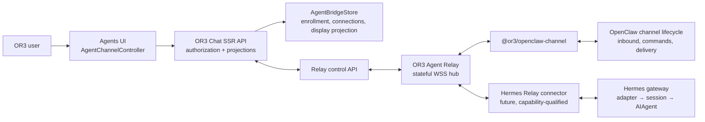

# Design

## Overview

Build an OR3 Agent Relay that accepts outbound, runtime-owned connector connections and exposes a workspace-authorized Agents projection to OR3 Chat. OpenClaw connects through a purpose-built channel package; the package uses OpenClaw's channel lifecycle for message ingestion and reply delivery, including its native streaming and command behavior. Hermes connects through its Relay connector contract after qualification. Both adapters translate to a small versioned OR3 Agent Bridge Protocol, so enrollment, capability handling, browser projection, recovery, and security exist once.

The current `ExternalAgentController` remains an `or3-intern` adapter. The new bridge has its own controller and persistence contract because its connection lifecycle, protocol, and canonical ownership differ. Presentation components may be shared later only after the event contract is proven equivalent.

## Architecture



| Component | Responsibility | Requirements |
| --- | --- | --- |
| `@or3/agent-bridge-protocol` | Defines the wire envelope, capability schema, validation, errors, cursors, and test fixtures. Has no Nuxt, OpenClaw, or Hermes imports. | R2, R4, R5, R7, R8 |
| OR3 Agent Relay | Holds authenticated outbound sockets, routes control messages, validates all frames, applies connection-scoped rate/size limits, and resumes acknowledged delivery cursors. | R1, R2, R3, R4, R5, R7 |
| OR3 Chat Agent Bridge API | Authorizes workspace actions with `can()`, creates/approves/revokes enrollments, serves projection data to the browser, and talks to the relay control plane. | R1, R3, R5, R6, R7 |
| `AgentBridgeStore` | Persists enrollment authority, revocable connector identities, session/turn display state, and a bounded event projection. | R1, R3, R5, R6, R7 |
| `AgentChannelController` | Browser-only state coordinator for connection inventory, session projection, live updates, and supported actions. It never holds connector credentials. | R3, R4, R5, R6 |
| `@or3/openclaw-channel` | An OpenClaw channel plugin that maps OR3 messages to normalized channel input and maps OpenClaw delivery/progress back to bridge events. | R1, R2, R3, R4, R6, R7 |
| Hermes Relay adapter | Maps Hermes's connector descriptor and inbound/follow-up/interrupt frames to the bridge protocol after contract qualification. | R2, R3, R4, R6, R8 |

The relay is deliberately a stateful deployment component, not a `globalThis` registry in the Nitro process. Long-lived outbound runtime sockets must survive browser requests and work across OR3 Chat application instances. Hosted OR3 can operate it centrally; self-hosted installations use the same relay service and explicitly configure its public URL. Static builds do not load this feature.

## Components and Interfaces

### Versioned bridge protocol

`packages/agent-bridge-protocol` defines JSON messages and runtime validators. Every envelope is bounded before parsing and has this shared identity:

```ts
type RuntimeKind = "openclaw" | "hermes";

type BridgeIdentity = {
  protocol: "or3-agent-bridge";
  major: 1;
  connectionId: string;
  runtime: RuntimeKind;
};

type BridgeEventKind =
  | "turn.accepted"
  | "turn.status"
  | "assistant.delta"
  | "assistant.final"
  | "tool.started"
  | "tool.updated"
  | "tool.completed"
  | "approval.requested"
  | "approval.resolved"
  | "turn.failed"
  | "turn.cancelled";

type BridgeEvent = BridgeIdentity & {
  type: "event";
  eventId: string;
  sessionId: string;
  turnId: string;
  sequence: number;
  occurredAt: string;
  kind: BridgeEventKind;
  payload: Record<string, unknown>;
};
```

The protocol also defines `connector.hello`, `connector.capabilities`, `connector.heartbeat`, `turn.submit`, `turn.abort`, `approval.resolve`, `cursor.ack`, `resume`, `result`, and `error` messages. IDs are opaque, maximum field lengths are protocol constants, and unknown required enum values are rejected. Additive optional fields remain preserved only inside a bounded `extensions` object.

Capabilities are explicit rather than inferred from runtime names:

```ts
type BridgeCapabilities = {
  streaming: boolean;
  toolProgress: boolean;
  commands: "runtime-text" | "none";
  cancel: boolean;
  approvalDecisions: boolean;
  sessionHistory: boolean;
  attachments: false; // v1 fixed false
};
```

`turn.submit` carries an opaque bridge session ID, idempotency key, and text. It does not carry a shell command, filesystem root, approval override, provider credential, or arbitrary config. Text beginning with `/` remains text: only the runtime can decide whether it is a command and whether the sender may run it.

### Enrollment and connection control

`AgentBridgeEnrollmentService` follows the good portions of the existing Connect device-code pattern but is separate from `ConnectStore`: it has no tunnel, host binary, `or3-intern` version, or environment provisioning fields.

1. An OR3 workspace member creates a 10-minute enrollment request through the SSR API.
2. Agents displays one copy/paste command that installs `@or3/openclaw-channel` and adds the `or3` channel with the short code. A future OpenClaw catalog entry may collapse that into `openclaw channels add or3`, but v1 must not assume third-party package discovery before installation.
3. The channel plugin exchanges the code for a pending connector request over TLS. The raw code is never stored after exchange.
4. The user approves the displayed runtime name in OR3. The relay issues a random connection credential once, stores only a domain-separated hash, and accepts a connector socket only after authentication.
5. Revocation invalidates the credential, terminates existing sockets, and prevents the relay from accepting new frames.

The browser does not receive the connector credential. Connection metadata is retrieved only through workspace-authorized OR3 APIs with `Cache-Control: no-store`.

### Relay and delivery projection

The Agent Relay owns live socket state and a per-connection routing registry. It sends a `resume` request after a reconnect and accepts only the missing suffix after the stored cursor. It acknowledges every accepted event only after the projection write commits. This lets connectors use at-least-once delivery without double-rendering it in OR3.

The relay writes only a display projection:

- one mutable, bounded live preview per active turn;
- structured start/update/complete state for each tool lifecycle;
- final assistant text, failure, cancellation, and resolved approvals;
- stable references needed to reopen an Agent conversation.

It does not become the executor's tool log or source of permission truth. Runtime-native command history and internal reasoning stay in the runtime. A connector can report a recovered, possibly duplicate final delivery; the projection preserves that explicit status rather than pretending exactly-once execution.

### Browser controller and UI

`AgentChannelController` gets a workspace-scoped snapshot from the SSR API and opens a browser subscription to projection updates. It follows the current external-agent controller's stale-work, monotonic-generation, subscription cleanup, and Activity registration patterns, but it consumes bridge DTOs rather than an `InternClient`.

The UI shows:

- **Connect OpenClaw** as the primary enrollment path, with a copyable command and approval status;
- connection cards with runtime kind, online/offline/degraded state, capabilities, and revoke control;
- Agent sessions whose conversation body is a projection of accepted bridge events;
- a single live assistant segment, compact tool cards, and a visible recovery marker when required;
- Cancel and Approve/Deny only when both the connection and session advertise the relevant feature.

Streaming defaults to a `progress` presentation: short status/tool lines while work is active and a normal final assistant message. This mirrors the current OpenClaw Discord/Telegram defaults and Hermes's preference for concise progress. Raw command text is never displayed by default; a future runtime may advertise a sanitized detail field without changing the protocol.

### OpenClaw channel adapter

`@or3/openclaw-channel` is a conventional external channel plugin with package discovery metadata, a setup entry, channel configuration, and a narrow runtime entry. It must use current SDK channel surfaces rather than bundled/private imports:

- `createChatChannelPlugin`/`defineChannelPluginEntry` for plugin registration;
- the channel inbound lifecycle to normalize a bridge `turn.submit` as an OR3 conversation message with a stable channel/session grammar;
- the channel outbound message adapter to translate normal delivery, preview edits, media refusal in v1, tool progress, and final delivery into bridge events;
- the plugin's own scoped config for enrollment/connection state; no runtime listener starts from discovery or setup-only imports.

The plugin maps an OR3 conversation to a distinct channel conversation key such as `or3:<connectionId>:<bridgeSessionId>`. OR3 user and workspace labels are untrusted channel context, never model instructions. The channel trusts only its authenticated relay connection as ingress; end-user policy is then enforced by OpenClaw's agent/channel policy. This preserves OpenClaw's deterministic reply routing, session isolation, native command behavior, and durable delivery lifecycle.

### Hermes adapter

Hermes should not be integrated through its browser API server for this feature. Its documented experimental Relay path is closer to the desired topology: Hermes dials an external connector, advertises a capability descriptor, receives inbound/follow-up/interrupt frames, and emits delivery through the same connection. The OR3 Agent Relay implements that connector-facing protocol in a dedicated adapter that maps it to `@or3/agent-bridge-protocol`.

The adapter is version-pinned and remains behind a feature flag until contract fixtures prove session identity, streaming, cancellation, approvals, and reconnect behavior. Hermes's OpenAI-compatible API server remains a separate future integration option, not a fallback for the Agent Channel bridge.

## Data Models

`AgentBridgeStore` is a server-owned persistence contract with SQLite and Convex implementations, registered through the existing provider registry pattern. It does not reuse browser KV or include runtime secrets in synchronized workspace tables.

| Record | Key fields | Index / reason |
| --- | --- | --- |
| `Enrollment` | `id`, `code_hash`, `workspace_id`, `runtime`, `status`, `attempts`, `expires_at` | unique `code_hash` for redemption; `(workspace_id, status)` for the user's pending list |
| `Connection` | `id`, `workspace_id`, `runtime`, `instance_id`, `credential_hash`, `capabilities`, `status`, `last_seen_at`, `revoked_at` | `(workspace_id, status, last_seen_at)` for Agents inventory; unique active `(workspace_id, runtime, instance_id)` |
| `SessionProjection` | `id`, `connection_id`, `runtime_session_id`, `title`, `status`, `last_event_cursor`, `updated_at` | unique `(connection_id, runtime_session_id)`; `(connection_id, updated_at)` for recent sessions |
| `TurnProjection` | `id`, `session_id`, `runtime_turn_id`, `status`, `accepted_at`, `completed_at`, `recovery_state` | unique `(session_id, runtime_turn_id)`; `(session_id, accepted_at)` for ordered transcript turns |
| `EventProjection` | `event_id`, `turn_id`, `sequence`, `kind`, `payload`, `occurred_at` | unique `event_id` for replay dedupe; unique `(turn_id, sequence)` for ordered render and cursor resume |
| `LivePreview` | `turn_id`, `text`, `last_sequence`, `updated_at` | one row per active turn to avoid storing one record per text delta |

Final conversation items and compact tool lifecycle rows follow the workspace's normal conversation retention policy. `LivePreview` is removed or folded into the terminal projection at turn completion; a connector cannot make OR3 retain unbounded token deltas or tool output.

## Error Handling

| Scenario | Behavior |
| --- | --- |
| Invalid/oversized/unknown-major connector frame | Reject before dispatch, log safe reason code, close the socket after the configured strike threshold. Never echo payload content. |
| Expired or invalid enrollment code | Return a generic non-secret enrollment failure; do not create a connection or disclose workspace state. |
| Connector offline | Preserve existing history, mark connection offline, and reject a new turn as retryable. Do not create a hidden execution queue. |
| Duplicate or out-of-order event | Deduplicate by `eventId`, accept only the next cursor sequence, and request resume if a gap is observed. Terminal state wins over later nonterminal events. |
| Projection store failure | Do not acknowledge the connector event. The connector retries under its delivery policy, preserving at-least-once behavior. |
| Runtime rejects a turn/control | Store the typed rejection against the pending UI action. Keep prior state visible and offer retry only when supported. |
| Connector capability loss after reconnect | Mark the connection degraded and hide now-unsupported controls. Do not issue a fallback command or approval request. |
| Relay unavailable in a static/serverless deployment | Gate enrollment and Agents connection actions at discovery time; return a clear configuration error rather than an endless reconnect state. |

## Testing Strategy

- **Protocol unit tests (R2, R4, R5, R7, R8):** validate every envelope, size bound, unknown field policy, major-version rejection, ID/cursor ordering, redaction, and fixture round-trip.
- **Relay/service tests (R1, R3, R5, R6, R7):** exercise code expiration/attempts, approval/revocation, workspace isolation, socket authentication, replay dedupe, store-before-ack, gaps, reconnect, and action acknowledgement with a fake connector.
- **Store contract suites (R1, R5, R7):** run the same enrollment/connection/projection tests against SQLite and Convex providers; verify atomic consume/revoke behavior.
- **OpenClaw package tests (R2, R3, R4, R6, R8):** use protocol fixtures to prove inbound session grammar, command pass-through, preview/final delivery mapping, tool progress sanitization, cancellation, and startup-safe imports. Qualify against a pinned OpenClaw SDK version and a disposable Gateway smoke test before publication.
- **Browser/controller tests (R3, R4, R5, R6):** cover state transitions, stale workspace/session rejection, active preview replacement, terminal precedence, capability gating, offline retry, and Activity cleanup.
- **Targeted end-to-end test (R1, R4, R5, R6):** fake relay + browser: enroll OpenClaw, approve, start a session, stream/progress/finalize, reload, reconnect with duplicate final, cancel, and revoke. Keep real OpenClaw/Hermes tests in an explicit opt-in live lane.
- **Hermes qualification gate (R2, R8):** replay the shared fixture suite through its Relay adapter before exposing its enrollment button. No feature is enabled based only on a successful WebSocket handshake.

## Design Decisions

1. **Use an OpenClaw channel, not an OR3 browser Gateway client.** OpenClaw's Discord and Telegram channels already demonstrate the desired structure: deterministic per-channel routing, normalized inbound sessions, pairing/allowlists, and a configurable preview/progress delivery mode. A direct Gateway client would require browser device identity, privileged scopes, and a public/reachable Gateway. The channel keeps agent execution under OpenClaw and makes setup one link code plus one command.

2. **Use a shared outbound relay protocol, not a generic runtime implementation interface.** OpenClaw and Hermes have different native APIs. A versioned message protocol plus capability descriptor gives both a narrow adapter surface. It avoids a premature TypeScript abstraction that would encode OpenClaw-specific sessions, models, or tools before Hermes has been qualified.

3. **Run a stateful relay outside the Nuxt request process.** This is necessary for persistent outbound sockets, routing after browser reconnect, and multi-instance deployment. A short-lived in-process WebSocket registry would work in development but fail under horizontal scaling/serverless hosts.

4. **Do not reuse OR3 Connect directly.** It is designed for `or3-intern` installation and Cloudflare tunnel provisioning. Reusing its data types would make a lightweight channel connection inherit unrelated binary, tunnel, and control-token semantics. The new enrollment service borrows only its secure device-code principles.

5. **Treat OR3 history as a delivery projection, not executor truth.** Runtimes own execution, policies, approvals, and canonical native sessions. OR3 needs a durable, bounded display projection to show conversations after a browser reload and to sync UI state, but it must never claim it can replay or resume a tool operation itself.

6. **Forward slash commands unchanged.** OpenClaw and Hermes each own rich command sets and authorization. OR3 must not duplicate a command catalog or translate `/approve`, `/model`, `/stop`, or runtime-specific admin commands into privileged RPCs. Dedicated UI controls are limited to explicitly advertised, acknowledged bridge actions.

7. **Default to concise progress, not raw execution traces.** OpenClaw's `progress` streaming mode and Hermes's compact progress defaults are a good UX baseline. One mutable status/assistant preview and compact tool cards make a long turn legible without leaking command lines, paths, or secrets.

8. **Use Hermes Relay, not its OpenAI-compatible API server, for the matching product.** Hermes Relay already supports the desired outbound connector and capability negotiation shape. Its API server is useful for a separate stateless model/provider integration but is not a channel bridge and would require OR3 to rebuild session/control semantics.

## Risks & Mitigations

| Risk | Mitigation |
| --- | --- |
| A hosted relay is a new operational component | Publish a supported relay deployment target before enabling the UI; keep the feature disabled unless a configured health check passes. Document self-hosted deployment and do not make static builds depend on it. |
| OpenClaw SDK/channel APIs evolve quickly | Pin the channel package to an exact supported OpenClaw release, test against generated fixtures plus a Gateway smoke test, and reject incompatible major protocol versions. |
| Hermes Relay is explicitly experimental | Keep Hermes behind a feature flag and require the full shared contract suite before release; do not silently fall back to its API server. |
| Reconnect may duplicate live/final delivery | Require connector-generated delivery IDs and monotonic sequence cursors; persist before acknowledgement; show explicit recovered-delivery state when the runtime reports ambiguity. |
| A channel bridge becomes a privilege-escalation path | Use code approval, per-connection credentials, workspace-scoped authorization, schema validation, frame limits, redaction, and runtime-owned permission policy. Never pass Gateway or provider credentials through OR3. |
