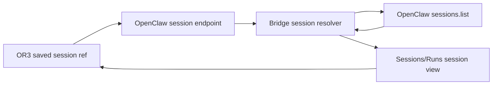

# Design

## Overview

Replace read-time session creation with authoritative restoration inside `packages/openclaw-or3`. The bridge will query OpenClaw for the exact deterministic session key, hydrate its in-memory record with native activity metadata, and refuse to invent a session when the native record is unavailable.

## Architecture



- **Gateway control adapter** (`packages/openclaw-or3/index.js`): exposes the existing `sessions.list` RPC to the bridge. Serves R1.
- **Bridge session resolver** (`packages/openclaw-or3/src/bridge.js`): distinguishes creation from restoration and maps native activity timestamps. Serves R1 and R3.
- **Timestamp normalizer** (`packages/openclaw-or3/src/bridge.js`): accepts the supported wire formats without substituting the current time for historical data. Serves R2.
- **HTTP session handler** (`packages/openclaw-or3/src/bridge.js`): awaits resolution and returns the existing session response shape. Serves R1 and R3.

## Components and Interfaces

Extend the bridge control object with one internal method:

```js
sessions(params) => gatewayRequest("sessions.list", params, ["operator.read"])
```

Add an async resolver, conceptually:

```js
resolveSession(id) -> Promise<BridgeSession>
```

Resolution rules:

1. Return an existing in-memory record when present.
2. Compute the existing deterministic OpenClaw key from `agentId` and OR3 session ID.
3. Call `sessions.list` with an exact-key search and find a row whose `key` equals the computed key.
4. Convert `row.lastActivityAt ?? row.updatedAt` to epoch seconds and hydrate the bridge record. For a restored record lacking a distinct creation time, use the same native instant for `createdAt`; `updatedAt` is the user-visible ordering field.
5. Return 404 when the row or a valid native activity timestamp is absent. Do not call `ensureSession()` from GET or message-history read paths.

`createSession()` remains the only path allowed to initialize timestamps from the current clock. `startRun()` and event handling retain their existing updates.

## Data Models

N/A. No new persistence is needed. The bridge cache retains its current record shape, and the Gateway remains authoritative.

## Error Handling

- Native row absent or lacks a usable activity timestamp: return 404 without mutating the bridge map; OR3 retains its persisted reference.
- `sessions.list` RPC fails: surface a bounded 503-style bridge error; do not replace saved metadata.
- Invalid timestamp format: treat it as unavailable rather than using `Date.now()`.
- Message timestamp absent: use the already-resolved session activity time so history cannot make an old session look newly active.

## Testing Strategy

- Unit: restore an old session into an empty bridge and verify its historical instant survives (R1).
- Unit: verify `lastActivityAt` precedence, `updatedAt` fallback, and missing-row non-mutation (R1).
- Unit: cover seconds, milliseconds, ISO strings, and missing message timestamps (R2).
- Regression: verify new-session creation and run/event activity still use current activity time (R3).
- Run only the package's targeted bridge test file; no full-project suite is required.

## Design Decisions

- Fix the producer, not the sidebar. The bad value also affects sorting and persisted references, so display-only correction is incomplete.
- Use native Gateway metadata instead of chat history as the primary activity source. It is cheaper, explicit, and available even when history has no usable user turn.
- Return not found rather than preserve a synthetic bridge record. OR3 already has a persisted reference and safely ignores one failed eager rehydration.

## Risks & Mitigations

- **Gateway field availability:** prefer `lastActivityAt`, but support `updatedAt` for the pinned OpenClaw line.
- **Broad search match:** require exact equality on the computed session key after `sessions.list` returns.
- **Millisecond/second confusion:** centralize conversion and cover each accepted representation.
- **Previously corrupted references:** document that this prevents future overwrites; it cannot infer historical dates already lost from both OR3 and OpenClaw.
