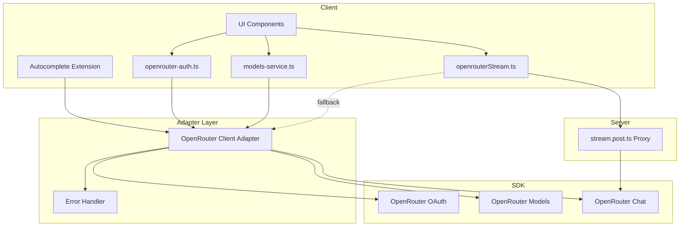
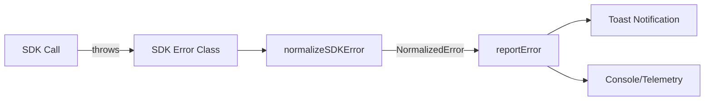

# OpenRouter SDK Migration - Technical Design

## Overview

This document describes the technical architecture for migrating OR3 Chat from direct `fetch()` calls to the OpenRouter TypeScript SDK. The design prioritizes minimal disruption to existing code, strong type safety, and maintainability.

### Goals
1. Replace 5 fetch-based integrations with SDK equivalents
2. Centralize OpenRouter access through an adapter layer
3. Preserve all existing behavior including streaming, caching, and error handling
4. Enable tree-shaking for optimal bundle size

---

## Architecture

### High-Level Flow



### Core Components

#### 1. OpenRouter Client Adapter (`shared/openrouter/client.ts`)

A thin adapter layer that wraps the SDK and provides:
- Consistent API key management across client/server
- Common header injection (`HTTP-Referer`, `X-Title`)
- Error normalization
- Environment-aware initialization

#### 2. SDK Error Handler (`shared/openrouter/errors.ts`)

Centralized error handling that maps SDK errors to user-friendly messages and integrates with the existing `reportError()` system.

#### 3. Type Definitions (`types/openrouter-sdk.d.ts`)

Type augmentations and re-exports to bridge SDK types with existing OR3 interfaces.

---

## Component Details

### OpenRouter Client Adapter

```typescript
// shared/openrouter/client.ts

import { OpenRouter } from '@openrouter/sdk';
import type { OpenRouterCore } from '@openrouter/sdk/core.js';

// Configuration interface
export interface OpenRouterClientConfig {
  apiKey?: string;
  referer?: string;
  title?: string;
}

// Default headers for all requests
const DEFAULT_HEADERS = {
  'HTTP-Referer': 'https://or3.chat',
  'X-Title': 'or3.chat',
};

/**
 * Create a configured OpenRouter SDK client.
 * 
 * In SSR context: Uses env key if available, otherwise empty (will fail for auth-required calls)
 * In client context: Uses user's stored key from state/localStorage
 */
export function createOpenRouterClient(config: OpenRouterClientConfig = {}): OpenRouter {
  return new OpenRouter({
    apiKey: config.apiKey ?? '',
    // SDK doesn't have a direct "headers" option, we'll use fetchOptions per-call
  });
}

/**
 * Get request options with common headers.
 * Use this when calling SDK methods to inject referer/title headers.
 */
export function getRequestOptions(signal?: AbortSignal) {
  return {
    fetchOptions: {
      headers: DEFAULT_HEADERS,
      ...(signal && { signal }),
    },
  };
}

// Re-export SDK types for convenience
export type { OpenRouter };
export { OpenRouterCore } from '@openrouter/sdk/core.js';
```

### SDK Error Handler

```typescript
// shared/openrouter/errors.ts

import {
  BadRequestResponseError,
  UnauthorizedResponseError,
  PaymentRequiredResponseError,
  ForbiddenResponseError,
  NotFoundResponseError,
  TooManyRequestsResponseError,
  RequestTimeoutResponseError,
  InternalServerResponseError,
  BadGatewayResponseError,
  ServiceUnavailableResponseError,
  EdgeNetworkTimeoutResponseError,
  ProviderOverloadedResponseError,
  ChatError,
} from '@openrouter/sdk/models/errors';

export interface NormalizedError {
  code: string;
  message: string;
  status: number;
  retryable: boolean;
  raw?: unknown;
}

/**
 * Map SDK error classes to normalized error objects.
 * This enables consistent error handling across all SDK calls.
 */
export function normalizeSDKError(error: unknown): NormalizedError {
  // SDK typed errors
  if (error instanceof UnauthorizedResponseError) {
    return {
      code: 'ERR_AUTH',
      message: 'Invalid or expired API key. Please re-authenticate.',
      status: 401,
      retryable: false,
      raw: error,
    };
  }
  
  if (error instanceof PaymentRequiredResponseError) {
    return {
      code: 'ERR_CREDITS',
      message: 'Insufficient credits. Please add credits at openrouter.ai/credits',
      status: 402,
      retryable: false,
      raw: error,
    };
  }
  
  if (error instanceof ForbiddenResponseError) {
    return {
      code: 'ERR_FORBIDDEN',
      message: 'Access denied. Your key may not have required permissions.',
      status: 403,
      retryable: false,
      raw: error,
    };
  }
  
  if (error instanceof TooManyRequestsResponseError) {
    return {
      code: 'ERR_RATE_LIMIT',
      message: 'Rate limit exceeded. Please try again in a moment.',
      status: 429,
      retryable: true,
      raw: error,
    };
  }
  
  if (error instanceof BadRequestResponseError) {
    return {
      code: 'ERR_BAD_REQUEST',
      message: error.error?.message || 'Invalid request parameters.',
      status: 400,
      retryable: false,
      raw: error,
    };
  }
  
  if (error instanceof NotFoundResponseError) {
    return {
      code: 'ERR_NOT_FOUND',
      message: 'Requested resource not found.',
      status: 404,
      retryable: false,
      raw: error,
    };
  }
  
  if (error instanceof RequestTimeoutResponseError || error instanceof EdgeNetworkTimeoutResponseError) {
    return {
      code: 'ERR_TIMEOUT',
      message: 'Request timed out. Please try again.',
      status: error instanceof RequestTimeoutResponseError ? 408 : 524,
      retryable: true,
      raw: error,
    };
  }
  
  if (error instanceof InternalServerResponseError) {
    return {
      code: 'ERR_SERVER',
      message: 'OpenRouter service error. Please try again later.',
      status: 500,
      retryable: true,
      raw: error,
    };
  }
  
  if (error instanceof BadGatewayResponseError || error instanceof ServiceUnavailableResponseError) {
    return {
      code: 'ERR_PROVIDER',
      message: 'AI provider temporarily unavailable. Please try again.',
      status: error instanceof BadGatewayResponseError ? 502 : 503,
      retryable: true,
      raw: error,
    };
  }
  
  if (error instanceof ProviderOverloadedResponseError) {
    return {
      code: 'ERR_OVERLOADED',
      message: 'AI provider is overloaded. Please try again in a moment.',
      status: 529,
      retryable: true,
      raw: error,
    };
  }
  
  if (error instanceof ChatError) {
    return {
      code: 'ERR_CHAT',
      message: error.error?.message || 'Chat request failed.',
      status: 400,
      retryable: false,
      raw: error,
    };
  }
  
  // Generic error fallback
  if (error instanceof Error) {
    // Check for AbortError (user cancellation)
    if (error.name === 'AbortError') {
      return {
        code: 'ERR_ABORTED',
        message: 'Request was cancelled.',
        status: 0,
        retryable: false,
        raw: error,
      };
    }
    
    return {
      code: 'ERR_UNKNOWN',
      message: error.message || 'An unexpected error occurred.',
      status: 0,
      retryable: true,
      raw: error,
    };
  }
  
  return {
    code: 'ERR_UNKNOWN',
    message: 'An unexpected error occurred.',
    status: 0,
    retryable: true,
    raw: error,
  };
}

/**
 * Check if an error is an SDK error type.
 * Useful for conditional handling.
 */
export function isSDKError(error: unknown): boolean {
  return (
    error instanceof UnauthorizedResponseError ||
    error instanceof PaymentRequiredResponseError ||
    error instanceof ForbiddenResponseError ||
    error instanceof TooManyRequestsResponseError ||
    error instanceof BadRequestResponseError ||
    error instanceof NotFoundResponseError ||
    error instanceof RequestTimeoutResponseError ||
    error instanceof InternalServerResponseError ||
    error instanceof BadGatewayResponseError ||
    error instanceof ServiceUnavailableResponseError ||
    error instanceof EdgeNetworkTimeoutResponseError ||
    error instanceof ProviderOverloadedResponseError ||
    error instanceof ChatError
  );
}
```

---

## Migration Details by File

### 1. Models Service (`app/core/auth/models-service.ts`)

**Current Implementation:**
```typescript
const res = await fetch(url, { headers });
const json = await res.json() as ModelsResponse;
```

**SDK Migration:**
```typescript
import { OpenRouter } from '@openrouter/sdk';
import { getRequestOptions } from '~/shared/openrouter/client';
import { normalizeSDKError } from '~/shared/openrouter/errors';

export async function fetchModels(opts?: { force?: boolean; ttlMs?: number }): Promise<OpenRouterModel[]> {
  const ttlMs = opts?.ttlMs ?? 1000 * 60 * 60; // 1 hour
  
  // Check cache first
  if (!opts?.force) {
    const cached = loadCache();
    if (cached && Date.now() - cached.fetchedAt <= ttlMs && cached.data.length) {
      return cached.data;
    }
  }
  
  const key = readApiKey();
  const client = new OpenRouter({ apiKey: key ?? '' });
  
  try {
    const response = await client.models.list({}, getRequestOptions());
    // response.data contains the array of models
    const list = response.data ?? [];
    
    // Map SDK model type to our OpenRouterModel interface
    const models: OpenRouterModel[] = list.map(mapSDKModelToLocal);
    
    saveCache(models);
    return models;
  } catch (error) {
    // Fallback to cache on any error
    const cached = loadCache();
    if (cached?.data.length) return cached.data;
    
    const normalized = normalizeSDKError(error);
    throw new Error(`Failed to fetch models: ${normalized.message}`);
  }
}

function mapSDKModelToLocal(model: SDKModel): OpenRouterModel {
  // Map SDK Model type to existing OpenRouterModel interface
  // Most fields should match, may need minor transformations
  return {
    id: model.id,
    name: model.name,
    description: model.description,
    created: model.created,
    architecture: model.architecture,
    top_provider: model.topProvider,
    pricing: model.pricing,
    // ... rest of fields
  };
}
```

**Key Changes:**
- Replace `fetch()` with `client.models.list()`
- SDK returns typed `ModelsListResponse` with `.data` array
- Error handling via `normalizeSDKError()`
- Cache logic unchanged

### 2. OAuth Exchange (`app/core/auth/openrouter-auth.ts`)

**Current Implementation:**
```typescript
resp = await fetchFn('https://openrouter.ai/api/v1/auth/keys', {
  method: 'POST',
  headers: { 'Content-Type': 'application/json' },
  body: JSON.stringify({ code, code_verifier, code_challenge_method }),
});
```

**SDK Migration:**
```typescript
import { OpenRouter } from '@openrouter/sdk';
import { normalizeSDKError } from '~/shared/openrouter/errors';

export async function exchangeOpenRouterCode(p: ExchangeParams): Promise<ExchangeResult> {
  // SDK OAuth doesn't require auth for exchange
  const client = new OpenRouter({ apiKey: '' });
  
  try {
    const response = await client.oAuth.exchangeAuthCodeForAPIKey({
      code: p.code,
      codeVerifier: p.verifier,
      codeChallengeMethod: p.codeMethod as 'S256' | 'plain',
    });
    
    // SDK response contains { key: string }
    const userKey = response.key;
    
    if (!userKey) {
      reportError(
        err('ERR_AUTH', 'Auth exchange returned no key', { severity: 'error' }),
        { toast: true }
      );
      return { ok: false, status: 200, reason: 'no-key' };
    }
    
    return { ok: true, userKey, status: 200 };
  } catch (error) {
    const normalized = normalizeSDKError(error);
    
    if (normalized.code === 'ERR_ABORTED') {
      return { ok: false, status: 0, reason: 'network' };
    }
    
    reportError(
      err(normalized.code, normalized.message, {
        severity: 'error',
        tags: { domain: 'auth', stage: 'exchange', attempt: p.attempt || 1 },
        retryable: normalized.retryable,
      }),
      { toast: true }
    );
    
    return { ok: false, status: normalized.status, reason: 'bad-response' };
  }
}
```

**Key Changes:**
- Replace manual `fetch()` with `client.oAuth.exchangeAuthCodeForAPIKey()`
- SDK expects `codeVerifier` (camelCase) not `code_verifier`
- Response is typed as `ExchangeAuthCodeForAPIKeyResponse`
- Error handling via `normalizeSDKError()`

### 3. Autocomplete Extension (`app/plugins/EditorAutocomplete/TiptapExtension.ts`)

**Current Implementation:**
```typescript
const response = await fetch('https://openrouter.ai/api/v1/chat/completions', {
  method: 'POST',
  headers: { Authorization: `Bearer ${orKey}`, ... },
  body: JSON.stringify({ model, messages }),
});
```

**SDK Migration:**
```typescript
import { OpenRouter } from '@openrouter/sdk';
import { getRequestOptions } from '~/shared/openrouter/client';
import { normalizeSDKError } from '~/shared/openrouter/errors';

async function editorAutoComplete(content: string, abortSignal?: AbortSignal) {
  const orKey = state.value.openrouterKey || localStorage.getItem('openrouter_api_key') || '';
  
  if (!orKey) {
    throw new Error('OpenRouter API key not found');
  }
  
  const { default: systemPrompt } = await import('./AutocompletePrompt');
  const prompt = systemPrompt(content);
  
  const client = new OpenRouter({ apiKey: orKey });
  
  try {
    const completion = await client.chat.send(
      {
        model: AutocompleteState.value.aiModel || 'openai/gpt-5-mini',
        messages: [
          { role: 'system', content: prompt },
          { role: 'user', content },
        ],
      },
      getRequestOptions(abortSignal)
    );
    
    // SDK returns ChatResponse with choices array
    const generatedText = completion.choices?.[0]?.message?.content || '';
    
    // Existing parsing logic unchanged
    let parsedCompletion = '';
    let match = /<next_line>(.*?)<\/next_line>/s.exec(generatedText);
    if (!match) {
      match = /<next_line>(.+)/s.exec(generatedText);
    }
    if (match && match[1]) {
      parsedCompletion = match[1];
    }
    
    return { completion: parsedCompletion };
  } catch (error) {
    const normalized = normalizeSDKError(error);
    
    if (normalized.code === 'ERR_ABORTED') {
      throw error; // Re-throw AbortError for existing handling
    }
    
    throw new Error(normalized.message);
  }
}
```

**Key Changes:**
- Replace `fetch()` with `client.chat.send()`
- Pass `AbortSignal` via `fetchOptions.signal`
- SDK returns typed `ChatResponse`
- Parsing logic unchanged

### 4. Streaming Server Proxy (`server/api/openrouter/stream.post.ts`)

**Design Decision: Keep Raw Fetch for Streaming**

The SDK's `chat.send()` method returns a `Promise<ChatResponse>`, which buffers the entire response. For SSE streaming, we need direct access to the response body stream.

**Options Considered:**
1. ❌ Use SDK `chat.send()` - Buffers response, breaks streaming
2. ❌ Use SDK Core functions - Same buffering issue
3. ✅ Keep raw fetch, use SDK for types/constants - Best of both worlds

**Implementation:**
```typescript
// server/api/openrouter/stream.post.ts
import type { ChatGenerationParams } from '@openrouter/sdk/models';

const OR_URL = 'https://openrouter.ai/api/v1/chat/completions';

export default defineEventHandler(async (event) => {
  // Read and validate body using SDK types for type safety
  let body: ChatGenerationParams;
  try {
    body = await readBody(event);
  } catch {
    setResponseStatus(event, 400);
    return 'Invalid request body';
  }
  
  // Key selection logic unchanged
  const config = useRuntimeConfig(event);
  const authHeader = getHeader(event, 'authorization');
  const clientKey = authHeader?.startsWith('Bearer ') ? authHeader.slice(7) : undefined;
  const apiKey = config.openrouterApiKey || clientKey;
  
  if (!apiKey) {
    setResponseStatus(event, 400);
    return 'Missing OpenRouter API key';
  }
  
  // AbortController for client disconnect
  const ac = new AbortController();
  event.node.req.on('close', () => ac.abort());
  
  // Direct fetch for streaming (SDK doesn't support streaming response passthrough)
  let upstream: Response;
  try {
    upstream = await fetch(OR_URL, {
      method: 'POST',
      headers: {
        Authorization: `Bearer ${apiKey}`,
        'Content-Type': 'application/json',
        Accept: 'text/event-stream',
        'HTTP-Referer': /* compute referer */,
        'X-Title': 'or3.chat',
      },
      body: JSON.stringify(body),
      signal: ac.signal,
    });
  } catch (e) {
    if (e instanceof Error && e.name === 'AbortError') return;
    setResponseStatus(event, 502);
    return 'Failed to reach OpenRouter';
  }
  
  // ... rest unchanged (pipe stream)
});
```

**Rationale:**
- Streaming requires direct body access, which the SDK doesn't expose
- Type safety achieved via `ChatGenerationParams` type for request body
- URL constant could be extracted from SDK if exposed, otherwise hardcoded
- All other logic (abort, headers, piping) unchanged

### 5. Client Streaming Fallback (`app/utils/chat/openrouterStream.ts`)

**Same Design Decision: Keep Raw Fetch for Streaming**

```typescript
import type { ChatGenerationParams } from '@openrouter/sdk/models';

// Fallback path uses raw fetch for streaming
const resp = await fetch('https://openrouter.ai/api/v1/chat/completions', {
  method: 'POST',
  headers: {
    Authorization: `Bearer ${apiKey}`,
    'Content-Type': 'application/json',
    'HTTP-Referer': /* origin */,
    'X-Title': 'or3.chat',
    Accept: 'text/event-stream',
  },
  body: JSON.stringify(body satisfies ChatGenerationParams),
  signal,
});
```

**Benefits of Using SDK Types:**
- `body satisfies ChatGenerationParams` provides compile-time type checking
- Any schema changes in OpenRouter API surface as TypeScript errors
- No runtime overhead - types are erased at compile time

---

## Data Models

### Type Mapping

The SDK provides types that largely match our existing interfaces but with some naming differences:

| OR3 Interface | SDK Type | Notes |
|---------------|----------|-------|
| `OpenRouterModel` | `Model` | Field naming differs (camelCase vs snake_case) |
| `ExchangeResult` | - | Keep as-is, wraps SDK response |
| Request body types | `ChatGenerationParams` | Use directly |
| Response types | `ChatResponse` | Use directly |

### Model Type Adapter

```typescript
// shared/openrouter/types.ts

import type { Model as SDKModel } from '@openrouter/sdk/models';
import type { OpenRouterModel } from '~/core/auth/models-service';

/**
 * Convert SDK Model type to our internal OpenRouterModel type.
 * Handles field name differences between SDK (camelCase) and our interface (snake_case).
 */
export function sdkModelToLocal(model: SDKModel): OpenRouterModel {
  return {
    id: model.id,
    name: model.name,
    description: model.description,
    created: model.created,
    architecture: model.architecture ? {
      input_modalities: model.architecture.inputModalities,
      output_modalities: model.architecture.outputModalities,
      tokenizer: model.architecture.tokenizer,
      instruct_type: model.architecture.instructType,
    } : undefined,
    top_provider: model.topProvider ? {
      is_moderated: model.topProvider.isModerated,
      context_length: model.topProvider.contextLength,
      max_completion_tokens: model.topProvider.maxCompletionTokens,
    } : undefined,
    pricing: model.pricing,
    canonical_slug: model.canonicalSlug,
    context_length: model.contextLength,
    hugging_face_id: model.huggingFaceId,
    per_request_limits: model.perRequestLimits,
    supported_parameters: model.supportedParameters,
  };
}
```

---

## Error Handling

### Error Flow



### Integration with Existing Error System

```typescript
// Example usage in a migrated function
import { normalizeSDKError } from '~/shared/openrouter/errors';
import { reportError, err } from '~/utils/errors';

try {
  const result = await client.models.list();
  return result.data;
} catch (error) {
  const normalized = normalizeSDKError(error);
  
  reportError(
    err(normalized.code, normalized.message, {
      severity: normalized.retryable ? 'warning' : 'error',
      tags: { domain: 'models', sdk: true },
      retryable: normalized.retryable,
    }),
    { toast: true }
  );
  
  throw new Error(normalized.message);
}
```

---

## Testing Strategy

### Unit Tests

1. **Adapter Layer Tests**
   - Test `createOpenRouterClient()` with various configs
   - Test `getRequestOptions()` header injection
   - Test `normalizeSDKError()` with all SDK error types

2. **Model Service Tests**
   - Mock SDK `models.list()` response
   - Test caching behavior unchanged
   - Test error fallback to cache

3. **OAuth Exchange Tests**
   - Mock SDK `oAuth.exchangeAuthCodeForAPIKey()`
   - Test success and failure paths
   - Verify existing `ExchangeResult` types maintained

4. **Autocomplete Tests**
   - Mock SDK `chat.send()` response
   - Test AbortSignal propagation
   - Test error message extraction

### Integration Tests

1. **SSR Mode**
   - Verify server route proxies correctly
   - Test env key preference over client key
   - Verify streaming passthrough

2. **Static Mode**
   - Verify fallback to direct OpenRouter
   - Test `parseOpenRouterSSE()` still works
   - Verify cache TTL behavior

### Mocking Strategy

```typescript
// tests/utils/mock-openrouter.ts

import { vi } from 'vitest';

export function mockOpenRouterSDK() {
  return {
    models: {
      list: vi.fn().mockResolvedValue({
        data: [{ id: 'test/model', name: 'Test Model' }],
      }),
    },
    chat: {
      send: vi.fn().mockResolvedValue({
        choices: [{ message: { content: 'Test response' } }],
      }),
    },
    oAuth: {
      exchangeAuthCodeForAPIKey: vi.fn().mockResolvedValue({
        key: 'test-api-key',
      }),
    },
  };
}
```

---

## Bundle Size Optimization

### Tree-Shaking Strategy

The SDK supports standalone functions for tree-shaking:

```typescript
// Instead of importing the full SDK
import { OpenRouter } from '@openrouter/sdk';
const client = new OpenRouter({ apiKey });
await client.models.list();

// Use standalone functions for smaller bundles
import { OpenRouterCore } from '@openrouter/sdk/core.js';
import { modelsList } from '@openrouter/sdk/funcs/modelsList.js';

const core = new OpenRouterCore({ apiKey });
const result = await modelsList(core);
```

**Recommendation:** Start with the class-based approach for simplicity. If bundle analysis shows the SDK is too large, refactor to standalone functions.

### Code Splitting

For the autocomplete extension (only loaded when editing):
```typescript
// Dynamically import SDK only when needed
const { OpenRouter } = await import('@openrouter/sdk');
const client = new OpenRouter({ apiKey });
```

---

## Migration Phases

### Phase 1: Infrastructure (Day 1)
1. Install `@openrouter/sdk` package
2. Create `shared/openrouter/client.ts` adapter
3. Create `shared/openrouter/errors.ts` error handler
4. Add type definitions/mappings

### Phase 2: Non-Streaming Calls (Day 2)
1. Migrate `models-service.ts`
2. Migrate `openrouter-auth.ts`
3. Migrate `TiptapExtension.ts` autocomplete
4. Verify all unit tests pass

### Phase 3: Streaming Review (Day 3)
1. Audit streaming code paths
2. Add SDK types to request bodies (`satisfies ChatGenerationParams`)
3. Keep raw fetch for actual streaming
4. Document streaming limitations

### Phase 4: Testing & Verification (Day 4)
1. Run full test suite
2. Manual testing of all flows
3. Bundle size analysis
4. Performance comparison

### Phase 5: Cleanup (Day 5)
1. Remove any dead code
2. Update documentation
3. Final code review
