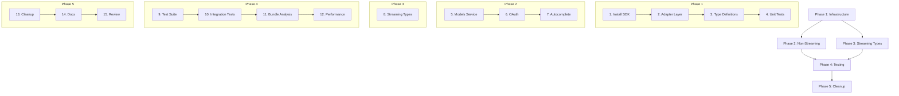

# OpenRouter SDK Migration - Implementation Tasks

## Overview

This document provides a detailed task checklist for implementing the OpenRouter SDK migration. Tasks are organized by phase and include requirement mappings for traceability.

---

## Phase 1: Infrastructure Setup

### 1. Install SDK Package
**Requirements: 1.1, 10.1**

- [ ] 1.1 Add `@openrouter/sdk` to `package.json` dependencies
  ```bash
  bun add @openrouter/sdk
  ```
- [ ] 1.2 Run `bun install` and verify no dependency conflicts
- [ ] 1.3 Verify SDK is properly installed with `import { OpenRouter } from '@openrouter/sdk'`
- [ ] 1.4 Check initial bundle impact with `bun run analyze`

### 2. Create Adapter Layer
**Requirements: 2.1, 2.2, 2.3, 2.4, 2.5**

- [ ] 2.1 Create `shared/openrouter/client.ts`
  - [ ] 2.1.1 Define `OpenRouterClientConfig` interface
  - [ ] 2.1.2 Implement `createOpenRouterClient()` factory function
  - [ ] 2.1.3 Implement `getRequestOptions()` helper for common headers
  - [ ] 2.1.4 Add default headers constant (`HTTP-Referer`, `X-Title`)
  - [ ] 2.1.5 Re-export SDK types for convenience

- [ ] 2.2 Create `shared/openrouter/errors.ts`
  - [ ] 2.2.1 Define `NormalizedError` interface
  - [ ] 2.2.2 Import all SDK error classes
  - [ ] 2.2.3 Implement `normalizeSDKError()` function
    - [ ] Handle `UnauthorizedResponseError` → ERR_AUTH
    - [ ] Handle `PaymentRequiredResponseError` → ERR_CREDITS
    - [ ] Handle `ForbiddenResponseError` → ERR_FORBIDDEN
    - [ ] Handle `TooManyRequestsResponseError` → ERR_RATE_LIMIT
    - [ ] Handle `BadRequestResponseError` → ERR_BAD_REQUEST
    - [ ] Handle `NotFoundResponseError` → ERR_NOT_FOUND
    - [ ] Handle `RequestTimeoutResponseError` → ERR_TIMEOUT
    - [ ] Handle `EdgeNetworkTimeoutResponseError` → ERR_TIMEOUT
    - [ ] Handle `InternalServerResponseError` → ERR_SERVER
    - [ ] Handle `BadGatewayResponseError` → ERR_PROVIDER
    - [ ] Handle `ServiceUnavailableResponseError` → ERR_PROVIDER
    - [ ] Handle `ProviderOverloadedResponseError` → ERR_OVERLOADED
    - [ ] Handle `ChatError` → ERR_CHAT
    - [ ] Handle `AbortError` → ERR_ABORTED
    - [ ] Handle generic `Error` fallback → ERR_UNKNOWN
  - [ ] 2.2.4 Implement `isSDKError()` type guard function

- [ ] 2.3 Create `shared/openrouter/types.ts`
  - [ ] 2.3.1 Import SDK `Model` type
  - [ ] 2.3.2 Import local `OpenRouterModel` type
  - [ ] 2.3.3 Implement `sdkModelToLocal()` mapping function
    - [ ] Map `id`, `name`, `description`, `created`
    - [ ] Map `architecture` (camelCase → snake_case)
    - [ ] Map `topProvider` → `top_provider`
    - [ ] Map `pricing` fields
    - [ ] Map remaining optional fields

- [ ] 2.4 Create `shared/openrouter/index.ts` barrel export
  - [ ] Export from `client.ts`
  - [ ] Export from `errors.ts`
  - [ ] Export from `types.ts`

### 3. Add Type Definitions
**Requirements: 9.1, 9.2**

- [ ] 3.1 Create `types/openrouter-sdk.d.ts` if needed for augmentations
- [ ] 3.2 Verify TypeScript compiles with `bun run type-check`
- [ ] 3.3 Fix any type errors in existing code after SDK import

### 4. Unit Tests for Infrastructure
**Requirements: 13.1, 13.2**

- [ ] 4.1 Create `tests/unit/shared/openrouter/client.test.ts`
  - [ ] Test `createOpenRouterClient()` with various configs
  - [ ] Test `getRequestOptions()` header injection
  - [ ] Test `getRequestOptions()` with AbortSignal

- [ ] 4.2 Create `tests/unit/shared/openrouter/errors.test.ts`
  - [ ] Test `normalizeSDKError()` with each SDK error type
  - [ ] Test `normalizeSDKError()` with AbortError
  - [ ] Test `normalizeSDKError()` with generic Error
  - [ ] Test `isSDKError()` type guard

- [ ] 4.3 Create `tests/unit/shared/openrouter/types.test.ts`
  - [ ] Test `sdkModelToLocal()` with full model data
  - [ ] Test `sdkModelToLocal()` with minimal model data
  - [ ] Test `sdkModelToLocal()` with undefined optional fields

---

## Phase 2: Migrate Non-Streaming Calls

### 5. Migrate Models Service
**Requirements: 3.1, 3.2, 3.3, 3.4, 3.5, 3.6**

- [ ] 5.1 Update `app/core/auth/models-service.ts`
  - [ ] 5.1.1 Add SDK and adapter imports
  - [ ] 5.1.2 Replace `fetch()` call with `client.models.list()`
  - [ ] 5.1.3 Map SDK response using `sdkModelToLocal()`
  - [ ] 5.1.4 Update error handling to use `normalizeSDKError()`
  - [ ] 5.1.5 Preserve cache logic (localStorage, TTL)
  - [ ] 5.1.6 Preserve fallback to cache on error
  - [ ] 5.1.7 Handle case where no API key is available

- [ ] 5.2 Test models service migration
  - [ ] 5.2.1 Run existing models service tests
  - [ ] 5.2.2 Manual test: Load app without API key, verify models load
  - [ ] 5.2.3 Manual test: Load app with API key, verify models load
  - [ ] 5.2.4 Manual test: Verify cache is populated
  - [ ] 5.2.5 Manual test: Verify cache is used within TTL

### 6. Migrate OAuth Exchange
**Requirements: 4.1, 4.2, 4.3, 4.4, 4.5**

- [ ] 6.1 Update `app/core/auth/openrouter-auth.ts`
  - [ ] 6.1.1 Add SDK and adapter imports
  - [ ] 6.1.2 Replace `fetch()` call with `client.oAuth.exchangeAuthCodeForAPIKey()`
  - [ ] 6.1.3 Map SDK parameter names (camelCase)
    - [ ] `code` → `code`
    - [ ] `code_verifier` → `codeVerifier`
    - [ ] `code_challenge_method` → `codeChallengeMethod`
  - [ ] 6.1.4 Extract `key` from SDK response
  - [ ] 6.1.5 Update error handling to use `normalizeSDKError()`
  - [ ] 6.1.6 Preserve `ExchangeResult` return type
  - [ ] 6.1.7 Preserve `reportError()` integration
  - [ ] 6.1.8 Remove `fetchImpl` parameter (no longer needed)

- [ ] 6.2 Test OAuth exchange migration
  - [ ] 6.2.1 Run existing OAuth tests (if any)
  - [ ] 6.2.2 Manual test: Complete OAuth flow end-to-end
  - [ ] 6.2.3 Manual test: Verify key is stored in state
  - [ ] 6.2.4 Manual test: Verify key is persisted to IndexedDB
  - [ ] 6.2.5 Manual test: Test with invalid code (error handling)

### 7. Migrate Autocomplete Extension
**Requirements: 5.1, 5.2, 5.3, 5.4, 5.5, 5.6**

- [ ] 7.1 Update `app/plugins/EditorAutocomplete/TiptapExtension.ts`
  - [ ] 7.1.1 Add SDK and adapter imports
  - [ ] 7.1.2 Replace `fetch()` call with `client.chat.send()`
  - [ ] 7.1.3 Update message format for SDK
  - [ ] 7.1.4 Pass `AbortSignal` via `getRequestOptions(signal)`
  - [ ] 7.1.5 Extract content from SDK `ChatResponse`
  - [ ] 7.1.6 Update error handling to use `normalizeSDKError()`
  - [ ] 7.1.7 Re-throw `AbortError` for existing handling
  - [ ] 7.1.8 Preserve prompt parsing logic unchanged

- [ ] 7.2 Test autocomplete migration
  - [ ] 7.2.1 Run existing autocomplete tests (if any)
  - [ ] 7.2.2 Manual test: Trigger autocomplete in editor
  - [ ] 7.2.3 Manual test: Verify suggestion appears
  - [ ] 7.2.4 Manual test: Verify Tab accepts suggestion
  - [ ] 7.2.5 Manual test: Verify Escape cancels (AbortSignal)
  - [ ] 7.2.6 Manual test: Test without API key (error handling)

---

## Phase 3: Streaming Review & Type Safety

### 8. Add SDK Types to Streaming Code
**Requirements: 6.1-6.7, 7.1-7.5, 9.1, 9.2**

- [ ] 8.1 Update `server/api/openrouter/stream.post.ts`
  - [ ] 8.1.1 Import `ChatGenerationParams` from SDK
  - [ ] 8.1.2 Type request body with `ChatGenerationParams`
  - [ ] 8.1.3 Keep raw `fetch()` for streaming (SDK limitation)
  - [ ] 8.1.4 Add comment explaining streaming design decision
  - [ ] 8.1.5 Verify all existing behavior preserved

- [ ] 8.2 Update `app/utils/chat/openrouterStream.ts`
  - [ ] 8.2.1 Import `ChatGenerationParams` from SDK
  - [ ] 8.2.2 Add `satisfies ChatGenerationParams` to request body
  - [ ] 8.2.3 Keep raw `fetch()` for streaming (SDK limitation)
  - [ ] 8.2.4 Add comment explaining streaming design decision
  - [ ] 8.2.5 Verify all existing behavior preserved

- [ ] 8.3 Test streaming functionality
  - [ ] 8.3.1 Run existing streaming tests
  - [ ] 8.3.2 Manual test: Send chat message in SSR mode
  - [ ] 8.3.3 Manual test: Verify streaming response appears
  - [ ] 8.3.4 Manual test: Verify reasoning tokens display correctly
  - [ ] 8.3.5 Manual test: Verify tool calls work
  - [ ] 8.3.6 Manual test: Verify image generation works
  - [ ] 8.3.7 Manual test: Close tab mid-stream (abort handling)

---

## Phase 4: Testing & Verification

### 9. Run Full Test Suite
**Requirements: 11.1, 11.2, 11.3, 11.4, 11.5, 13.1**

- [ ] 9.1 Run all unit tests: `bun run test`
- [ ] 9.2 Verify zero test failures
- [ ] 9.3 Fix any failing tests
- [ ] 9.4 Run type check: `bun run type-check`
- [ ] 9.5 Verify zero TypeScript errors

### 10. Manual Integration Testing
**Requirements: 11.1-11.5, 12.1-12.4**

- [ ] 10.1 Test SSR Mode (`bun run dev`)
  - [ ] 10.1.1 Test OAuth login flow
  - [ ] 10.1.2 Test model list loading
  - [ ] 10.1.3 Test chat streaming
  - [ ] 10.1.4 Test editor autocomplete
  - [ ] 10.1.5 Test error scenarios

- [ ] 10.2 Test Static Build (`bun run generate`)
  - [ ] 10.2.1 Generate static build
  - [ ] 10.2.2 Serve with local server
  - [ ] 10.2.3 Test OAuth login flow
  - [ ] 10.2.4 Test model list loading
  - [ ] 10.2.5 Test chat streaming (fallback path)
  - [ ] 10.2.6 Test editor autocomplete
  - [ ] 10.2.7 Verify server route unavailability is cached

### 11. Bundle Size Analysis
**Requirements: 10.1, 10.2, 10.3**

- [ ] 11.1 Build production bundle: `bun run build`
- [ ] 11.2 Run bundle analyzer: `bun run analyze`
- [ ] 11.3 Measure SDK contribution to bundle size
- [ ] 11.4 If >50KB gzipped, consider standalone function refactor
- [ ] 11.5 Document final bundle size impact

### 12. Performance Testing
**Requirements: 10.3, 11.3**

- [ ] 12.1 Measure initial page load time before/after
- [ ] 12.2 Measure time to first model list render
- [ ] 12.3 Measure time to first chat response
- [ ] 12.4 Verify no regression in any metric

---

## Phase 5: Cleanup & Documentation

### 13. Code Cleanup
**Requirements: All**

- [ ] 13.1 Remove any commented-out old fetch code
- [ ] 13.2 Remove unused imports
- [ ] 13.3 Run linter: `bun run lint`
- [ ] 13.4 Fix any lint errors
- [ ] 13.5 Final code formatting pass

### 14. Update Documentation
**Requirements: All**

- [ ] 14.1 Update `docs/error-handling.md` with SDK error types
- [ ] 14.2 Add `docs/openrouter-integration.md` documenting the adapter layer
- [ ] 14.3 Update any README references to OpenRouter integration
- [ ] 14.4 Document streaming limitation (raw fetch required)

### 15. Final Review
**Requirements: All**

- [ ] 15.1 Code review of all changed files
- [ ] 15.2 Verify all requirements are met
- [ ] 15.3 Verify all acceptance criteria pass
- [ ] 15.4 Create PR with detailed description
- [ ] 15.5 Address review feedback
- [ ] 15.6 Merge to main branch

---

## Rollback Plan

If issues are discovered post-merge:

1. [ ] Identify affected functionality
2. [ ] Check if issue is SDK-related or migration-related
3. [ ] If SDK bug: Report to OpenRouter, apply workaround
4. [ ] If critical: Revert migration commit
5. [ ] If minor: Create fix PR

---

## Task Dependencies



---

## Estimated Timeline

| Phase | Tasks | Estimated Time |
|-------|-------|----------------|
| Phase 1 | 1-4 | 4 hours |
| Phase 2 | 5-7 | 6 hours |
| Phase 3 | 8 | 2 hours |
| Phase 4 | 9-12 | 4 hours |
| Phase 5 | 13-15 | 2 hours |
| **Total** | | **~18 hours** |

---

## Success Criteria

The migration is complete when:

- [ ] All 5 fetch call sites have been updated
- [ ] All unit tests pass
- [ ] All manual integration tests pass
- [ ] Bundle size increase is <50KB gzipped
- [ ] No performance regression
- [ ] Documentation is updated
- [ ] Code review is approved
- [ ] PR is merged

---

## Risk Mitigation

| Risk | Mitigation |
|------|------------|
| SDK has bugs | Keep raw fetch as fallback, report bugs upstream |
| Bundle too large | Use standalone functions for tree-shaking |
| Type mismatches | Create mapping functions, add tests |
| Breaking changes | Comprehensive testing, staged rollout |
| Streaming breaks | Keep raw fetch for streaming, only add types |
