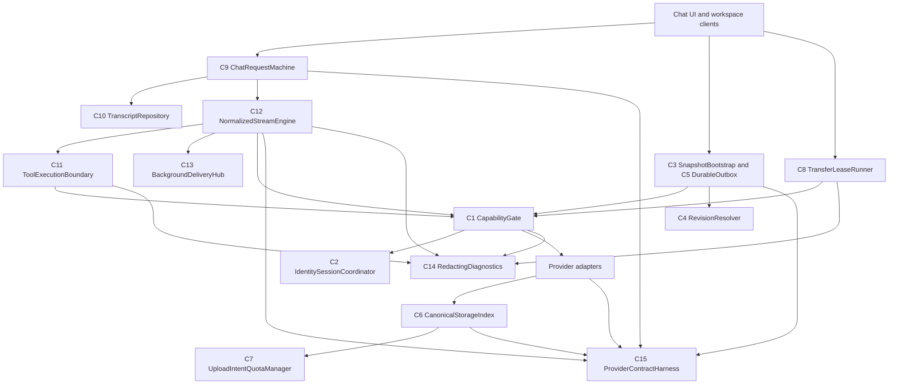

# Design

## Overview

The remediation replaces implicit cross-layer assumptions with a small set of enforceable boundaries. Cloud reads and mutations pass through authenticated capabilities; sync convergence uses one revision tuple and snapshots canonical state; storage lifecycle is intent- and reference-driven; chat uses a request state machine, canonical transcript, shared tool boundary, and normalized stream engine.

The design preserves the existing Nuxt/provider architecture. It does not introduce a new external service. Provider adapters remain responsible for backend-specific persistence, but shared contract tests prevent them from redefining authorization, ordering, integrity, or terminal-state semantics.

## Architecture



### C1: CapabilityGate

One server-side boundary derives subject and workspace from authenticated context and evaluates named capabilities before calling Convex functions, provider adapters, paid streaming, background jobs, storage mutations, GC, or server tools. It serves R1, R5, R7, and R12.

Direct Convex functions that are not valid public subject-bound operations become internal. Public functions accept resource identifiers, never authoritative actor IDs or roles. Administrative retention/GC is internal or owner/admin-capability bound.

### C2: IdentitySessionCoordinator

This component normalizes provider identity into a stable internal user ID, validates verified email state, atomically consumes invitations during provisioning, versions authorization-affecting session state, and prevents stale asynchronous responses from committing. It serves R1 and R4.

Session/token caches use an opaque digest plus provider namespace and authorization revision, never raw bearer or cookie material.

### C3: SnapshotBootstrap

Fresh clients request a consistent materialized snapshot with a server high-watermark. After applying the snapshot transactionally, incremental pull begins strictly after that watermark. Existing cursors continue using incremental pull. Retention stays disabled until provider contract tests prove snapshot-plus-replay completeness. It serves R2 and R12.

### C4: RevisionResolver

One shared revision comparison contract orders `(clock, hlc, opId)` and is used for materialized rows, tombstones, local page application, server batch application, provider templates, and outbox coalescing. It serves R3.

Logical primary keys and ownership fields are immutable after insert. The resolver consumes operations in deterministic batch order while updating an in-memory per-key state map after each winner.

### C5: DurableOutbox

The outbox uses explicit states: `pending`, `in_flight`, `retry_wait`, `failed_retryable`, `failed_permanent`, `applied`, and `discarded`. Startup never purges recoverable failures. Stop increments a lifecycle generation that invalidates every pending callback. It serves R3 and R4.

Batch validation returns a per-operation result so one malformed operation cannot poison siblings. Oversized canonical content remains recoverable and is never replaced by lossy marker data.

### C6: CanonicalStorageIndex

Quota, references, and GC query materialized `file_meta` and canonical reference edges. Retained sync logs are not consulted. GC candidates require a canonical unreferenced decision plus retention expiry; providers verify marker/blob counterparts before deletion. It serves R5.

### C7: UploadIntentQuotaManager

A one-time intent reserves quota and binds workspace, object key, digest, maximum size, MIME policy, and expiry. Commit atomically verifies the intent and actual provider metadata, consumes quota, publishes canonical metadata, and makes the object eligible for reference-driven lifecycle. It serves R5.

Where a provider cannot verify SHA-256 from metadata, commit streams and hashes under a configured cap or rejects the provider capability during validation.

### C8: TransferLeaseRunner

Transfers use an atomic, expiring lease and immutable execution context containing workspace ID and database identity. Missing remote metadata produces typed `pending_upload` or `remote_missing` states, never synced deletion. Downloads stream under size and MIME validation. It serves R6.

Every timer, waiter, listener, and object URL is owned by a transfer execution scope with idempotent disposal.

### C9: ChatRequestMachine

Atomic request admission creates a request-scoped object before the first asynchronous hook. A discriminated state machine controls send, foreground/background start, tools, continuation, abort, completion, failure, and detach. Retry creates or stages a branch instead of deleting its source. It serves R8 and R10.

The public send contract returns `accepted`, `rejected`, or `failed` with a stable reason. The composer clears only on `accepted` after the user row is durable.

### C10: TranscriptRepository

One canonical transcript stores ordered user, assistant, tool-call, tool-result, reasoning, attachment, generation, and terminal metadata. It reconstructs both UI messages and provider messages. Streaming patches only owned fields against the latest row, using deterministic `(index, order_key)` ordering. It serves R8 and R9.

Foreground/background transport differences do not change durable representation. Pending generations include origin database, request/stream ID, mode, lease/heartbeat, and terminal state so reload recovery is deterministic.

### C11: ToolExecutionBoundary

At request start, this boundary snapshots allowed definitions and compiles their schemas. Invocation requires allowlist membership, runtime compatibility, enabled state, authorization context, valid arguments, and an idempotency ledger entry. It serves R1, R7, R9, and R11.

Exact call replay returns the prior result; conflicting reuse fails. Handler context includes a composed abort signal. Model-facing output, durable full output, and UI preview are separate bounded representations.

### C12: NormalizedStreamEngine

One SSE parser emits normalized text, reasoning, image, tool-call, provider-error, terminal, and usage events. One transport-independent loop applies iteration limits, per-turn content, cancellation, deadlines, retry classification, and terminal flushing. Foreground and background adapters only provide I/O and persistence. It serves R8, R10, and R11.

### C13: BackgroundDeliveryHub

One per-job hub owns provider reconciliation polling and fans live events to viewers. Polling is adaptive and suspended while authoritative live events are healthy. Viewer queues have byte caps and disconnect with resumable offsets. Client polling treats transport errors as retryable observations, not server terminal state. It serves R9, R10, and R11.

### C14: RedactingDiagnostics

Structured logs accept metadata, lengths, hashes, typed error codes, and correlation IDs. They reject or redact prompt content, credentials, tool arguments/results, emails, passwords, and file contents before serialization. It serves R11 and R12.

### C15: ProviderContractHarness

Shared test fixtures exercise SQLite, Convex, FS, S3, Clerk, Basic Auth, direct/gateway modes, and generated templates against the same authorization, snapshot, LWW, storage, and streaming contracts. It serves R2, R3, R5, R10, and R12.

## Components and Interfaces

```ts
export type Capability =
    | 'workspace.read'
    | 'workspace.write'
    | 'users.manage'
    | 'sync.gc'
    | 'storage.write'
    | 'storage.gc'
    | 'ai.paid'
    | 'ai.background'
    | 'tool.execute';

export interface AuthzContext {
    userId: string;
    workspaceId: string;
    sessionRevision: number;
    capabilities: ReadonlySet<Capability>;
}

export type AuthzResult =
    | { ok: true; context: AuthzContext }
    | { ok: false; code: 'unauthenticated' | 'forbidden' | 'wrong_workspace' };

export interface Revision {
    clock: number;
    hlc: string;
    opId: string;
}

export interface SnapshotPage<T> {
    workspaceId: string;
    highWatermark: number;
    rows: T[];
    nextPage: string | null;
}

export type SendResult =
    | { status: 'accepted'; requestId: string; userMessageId: string }
    | { status: 'rejected'; reason: 'auth' | 'filtered' | 'limit' | 'busy' | 'invalid' }
    | { status: 'failed'; error: ChatFailure };

export type ChatRequestState =
    | { state: 'admitting' }
    | { state: 'persisted'; userMessageId: string }
    | { state: 'streaming'; assistantMessageId: string; mode: 'foreground' | 'background' }
    | { state: 'running_tools'; iteration: number }
    | { state: 'detached'; generationId: string }
    | { state: 'complete' }
    | { state: 'aborted'; reason: string }
    | { state: 'failed'; error: ChatFailure };

export interface ToolExecutionContext {
    userId: string;
    workspaceId: string;
    threadId: string;
    messageId: string;
    requestId: string;
    callId: string;
    signal: AbortSignal;
}

export type ToolLedgerResult =
    | { state: 'new' }
    | { state: 'replay'; resultRef: string }
    | { state: 'conflict'; previousFingerprint: string };

export type StreamEvent =
    | { type: 'text'; delta: string }
    | { type: 'reasoning'; delta: string }
    | { type: 'image'; url: string }
    | { type: 'tool_call'; id: string; name: string; arguments: string }
    | { type: 'provider_error'; error: StreamFailure }
    | { type: 'done'; finishReason?: string };
```

Public route and provider functions return typed domain failures. HTTP/Convex adapters translate those failures at the boundary rather than using message substring inspection.

## Data Models

### Sync tombstone

```ts
interface SyncTombstone {
    workspaceId: string;
    table: string;
    recordId: string;
    clock: number;
    hlc: string;
    opId: string;
    serverDeletedAt: number;
    version: number;
}
```

Required query: latest tombstone by `(workspaceId, table, recordId)`. Retention uses `serverDeletedAt` plus bounded device cursor state.

### Device cursor

Store one monotonic cursor per `(workspaceId, userId, deviceId)` with `updatedAt`. Writes reject future or invalid versions; GC reads bounded pages.

### Upload intent and quota reservation

```ts
interface UploadIntent {
    id: string;
    workspaceId: string;
    objectKey: string;
    expectedSha256: string;
    maxBytes: number;
    allowedMime: string;
    reservedBytes: number;
    expiresAt: number;
    state: 'reserved' | 'committed' | 'expired' | 'cancelled';
}
```

Required queries: consume by ID exactly once; sum/lock active reservations per workspace; expire by `expiresAt` in bounded batches.

### Transfer lease

Add `leaseOwner`, `leaseExpiresAt`, `attempt`, and `retryAt` to persisted transfers. Claim queries select `queued` or expired `running` rows for one workspace and update the lease transactionally.

### Chat generation and tool ledger

Persist `generationId`, `requestId`, `originDbName`, `mode`, `state`, `heartbeatAt`, and terminal error metadata with the assistant generation. Persist tool call ID, fingerprint, status, bounded result reference, and completion revision. This data is required for reload recovery and exactly-once result reuse.

### Transcript ordering

All transcript queries order by `(thread_id, index, order_key)`. Insert-after normalization re-reads neighbors before assigning the final position. Tool-call/result records retain parent turn and call IDs so retry/branch operations can select a complete turn.

## Error Handling

- Authorization failures are terminal and never retried. Responses reveal no cross-tenant existence information.
- Validation failures are isolated to the offending input or operation and remain recoverable when user data has not been accepted.
- Network, 429, and 5xx failures are retryable with bounded jitter and parsed `Retry-After`; they do not manufacture server terminal state.
- Not-found becomes terminal only after resource-authoritative reconciliation. Storage 404/410 never becomes synced user deletion by itself.
- Abort is a distinct terminal value preserved across fetch, body consumption, retry waits, tools, persistence, and background providers.
- Persistence conflicts re-read canonical state and patch owned fields. They never retry by replaying a completed side effect without consulting the ledger.
- Provider error envelopes are typed stream failures. Malformed SSE is a protocol failure, not successful completion.
- Oversized payloads fail before mutation or are stored by bounded reference. Logs include error code, size, and correlation ID, never raw content.

## Testing Strategy

### Unit tests

- Capability decisions for unauthenticated, viewer, editor, owner, admin, wrong-workspace, and paid-execution cases (R1).
- Revision tuple comparison, tombstone precedence, same-page state updates, duplicate operation IDs, and primary-key immutability (R3).
- Tool schema, allowlist, replay ledger, timeout signals, payload limits, and ownership-bound registry cleanup (R7).
- SSE framing, provider errors, UTF-8 splits, exactly one terminal event, abortable retry delay, and idle deadline (R10).
- Token-budget turn grouping, deterministic transcript ordering, metadata patch merging, and continuation pending state (R8, R9).

### Integration tests

- Fresh empty database snapshot after retained history, followed by concurrent incremental changes (R2).
- Invite acceptance/provisioning failure injection and workspace activation through real policy (R1).
- Presign/commit races, checksum mismatch, split-page marker/blob listing, live-reference GC, and quota reservation expiry (R5).
- Transfer crash recovery, multi-tab claims, workspace switch during transfer, pending upload, bounded download, and retry timing (R6).
- Foreground/background parity for text, reasoning, tool loops, provider errors, abort timing, reload, and terminal persistence (R8-R10).

### End-to-end tests

- New device after retention sees every live workspace record.
- Removed/viewer users cannot mutate, invoke paid AI, manage invitations, or run GC through direct provider APIs.
- A background response survives offline polling and workspace switching.
- A rejected retry or send preserves the original conversation and composer draft.
- Side-effectful tool replay across reconnect invokes the handler once.

### Performance and resilience tests

- Bounded snapshot/GC memory and page counts across configured large datasets.
- N background viewers share one reconciliation poller and each queue stays under its byte cap.
- A 500-token and 200-reasoning-event stream produces bounded persistence writes with exact terminal content.
- Large downloads and tool results remain under configured memory/payload limits.

## Design Decisions

### Snapshot plus replay instead of retaining all history

Keeping an infinite log avoids bootstrap loss but creates unbounded storage and query cost. A materialized snapshot at a high-watermark is the normal sync design and makes retention safe. GC remains disabled until it exists.

### One revision tuple everywhere

Allowing providers or tombstones to omit HLC makes equal-clock convergence impossible. A single comparator and tuple is smaller and safer than provider-specific conflict logic.

### Branch-preserving retry instead of delete-and-resend

Deleting first creates unrecoverable data loss and invalid future context. Branching already matches the conversation domain and lets cleanup happen after acceptance.

### Canonical transcript instead of UI/raw/tool-specific stores

Maintaining separate foreground, background, UI, raw, and provider histories caused drift. One durable representation with projections is easier to test and delete later than more reconciliation glue.

### Shared stream engine with adapters

Foreground and background need different transports but not different semantics. Sharing the parser and state transitions prevents iteration-limit, content, abort, and persistence behavior from drifting again.

### Cooperative cancellation plus idempotency

JavaScript cannot forcibly stop arbitrary handler side effects. Abort signals are required for cooperative work; a durable ledger provides correctness when handlers or networks cannot be cancelled perfectly.

## Risks & Mitigations

1. **Migration changes convergence for existing data.** Add idempotent HLC/tombstone backfills, dual-read compatibility during rollout, and repair tooling before enabling GC.
2. **Snapshot consistency varies by provider.** Define the high-watermark contract first and make each adapter pass the shared harness before production enablement.
3. **Tool API changes break plugins.** Introduce context-aware handler overloads and owner-bound registration disposers with a compatibility window, while rejecting unsafe server execution immediately.
4. **Chat refactoring changes user-visible ordering.** Land canonical transcript projections behind parity tests and compare foreground/background payload fixtures before switching writers.
5. **Containment flags remain disabled indefinitely.** Track every temporary disablement in `tasks.md` with an explicit re-enable gate and owner; release cannot proceed while the blocker matrix is open.
