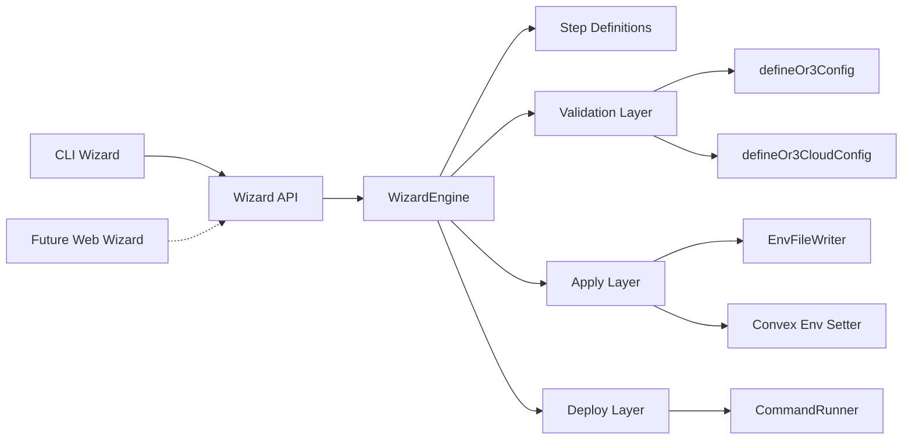

# design.md

artifact_id: 0eaa1c74-2812-4d95-b5dc-0e60bcbeb99c

## Overview

This design defines a **wizard engine + API** that can be used by:

- A CLI (immediate next step)
- A future website wizard (out of scope)

The design is intentionally simple:

- Single source of truth for rules = existing OR3 config validators (`defineOr3Config`, `defineOr3CloudConfig`).
- Wizard collects answers → renders steps → validates → applies (writes env/config) → optionally deploys.
- No new long-lived services required: the CLI can run the API in-process.

Key repo facts the wizard must align with:

- `config.or3.ts` reads base config from env (branding/features/limits/UI).
- `config.or3cloud.ts` reads cloud config from env; cloud features are gated by `SSR_AUTH_ENABLED=true`.
- Cloud strict validation is enforced by `defineOr3CloudConfig(config, { strict })`, where `strict` is effectively true in production.
- Convex + Clerk requires Convex env vars `CLERK_ISSUER_URL` and `OR3_ADMIN_JWT_SECRET` set via Convex CLI.

### Reuse existing config plumbing (avoid drift)

The repo already has “env → typed config” and “safe `.env` editing” utilities that the wizard can reuse to reduce duplication and data-loss risk:

- Validation helpers:
  - `server/admin/config/resolve-config.ts` exports `buildOr3ConfigFromEnv(env)` and `buildOr3CloudConfigFromEnv(env)`.
  - `utils/or3-cloud-config.ts` exports `defineOr3CloudConfig(config, { strict })` which enforces the authoritative schema.
- `.env` read/merge/write:
  - `server/admin/config/env-file.ts` already round-trips `.env` while preserving comments/unknown lines.
  - The wizard will likely need a generalized version that accepts `(instanceDir, envFile)` instead of hardcoding `process.cwd()` and `.env`.
- UX metadata / field copy:
  - `server/admin/config/config-metadata.ts` defines labels/descriptions/grouping per env var.
  - `server/admin/config/config-manager.ts` has a strict whitelist + masking pattern (good defaults for “wizard-owned keys” + redaction).

Even if the wizard is later published as a standalone package, these files are useful as the canonical in-repo source of truth during v1. If packaging constraints prevent importing server/admin modules, keep a minimal copy that is mechanically derived from the above.

## Core UX flow (step graph)

The wizard should feel like:

1. “What are you trying to do?” (local dev vs production)
2. “Use the defaults?” (Clerk + Convex is the default path)
3. “Paste these keys/URLs” (with clear links and examples)
4. “Review (redacted), validate, write config”
5. “Start the app / build it”

### Default path (recommended)

- Auth: Clerk
- Sync: Convex
- Storage: Convex
- Limits storage: Convex if sync enabled, else memory (matches current behavior)

### Provider selection (UX principle)

Even though v1 only exposes implemented providers (Clerk + Convex), the wizard must treat provider choice as a first-class concept:

- Users pick providers early.
- The wizard asks only the questions relevant to the chosen providers.
- Adding new providers later is primarily a matter of registering metadata + validation rules, not reworking the wizard flow.

### Minimal required inputs for default path

- `SSR_AUTH_ENABLED=true`
- `NUXT_PUBLIC_CLERK_PUBLISHABLE_KEY`
- `NUXT_CLERK_SECRET_KEY`
- `VITE_CONVEX_URL`
- Convex env vars (set via `bunx convex env set`):
  - `CLERK_ISSUER_URL`
  - `OR3_ADMIN_JWT_SECRET`

## Architecture

### High-level components



### “API first” interpretation

We define a **stable typed API contract** (request/response) and implement it in a way that can be:

- Called directly in-process (CLI)
- Exposed over HTTP later (website)

To keep it non-overengineered, the first implementation can be:

- A TypeScript module exporting an API surface (functions)
- An optional thin HTTP wrapper (H3) that simply forwards to the module

The website wizard can later call the HTTP wrapper.

## Data model

### Wizard answers

Answers are stored as a structured object that can generate:

- `.env` variables for OR3/Nuxt
- Convex environment commands (`bunx convex env set ...`)

```ts
export type WizardDeploymentTarget = 'local-dev' | 'prod-build';

export interface WizardAnswers {
  // Target + files
  instanceDir: string;
  envFile: '.env' | '.env.local'; // recommend '.env' in v1 (matches existing admin tooling)
  deploymentTarget: WizardDeploymentTarget;

  // Base branding
  or3SiteName: string;
  or3DefaultTheme: string;
  themeInstallMode?: 'use-existing' | 'install-selected' | 'install-all';
  themesToInstall?: Array<'blank' | 'retro' | string>;
  or3LogoUrl?: string;
  or3FaviconUrl?: string;

  // Cloud gating
  ssrAuthEnabled: boolean; // maps to SSR_AUTH_ENABLED

  // Auth
  authProvider: 'clerk' | 'custom';
  clerkPublishableKey?: string;
  clerkSecretKey?: string;

  // Cloud providers
  syncEnabled: boolean;
  syncProvider: 'convex' | 'firebase' | 'custom';
  convexUrl?: string; // maps to VITE_CONVEX_URL

  storageEnabled: boolean;
  storageProvider: 'convex' | 's3' | 'custom';

  // Convex env (not .env):
  convexClerkIssuerUrl?: string; // CLERK_ISSUER_URL
  convexAdminJwtSecret?: string; // OR3_ADMIN_JWT_SECRET

  // OpenRouter hosting
  openrouterInstanceApiKey?: string;
  openrouterAllowUserOverride: boolean;
  openrouterRequireUserKey: boolean;

  // Optional hardening
  allowedOrigins?: string[];
  forceHttps?: boolean;
}

## Provider catalog (extensibility without overengineering)

Rather than hardcoding provider prompts into the CLI, define a small provider catalog that drives:

- selection lists
- provider-scoped required fields
- install hints

In v1, this catalog can be a plain in-repo constant populated from existing ids:

- Auth: `clerk`, `custom` (but only show providers with implemented runtime support)
- Sync: `convex`, `firebase`, `custom` (but only show `convex` initially)
- Storage: `convex`, `s3`, `custom` (but only show `convex` initially)

Future providers can be added by extending the catalog and implementing the runtime provider.

```ts
export type ProviderKind = 'auth' | 'sync' | 'storage';

export interface ProviderDependency {
  /** Package name to add to the instance project (future capability). */
  packageName: string;
  /** Why this dependency exists (used in UX copy). */
  reason: string;
}

export interface WizardProviderDescriptor {
  kind: ProviderKind;
  id: string;
  label: string;
  implemented: boolean;
  docsUrl?: string;
  dependencies?: ProviderDependency[];

  /** Extra fields to collect when this provider is chosen. */
  fields: WizardField[];
}
```

### Why this is “simple”

- The catalog is metadata, not a plugin system.
- There’s no dynamic discovery in v1.
- The step engine stays stable: it renders “provider selection” and then emits provider-specific sub-steps based on the catalog.
```

### Presets

Presets are for UX speed. They should store **non-secret** defaults and choices.

```ts
export interface WizardPreset {
  name: string;
  createdAt: string;
  answers: Partial<Omit<WizardAnswers,
    | 'clerkSecretKey'
    | 'openrouterInstanceApiKey'
    | 'convexAdminJwtSecret'
  >>;
}
```

Notes:

- Presets do not store secrets by default.
- The CLI can offer `--with-secrets` later (explicit opt-in).

## Step definition + validation

Steps should be declarative so the CLI and future web wizard can render the same content.

```ts
export type WizardFieldType =
  | 'text'
  | 'password'
  | 'boolean'
  | 'select'
  | 'multi-string';

export interface WizardField<TValue = unknown> {
  key: keyof WizardAnswers;
  type: WizardFieldType;
  label: string;
  help?: string;
  defaultValue?: TValue;
  options?: { label: string; value: any }[];
  required?: boolean;
  secret?: boolean;
  validate?: (value: TValue, answers: WizardAnswers) => string | null;
}

export interface WizardStep {
  id: string;
  title: string;
  description?: string;
  fields: WizardField[];
  canSkip?: (answers: WizardAnswers) => boolean;
}

### Provider-scoped steps

Implement provider choice as:

- a single “Choose providers” step (auth/sync/storage)
- followed by provider-specific steps generated from `WizardProviderDescriptor.fields`

This keeps UX linear and avoids showing irrelevant questions.
```

### Validation strategy

Use a two-tier validation approach:

1. **Fast local validation** (field-level):
   - required fields
   - simple format checks (e.g., `pk_...`, URL parsing)
   - cross-field rules (e.g., `requireUserKey` implies `allowUserOverride=true`)

2. **Authoritative config validation** (final):
   - Build an env map from `WizardAnswers`.
   - Run `buildOr3ConfigFromEnv(env)` for base config.
   - For cloud config strictness, avoid relying on global `process.env`:
     - Prefer building a `Or3CloudConfig` candidate and calling `defineOr3CloudConfig(config, { strict })` explicitly, OR
     - Add a small helper (e.g. `buildOr3CloudConfigFromEnv(env, { strict })`) that forwards to `defineOr3CloudConfig`.

This ensures the wizard never diverges from the real runtime configuration rules.

### Convex + Clerk validation

The wizard should detect the “Convex + Clerk” path and provide a focused checklist:

- OR3 env contains `VITE_CONVEX_URL`
- Convex env contains `CLERK_ISSUER_URL` and `OR3_ADMIN_JWT_SECRET`

In early versions, we do not need to call Clerk/Convex APIs directly; instead:

- Validate “looks like a URL/key” locally
- Offer optional “run connectivity checks” (HTTP GET to Convex URL, etc.)

## Apply (writing config)

### Env file writing

The apply step must be non-destructive:

- Read existing env file if present.
- Update only keys that the wizard owns.
- Preserve unknown keys, comments, and ordering when practical.

Owned keys are the ones described in config docs, e.g.:

- `SSR_AUTH_ENABLED`
- `NUXT_PUBLIC_CLERK_PUBLISHABLE_KEY`
- `NUXT_CLERK_SECRET_KEY`
- `VITE_CONVEX_URL`
- `OPENROUTER_API_KEY`
- etc.

### Convex env setting

For Convex settings (not read from OR3 `.env`), the wizard should optionally run:

- `bunx convex env set CLERK_ISSUER_URL=...`
- `bunx convex env set OR3_ADMIN_JWT_SECRET=...`

This should be a distinct step because it requires:

- Convex CLI installed (or accessible via `bunx convex`)
- A configured Convex project in the instance directory

## Install-on-demand (future capability; plan for it now)

Eventually the CLI should be able to install optional components as needed:

- provider packages (auth/sync/storage)
- theme packs

To keep v1 simple but future-ready:

1. Add `dependencies` to provider descriptors, but do not execute installs unless the feature is enabled.
2. Add a “theme selection” step that can run in `use-existing` mode initially.
3. When installs are enabled:
  - use `bun add` when running under Bun
  - support npm workflows by printing the equivalent `npm install` commands (or using npm when explicitly selected)

This preserves a strong UX without locking us into a single packaging strategy.

## Deploy / boot

### Local dev boot

For “local dev” target, the wizard should run:

- `bun install`
- `bunx convex dev` (optional to run in background; depends on current workflow)
- `SSR_AUTH_ENABLED=true bun run dev` (or `bun run dev:ssr` which already sets it)

### Production build

For “prod build” target, the wizard should run:

- `bun install`
- `bun run build`

Then print the start command (host-dependent):

- `bun run preview` (Nuxt preview)

(Exact production process managers are out of scope for this phase; the wizard can still give a minimal viable command.)

## API surface

### In-process API (primary)

```ts
export interface WizardSession {
  id: string;
  createdAt: string;
  currentStepId: string;
  answers: Partial<WizardAnswers>;
}

export interface WizardApi {
  createSession(input?: { presetName?: string }): Promise<WizardSession>;
  getSession(id: string): Promise<WizardSession>;

  getCurrentStep(id: string): Promise<WizardStep>;
  submitAnswers(id: string, patch: Partial<WizardAnswers>): Promise<WizardSession>;

  validate(id: string, opts: { strict: boolean }): Promise<{
    ok: boolean;
    errors: string[];
    derived: {
      env: Record<string, string>;
      convexEnv: Record<string, string>;
    };
  }>;

  apply(id: string): Promise<{ writtenFiles: string[] }>; // env files only
  deploy(id: string): Promise<{ started: boolean; instructions?: string }>; // runs commands
}
```

### Optional HTTP wrapper (for future web)

A thin wrapper can expose the same operations as JSON over HTTP.

- The wrapper should be strictly an adapter; it should not own business logic.
- For now, we can keep wizard sessions in memory (CLI use-case). A future web wizard can add persistence.

## Error handling

Use a simple service-result pattern so UX stays consistent.

```ts
export type ServiceResult<T> =
  | { ok: true; value: T }
  | { ok: false; error: { code: string; message: string; details?: any } };
```

Rules:

- Never include raw secret values in `details`.
- Provide “next action” text for command failures (e.g., “Run `bunx convex dev` manually”).

## Testing strategy (for later implementation)

- Unit tests:
  - Field-level validation (Clerk key format, URL parsing)
  - Strict-mode cloud config validation via `defineOr3CloudConfig`
  - Env writer merge behavior (preserve unknown vars)
- Integration tests:
  - “default path” end-to-end in a temp directory (dry-run mode)
  - Deploy step in dry-run mode (command runner mocked)

## Scope boundaries (explicit)

In this phase we will design for but not implement:

- Full deployment automation to third-party hosts
- Web wizard UI
- Provider expansions beyond the default Clerk + Convex path

We will keep the design extensible enough to add:

- S3 storage prompts
- Gateway sync mode and SSR endpoints
- Additional auth providers
