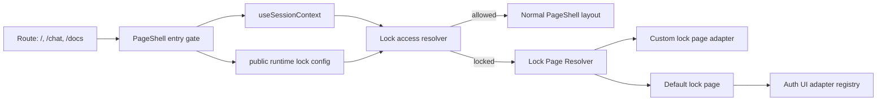

# Overview

This design adds an optional OR3 Cloud lock page that can replace the main `PageShell` experience for visitors who are not yet allowed into the authenticated app.

The design keeps to existing OR3 constraints:

- off by default,
- SSR-auth gated,
- static builds unchanged,
- provider-agnostic auth UI integration,
- extension-first override surface instead of hard-coded branding.

The built-in default is a simple auth-first page. Deployments can register a custom replacement for branded landing pages, sales pages, invite-only messaging, or other pre-auth experiences.

# Current-state findings

1. The main app entry routes (`/`, `/chat`, `/docs`) all converge on [`PageShell`](/Users/brendon/Documents/or3/or3-chat/app/components/PageShell.vue), which is the cleanest integration point for a lock gate.
2. SSR auth state already flows through [`useSessionContext`](/Users/brendon/Documents/or3/or3-chat/app/composables/auth/useSessionContext.ts), backed by `/api/auth/session`, so the lock page does not need a second session endpoint.
3. OR3 already uses small registries for swappable UI surfaces, including the auth UI adapter registry in [`app/core/auth-ui/registry.ts`](/Users/brendon/Documents/or3/or3-chat/app/core/auth-ui/registry.ts).
4. Authorization remains centralized in [`server/auth/can.ts`](/Users/brendon/Documents/or3/or3-chat/server/auth/can.ts); the lock page should not create a parallel server auth model.

# Architecture



## Scope

V1 scope is the shared app-shell routes that already render `PageShell`:

- `/`
- `/chat`
- `/docs`

This captures the main OR3 landing experience without inventing a new route system. Non-`PageShell` routes keep their existing behavior unless explicitly extended later.

## Configuration surface

The feature belongs under OR3 Cloud auth config because it only matters in SSR auth deployments and depends on auth/access policy.

### Proposed config shape

```ts
export interface Or3CloudAuthLockPageConfig {
    enabled?: boolean;
    adapter?: string;
}
```

Proposed placement:

```ts
export interface Or3CloudConfig {
    auth: {
        enabled: boolean;
        provider: string;
        guestAccessEnabled?: boolean;
        lockPage?: Or3CloudAuthLockPageConfig;
    };
}
```

Resolved defaults:

```ts
lockPage: {
    enabled: false,
    adapter: 'default',
}
```

### Env mapping

Additive env keys:

- `OR3_AUTH_LOCK_PAGE_ENABLED`
- `OR3_AUTH_LOCK_PAGE_ADAPTER`

Notes:

- ignored when `SSR_AUTH_ENABLED !== 'true'`,
- preserved by config tooling and wizard env merging,
- public runtime config only needs non-secret lock-page metadata.

## Core components

### 1. Lock page adapter registry

New client/SSR-safe registry patterned after the auth UI adapter registry:

```ts
import type { Component } from 'vue';

export interface LockPageAdapter {
    id: string;
    component: Component;
}

export function registerLockPageAdapter(input: LockPageAdapter): void;
export function unregisterLockPageAdapter(id: string): void;
export function resolveLockPageAdapter(id: string): LockPageAdapter | null;
```

Responsibilities:

- lets deployments register a custom lock page,
- keeps fallback behavior deterministic,
- avoids hard-coded imports in `PageShell`.

### 2. Lock access resolver composable

Add a small composable dedicated to app-entry gating:

```ts
export type LockPageDecisionReason =
    | 'disabled'
    | 'ssr-auth-disabled'
    | 'authenticated'
    | 'guest-allowed'
    | 'unauthenticated'
    | 'forbidden'
    | 'session-error';

export interface LockPageDecision {
    locked: boolean;
    reason: LockPageDecisionReason;
}

export function useLockPageGate(): {
    decision: ComputedRef<LockPageDecision>;
    pending: ComputedRef<boolean>;
};
```

Decision rules:

1. If SSR auth is disabled: `locked = false`.
2. If lock page is disabled: `locked = false`.
3. If session is authenticated and has readable workspace access: `locked = false`.
4. If deployment guest access permits unauthenticated entry: `locked = false`.
5. Otherwise: `locked = true`.
6. If session resolution errors while the feature is enabled: `locked = true`.

This keeps the feature aligned with existing session behavior instead of introducing a second access service.

### 3. Default lock page component

Add a built-in component, for example:

- `app/components/lock-page/DefaultLockPage.vue`

Responsibilities:

- show site branding and concise access messaging,
- render provider-owned auth UI via the existing auth UI adapter registry,
- optionally show legal links from base OR3 config,
- remain generic enough that it works for basic-auth, Clerk, or future providers.

Important detail:

- the default component must resolve provider UI through `resolveAuthUiAdapter(...)`,
- it must not import Clerk or provider SDKs directly from core entry code.

### 4. `PageShell` entry gate

`PageShell` becomes the first render decision point for shell routes.

Pseudo-flow:

```ts
const { decision, pending } = useLockPageGate();
const lockPage = computed(() => resolveLockPageAdapter(activeAdapterId) ?? DefaultLockPage);

if (pending.value && featureEnabled) {
  render lightweight loading state;
} else if (decision.value.locked) {
  render lockPage;
} else {
  render normal PageShell;
}
```

Key constraint:

- perform this decision before sidebar, pane, and dashboard setup so locked visitors do not instantiate the main app shell.

## Override model

Developers register custom lock pages from normal app/plugin code:

```ts
import MyLandingPage from '~/components/custom/MyLandingPage.vue';
import { registerLockPageAdapter } from '~/core/lock-page/registry';

export default defineNuxtPlugin(() => {
    registerLockPageAdapter({
        id: 'marketing',
        component: MyLandingPage,
    });
});
```

Then select it in config:

```ts
export const or3CloudConfig = defineOr3CloudConfig({
    auth: {
        enabled: true,
        provider: 'basic-auth',
        lockPage: {
            enabled: true,
            adapter: 'marketing',
        },
    },
});
```

Fallback behavior:

1. resolve configured adapter id,
2. if not found, use built-in default,
3. if custom component throws during lazy resolution, log and use built-in default on the next safe render path.

## SSR and static-build behavior

### SSR deployments

- feature can be enabled,
- `useSessionContext()` provides SSR-safe initial session data,
- lock page can render on the first response without flashing the app shell.

### Static deployments

- feature is inert,
- no server auth session exists,
- current local-first behavior remains unchanged.

This avoids turning the lock page into a hidden dependency for static builds.

## Error handling

| Scenario | Behavior |
|---|---|
| Config enables lock page but adapter id is unknown | Log warning, render default lock page |
| Session fetch fails while lock page enabled | Fail closed, render lock/error state instead of shell |
| Auth provider adapter missing | Default lock page shows non-destructive unavailable/auth-misconfigured state |
| SSR auth disabled | Lock page feature ignored |

## Performance considerations

- Gate before the main `PageShell` setup to avoid unnecessary pane/sidebar/dashboard work.
- Reuse `useSessionContext()` instead of introducing another network request.
- Keep adapter lookup in an in-memory registry.
- Avoid global route middleware for V1 unless direct non-shell routes need identical treatment later.

## Security considerations

- The lock page only controls app-entry rendering; it is not a substitute for API authorization.
- Existing server routes continue to use `resolveSessionContext()` and `can()` as the real enforcement boundary.
- Fail closed on access-resolution errors when the feature is enabled.

# Testing strategy

## Unit

1. Config parsing/defaults for `auth.lockPage`.
2. `useLockPageGate()` decision matrix:
   - feature disabled,
   - SSR auth disabled,
   - authenticated allowed user,
   - guest allowed,
   - unauthenticated denied,
   - session error.
3. Registry resolution and fallback to default adapter.

## Integration

1. `PageShell` renders the default lock page when feature is enabled and access is denied.
2. `PageShell` renders the configured custom lock page when adapter exists.
3. `PageShell` renders the normal shell when access is allowed.
4. Unknown adapter id falls back cleanly to default lock page.

## SSR/auth integration

1. SSR first render of `/` hides the shell for denied users.
2. Authenticated session hydrates directly into the normal shell without lock-page flash.
3. Guest-access-enabled deployment bypasses the lock page according to policy.

## Manual verification

1. Enable lock page with default adapter on `basic-auth` deployment.
2. Verify `/`, `/chat`, and `/docs` show the lock page when signed out.
3. Sign in and verify the shell appears immediately after session refresh.
4. Register a custom adapter and verify config switches to it without core edits.

# Minimal implementation direction

Prefer the smallest end-to-end slice:

1. Add typed config and env parsing.
2. Add lock page registry + default component.
3. Add `useLockPageGate()`.
4. Gate `PageShell`.
5. Add tests.
6. Update OR3 Cloud config docs and wizard/config preservation.
