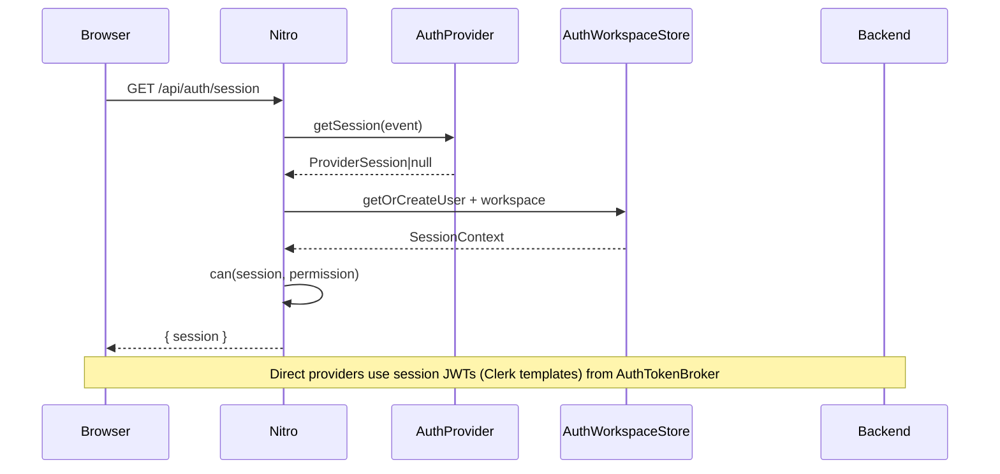
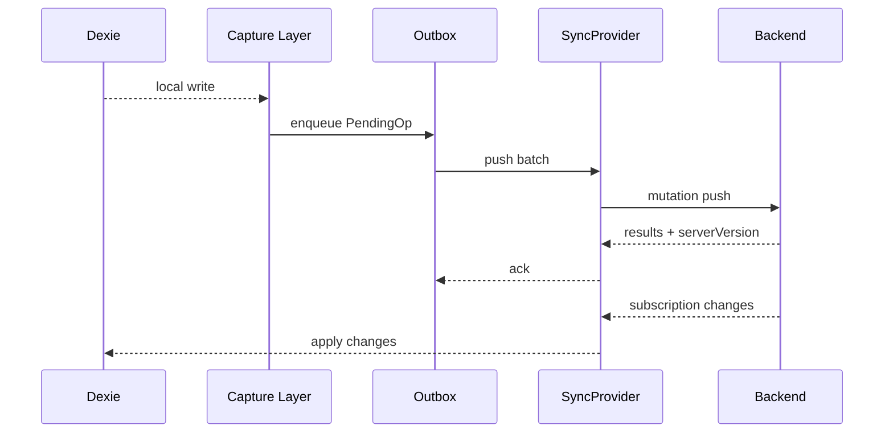
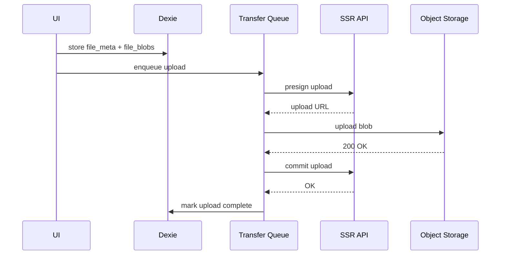

# architecture.md

artifact_id: 2026432e-9183-4590-b963-10e7a5e7d0b2
date: 2026-01-11

## Overview

This document unifies the SSR auth, sync, and storage designs into a single architecture that preserves local-first UX while enabling multi-user SSR deployments.

Key properties:
- Local Dexie remains the UX source of truth.
- SSR auth is provider-agnostic (Clerk default) and fully gated.
- Sync is optional and scoped by workspace.
- Blobs are stored locally first, then uploaded to object storage via presigned URLs.

## Goals

- Multi-user SSR with workspace-scoped data and centralized `can()` authorization.
- Optional sync that never blocks local UX.
- Blob storage decoupled from record sync with hash-based dedupe.

## Constraints

- Static builds must continue to run without SSR auth or sync.
- SSR-only modules must not leak into client bundles.
- Hook and registry patterns must be preserved.

## Key design decisions (locked)

- Canonical workspace/user store: selected SyncProvider backend (Convex default) via `AuthWorkspaceStore`.
- Auth propagation: direct providers use session JWTs (Clerk templates); SSR endpoints enforce `can()` then call providers with server credentials.
- Local workspace scoping: one Dexie DB per workspace (`or3-db-${workspaceId}`).
- Field mapping contract: snake_case wire schema aligned with Dexie.
- Sync providers support `direct` and `gateway` modes for DB-agnostic operation.

## System context

```mermaid
flowchart TB
    subgraph Client[Browser Client]
        UI[Vue UI]
        Dexie[Dexie IndexedDB]
        Sync[Sync Engine]
        Transfers[File Transfer Queue]
    end

    subgraph SSR[Nitro SSR Server]
        Auth[Auth Provider Registry]
        Can[can() Authorization]
        AuthStore[Workspace Store]
        Api[SSR API Endpoints]
    end

    subgraph Backend[SyncProvider Backend]
        ProviderDB[Provider Tables]
        ChangeLog[Change Log]
        Storage[Object Storage]
    end

    UI --> Dexie
    Dexie <--> Sync
    Transfers <--> Dexie

    UI --> Api
    Api --> Can
    Can --> AuthStore
    Api --> ProviderDB
    Api --> Storage

    Sync --> ProviderDB
    Sync --> ChangeLog
```

## Auth and authorization flow



Notes:
- `can()` is the only authorization gate.
- `auth.access:filter:decision` can only restrict access.

## Sync flow (records)



Notes:
- Capture layer must suppress writes applied from remote sync to avoid loops.
- A single cursor strategy is required if `serverVersion` is global.
- Local DB instances are per workspace to avoid `workspaceId` in every row.

## Storage flow (blobs)



Notes:
- Transfers are local-first and retryable.
- Downloads should verify blob hash before caching.

## Data model mapping (example)

Local Dexie uses snake_case. The provider backend stores the same wire schema (Convex default) to avoid mapping overhead.

- `created_at` <-> `createdAt`
- `updated_at` <-> `updatedAt`
- `file_hashes` (string) <-> `fileHashes` (string or array)
- `thread_id` <-> `threadClientId`
- `hash` (file_meta) <-> `hash` (same)

## SSR boundaries

- Auth providers, `can()`, and SSR APIs live under `server/**`.
- Sync and storage queues are client-only; guard with `process.client` and feature flags.
- Static builds should not import or bundle SSR auth dependencies.

## Observability and hooks

- Auth: `auth.access:filter:decision`, `auth.user:action:created`, `auth.workspace:action:created`.
- Sync: `sync.*` lifecycle hooks (push, pull, conflict, retry, stats).
- Storage: `storage.files.*` lifecycle hooks (upload, download, GC).

## Failure modes and recovery

- Offline writes: remain in Dexie and outbox; flush on reconnect.
- Conflict: resolve via LWW with deterministic tie-breakers.
- Cursor expiry: trigger rescan with overlay of pending ops.
- Upload failures: exponential backoff and manual retry.
- ChangeLog growth: require retention policy and periodic GC.

## Security notes

- All SSR endpoints call `can()` and must be server-only.
- Presigned URLs should be short-lived and scoped to workspace.
- Never log tokens or session contents.
