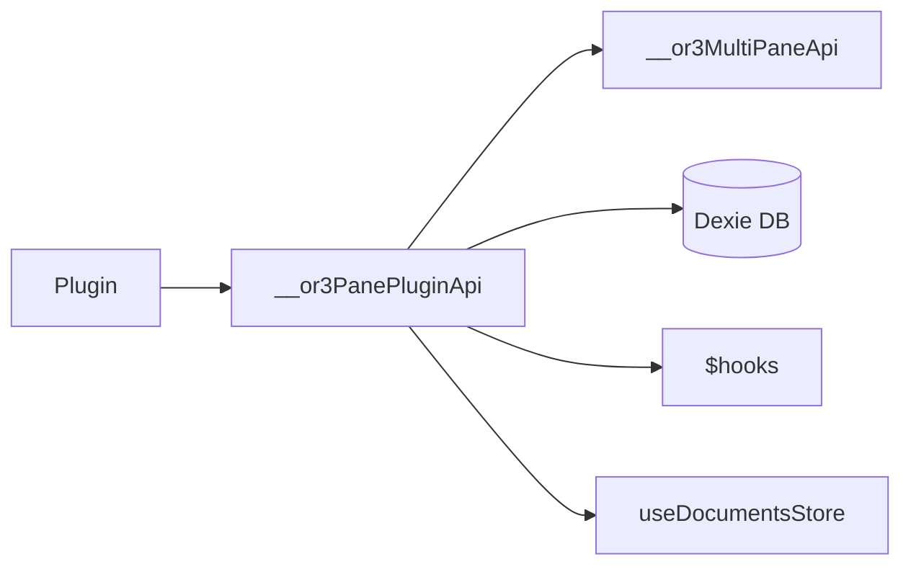

# design.md

artifact_id: 9d1b3a26-60ae-4d38-bc2d-1b2d8c6d9a42

## Overview

Implement a **single lightweight plugin-facing API object** `__or3PanePluginApi` exposing a tiny set of imperative helper functions to:

-   Send a chat message to a pane's thread (creating one if requested).
-   Replace or patch the currently open document in a doc pane.
-   Set a document title.
    All operations reuse existing composables / db utilities to avoid duplication.

No event bus additions, no new abstractions; just direct lookups against the already globally exposed multi-pane state (`__or3MultiPaneApi`).

## Architecture

```
[Plugin Code] --> globalThis.__or3PanePluginApi --> (lookup pane via __or3MultiPaneApi)
                                                      |-> sendMessage: tx.appendMessage + hooks
                                                      |-> create.thread (if createIfMissing)
                                                      |-> setDocumentContent / setDocumentTitle
                                                      |-> shallowPatch helper
```

Mermaid:



## Components / Functions

Single file `app/plugins/pane-plugin-api.client.ts` containing:

-   Interface `PanePluginApi`.
-   Internal `err(code,msg)` helper.
-   `getPane(paneId)` accessor (iterates panes array once).
-   `sendMessage(opts)`:
    1. Validate source, paneId, text.
    2. Ensure pane is chat.
    3. If no thread and `createIfMissing`, create thread & bind (call existing `setPaneThread`).
    4. Append user message via `tx.appendMessage` (role defaults 'user'; allow role override limited to 'user'|'assistant').
    5. Fire normal hooks by manually invoking `hooks.doAction('ui.pane.msg:action:sent', pane, payload)` (this mirrors existing useChat path; acceptable minimal duplication). We avoid invoking full `useChat.sendMessage` to keep code minimal and synchronous; we only need injection of finished message, not streaming.
-   `updateDocumentContent({content})` calls `setDocumentContent`.
-   `patchDocumentContent({patch})` loads current, merges, calls `setDocumentContent`.
-   `setDocumentTitle({title})` calls `setDocumentTitle`.

### Thread Creation

Use existing `create.thread` and then `setPaneThread(index, newId)` via `__or3MultiPaneApi`.

### Shallow Patch Logic

```
function shallowPatch(base, patch) {
  if(Array.isArray(base.content) && Array.isArray(patch.content)) {
    base.content = [...base.content, ...patch.content];
  }
  for(const k of Object.keys(patch)) if(k !== 'content') base[k] = patch[k];
  return base;
}
```

If base not object: start from `{ type:'doc', content:[] }`.

### Error Handling Pattern

Return `{ ok:false, code, message }`; success returns `{ ok:true, ... }`.

## Interfaces

```ts
export interface PanePluginApi {
    sendMessage(opts: {
        paneId: string;
        text: string;
        role?: 'user' | 'assistant';
        createIfMissing?: boolean;
        source: string;
    }): Promise<
        | { ok: true; messageId: string; threadId: string }
        | { ok: false; code: string; message: string }
    >;
    updateDocumentContent(opts: {
        paneId: string;
        content: any;
        source: string;
    }): { ok: true } | { ok: false; code: string; message: string };
    patchDocumentContent(opts: {
        paneId: string;
        patch: any;
        source: string;
    }): { ok: true } | { ok: false; code: string; message: string };
    setDocumentTitle(opts: {
        paneId: string;
        title: string;
        source: string;
    }): { ok: true } | { ok: false; code: string; message: string };
}
```

## Data Flow (sendMessage)

1. Plugin calls API.
2. Validate + locate pane (O(1) over panes length ~small).
3. Possibly create thread.
4. Append message to DB.
5. Run `hooks.doAction('ui.pane.msg:action:sent', pane, payload)`.
6. Return message id + thread id.

## Hooks Compatibility

-   Downstream listeners of `ui.pane.msg:action:sent` will treat injected messages same as user origin.
-   We skip filtering (`ui.chat.message:filter:outgoing`) intentionally for simplicity & determinism; can add later if explicitly requested.

## Testing Strategy

Unit style (Vitest) new file `panePluginApi.test.ts`:

-   Happy path existing thread.
-   Create thread when missing.
-   Reject non-chat pane.
-   Reject missing source.
-   Document content replace & patch.
-   Title set.
    Edge: patch when existing content absent.

## Error Modes

-   not_found: pane missing.
-   pane_not_chat / pane_not_doc.
-   no_thread (and createIfMissing=false).
-   missing_source.
-   invalid_text (empty string).

## Performance Considerations

All operations constant-time; no watchers, no deep cloning (shallow modifications only). Streaming intentionally not supported to avoid complexity.

## Size Target

Estimated ~110 LOC including interface & helper functions.

## Open Questions (Deferred)

-   Streaming injection (deferred, out of scope).
-   Hook filters for outgoing content (only if demanded later).
-   Multi-message batch send (can wrap in plugin easily using loop).
