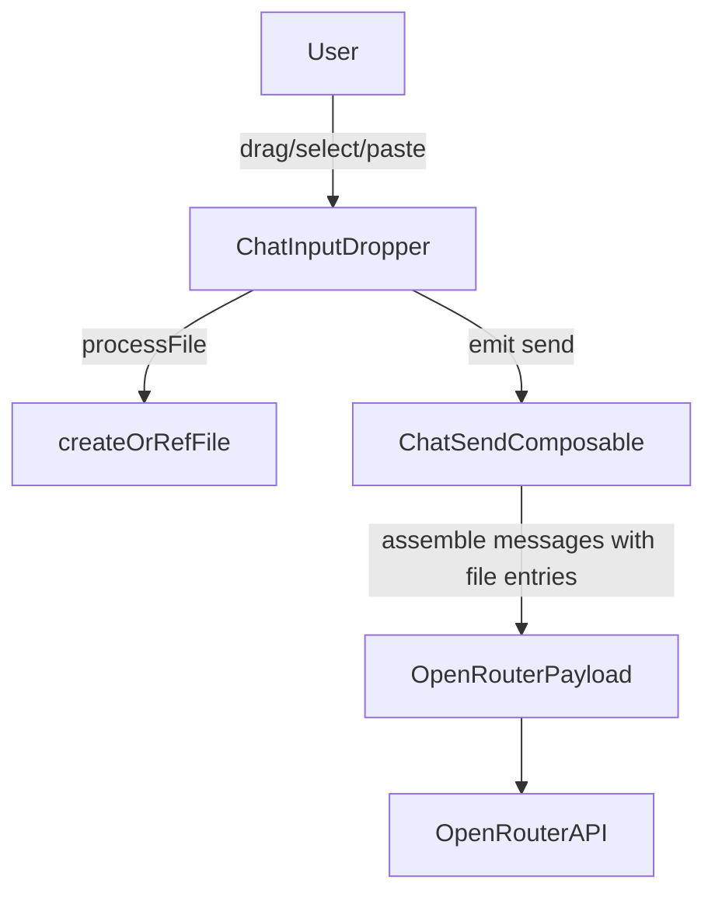

# design.md

artifact_id: c3d7c2b1-6f07-49b2-9ef3-7e0f1e0d8f42

## 1. Overview

Add minimal PDF attachment support by extending existing image handling in `ChatInputDropper.vue` and downstream send pipeline. Distinguish PDFs via MIME detection and store as base64 data URLs using the same persistence helper `createOrRefFile`. Thumbnails use a simple placeholder (icon + filename). Sending logic generalizes from images array to a unified attachments array supporting both images and PDFs.

## 2. Architecture



## 3. Data Structures

### 3.1 Attachment Union

```ts
interface BaseAttachmentMeta {
    file: File; // original File object
    url: string; // data URL preview (for PDF this is icon placeholder not used; still keep for consistency)
    name: string;
    hash?: string;
    status: 'pending' | 'ready' | 'error';
    error?: string;
    meta?: FileMeta; // from persistence
    mime: string; // e.g. 'image/png' or 'application/pdf'
    kind: 'image' | 'pdf';
}

// Existing UploadedImage extends mostly; we'll rename internally to a generic Attachment.
```

### 3.2 Send Payload Extension

Current emit `send` payload has `images: UploadedImage[]`. We'll introduce `attachments: Attachment[]` (images + pdfs) while preserving `images` for backward compatibility (populate from filtered attachments) to avoid ripple edits. New code paths will prefer `attachments` if present.

```ts
interface SendPayloadV2 {
    text: string;
    attachments: Attachment[]; // unified
    images: Attachment[]; // legacy field (image only)
    largeTexts: LargeTextBlock[];
    model: string;
    settings: ImageSettings; // unchanged
    webSearchEnabled: boolean;
}
```

## 4. Component Changes (`ChatInputDropper.vue`)

1. Generalize `UploadedImage` to `Attachment` with `kind` & `mime`.
2. Accept & process PDFs inside `processFile` (rename maybe `processAttachment`).
3. Drag over: also highlight for PDFs (check `item.type==='application/pdf'`).
4. Grid rendering: branch `v-if=att.kind==='image'` vs `att.kind==='pdf'`.
5. PDF Tile Layout (tailwind utility only):

```
<div class="relative group aspect-square border border-black retro-shadow rounded-[3px] ... bg-[var(--md-surface-container-low)] flex flex-col justify-center items-center">
  <span class="text-[10px] font-semibold tracking-wide uppercase bg-black text-white px-1 py-0.5 rounded mb-1">PDF</span>
  <span class="text-[11px] leading-snug line-clamp-4 px-1 break-words" :title="att.name">{{ truncated(att.name) }}</span>
  <button ... remove ...>
```

Reuse remove button styling.

6. Paste handler: loop clipboard items for `application/pdf` similar to images.
7. Reset path clears `attachments`.
8. Emitted events: `image-add` / `image-remove` kept; we can still emit them for images; PDFs can reuse `image-add` naming for simplicity or add new events (skip to stay minimal).

## 5. Persistence

No schema changes. `createOrRefFile` already handles arbitrary `File` objects; ensure it's tolerant of PDF MIME. Base64 data URL produced via `FileReader.readAsDataURL` identical to images.

## 6. OpenRouter Payload Assembly

Where the OpenRouter request is built (likely in `useChatSend` or a related service), ensure attachments iterate and produce entries:

```ts
attachments.forEach((att) => {
    if (att.status === 'ready' && att.kind === 'pdf') {
        content.push({
            type: 'file',
            file: { filename: att.name, file_data: att.url },
        });
    } else if (att.status === 'ready' && att.kind === 'image') {
        // existing logic unchanged
    }
});
```

If current pipeline already pushes images through a generalized path using `file` type, simply extend the filter condition.

## 7. Error Handling

-   Mark `status='error'` if persistence fails; tile shows same error style (reuse existing CSS classes).
-   Skip errored attachments in send assembly.

## 8. Testing / QA

Minimal manual QA steps (keep scope small):

-   Drag one PDF -> appears with PDF badge.
-   Add image + PDF -> both show; send payload includes one `file` entry per attachment.
-   Remove PDF -> grid updates.
-   Exceed max attachments with mixture -> extras ignored.
-   Paste PDF (if environment supports) -> added.

Automated (optional if tests infra exists):

-   Unit test helper that classifies `File` to `kind` = pdf vs image.

## 9. Performance Considerations

-   PDFs may be large; base64 encoding entire file increases memory. For simplicity we accept this (matching requirement). Limit remains enforced by existing `MAX_FILES_PER_MESSAGE` (could add size guard later; out-of-scope).
-   No extra watchers; attachments array replaces images array with same reactive cost.

## 10. Simplicity Notes

-   Avoid new components; inline PDF tile template.
-   Maintain backward compatibility via `images` field to prevent broad refactor.
-   No additional plugin, worker, or parsing library added.

## 11. Future Enhancements (Not Now)

-   First page raster thumbnail with pdf.js.
-   Text extraction with incremental streaming to model.
-   Caching file annotations for cost savings.
-   Per-attachment size warnings / progress indicators.
