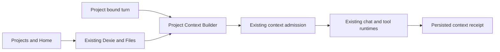

# Design

## Overview

Add project policy, Home, and extraction to existing OR3 systems. Files remains the library; the chat runtime owns execution.

## Architecture



## Components and Interfaces

| Component | Responsibility and reuse | Requirements |
| --- | --- | --- |
| Project Home | Register a sidebar page using Chats/Documents navigation, shared search, list and empty-state styles. The home shows project identity, New chat, a brief, Knowledge/Memory links, and time-grouped chats/documents. Reuse `SidebarPageLink`, `SidebarTimeGroupedList` with its header slot, and existing Files intake. Settings holds chat association and memory-exclusion controls. Opening a project preserves the active pane and tabs. | R1 |
| Project Store | Extend [project associations](../../app/utils/chat/workspace-projects.ts); own settings, explicit memories, and knowledge bindings. | R2, R3, R7 |
| Source Intake | Extend [Files intake](../../app/db/workspace-files.ts), preview, bounded reads, and document history. | R2 |
| Project Context Builder | Resolve immutable turn inputs before [native admission](../../app/composables/chat/useAi.ts); all project-bound inference paths call it. | R4 |
| Project Tool Policy | Narrow existing client/server registries and plugin/workflow authority at execution. | R5 |
| Context Receipt | Extend [source receipts](../../app/utils/chat/workspace-source-receipts.ts) with evidence from submitted requests. | R4 |
| Project Continuity | Reuse [compaction](../../app/composables/chat/useThreadCompaction.ts) and existing workspace search/read. | R6 |

```ts
type ContextMode = 'relevant' | 'always' | 'off';
// Proposed internal contract, using captured origin/thread or new-chat project,
// query, model, and signal; never derive ownership from the active pane.
type BuildProjectContext = (input: ProjectContextInput)
  => Promise<ProjectContextSnapshot>;
```

Capture owner/revisions, instructions, brief, memories, source parts, tool restrictions, and receipt candidates. Reuse lexical search, initially selecting up to five bounded excerpts within remaining capacity. Instructions, brief, saved memories, and “Always include” sources must fit in full or refuse. Preserve transcript admission; no automatic trimming or embeddings. Explicit chat model choices override project defaults. Compose instructions through existing prompt handling; retrieved content remains reference material, never authority.

## Data Models

Preserve `projects.data` membership arrays and extension fields. Make `threads.project_id` authoritative; backfill unambiguous owners and require visible resolution of conflicts. Create/move chats atomically with memberships.

Use three versioned internal `posts` types: settings/brief, individual memories with provenance, and knowledge bindings with mode/current revision/history. Bindings reference catalog items/native documents; `file_hashes` retain upload originals and extracted-text blobs. Keep native document history. Reuse `[postType+title]` lookups and KV preferences; hide internal posts from general search. Qualify row limits, retained references, backups, and provider preservation.

## Error Handling

Separate transfer and extraction status. Missing/offline bytes, malformed files, interruptions, and stale revisions offer retry/reload. Failed replacement preserves the current revision. Scanned/unsupported content stays visibly partial/failed. Required unavailable context blocks sending; optional omissions appear in receipts. Preserve refused drafts.

## Testing Strategy

Extend existing context, storage, workspace-cloud, and journey harnesses. Define failures first; retain E2E traces and sanitized request/receipt comparisons. Cover pane races, forbidden actions, replacement/retention, retries/recovery, and provider/backup round trips. Write any necessary isolated boundary tests before production code.

## Design Decisions

- **Extract locally.** Add lazy [PDF.js](https://github.com/mozilla/pdf.js/blob/master/examples/node/getinfo.mjs) and [Mammoth raw-text](https://github.com/mwilliamson/mammoth.js#api) workers: these fill actual PDF/DOCX gaps. Bound bytes/time, disable external access, preserve page/paragraph locations, and render plain text. Keep the 64 KiB search excerpt; store further extraction in file blobs. Defer OCR.
- **Retain images.** Reuse [image content parts](https://openrouter.ai/docs/guides/overview/multimodal/image-understanding). Model-dependent [PDF parsing](https://openrouter.ai/docs/guides/overview/multimodal/pdfs) cannot define the persistent preview.
- **Explicit knowledge.** Cataloged chat uploads gain no future project retrieval eligibility. Only promoted bindings do. Notes/saved responses reuse native documents.
- **Enforce at dispatch.** Intersect project policy, enablement, and current permissions; validate resource arguments and send/publish approvals. Disable tools whose resource restriction cannot be enforced. Scope legacy tools too. Servers resolve trusted policy; background jobs retain scope but honor revocation. Adapt [workflow host bridges](../../app/composables/plugins/workflow-host-bridge.ts) and plugin inference; unadapted project execution must refuse.
- **Receipt after admission.** Record each submitted iteration after final filters: source/revision/range IDs, bounded text, and omission reasons in assistant metadata. Exclude secrets, binaries, and signed URLs. Retrieval is not inclusion; inclusion is not proof of reasoning.

## Risks & Mitigations

Ambiguous membership → explicit resolution. Parsing limits → truthful coverage. Tool bypasses → shared dispatch gates. Stale summaries → review/invalidation on exclusion. Sync conflicts → revision checks/provider qualification, without promising simultaneous editing.
