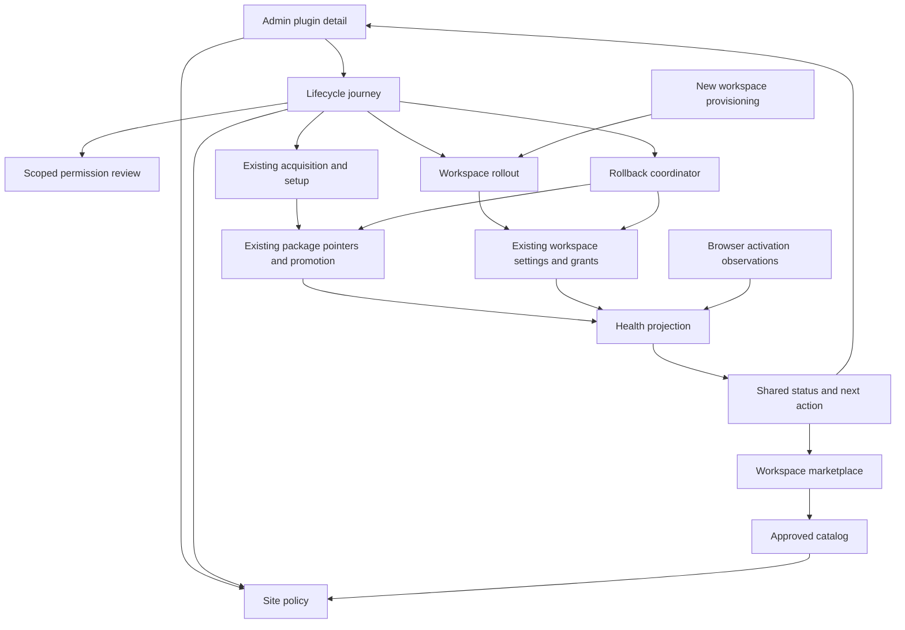

# Design

## Overview

Extend the existing V2 lifecycle with site approval and a bounded workspace rollout service. Present it through one admin plugin detail page and a shared status/action projection used by both Admin and Marketplace. Preserve the acquisition pipeline, pointer service, authority comparison, provider settings, setup system, and runtime loaders.

Delivery has five phases: **1. Status and contracts; 2. Site approval and catalog; 3. Workspace rollout; 4. Guided install and updates; 5. Health and recovery.** Phase 1 can ship independently. Phases 2–3 establish the policy required by the complete guide. Phase 5 completes the verification and recovery experience.

## Architecture



| Component | One responsibility | Requirements | Existing seams / proposed additions |
| --- | --- | --- | --- |
| Status Projection | Derive one scoped status and next action | R1, R8 | Extend `shared/plugins/lifecycle/lifecycle-view.ts` and existing acquisition failure presentation |
| Site Policy | Persist site catalog decisions and future workspace defaults | R3, R5, R6 | New small store/service under `server/admin/plugins/`; reuse extension storage and atomic-lock conventions |
| Approved Catalog | Enforce site visibility for workspace users | R5 | `server/utils/plugins/marketplace/service.ts`, catalog/detail/preflight routes, Library install-request route; add guarded admin catalog route |
| Permission Review | Validate one release-and-scope consent decision | R6 | Existing `review.get.ts`, `grants.post.ts`, authority comparisons and `workspace-plugin-store.ts` |
| Rollout Service | Apply an authorized workspace target snapshot resumably | R3, R4, R6 | New bounded operation record/service; existing enablement, grants, setup and provider CAS |
| Provisioning Integration | Apply an explicit default to a newly created workspace | R3 | `server/workspaces/provisioning.ts`, auth default-workspace creation, user/admin workspace creation routes |
| Lifecycle Journey | Render the next step from authoritative operations | R2, R7, R8 | `useMarketplace.ts`, setup composable, Discover/Installed/Updates, `app/pages/admin/plugins.vue` |
| Health Projection | Explain package readiness and actual browser activation evidence | R1, R9 | Package canaries, portable/trusted activation registries, existing 30-second observation flow |
| Rollback Coordinator | Preflight and restore the shared selected version | R7, R10 | `package-promotion.ts`, `package-operation-support.ts`, rollback route and instance-wide preflight |

## Components and Interfaces

### Shared status and action

Extend the existing lifecycle projection; do not store another status flag. Server DTOs supply site policy, package selection, workspace enablement, consent/setup readiness, operation progress, and allowed actions. Browser observations are joined on the client and retain their workspace/digest/generation scope.

```ts
type AdminPluginStatus =
    | 'needs-site-approval' | 'needs-permissions' | 'needs-setup'
    | 'checking' | 'ready-to-enable' | 'disabled' | 'starting'
    | 'active' | 'needs-attention';

type PluginNextAction =
    | { kind: 'approve-site' | 'review-permissions' | 'configure' | 'enable' }
    | { kind: 'continue' | 'retry'; operationId: string }
    | { kind: 'open-workspace'; workspaceId: string }
    | { kind: 'sign-in-admin' | 'configure-registry' | 'diagnostics' }
    | { kind: 'none'; reason: string };

interface PluginAdminView {
    pluginId: string;
    workspaceId: string | null;
    status: AdminPluginStatus;
    explanation: string;
    nextAction: PluginNextAction;
    // Existing identity/lifecycle DTOs remain authoritative.
    lifecycle: PluginLifecycleView;
    pendingUpdate: PluginUpdateView | null;
    enabledWorkspaceCount: number;
}
```

Status precedence is deterministic: active operation/checking; a failure that needs intervention; missing site approval for a new action; missing consent/setup for an intended activation; ready-to-enable or deliberately disabled; starting/active from exact observation. A failed pending update does not relabel the working current release as failed. Disabled plugins do not demand setup until enablement is requested. Show “Enabled in N workspaces” at site scope; only a scoped browser observation can establish Active.

Remediation is a typed action with structured plugin, release, workspace and operation identifiers. Derive internal navigation from those identifiers; reject arbitrary return URLs. Preserve the existing admin-session versus Chat-session distinction and display the selected workspace's name and owner where names collide.

### Site policy and catalog

Add a guarded catalog inside Admin > Plugins. It uses the existing configured-registry client and signature preflight, and lets a system administrator approve a published release before offering it to users. The public central marketplace is unchanged.

Dashboard Discover reads local approved metadata. Filter and paginate the approved set before returning results; do not fetch one remote page and remove hidden entries afterward. Store the small display snapshot needed for name/category/tag search when approval is saved. This is the site's approved catalog, not a replica of the entire marketplace. Existing update checks refresh relevant display metadata. Before detail/preflight/install, resolve and verify the exact approved release through the existing registry trust pipeline; stale metadata can never authorize execution or substitute a newer version.

Enforce the policy on catalog, detail, preflight, install requests, and authoritative acquisition/enablement entry points for marketplace-managed V2 packages. A deep link cannot bypass it. Source plugins and explicit local development admission retain their separate existing authorization paths and never masquerade as approved marketplace releases. System administrators can inspect unapproved releases through admin routes, then commit an explicit site approval. Paid Library coverage, publisher trust, and workspace grants remain required independently.

Removing an entry from the catalog blocks new discovery/enablement and future defaults. It does not silently disable existing workspaces. Offer “Disable in workspaces” as a separate scoped operation. Recovery of already installed code remains possible under current trust and consent checks even when catalog discovery is hidden.

### Scoped permission review

Reuse full effective-authority comparisons already used by Updates. The review shows plain-language permissions and a compact current/proposed comparison; raw hashes live in expandable details. Bind the submitted decision to signed release identity and frozen target IDs, plus an explicit future-default decision when selected.

The permission service validates the decision once, then the rollout service writes the existing per-workspace consent records. Each application still verifies the selected release and workspace preconditions. Ordinary workspace administrators can only act on their authorized workspace. System-admin batch consent must never become a reusable bearer capability or replace runtime checks.

Existing unchanged/narrower-authority inheritance stays authoritative. On update, advance the future default only when the existing comparison establishes sufficient authority or the administrator explicitly approves the expansion. A package digest changing after preview requires an updated review.

### Rollout preview and execution

```ts
type WorkspaceSelection =
    | { kind: 'selected'; workspaceIds: readonly string[] }
    | { kind: 'all-existing' }
    | { kind: 'new-only' };

interface RolloutRequest {
    pluginId: string;
    expectedPackageDigest: Sha256;
    expectedPointerRevision: number;
    expectedPolicyRevision: number;
    selection: WorkspaceSelection;
    enabled: boolean;
    includeFutureWorkspaces: boolean;
}

type WorkspaceRolloutOutcome =
    | { state: 'pending' | 'applied' | 'already-applied' }
    | { state: 'blocked' | 'failed'; code: string; message: string }
    | { state: 'skipped'; reason: 'workspace-deleted' };
```

Preview resolves selection through the provider's existing workspace listing, captures exact IDs and per-target enablement/grant/setup preconditions, and stores an expiring preview record. Reuse the existing enumeration cap of 100 pages of 100 workspaces; fail explicitly if exceeded, never silently truncate. Paginated search/selection keeps the browser from rendering thousands of checkboxes at once. An all-existing snapshot excludes workspaces created afterward; the explicit future policy handles those.

Proposed admin-only routes under `/api/admin/plugins/rollouts`: `POST preview`, `POST` to apply a preview, `GET /:id`, `POST /:id/continue`, and `POST /:id/cancel`. Keep request validation, mutation-origin checks, authorization, and `no-store` behavior consistent with existing admin APIs. All mutations include expected revisions. Duplicate starts with the same preview return its existing operation.

Use request-driven continuation, as with existing acquisition recovery, rather than a new daemon or queue. Each continuation leases the operation and processes at most 25 workspace outcomes, stopping between outcomes after a five-second work budget. Provider I/O must have a bounded timeout; preserve uncertain writes for read-back reconciliation. Reopening the page offers Continue. Closing the browser pauses further batches at the next request boundary and never loses progress.

For each workspace: revalidate identity and targeted prerequisites; record the intended consent/enablement values; apply grant review; check setup; compare-and-set enablement; read back after an uncertain response; record the outcome. Coordinate each bounded mutation batch with acquisition, promotion, rollback and uninstall through the existing plugin operation lock; recheck pointer/policy revisions under that lock, and never hold it while waiting for browser interaction. SQLite and Convex settings adapters already implement optional provider-native `compareAndSet`; use it, and update all competing enablement writes to the same CAS path. On providers without an atomic primitive, reject bulk mutation with an actionable capability reason instead of claiming multi-process safety. No loop can overwrite an unrelated plugin's enablement change.

Grant-write success followed by setup or enablement failure leaves the approved review recorded but the plugin inactive, and reports that exact outcome. Cancellation stops pending work; it does not pretend to undo completed writes. Retry processes unresolved work and rechecks any externally changed targets. Bound retained operation history using the acquisition store's retention conventions; active/recoverable operations are not evicted.

The future-default decision is persisted explicitly with the operation and shown separately in its receipt. Cancellation of existing-workspace batches does not revert an already saved future default; the cancel view explains this and offers the ordinary default toggle. Operations for new workspaces record the governing policy revision so retries cannot invent eligibility for older workspaces.

### New workspace provisioning

Extend `provisionWorkspaceDefaults` and its three existing call sites. Source-plugin configured defaults keep their existing behavior; V2 policy takes precedence for V2 packages and cannot be bypassed by `defaultEnabled`.

At actual workspace creation, snapshot applicable future policies into the same rollout journal as a single-workspace operation before applying them. Bind consent to the approved selected identity. Do not copy secrets or settings. If setup is required, record Needs setup and leave the plugin disabled. Removing/changing policy or package selection while provisioning requires revalidation before application.

A plugin-provisioning failure must not report workspace creation itself as failed after the workspace exists. Return the created workspace with a provisioning warning and retry context, and expose the recorded failure in Admin. If journaling itself is unavailable, preserve the created ID and explicit failure so a retry repairs that workspace rather than creating a duplicate. Never infer “new workspace” merely from an empty `plugins.enabled` key.

### Guided lifecycle UI

Admin > Plugins gets Catalog, Installed, and Updates views using existing themed Nuxt UI components. A plugin detail contains Overview, Workspaces, and expandable technical details. Keep source/development tools under Advanced. Existing dashboard components use the same projection and link authorized administrators into this detail rather than rebuilding a second flow.

The guide renders the durable acquisition stage and links a rollout operation only after package selection is ready. Installing once does not redownload per workspace. Setup-required workspaces show a named list and scoped Configure links. Browser canary steps remain tied to the acquisition workspace, even if the admin is browsing another workspace. Refresh/sign-in recovery restores operation IDs and target context.

Updates remain on their existing acquisition/promotion path. Show current version separately from Update being checked; present all-enabled-workspace impact before applying. A chosen canary workspace supplies testing evidence, not an independent production version. Do not introduce a second install state machine in Vue.

### Health and rollback

Project existing package validation, setup readiness, canary evidence, and portable/trusted runtime observations into a check list with pass/failed/pending/not-applicable outcomes. Auto-check after enablement in the current browser, and expose Run check on demand. Required registrations are checked against existing runtime contribution receipts. Do not guess that every plugin must have a sidebar, or label a plugin fully healthy merely because setup returned.

Preserve the 30-second browser observation window. At site scope, report enabled counts and scoped evidence rather than asserting every workspace runs. Do not create background polling for every workspace. Optional service readiness can use existing non-mutating setup probes only; a real workflow/model execution remains a separate explicit smoke test.

Extend the rollback route with `expectedCurrentDigest`, `expectedPreviousDigest`, and expected pointer revision. Reuse instance-wide promotion preflight and the existing migration/state snapshot helpers for all live enabled workspaces, not only the administrator's selected workspace. Revalidate affected membership/revisions at the pointer commit boundary using the existing operation lock/fence. On success, revoke replaced runtime handles and signal normal reconciliation; preserve enablement and stored data. Unsupported migration/data-readability gets an explanation, not an unsafe restore button. Rollback affects all enabled workspaces because selection is shared, including workspaces enabled since the update.

## Data Models

Use the existing provider settings for workspace truth and the existing extension filesystem for site/package truth. No new database, provider namespace, or external queue is needed.

| Record | Location / fields | Purpose and bounds |
| --- | --- | --- |
| Site plugin policy | Proposed `<extensions>/.plugin-admin/<pluginId>.json`; schema version, revision, catalog decision, approved release identity/display snapshot, future policy, actor/time | One bounded record per plugin; atomically replaced under existing lock conventions; display metadata excludes arbitrary HTML/secrets |
| Rollout record | Proposed `<extensions>/.plugin-rollouts/<operationId>.json`; schema version, revision, plugin identity, preview expiry, actor, target snapshot, preconditions, consent decision, future-policy result, per-target outcomes, lease/cancel/status | At most the existing 10,000-workspace enumeration cap; paginated status DTOs; retained history bounded as acquisition history is |
| Workspace enablement | Existing `plugins.enabled` setting | CAS read/modify/write; preserve unrelated plugins and explicit existing choices |
| Workspace consent/setup | Existing grant-review and setup/state records | No alternate ACL; written only after verified scoped approval; credentials stay workspace-specific |
| Health result | Derived from existing canary/activation evidence and operation receipts | Browser observations are ephemeral and scoped; record check timestamps/outcomes only where existing lifecycle records support them |

Initial site-policy migration is idempotent and scoped to verified currently selected marketplace packages. It creates catalog visibility only, never new consent or enablement. Quarantined/corrupt packages stay unavailable. Missing policy after migration means not approved; a corrupt policy fails closed with an admin repair message. A versioned migration marker prevents a hidden installed plugin from being automatically reapproved on each startup.

## Error Handling

Use existing acquisition result/failure values and `createError` at HTTP boundaries. Add stable codes only for new conditions, such as `site-approval-required`, `rollout-preview-stale`, `rollout-conflict`, and `bulk-settings-cas-unavailable`. Map them through existing failure presentation.

| Failure | Result and recovery |
| --- | --- |
| Registry timeout or invalid signature | Keep existing installation and policy; show retry/diagnostics; never approve from display metadata |
| Package/policy changed after preview | HTTP 409 with refreshed-review action; apply no new target from stale evidence |
| One workspace's setup/grant/store fails | Record its reason, retain completed work, continue independent eligible targets, offer scoped retry |
| Process stops after write but before recording success | Read back expected values on resume; mark already-applied or conflict, never repeat a non-idempotent action blindly |
| Two admins change enablement | Provider CAS detects conflict; reread, preserve unrelated changes, and require re-review when the target choice changed |
| Admin authentication expires | Stop mutation; preserve operation; resume only after authorization is restored |
| Workspace deleted during rollout | Skip it explicitly; do not fail all other targets |
| New workspace created but default provisioning fails | Return existing workspace ID with warning; retry recorded provisioning without duplicating workspace |
| Browser absent/slow, service setup missing | Report pending/needs setup with scope; do not label all workspaces active |
| Unsafe rollback | Keep current pointer; show why previous code cannot safely run and retain redacted diagnostics |

## Testing Strategy

Write failure cases and executable acceptance scenarios before implementing each behavior. Prefer real route/service and browser journeys; do not add unit tests for labels or assertions mirroring source code.

- **UI/flow E2E (R1, R2, R5, R7, R8, R9):** extend the existing marketplace/browser harness for navigation, full journey recovery, direct-link gating, empty catalog, ambiguous workspace names, keyboard focus, and 375px/1440px overflow. `tests/e2e/marketplace.spec.ts` currently stubs data endpoints; those tests alone cannot prove permission or rollout correctness.
- **Real persistence journeys (R3, R4, R6):** exercise actual admin routes and SQLite stores with 1,000 disposable workspaces, partial setup, permission failure, restart, duplicate requests, policy changes, deletion, cancellation, and CAS conflicts. Run a disposable Convex-provider qualification for changed CAS/grant behavior. Retain a receipt with counts, versions/digests, before/after enablement and failure IDs; omit secrets.
- **Focused integration regressions (R5, R6, R10):** extend existing grant, promotion, acquisition and provider suites where isolation is required; enumerate failure modes first. Verify non-admin denial, workspace-admin boundaries, signed authority, paid entitlement, direct acquisition bypass attempts, prior-version compatibility, and stale commit fences.
- **Actual plugin browser smoke (R2, R9, R10):** use Workflows and a portable fixture. Approve, install/enable, verify contribution registration, import a simple workflow, choose it with `/`, execute, reload, update, and restore the prior compatible release. Separately label any AI/model smoke; normal health checks must not make paid requests. Preserve screenshots and a machine-readable receipt.
- **Load and recovery gate (R3, R4):** verify each continuation applies at most 25 outcomes and respects the inter-outcome time budget, status pages remain bounded, provider calls have timeouts, and all 1,000 results are accounted for after interruption/retry. Record observed timings rather than claiming a universal total-time SLA.

Validation commands should be run once per coherent batch, using the existing named lanes: targeted `bunx vitest run <affected files> --reporter=dot`, `bun run type-check`, the repository's named E2E harness, and `bun run build` for the final connected change. Add one narrowly scoped `test:e2e:plugin-admin` harness only for the new real-provider journey; it must use disposable data, a recorded local registry fixture, and produce artifacts. Run provider build/typecheck suites if provider code changes. Live paid-network tests remain separately selected.

## Design Decisions

- **Extend, do not restart the lifecycle:** acquisition, authority comparison, setup, promotion, rollback and runtime observation already exist and have partially completed plans. New work is policy, scope, and a consistent UI. Link prior plans rather than resetting their checklists.
- **One selected version:** per-workspace versions would change package resolution, server routes, migrations and isolation. Keep that larger redesign out of this project and explain shared update/rollback impact in the UI.
- **Site policy plus per-workspace records:** a single global “approved” boolean would lose review identity and local prerequisites. Store the administrative decision once and apply the existing records to its explicit targets.
- **Request-driven durable batches:** a single HTTP loop over 1,000 provider writes is unreliable. A small resumable journal is justified by the scale requirement; an external queue or always-on worker is unnecessary for this delivery.
- **Provider CAS is required for bulk settings writes:** both inspected SQLite and Convex adapters expose it. An in-memory mutex cannot safely protect shared provider state across processes.
- **Future defaults are opt-in provisioning:** do not compute “globally enabled” lazily for every existing workspace. Provision new workspaces explicitly and keep disabled existing workspaces unchanged unless the admin chooses them.
- **Catalog hiding is separate from execution revocation:** administrators can remove a plugin from discovery without abruptly breaking existing workspaces. Disable operations and signed quarantine remain explicit execution controls.
- **Health evidence has limits:** installed and enabled are server facts; actual browser readiness is scoped evidence. No fake global active badge and no automatic model execution.

## Risks & Mitigations

1. **Permission scope widens accidentally.** Bind exact identity/scope; validate with existing authority rules; test every mutation entry point and workspace-admin denial.
2. **Partial rollout or concurrent writes lose choices.** Native CAS, frozen preconditions, durable outcomes, idempotent reconciliation and restart tests protect existing state.
3. **Global version selection makes an update affect more workspaces than expected.** Show all-enabled impact; keep candidate checks separate; preflight every affected workspace for update and rollback.
4. **New catalog rules hide existing installations.** Idempotent visibility-only migration, explicit empty state, and a one-time marker preserve existing approved use without creating grants.
5. **UI claims health or rollback success too early.** Use shared projections and exact runtime identity, label pending checks, and verify real browser/persistence outcomes rather than mocked success alone.
