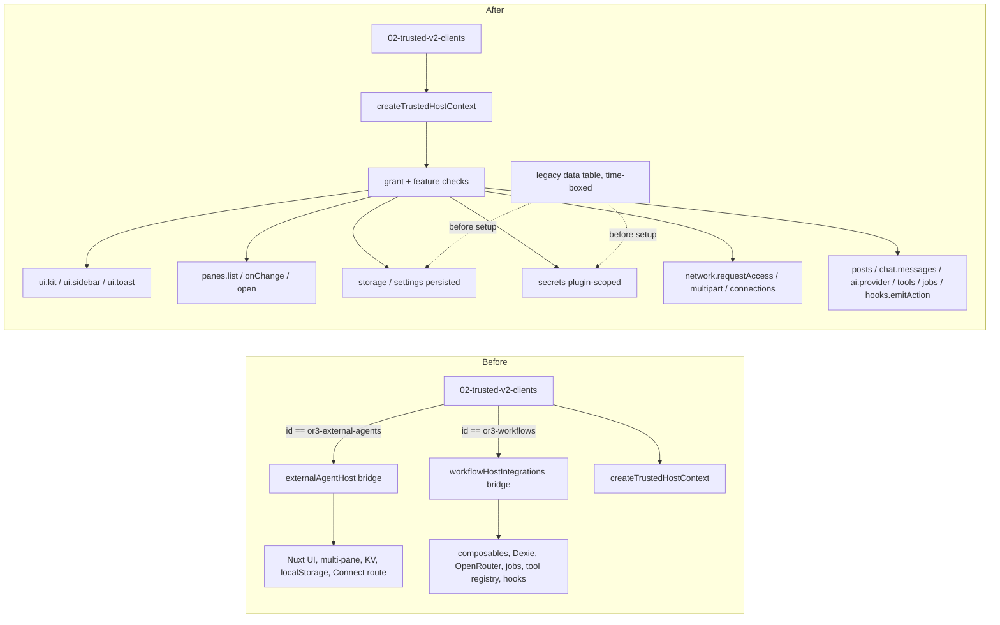

# Design

## Overview

Today `createTrustedHostContext()` builds a generic SDK context. `pluginContext()` in `app/plugins/02-trusted-v2-clients.client.ts` then adds a bridge object for two known plugin IDs. This design moves every bridge member into one of three places:

- an SDK capability that any trusted plugin can request;
- the plugin itself, where the member is plugin logic or a pure utility;
- deletion, where the member is dead or made redundant by host behavior.

The work lands in three slices that can each ship on their own:

1. **Shared foundation:** the UI kit, pane control, persistent storage and settings, and scoped secrets. Both plugins need these.
2. **External Agents cutover:** network access approvals, multipart upload, connections, workspace profiles and legacy data migration. Then the agents bridge is deleted.
3. **Workflows cutover:** records, chat messages, AI provider, tools, background jobs and hook emission. Then the workflows bridge and `pluginContext()` are deleted.

Agents goes first because its bridge is smaller and it carries the data migration.

## Architecture



Host rules that apply to every new client:

- Identity (plugin ID, workspace and activation generation) is captured by the host when the context is created. It is never taken from plugin input.
- Every method checks its grant at call time, rejects calls after its context has ended (`stale-context`), and registers disposal with the activation's existing `LegacyPluginScope` cleanup.
- New features are advertised only once fully implemented. There is one feature per slice, so that Agents can release before Workflows:
  - `or3-trusted-ui-kit-v1`: C2's kit.
  - `or3-trusted-host-v2`: C3–C6, which are toast/sidebar, pane control, persistent storage and settings, scoped secrets, access approvals, multipart, connections and profiles.
  - `or3-trusted-chat-records-v1`: C8.
  - External Agents requires the first two. Workflows requires all three.

## Bridge inventory

Each row is one member that a bridge hands to a plugin today. "Plugin" means the code moves into the plugin package. "Delete" means it is removed.

### External Agents (`externalAgentHost`)

| Member | Replacement | Component |
| --- | --- | --- |
| `ui.components` (16 entries) | `ui.kit.components`. `ClientOnly` moves into the plugin because it is a 6-line Vue component. | C2 |
| `ui.icon`, `ui.activeTheme`, `ui.chatInputTheme` | `ui.kit.icon`, `ui.kit.theme`, `ui.kit.chatInputTheme` | C2 |
| `ui.toast` | `ui.toast` | C2 |
| `ui.setActiveSidebarPage`, `ui.closeSidebarIfMobile` | `ui.sidebar.show`, `ui.sidebar.closeIfMobile` | C2 |
| `ui.panes.items/activeIndex/set/open` | `panes.list`, `panes.onChange`, `panes.open` with a target | C3 |
| `ui.panes.clearAgentPanes` | Delete. The host resets panes when a pane app is disposed. | C3 |
| `ui.limits` | `files.limits()` | C6 |
| `ui.connect.*` and the plugin's fetch of `/api/connect/environments` | `workspace.connections.status/list/remove` | C6 |
| `workspaceKv` (`external-agents.connections.v1`) | `storage` key `connections` | C4, C7 |
| `vaultStorage` (`or3.external-agents.credentials.v1`) | `secrets` key `vault`. The plugin keeps its own PIN encryption. | C5, C7 |
| `staging` | Plugin. Intern staging protocol code over `http.fetch` multipart. | C6 |
| `beginHostVerification` and the bridge's `authorizeDestination` | `network.requestAccess`, `network.revokeAccess` | C6 |
| `registerCodingProfile` | `ui.registerWorkspaceProfile` | C6 |

### Workflows (`ui.workflowHostIntegrations`)

| Member | Replacement | Component |
| --- | --- | --- |
| `workflowFeatures`, `workflowSlashEnabled`, `useOr3Config` | `settings` with host-configured defaults; `files.limits()` | C4, C6 |
| `records`, `searchWorkflows`, `reconcileInterruptedRuns`, `sendPorts.getWorkflowById/ByName`, `listWorkflowNames`, `getMessage`, `executionPorts.listWorkflowsWithMeta/loadConversationHistory`, `activity.store` | `posts` and `chat.messages`. The record helpers in `workflow-records-compat.ts` move into the plugin's `workflowLoad.ts`. | C8 |
| `ports.uiComponents`, `useIcon`, `useToast`, `useThemeOverrides`, `theme`, `useResponsiveState`, `messageAttachmentsGallery`, `streamMarkdown`, `useShikiHighlighter` | `ui.kit`, `ui.toast` | C2 |
| `useSidebarMultiPane`, `getGlobalMultiPaneApi`, `getWorkspaceResourceNavigationApi` | `panes` (including the core `chat` and `doc` targets) | C3 |
| `clearWorkflowPanes` | Delete (C3 reset) | C3 |
| `useActiveSidebarPage`, `getGlobalSidebarLayoutApi`, `closeSidebarIfMobile` | `ui.sidebar` | C2 |
| `useSidebarPostsApi`, `getPostsApi`, `usePostsList` | `posts` CRUD and `onChange` | C8 |
| `programmaticPrefill` | `chat.composer.prefill` | C8 |
| `markChatSendHandled` | `chat.send.markHandled` | C8 |
| `emitWorkflowState`, `emitNodeComplete`, `emitRunStart`, `emitRunComplete` | `hooks.emitAction` (allowlisted) | C8 |
| `modelSource`, `getModelCatalog`, `loadModelCatalog` | `ai.models()` with favorites, plus `ai.onModelsChange` | C8 |
| `getApiKey`, `requestApiKeyLogin`, `createOpenRouterClient`, `completeCaption` | `ai.provider()` and `ai.requestSignIn()`. Caption completion moves into the plugin. | C8 |
| `toolRegistry` | `tools.list`, `tools.execute` | C8 |
| `canStartBackground`, `trackBackground`, `abortBackground`, `backgroundStatus` | `jobs.*` | C8 |
| `startBackground`, `respondBackgroundHitl` | Plugin. They call its own `/api/plugins/or3-workflows/*` routes through `http.fetch`. | C6, C8 |
| `upsertWorkflowMessage`, `persistGeneratedImage` | `chat.messages.upsert`, `files.write` and `chat.messages.attachFile` | C8 |
| `reportError`, `notify` | `ui.toast` and `logger` | C2 |
| `parseHashes` | Plugin (pure utility) | — |
| `ports.workflowSlash` (`nuxtApp.$workflowSlash`) | Delete. Nothing provides it, and the plugin already overrides it. | — |

## Components and Interfaces

### C1. Context assembly and gates

- `02-trusted-v2-clients.client.ts`: delete `pluginContext()`, `AGENT_BRIDGE_GRANTS`, `WORKFLOW_BRIDGE_GRANTS` and the `setDestinationAuthorizer` plumbing. `definition.setup(trusted.context)` receives the generic context.
- Host features: add `or3-trusted-ui-kit-v1`, `or3-trusted-host-v2` and `or3-trusted-chat-records-v1` to the activation feature list (currently `['or3-trusted-host-v1', 'chat.send.prepare-commit-v1']`), each only after its components pass tests.
- Grant registry (`OR3_PLUGIN_V2_GRANT_REGISTRY`) and SDK `PluginGrant`:
  - Add `ui.workspace-profile.register`, `ai.provider`, `tools.use`, `jobs.background` and `hooks.emit`. Each is qualified for the trusted tier and given install-review copy.
  - Reuse existing grants for everything else: `ui.toast`, `ui.sidebar.register` (also covers `ui.sidebar.show`), `chat.read`, `chat.message.write`, `chat.editor.extension` (also covers `composer.prefill` and `send.markHandled`), `posts.*`, `settings.*`, `storage.*`, `secrets.*`, `files.*`, `workspace.connections.*`, `network.*`.
- `scripts/check-banned-imports.sh`: forbid `or3-external-agents`, `or3-workflows`, `externalAgentHost` and `workflowHostIntegrations` under `app/`, `server/` and `shared/`, except for this allowlist:
  - `app/core/workspace-profiles/builtins.ts`: the hidden-ID list.
  - The C7 legacy table.
  - The `OR3_WORKFLOWS_*` translation in `server/admin/config/`.
  - The plugin route mount prefix, if it is literal.
- Ledger and snapshots: refresh through `plugin-runtime:compatibility:check`.

### C2. UI kit, toast and sidebar navigation

`context.ui.kit` is present only when `or3-trusted-ui-kit-v1` is advertised and required.

```ts
interface PluginTrustedUiKitV1 {
  readonly components: Readonly<{
    UAlert, UBadge, UButton, UCheckbox, UDropdownMenu, UFieldGroup, UIcon, UInput,
    UModal, UPopover, USelectMenu, UTabs, UTextarea, UTooltip,
    ChatComposerShell, ChatMessage /* theme-resolved */, MessageAttachmentsGallery,
    StreamMarkdown, Scroll, SidebarEmptyState, SidebarGroupHeader
  }>; // typed as Vue `Component` from the vue peer
  icon(token: string): ComputedRef<string>;
  readonly theme: { readonly active: Ref<string>; overrides: typeof useThemeOverrides };
  chatInputTheme(closeIcon: Ref<string>): ChatInputThemeProps; // current bridge return shape
  readonly responsive: { readonly isMobile: Ref<boolean>; /* current useResponsiveState fields */ };
  highlighter(): ReturnType<typeof useShikiHighlighter>;
}
```

- `ChatMessage` is a `computed` component that resolves `theme.activeComponents['chat-message']` first, as the agents bridge does now. The kit object is built once per activation and frozen.
- Kit v1 means "the Nuxt UI 4 components and props as the host ships them". Breaking prop changes, including a Nuxt UI major upgrade, require `or3-trusted-ui-kit-v2`.
- `ui.toast(input)` maps to `useToast().add` and replaces the trusted context's `unsupported` stub. `confirm` and `progress` stay unsupported because neither plugin needs them.
- `ui.sidebar.show(pageId)` and `ui.sidebar.closeIfMobile()` wrap `setActiveSidebarPage` and `closeSidebarIfMobile`. `show` returns `not-found` for an unregistered page ID.

### C3. Pane control

- `panes.list()` returns `readonly { id, app, recordId?, active }[]`. The value of `app` is the pane mode: a registered pane app ID, or `chat` / `doc`. `panes.onChange(listener)` watches the multi-pane state and is disposed with the activation.
- `panes.open` gains `target: { pane: string }`, which sets the app and record in that pane. It also accepts the core apps `chat` and `doc` with `data.recordId`, through `getWorkspaceResourceNavigationApi`. This covers Workflows' thread and document navigation.
- **Reset on disposal:** the `unregisterPaneApp(id)` path used by the trusted runtime resets each pane with `mode === id`, using the reset both bridges perform today (mode `chat`, cleared thread, document and messages). This is core behavior, so it also fixes the problem for any future plugin.

### C4. Persistent storage and settings

- **Storage backend:** workspace KV rows named `or3.plugin.<pluginId>.storage.<key>`, holding `{ value, revision, updatedAt }`.
  - Reads and writes resolve the database captured at activation. They return `stale-context` after a workspace change, as `workspaceDb()` in the agents bridge enforces today.
  - Key and value validation and limits are reused from the existing memory storage. `list`/`listPage` use a prefix scan of the plugin's namespace.
  - CAS (`ifRevision`) is atomic within one Dexie transaction. Across devices, KV sync remains last-writer-wins.
- **Settings backend:** one KV row `or3.plugin.<pluginId>.settings`. Reads resolve in this order:
  1. persisted value;
  2. manifest schema default;
  3. host-configured default.
- **Host-configured defaults:** `resolve-config` produces `pluginSettingDefaults: Record<pluginId, Record<string, JsonValue>>`. The loader looks up the activating plugin's entry by ID; this is a map lookup, not a branch. The existing `OR3_WORKFLOWS_SLASH*` / `EXECUTION` flags, `appConfig.workflowSlashCommands` and `features.workflows.*` become the `or3-workflows` entry. `OR3_WORKFLOWS_ENABLED` keeps meaning "plugin enabled" (unified extraction 4.3).
- The memory implementations remain for the SDK test host only.

### C5. Scoped secrets and sign-out

- `createLocalStorageSecretStore` takes the plugin ID and stores entries as `or3.plugin.<pluginId>.secret.<key>`. It drops `EXTERNAL_AGENT_CREDENTIAL_VAULT_KEY` and its passthrough. Secrets are device-local and are not workspace-scoped, which matches the vault's behavior today.
- `logoutCleanup` replaces `preserveExternalAgentCredentials` with `preservePluginSecrets`:
  - Startup stale-session cleanup in `00-workspace-db.client.ts` passes `true`.
  - Observed sign-out and account change pass `false`. These remove every key matching `or3.plugin.*.secret.*`, plus any leftover legacy `or3.plugin.secret.*` keys. Neither shipped plugin writes those legacy keys, so they are deleted rather than migrated.
- The `ref`/`status` semantics are unchanged.

### C6. Network access, multipart, connections and profiles

- **Access approvals:**
  - `network.requestAccess({ origins, purpose })` shows a single host-owned modal listing the origins and the plugin's name. It resolves to `{ approved: string[] }`. Already-approved origins are returned without a prompt.
  - Approvals live in the host-owned KV row `or3.plugin-host.<pluginId>.network-approvals`. The plugin cannot address that namespace. `revokeAccess(origin)` removes an approval.
  - Accepted origins are `https:`, or `http:` on loopback. Credentials, query strings and fragments are rejected (the same rules as `approvedHostUrl()` today).
- **Authorization** in `trusted-mediation.ts`. A request is allowed when its origin matches any of:
  - a manifest-declared destination;
  - an approved origin;
  - a Connect environment origin returned by `workspace.connections.list()`, for plugins granted `workspace.connections.read`;
  - the host origin, when the path is under `/api/plugins/<pluginId>/`. This lets Workflows call its own routes, with session cookies included.
  - Path containment (`containsHostRequest`) is kept for approved base URLs.
- **Multipart:** the existing `{ kind: 'multipart', fields, files }` body gains `parts?: { name, filename, mimeType, data: Uint8Array }[]`. File refs resolve through the host file store. Total size is bounded by `maxFilesPerMessage × maxFileSizeBytes`, and the request honors `signal`.
  - The `.or3-upload-*` staging protocol moves from `external-agent-staging-bridge.ts` into the plugin unchanged. Batch naming, cleanup, and the 403/404/405 "unsupported" handling are preserved.
- **`files.limits()`** returns `{ maxFilesPerMessage, maxFileSizeBytes }` from `useOr3Config().limits`.
- **Connections:**
  - `workspace.connections.status()` returns `{ enabled, pairingUrl? }` from `runtimeConfig.public.connect` and `ssrAuthEnabled`.
  - `list()` maps `GET /api/connect/environments` into `PluginConnectionSummary`.
  - `remove(id)` posts to `/api/connect/environments/remove` with `X-Or3-Connect-Intent: remove`.
  - All three return `unsupported` when Connect is disabled.
  - `connect.vue`'s `or3:external-agents:refresh-cloud-hosts` event becomes the existing SDK `connections.changed` event.
- **Workspace profiles:** `ui.registerWorkspaceProfile(profile)` calls `registerWorkspaceProfile(profile, { source: { kind: 'plugin', id } })`, with the ID taken from the host. Collisions use the registry's existing rejection. The bridge's restriction to the `coding-workspace` ID is dropped.

### C7. Legacy data migration (time-boxed)

`app/composables/plugins/legacy-plugin-data.ts` holds a frozen, data-only table:

```ts
export const LEGACY_PLUGIN_DATA = {
  'or3-external-agents': {
    minStateVersion: 2,
    workspaceKv: { 'external-agents.connections.v1': 'connections' }, // -> storage key
    localStorage: { 'or3.external-agents.credentials.v1': 'vault' },   // -> secret key
  },
} as const;
```

The loader runs `migrateLegacyPluginData(descriptor)` after grant checks and before `setup()`. It runs only when the descriptor's `stateCompatibility.version >= minStateVersion`. For each mapping:

1. If the legacy entry is absent, skip it (already migrated, or never existed).
2. If the target is absent, write the legacy string as-is: the KV value becomes a JSON string storage value, and the vault becomes a secret string.
3. Read the target back. If it equals the legacy value, delete the legacy entry. If the target was already present (an interrupted earlier run), keep the target and delete the legacy entry only after the target reads back successfully.
4. On any error, leave the legacy entry, abort activation with `legacy-migration-failed`, and name the failed key. The next activation retries.

Scope and plugin-side behavior:

- KV mappings run per workspace on first activation in that workspace. KV sync propagates both the new row and the legacy deletion. The vault migrates once per device.
- After setup, the plugin calls `network.requestAccess` once with the origins of its migrated hosts. This is one prompt, and the host does not parse plugin data.
- External Agents raises `stateCompatibility` to `{ version: 2, reads: { minimum: 2, maximum: 2 }, rollback: 'unsupported' }`. The existing preflight then refuses a rollback to 0.1.x.
- A follow-up task deletes this module and its allowlist entry after the cutover release.

**Ways it can fail** (each must be covered by tests before the code is written):

- The legacy value is corrupt.
- The write throws because of quota or a closed database.
- The read-back does not match.
- The workspace switches during migration.
- Two tabs activate at the same time.
- Sync delivers the legacy deletion before the new row arrives.
- The vault is present but the KV entry is absent, or the reverse.
- The plugin is disabled mid-migration.
- A rollback is attempted afterwards.

### C8. Workflows capabilities

- **`posts`:** extend the mediated posts client to `get`, `list({ postType })`, `create`, `update`, `delete` and `onChange`. Writes are allowed only for a `postType` declared by a pane the plugin registered in this activation. Workflows registers its pane before running `reconcileInterruptedRuns`.
- **`chat.messages`:**
  - Methods: `get(id)`, `list({ type })`, `listByThread(threadId, { type? })`, `upsert({ id, threadId, streamId, data, pending })`, `updateData(id, data)` and `attachFile(id, fileRef)`.
  - Writes require `chat.message.write`. They only affect assistant rows whose `data.type` matches a message renderer the plugin registered. Each call asserts that the activation's database is current.
  - The upsert and attach transactions are moved verbatim from the bridge's `upsertWorkflowMessage` and `persistGeneratedImage`: clocks, ref counts, and ref release on failure. The six-image cap and the raster checks stay in the plugin.
- **`chat.composer.prefill(text)`** and **`chat.send.markHandled()`** require `chat.editor.extension`. `markHandled` is valid only inside an approved before-send hook callback.
- **`hooks.emitAction(name, payload)`** requires `hooks.emit` and uses a reviewed allowlist: `workflow.execution:action:start`, `:state_update`, `:node_complete` and `:complete`. These are the retained background-job contract.
- **`ai.models()`** gains `favorite` flags. `ai.onModelsChange(listener)` watches `modelStore.favoriteModels` and the catalog.
- **`ai.provider()`** requires `ai.provider`. It returns `{ client, apiKey, headers }` from `createOpenRouterClient` and `DEFAULT_HEADERS`, or `not-signed-in`. `ai.requestSignIn()` dispatches the existing `openrouter:login` event.
  - This deliberately exposes the user's key to a trusted plugin. The grant's review text says so. Trusted code can already read it, so the grant documents an existing capability rather than adding one.
- **`tools.list()`** and **`tools.execute(name, args, { signal })`** require `tools.use`. They wrap `useToolRegistry()` and respect the user's enabled-tool state.
- **`jobs`** requires `jobs.background`:
  - `available()` checks the existing background-streaming and session conditions in `canStartBackground`.
  - `track({ jobId, threadId, messageId })` calls `ensureBackgroundJobTracker`, with the activation database and the host-derived user.
  - `abort(jobId)` and `status(jobId)` wrap the existing helpers.
  - Starting jobs and HITL responses use the plugin's own routes through C6.

### C9. Plugin adapters

- **External Agents:** delete `createAgentHostPorts` and the `AgentHostPorts` cast. Replace `setAgentHostUiPort(ports.ui)` with a port built from `context.ui.kit`, `ui.toast`, `ui.sidebar`, `panes` and `files.limits()`.
  - `BrowserExternalAgentCredentialVault` keeps its synchronous `CredentialStorage` interface. Its adapter loads the `vault` secret during setup and writes through asynchronously; write failures surface as a toast.
  - Persistence reads and writes `storage` key `connections`. `transport.ts` uses `workspace.connections.list`.
  - Requires `or3-trusted-ui-kit-v1` and `or3-trusted-host-v2`. Bump to a new version with state version 2.
- **Workflows:** replace `requireHostIntegrations` with the declared required features. Build `installWorkflowHostPorts` and `installWorkflowExecutionPorts` from SDK clients, and move the record compatibility helpers in. Require all three features and the new grants, then bump the version.
- Both: `or3-plugin validate` must report no host aliases (`~/`, `#imports`, `@nuxt/ui/*`) or private context properties.

### C10. Documentation and release

- Plugin authoring guide: trusted UI kit, persistent storage, settings defaults, scoped secrets, access approvals, connections, profiles, records, AI provider, tools, jobs, hook emission.
- `public/_documentation/` via `docmap.json`, including `architecture/activity-external-agents.md`. Both plugin READMEs.
- SDK and plugin versions, per `docs/releasing.md`.

## Data Models

| Store | Key | Scope | Synced | Owner |
| --- | --- | --- | --- | --- |
| Workspace KV | `or3.plugin.<id>.storage.<key>` → `{ value, revision, updatedAt }` | plugin + workspace | yes (KV) | plugin through `storage` |
| Workspace KV | `or3.plugin.<id>.settings` → `Record<string, JsonValue>` | plugin + workspace | yes | plugin through `settings` |
| Workspace KV | `or3.plugin-host.<id>.network-approvals` → `{ origins: string[] }` | plugin + workspace | yes | host only |
| localStorage | `or3.plugin.<id>.secret.<key>` → string | plugin + device | no | plugin through `secrets` |
| Runtime config | `pluginSettingDefaults[<id>]` | deployment | n/a | host config |

Legacy keys are removed by C7 once their copies are verified: KV `external-agents.connections.v1`, and localStorage `or3.external-agents.credentials.v1`.

## Error Handling

- New clients return `PluginResult` codes: `permission-denied`, `stale-context`, `not-found`, `conflict`, `invalid-input`, `unsupported`, `host-unavailable`, `not-signed-in`, `aborted`. Messages must be safe to show.
- A missing required feature fails activation before `setup()` with the existing unsupported-feature reporting. Activation never succeeds partially.
- Migration failure aborts activation with `legacy-migration-failed` and leaves legacy data intact (C7).
- A declined access request resolves with that origin omitted; it is not an error. Later fetches to the origin return `permission-denied`.
- Vault write-through failures are shown to the user. The in-memory vault is not rolled back silently.

## Testing Strategy

The primary proof is end-to-end against installed packages, following AGENTS.md:

- Extend `tests/e2e/external-agent-visual.spec.ts` and `tests/e2e/workflows-installed.spec.ts`. They run against disposable hosts with the new package versions installed, using `OR3_AGENT_INSTALLED_TEST_HARNESS` and `OR3_WORKFLOW_INSTALLED_TEST_HARNESS`.
- They cover today's journeys, plus:
  - the legacy-data upgrade, by seeding 0.1.1 data, upgrading, and reaching connected hosts with no re-pairing;
  - the one-time access prompt;
  - disable resetting open panes;
  - toast and sidebar navigation;
  - a background workflow run with HITL.
- They produce screenshots, a JSON parity report against the pre-change baseline, and the package digests under `output/playwright/`. Together these are the repeatable artifact.

Isolated tests are used only where a destructive or security behavior must be pinned. In each case, write the failure list first:

- C7 migration: the failure list in C7.
- C5 sign-out: preserve versus remove, cross-plugin collisions, the legacy prefix.
- C6 authorization: approved and unapproved origins, own-route versus other-plugin routes, credentials in the URL, path containment, Connect origins after disconnect, multipart limits.

Add these cases to the canonical suites: `trusted-host-context.test.ts`, `logout-cleanup.test.ts`, `workspace-db-logout.test.ts`, and `tests/integration/trusted-plugin-contracts.test.ts`. Delete `external-agent-staging-bridge.test.ts` together with the module. Its cases move to the plugin's `src/client` tests.

Plugin package suites (`bun run test`, `typecheck`, Workflows `test:routes` and `test:continuity`, and `built-smoke.test.ts`) must pass against the new ports.

## Design Decisions

- **Real components through a versioned kit, not host-rendered DTO primitives.** Trusted plugins share the host's Vue instance, so a kit is a small change that preserves pixel parity. DTO primitives (`plugin-host-sdk` 6.2) remain the path for isolated plugins and are not required here.
- **One kit feature version tied to the Nuxt UI prop API.** This is honest about the coupling, and it makes a future break explicit through `-v2` instead of letting it fail silently.
- **Hard cutover.** Neither plugin is published, so keeping bridges and SDK paths side by side would be compatibility machinery with no consumer.
- **A host-run, data-only migration table.** Two alternatives were rejected. A permanent SDK "read legacy key" capability would leave surface behind for a one-time need. A manifest `legacyData` field would add schema for a single plugin. The table is small, auditable and scheduled for deletion.
- **A consent prompt for migrated origins, instead of the host parsing plugin data.** The host stays ignorant of the plugin's storage format, and the user explicitly approves network reach once.
- **Write scope derived from registered panes and renderers.** This adds no new manifest field, and it matches what each plugin already declares and renders.
- **Storage in workspace KV.** It reuses sync, workspace scoping and logout database cleanup. The agents connection list already lives there, so its behavior does not change.
- **Device-local, plugin-scoped secrets that are not workspace-scoped.** This matches the vault today and the sign-out semantics users already have.

## Risks & Mitigations

| Risk | Mitigation |
| --- | --- |
| The Workflows surface is large and touches chat persistence. | Ship it as its own slice after Agents. Move transactions verbatim. Continuity and installed E2E gates. |
| Migration loses credentials. | Copy, read back, then delete. Legacy data stays on any failure. Failure-list tests. Rollback refused by state version. |
| Cross-device storage revisions conflict. | Document CAS as per-device. The data involved is today already synced last-writer-wins. |
| A Nuxt UI upgrade breaks plugin UIs. | Kit v1 pinned to the current props. A kit `-v2` feature is required for breaking changes. Installed E2E screenshots. |
| The hook emit allowlist grows into a back door. | Fixed allowlist in host code. Additions need review and a contract-snapshot update. |
| A plugin keeps a hidden host import. | `or3-plugin validate` alias rejection and the `check-imports` ID rule. |
| An access prompt at upgrade confuses users. | Single batched modal naming the plugin and origins. Copy reviewed in the E2E screenshot. |
