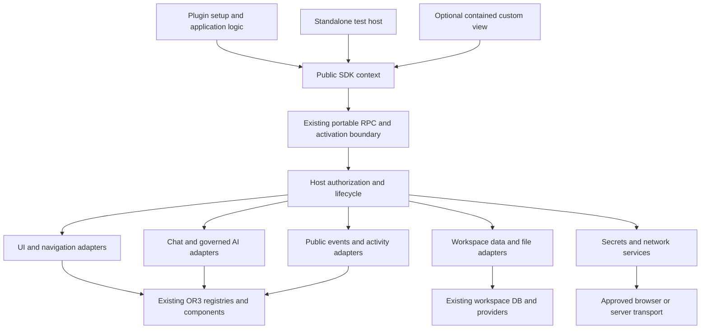

# Design

## Overview

The product is one authoring experience backed by the existing OR3 host. A developer declares a manifest, implements `setup(context)`, registers UI/commands, and calls typed services. The SDK hides wire formats and host integration; the host retains authorization, resource ownership and lifecycle control. A method is complete only when an independently built, installed package can use it.

Deliver in four usable milestones:

1. **An installed application:** a scaffolded plugin opens two independent panes from a sidebar and command, persists state and passes the same tests in the test host and real portable runtime.
2. **An integration application:** secrets, selected files, HTTP, streaming, workspace events and Activity work together against a deterministic external service. Chat/model extensions are completed on the same foundation.
3. **Standalone Agents:** the existing product moves behind the public API with credential/data migration and behavior parity. No requirement to launch the custom-UI profile before Agents can ship through host-rendered conversation primitives.
4. **General availability:** the contained custom-UI path passes its separate feasibility/security gate, a non-agent rich application passes qualification, documentation matches production, and standalone SDK distribution is qualified. Completing milestone 3 alone does not complete this entire plan.

This sequencing delivers useful functionality early while exposing difficult integration boundaries before removing the bundled Agents implementation.

## Architecture



Named components and their responsibilities:

| Component | Responsibility | Requirements |
| --- | --- | --- |
| **SDK Context** | Typed authoring facade, result normalization and feature discovery | R1, R3–R15 |
| **Activation Boundary** | Host-issued identity, reviewed authority, registration commit and disposal | R1, R2, R12 |
| **Surface Adapters** | Render/dispatch plugin UI and palette contributions through host registries | R3, R5, R14, R15 |
| **Pane Navigation** | Instance identity, routing, layout persistence and per-pane delivery | R4 |
| **Plugin Data** | Scoped storage and validated settings | R6, R7 |
| **Secret Custody** | User-scoped credentials, locking, references and rotation | R8 |
| **File Access** | Selected/workspace file references, chunk transfer and host writes | R9 |
| **Network Transport** | Approved HTTP/stream/WebSocket transport and connection discovery | R10, R11 |
| **Public Events** | Stable workspace/domain lifecycle payloads | R7, R12, R14 |
| **Chat and Models** | Adapt existing chat, tools, editor actions and governed model services | R13, R14 |
| **Activity Projection** | Adapt plugin-owned operation state into the existing Activity registry | R15 |
| **Test Host** | Run real SDK dispatch with deterministic external boundaries | R1, R16 |
| **Authoring Toolchain** | Scaffold, validate, bundle, preview, package and document public capabilities | R1, R17 |
| **Agents Migration** | Move Agents code/data to the SDK and prove parity | R18 |

### Current implementation versus required integration

Paths below are relative to the repository root; these are implementation seams, not proposed public imports.

| Existing evidence | What it establishes | Planned action |
| --- | --- | --- |
| `packages/plugin-sdk/src/{contracts,host,clients,results}.ts` | Context, grants, results, storage/settings contracts; no complete context for the proposed services | Extend these contracts; keep a single public result model |
| `packages/plugin-sdk/src/portable-runtime.ts` | Portable `setup()` is actually called; hooks explicitly throw unsupported | Build context services here and normalize transport errors; do not start a competing runtime |
| `app/composables/plugins/portable-client-runtime.ts` | Working scoped KV/settings and real sandbox integration | Bind persistence to the captured workspace, add production service adapters |
| `server/admin/plugins/v2-host-capabilities.ts` | Qualified grant registry exists | Expand each entry only with its installed-package proof; report methods/profile support as well as grants |
| `shared/plugins/isolation/{host-rpc-broker,capability-bridge,rpc-envelope,budgets}.ts` | Authority checks, server bridge, 256 KiB envelopes and a default 120-second activation budget | Extend bounded streaming protocol and long-lived application policy without weakening short-operation limits |
| `packages/plugin-sdk/src/{ui,portable}.ts`, `app/composables/plugins/{portable-pane,portable-tools}.ts` | Host-rendered workspace UI and client tools exist | Add typed registrations and independent pane routing; reuse current primitives and tools |
| `shared/plugins/contribution-surfaces.ts`, existing surface adapters | Host already has pane/sidebar/action/editor registries | Complete marketplace mapping, visibility, handlers and cleanup instead of adding registries |
| `server/utils/plugins/connections/`, `shared/plugins/connections/contracts.ts` | Credential encryption, scoped stores, provider operations and consent already exist | Reuse custody/policy; add declared generic destinations without requiring a host provider per external service |
| `app/core/external-agents/credentials.ts` | Memory-first vault with optional PIN-encrypted browser persistence and injectable vault | Move the behavior behind Secret Custody; preserve unlock/migration semantics |
| `app/core/activity/{contract,registry,timeline}.ts` | Bounded projection with canonical sources and result types | Define SDK-owned DTOs and map them; do not expose internal contracts by re-export |
| `packages/plugin-sdk/src/testing.ts`, existing SDK/portable tests | Two useful test-host implementations | Share validators and expose one recommended `createTestHost()` entry point |
| `app/plugins/external-agents.client.ts` and `app/components/external-agents/` | Private imports extend beyond entry-point setup into UI, auth, config, Connect routes and navigation | Audit and migrate the entire dependency graph |

Some documentation describes older V2 rollout limitations. The implementation status above is deliberately per path: do not infer that all V2 UI is missing, or that every contract is production-ready. Update those documentation distinctions as each capability is qualified; do not present proposed APIs as available today.

## Components and Interfaces

### 1. SDK Context and Activation Boundary

Use `PluginResult<T>` for asynchronous host operations. Add narrowly defined `unsupported`, `locked` and `stale-context` codes to the existing set; cancellation stays `aborted`, permission refusals stay `permission-denied`, and capacity/backpressure refusals use `quota-exceeded` with a safe reason. Normalize portable/RPC codes at one boundary, preserving retryability and correlation metadata. Keep the transport's internal envelope representation private.

Registration methods return the existing disposable-handle shape synchronously. They stage metadata/handler bindings during setup; the host acknowledges the complete registration batch before reporting activation ready. Unsupported, conflicting or unauthorized registrations fail setup. Runtime callbacks return results; host disposal is idempotent and does not depend on cooperative plugin cleanup. An activation owns all operation controllers and child handles; a pane owns its mounted subscriptions, not automatically every background operation of the plugin.

The public context remains approximately:

```ts
interface PluginContext {
  readonly pluginId: string;
  readonly generation: number;
  readonly signal: AbortSignal;
  readonly features: PluginFeatureNegotiation;
  readonly grants: ReadonlySet<PluginGrant>;
  readonly ai: AiApi;
  readonly ui: UiApi;
  readonly panes: PanesApi;
  readonly commands: CommandsApi;
  readonly chat: ChatApi;
  readonly workspace: WorkspaceApi;
  readonly storage: StorageApi;
  readonly settings: SettingsApi;
  readonly secrets: SecretsApi;
  readonly files: FilesApi;
  readonly http: HttpApi;
  readonly network: NetworkApi;
  readonly activity: ActivityApi;
  readonly events: EventsApi;
  readonly logger: PluginLogger;
  onCleanup(callback: () => void | Promise<void>): void;
  onActivate(callback: () => void | Promise<void>): void;
}
```

This is a proposed interface sketch, not an exhaustive replacement declaration. Retain current version/trust identity and existing compatibility members. Do not expose a generic `context.internal.call()` escape hatch. Existing low-level portable helpers may remain supported for their current profile, but new examples use typed services.

Feature discovery answers **host implementation support**. Grants answer **approved access**. Provider readiness answers **current service availability**. Keep all three distinct. Required capabilities fail preflight; an optional unsupported namespace returns `unsupported`. Add capability descriptors to the existing host capability registry, including methods, limits, profiles and qualification evidence. Do not build another registry/code-generation framework.

Suggested grant families are `ui.*.register`, `panes.open`, `commands.run.public`, `secrets.read/write/use`, `files.pick/read/write`, `network.stream/connect`, `workspace.connections.read`, `chat.read/write`, `activity.register` and permission-specific event subscriptions. Reuse existing grants where their meaning matches. Assign exact names in the first contract change and test their review/compatibility impact; never enable a method merely by adding a grant string. AI's current `network.http` gate is preserved until a separately reviewed grant refinement is warranted.

### 2. Surface Adapters and Pane Navigation

```ts
type PaneOpen = {
  app: string;
  data: PluginJsonValue;
  instanceKey?: string;
  target?: 'focus-or-new' | 'new' | 'replace-active';
};
interface PanesApi {
  open(input: PaneOpen): Promise<PluginResult<{ id: string }>>;
  focus(id: string): Promise<PluginResult<void>>;
  close(id: string): Promise<PluginResult<void>>;
}
```

`ui.registerPane`, `ui.registerSidebar`, `ui.registerCard` and `ui.registerAction` are typed wrappers over current contributions. IDs are plugin-namespaced. An app registration declares a data schema/version and mount handler; the SDK binds callbacks locally to opaque handler IDs. Functions, Vue components and DOM nodes never cross RPC. Commands use the same handler routing, cancellation and action authorization.

Every pane mount carries `{paneId, appId, data, signal}`. Rendering and UI events carry that pane ID, validated against the activation. Deduplicate `focus-or-new` by `(workspace, plugin, app, instanceKey)`; omitted keys create a new instance. `replace-active` uses existing unsaved-work and pane-limit policies. Persist only `{app, dataVersion, data, instanceKey}` in host layout state. Validate restore data and show the host's unavailable-plugin placeholder if the app is absent; never guess a new record. Opening two distinct sessions is mandatory qualification, correcting today's single-selected-list portable behavior.

Host-rendered UI grows only where concrete workflows need it: transcript messages/tool events, streaming text, composer submit/cancel, selected attachments, model choices, approval prompts and bounded progress. Adapt current ChatMessage/composer/theme behavior inside the host. Publish plain DTOs and renderer primitives, not wrappers that still require private component imports. Standard buttons, cards and forms continue to use existing UI primitives.

**Custom UI:** add a separately versioned, opt-in isolated application profile for bundled view assets. Its app code owns only its contained document and may bundle Vue or another browser library; it uses the same SDK bridge for host data and actions. It receives theme tokens and resize/focus messages, never the host framework singleton. Extend the current CLI bundler with verified package assets and allow bundled dependencies in this profile; do not silently relax the dependency-free portable profile.

Before implementation commits to browser frames, run a small feasibility gate on each supported engine: parent access, self/top navigation, meta-refresh, URL exfiltration, forms, popups, network, workers, storage, imports and resource loading. A sandbox/CSP declaration alone is not evidence that arbitrary view code is contained. Packaged scripts/styles/fonts/images must use a host-verified digest-bound resource path with no remote resolution; use host-mediated external-link and file-picker actions. Reject an unqualified browser/profile. If the gate cannot preserve the required containment, keep that profile unavailable and record the blocking result; do not claim general availability or substitute trusted-host execution. This risk is explicit rather than hidden behind the promise of arbitrary UI.

### 3. Plugin Data and Public Events

Use current KV/settings adapters with a host-captured workspace DB/service reference. Never look up the globally active DB halfway through an asynchronous write. Storage values remain JSON; add optional revision metadata on reads and `ifRevision` on writes. CAS is atomic in the active local store, protecting overlapping tabs. It does not promise globally linearizable writes across disconnected sync replicas; retain and document host sync conflict semantics. Paginate listing with stable opaque cursors, enforce total/value/key quotas, and publish the limits. Blob data belongs in Files.

Keep existing settings schemas workspace-scoped. Add an explicit schema scope for user preferences, with schema defaults and authorization determining which fields a member may edit. User settings are `(user, workspace, plugin)` scoped; they do not overwrite admin configuration. `delete` resets to schema default and has matching production/test behavior. Secret fields initiate Secret Custody UI rather than pass through the settings store.

`workspace.id` is fixed for an activation. On a committed switch, stop admission for the old context, emit a best-effort `workspace.changed` notice, abort its resources, then activate the plugin for the new scope after host workspace initialization. The new setup receives its initial snapshot, so a missed event is harmless. Failed/cancelled switches retain the old scope. `workspace.switch(id)` requests the existing authorized host flow; it does not select the authority for a storage call.

Expose a typed, versioned public event map: `workspace.changed`, `settings.changed`, `chat.created`, `chat.message.created`, `connections.changed` and `host.resumed`. Payloads contain IDs/revisions by default; message content requires chat-read authority. Events are live, ordered within their source generation, and not a durable replay log. Subscribers needing recovery fetch a fresh snapshot. Existing internal hooks/filter functions are not automatically public; a synchronous internal hook cannot be translated into asynchronous RPC without explicitly defining timeout and fallback semantics.

### 4. Secret Custody

```ts
interface SecretsApi {
  get(key: string): Promise<PluginResult<string | null>>;
  set(key: string, value: string, options?: {
    persistence?: 'session' | 'remember';
  }): Promise<PluginResult<void>>;
  delete(key: string): Promise<PluginResult<void>>;
  ref(key: string): Promise<PluginResult<{ id: string; revision: number }>>;
  unlock(): Promise<PluginResult<void>>; // host-owned interaction
}
```

Use host-owned memory as the browser default and migrate the existing encrypted remembered-vault behavior behind a service. Reuse the connection-store encryption/provider registry for server custody where supported; expose durability/lock status truthfully. Do not promise a hardware-backed browser vault. Unlock input and encryption keys remain in host UI/services. Persist ciphertext in a dedicated secret store, never ordinary plugin KV/settings or general sync/export records. Define owner/plugin/workspace association even for local mode, and never carry a local secret into a newly authenticated identity silently.

`get()` deliberately permits plaintext for a plugin's own secrets when separately approved; this is real authority, not an assertion that plugin code cannot leak what it can read. Default starter flows use `ref()` or host-managed credential entry and `secrets.use` instead. Existing provider-managed connections never become exportable through this API. Restrict injection to an approved connection/destination and fixed allowed header scheme, clear decrypted memory on lock/sign-out, and revalidate revisions for new requests/reconnects. Delete/lock cancels affected active operations. Avoid logging secret-bearing call parameters before redaction.

Migration is host-owned: import a remembered legacy token only after successful unlock, copy to the scoped store, verify retrieval/reference resolution, then record completion. Preserve the old encrypted entry for the supported rollback window; never overwrite a newer destination revision on retry. Review the inherited PIN/key lifecycle before advertising persistent custody, including wrong-PIN, corrupted ciphertext, recovery and explicit deletion tests.

### 5. File Access

```ts
type PluginFileRef = { id: string; name: string; mimeType: string; size: number };
interface PluginFileRead extends AsyncIterable<Uint8Array> {
  readonly result: Promise<PluginResult<void>>;
  cancel(): void;
}
interface FilesApi {
  pick(options?: { multiple?: boolean; accept?: readonly string[] }):
    Promise<PluginResult<readonly PluginFileRef[]>>;
  read(id: string, options?: { signal?: AbortSignal }):
    Promise<PluginResult<PluginFileRead>>;
  write(input: { name: string; mimeType: string; data: AsyncIterable<Uint8Array>;
    replace?: { id: string; ifRevision: number } }, options?: { signal?: AbortSignal }):
    Promise<PluginResult<PluginFileRef>>;
}
```

These are SDK-local objects; serialize bounded chunk/control messages, not async iterators. Mid-read failure closes the iterator and settles `result` as an error, so partial bytes cannot be mistaken for a complete file. A selected-file handle conveys only that selection. A persistent workspace file ID requires read authority on each access. The host maps to current upload/storage services, file metadata and attachment reference accounting. Picker cancellation returns `aborted`; a successful empty selection is not fabricated. Expose count/size/content-type limits for UI validation, but enforce again on host ingestion. MIME claims are metadata, not evidence that bytes are safe to render.

Use bounded chunk pull/acknowledgment below the existing 256 KiB envelope ceiling; never base64 an entire upload into a single RPC. Partial uploads stay staged until commit, are cancelled on teardown, and do not create visible broken file records. The same transfer primitive supports multipart transport and external-agent file staging. Remote staging directories and cleanup remain in the Agents protocol adapter, including preserving accepted-run attachments and reporting ambiguous cleanup failures.

### 6. Network Transport

An approved destination declares exact origin, allowed methods/path prefixes, credential binding and reachability (`browser` or `server`). A plugin can ship a declaration for an ordinary API without asking OR3 to implement a provider. The host reviews the authority; adding a URL at runtime does not approve it. User-configured agent endpoints go through the existing setup/connection consent flow and are bound to their approved origin.

`http.fetch({url, method, headers, body, destination, signal})` returns `PluginResult<HttpResponse>` with status/headers and bounded body access. Support JSON, text, bytes, selected-file multipart fields and raw streaming response bodies. Do not forward host cookies, session headers or arbitrary internal paths. Redirects default to refusal; any supported redirect is revalidated and never forwards credentials across origins. Server transport must validate resolved addresses/ports, prevent DNS rebinding/address changes at connection time and reject metadata/private targets unless a narrowly configured operator-approved endpoint permits them. Browser-local connections stay browser-mediated and remain subject to CORS, mixed-content and browser private-network restrictions; do not route them through server localhost as a fallback.

Offer `http.asFetch({destination})` as a narrowly supported standards adapter because `@or3/intern-client` already accepts injected `fetch`. It reconstructs `Request`/`Response`/stream behavior in the SDK, handles FormData and abort, and converts refusal results into the appropriate fetch exception. Document unsupported browser fetch options; test the actual client package. Host transport handles bytes and policy, while the existing intern/runs clients retain protocol-specific payload parsing. When such a client owns SSE retries, the underlying raw-body adapter disables host automatic retries to prevent double reconnect/replay.

```ts
type StreamOptions = {
  url: string;
  destination: string;
  format: 'sse' | 'bytes';
  method?: 'GET' | 'POST';
  headers?: Readonly<Record<string, string>>;
  body?: HttpBody; // same validated text/JSON/byte/file body types as http.fetch
  signal?: AbortSignal;
  reconnect?: false | { maxAttempts: number; resume: 'last-event-id' };
};
interface NetworkApi {
  stream(input: StreamOptions): Promise<PluginResult<PluginStream>>;
  connect(input: { url: string; destination: string; protocols?: readonly string[];
    signal?: AbortSignal }): Promise<PluginResult<PluginSocket>>;
}
// PluginStream: metadata + async chunks/events + terminal result + cancel().
// PluginSocket: bounded send(), incoming iterator, terminal result and close().
```

Start with SSE/raw bytes because Agents needs them; deliver WebSocket support before claiming R11 complete. Opening an operation uses ordinary short RPC; the resulting host-issued stream ID is tied to activation, owner, destination and credential revision. The SDK facade handles pull/ack/cancel messages. Enforce per-chunk, queued-byte, simultaneous-connection, idle and rate budgets in the existing ledger. On a slow consumer, stop reading upstream when possible and terminate with a typed overflow when not; do not drop arbitrary application bytes.

SSE parsing handles CR/LF boundaries, split UTF-8, multiline data, IDs and heartbeats. Maintain a bounded recent-ID window for duplicate suppression only when IDs exist. Default reconnect is off; opt-in GET reconnect uses bounded backoff and Last-Event-ID, rechecking authority each time. Non-idempotent POST and WebSocket send operations are never automatically replayed. SDK helpers can accept protocol-specific resume handling later when an actual consumer requires it, rather than inventing a universal resume protocol now.

The present 120-second activation wall budget and lifetime output/call totals are incompatible with an all-day application. Define a qualified long-lived application feature: retain bounded setup/callback execution, message size, concurrent work and AI spend; use rolling transport/call limits and bounded stream windows while the host session remains valid. Do not reset spend, forget revocation or accumulate unlimited buffers when a window rolls. Test beyond two minutes with injected time plus one real-duration smoke. Connection/session loss tears down streams; reconnection obtains fresh host authority and restores from canonical provider state.

Cloud connection discovery belongs at `workspace.connections.list()` as a safe capability-specific projection, returning opaque references and non-secret capability/status metadata. `workspace.connections.manage(ref)` opens the host-owned management UI for authorized removal/configuration. This covers Agents' current `/api/connect/environments` and removal calls without providing a same-origin HTTP backdoor. Host auth/config readiness becomes feature/status data and `connections.changed`, not a plugin import of runtime config or session composables.

### 7. Chat and Models, Activity Projection, diagnostics

`ai.models()` and `ai.complete()` adapt existing `listHostModels`/`completeWithHostModel`. Add `ai.stream()` through the shared stream lifecycle only with the same allowlist, accounting and host-owned credentials. Return model capabilities and real usage; don't claim providers support arbitrary multimodal inputs. Preserve error distinctions when normalizing RPC results.

`chat.create`, `chat.open`, `chat.appendMessage`, `chat.registerTool` and `chat.registerAction` use current chat services and admission checks. Appending has a caller-stable request ID for retry safety; provider-specific remote conversations remain Agents-owned, not duplicated as OR3 chat rows. Public DTOs reference files by ID. Editor action/inspector/document-AI contributions use `ui.registerAction`/typed contribution definitions under the existing namespace tree. Arbitrary TipTap extensions are not smuggled into the host from an isolated package; report the capability as unsupported until a separately qualified execution contract exists.

`activity.registerSource` accepts SDK-owned summaries/details/action handlers mirroring the current projection concept. Scope IDs and callbacks to plugin/workspace, bound list/detail/event payloads, and reuse terminal-state/deduplication logic. Closing an agent pane does not cancel a run still owned by the plugin's Activity source; unloading the plugin disconnects observation without claiming the remote run stopped. Remote cancel/approve failures retain canonical state. Host approval actions use the existing approval mechanism; `ui.confirm()` is only a generic dialog.

`ui.toast`, `ui.confirm` and `ui.progress` use host UI; progress returns an update/dispose handle and is tied to its operation. Logger/inspector uses existing redaction and request correlation, includes safe capability/refusal information and excludes content by default. No new analytics pipeline is needed.

### 8. Test Host and Authoring Toolchain

Make `createTestHost` the recommended ergonomic entry point over the real context and portable dispatch, extending `createPortableTestHost` rather than writing a third permissive simulator. Extract only validators/lifecycle logic that genuinely need to be shared. Host persistence/network/UI remain injected boundaries. Test-only inspectors are scoped helpers, not production context APIs.

```ts
const host = createTestHost({
  workspaceId: 'workspace-a',
  approvedGrants: exampleGrants,
  network: fakeService,
});
const installed = await host.install(myPlugin);
expect(installed.ok).toBe(true);
const result = await host.commands.run('example.open');
expect(result.ok).toBe(true);
expect(host.ui.panes()).toHaveLength(1);
expect(await host.forPlugin('example').storage.get('sessions'))
  .toEqual({ ok: true, value: expectedSessions });
await host.workspace.switch('workspace-b');
expect(host.resources.activeFor('workspace-a')).toBe(0);
```

Include failure injection, fake time, selected files, locked vaults, transport recordings and mid-stream disconnects. Defaults deny undeclared grants and unconfigured calls. Conformance scenarios run against both this host and a real installed fixture so a pleasant fake cannot certify a nonfunctional production contract.

Keep the CLI's current create/validate/test/build/pack/inspect flow. Add preview/watch only by extending existing candidate tooling; on reload dispose the prior activation and label development packages correctly. Start with two templates/recipes: command + pane + storage, and external service + secret + file + stream. Add the custom-view template when its profile is qualified. Validate from packed artifacts in an empty directory, with no OR3 aliases, private imports, sibling packages or local configuration. Publication remains a distinct documented release activity.

### 9. Agents Migration

Inventory the complete graph, not just `external-agents.client.ts`:

| Current dependency | Replacement |
| --- | --- |
| DB workspace getter/subscription and persistence binding | `workspace` lifecycle and scoped `storage` |
| Agents memory/PIN vault | `secrets` plus host unlock/credential-entry UI |
| Intern/runs transport and driver detection using raw fetch | Injected mediated fetch/stream transport |
| File inputs and remote multipart upload | `files` plus mediated multipart; retain remote staging logic |
| Pane/sidebar/palette/activity registries | `ui`, `commands`, `activity` |
| Global multipane API and encoded session routing | `panes` with per-session instance data |
| Private ChatMessage/composer/theme/icon/config imports | Public host-rendered conversation primitives and host limits |
| Session watchers, visibility listeners, Cloud inventory/removal endpoints | Public lifecycle events and `workspace.connections` management |

Move pure protocol/controller/presentation logic into the standalone package with relative imports. Keep transport, persistence and clock dependencies injected. Migrate adapters first while bundled Agents remains the single owner, run parity, then build/install the external package. A host-owned idempotent migration copies `external-agents.connections.v1` and credential associations into the new scope only when safe. Keep a receipt of source revision, target revision and verification; never run both registries simultaneously. If new plugin state cannot be read by the prior implementation, say so and retain it; do not pretend package rollback replays remote agent actions or rolls back data.

## Data Models

Reuse existing stores. These are logical records; do not expose physical table names in SDK types.

| Record | Key and relevant fields | Persistence and access pattern |
| --- | --- | --- |
| Plugin value | workspace + plugin + key; JSON, revision, bytes, updatedAt | Existing KV adapter; prefix listing and CAS transaction; reuse existing name index |
| Plugin setting | workspace + plugin + schema version; optional user scope | Existing settings service plus scoped user preferences; schema/role validated reads and writes |
| Secret | user + workspace + plugin + key; encrypted value/reference, credential revision, persistence mode | Dedicated vault/connection provider store; lookup by full owner key; never ordinary plugin export |
| File reference | file ID plus host-owned access/selection record, size/type/revision | Existing file metadata/provider; ephemeral selection grants held by activation, persistent file refs reauthorized |
| Pane state | existing layout pane ID; app, plugin, dataVersion, JSON data, instanceKey | Existing layout persistence; no plugin-owned duplicate tab store |
| Active stream/socket | opaque operation ID, activation, owner, destination, credential revision, queue/accounting | Memory only, bounded, removed at terminal state/teardown; no stream database |
| Agents migration receipt | scoped source/target revisions, migration version, verification outcome | Existing host migration metadata; prevents overwrite and supports safe repeat |

No new user/workspace database, job ledger, message bus or blanket index set. Add a provider index only if the selected physical secret/settings store lacks efficient full-owner lookup. Explicit secret-provider schema changes require migration, backup and restore tests; generic plugin data backups contain references, not decryption material. Retention after disable/uninstall follows the host's explicit data-removal flow and preserves rollback copies until accepted.

## Error Handling

| Failure | Public result and recovery |
| --- | --- |
| Missing feature/profile | `unsupported`; preflight blocks required capability, optional UI explains availability |
| Denied or stale review | `permission-denied`; host review flow, no repeated automatic prompts |
| Workspace/version/session replaced | `stale-context` or `aborted`; dispose old ownership, new setup rehydrates |
| Vault locked/missing/unavailable | `locked`, success with null, or `host-unavailable` respectively; host unlock/configuration flow |
| Invalid contribution/duplicate ID | Setup fails and withdraws staged handles; diagnostic identifies contribution |
| Storage/file revision conflict | `conflict`; refresh/reconcile; no blind retry that overwrites newer data |
| Quota or slow consumer | `quota-exceeded` with safe limit/reason; terminate operation, retain committed data |
| Upstream HTTP non-2xx | Successful transport response with HTTP status; plugin interprets service error; no fabricated business success |
| DNS/CORS/network failure | `network-error` with safe reachability reason; no silent change of network location |
| Stream timeout/disconnect | `timeout`/`network-error`; reconnect only under declared policy; terminal result distinguishes partial output |
| Cancelled/ambiguous remote write | `aborted` or network error with outcome-unknown detail; reconcile using provider ID, never automatically replay |
| Source/handler crash | Isolated failure, remaining sources continue, activation inspector records safe context |

Terminal operations complete exactly once locally; that does not imply exactly-once remote execution. Error normalization must not turn all policy failures into `internal`, erase HTTP status, or log an unredacted underlying exception.

## Testing Strategy

- **Contracts and units (R1–R15):** SDK types/exports, manifest feature/grant validation, Result normalization, scoped persistence/CAS, schema defaults, vault wrong-PIN/ciphertext/rotation, pane data, file limits, SSE decoder/reconnect, stream accounting and disposal. Extend existing canonical suites rather than clone implementations in tests.
- **Integration (R2–R15):** exercise production adapters with real local stores and deterministic external transports. Two plugins/two workspaces/two panes; switch during delayed storage/file/model/stream operations; auth/grant revocation; repeated teardown; partial setup rollback; actual intern-client multipart and stream behavior.
- **Harness conformance (R16):** same scenarios and expected results through `createTestHost` and production portable dispatcher. Unknown calls fail closed. Injected clocks test long-lived sessions and reconnect without wall-clock sleeps.
- **Installed-package E2E (R3–R5, R17–R18):** build an external fixture, acquire/install with existing V2 flow, approve grants, activate, use sidebar/palette/two panes, reload, switch workspace, disable/update and verify zero stale registrations or active transfers. Extend the existing containment harness; add a named bounded SDK E2E script so developers do not run unrelated credential/visual suites.
- **Containment (R2, R8–R11):** hostile identity/handle inputs, cross-owner file/secret access, redirected credentials, DNS/private-target policy, approval forgery, byte flooding and blocked raw networking. Custom UI must pass reachable-target probes on every claimed browser, including self-navigation and asset exfiltration.
- **Agents parity (R18):** scripted Intern, OpenClaw and Hermes fixtures, local and Cloud flows, unlock/reload, reconnect/cancel, approvals, two sessions, attachments and staging failure, Activity navigation, migration retry and switch-back. Preserve existing controller/credential/activity tests as characterization evidence.
- **Performance (R3, R11):** compare baseline and candidate on the same host for idle worker behavior, conversation rendering and high-rate streams. Verify bounded queues under a slow consumer and return to baseline resource counts after repeated open/close/reconnect; record justified budgets before release. Include one real-duration stream beyond 120 seconds. No speculative benchmark infrastructure beyond these risks.

Existing commands to reuse during implementation: `bun run plugin-runtime:sdk:check`, `bun run plugin-runtime:v2-conformance:check`, `bun run plugin-runtime:contracts:check`, `bun run plugin-runtime:isolation:check`, `bun run plugin-runtime:containment:qualify`, `bun run test:plugin-compatibility`, `bun run type-check`, and `bun run check:docs`. Use targeted Vitest suites during each coherent slice. Before SDK/public authorization publication, run all affected suites, the full relevant typechecks/builds and release qualification from `docs/releasing.md`; inspect the actual tarballs. Do not run those checks merely for these planning files.

## Design Decisions

1. **One context over existing infrastructure.** Typed helpers replace hand-written capability names; current registries and portable RPC remain the authority. A new runtime would multiply lifecycle and permission bugs.
2. **Production proof precedes advertising.** A contract, fake-host test or qualified grant alone does not prove every method works. Qualification is tied to method/profile plus an installed artifact.
3. **Safe defaults must still permit useful software.** Ordinary services can be declared as destinations without new host providers. Selected files, secret references and standard fetch adaptation remove common reasons for raw network/database imports.
4. **Host-rendered and custom UI have different containment requirements.** The first gives immediate theme/accessibility integration; the second supports applications beyond the widget vocabulary. Do not force every application into host templates or pretend arbitrary frames inherit worker containment automatically.
5. **Small escape hatches are still APIs.** Add a concrete missing capability when two real callers need a private behavior. Do not add general host-method dispatch, arbitrary internal hooks or database queries to make a migration pass.
6. **Immutable workspace context beats mutable authority.** Developers rehydrate in setup; stale references fail instead of accidentally writing into whichever workspace became active most recently.
7. **Credential use and credential read are distinct.** Own-secret reads meet genuine integration needs, while managed credentials remain host-only. Browser and server persistence capabilities are disclosed explicitly.
8. **Transport and provider semantics stay separate.** Host handles byte transfer, permissions and lifecycle; Agents retains provider payloads, remote staging retention and protocol-specific replay rules. Only one layer owns reconnect.
9. **Do not erase existing compatibility promises.** Preserve frozen V1 and current portable entry points where documented; new behavior is versioned/feature-negotiated. No broad dual implementation or fallback subsystem is added.
10. **Agents is the demanding reference, not the domain model of the SDK.** A non-agent app must use the same files, commands, panes and networking. Cloud connection management is exposed as a narrow host capability because the current product actually requires it.

## Risks & Mitigations

1. **The attractive API only works in tests.** Tie each advertised method to shared conformance and installed-package E2E; build the test host alongside the first slice rather than at the end.
2. **Long-lived sessions exhaust current containment limits.** Qualify a distinct application lifetime policy, preserve work/spend/revocation controls, and test sustained streams with slow consumers before Agents cutover.
3. **Secrets or file/network handles cross scopes.** Capture identity at activation, reauthorize at commit/reconnect, separate secret read/use, and test mid-operation workspace/sign-out/revocation races against real adapters.
4. **Rich UI cannot meet browser containment guarantees.** Run the feasibility/probe gate early, publish only qualified engines/profiles, keep the existing host-rendered path useful, and treat failure as a GA blocker rather than quietly granting host trust.
5. **Agents extraction misses hidden UI/Cloud/migration dependencies.** Audit the full graph, characterize existing behavior before edits, move adapters incrementally, retain legacy data, and permit only one active implementation during cutover.
