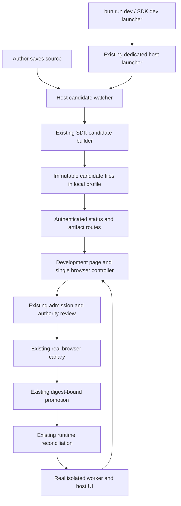

# Design

## Overview

Add an automatic reload loop around the existing development-candidate workflow. The SDK supplies a small `dev` launcher; the host owns watching/building; an authenticated browser page performs the existing admission → browser canary → promotion sequence and displays the real portable plugin surface. No plugin code is imported directly into Nuxt, and no alternate runtime is introduced.

Proposed user journey, after installing the host's documented prerequisites:

```sh
# Once, from the OR3 checkout: scaffold, install, link, start, open browser.
bun run dev:plugin --create ../my-plugin

# Every subsequent session, from the plugin directory:
cd ../my-plugin
bun run dev
```

The first browser visit asks for the generated local password and initial permissions. Subsequent saves update the plugin automatically. Existing packages associate a host once with `or3-plugin dev . --host /absolute/path/to/or3-chat`; the starter script is `or3-plugin dev .`. Missing association errors print that exact recovery command. There is no discovery wizard, network pairing, access token, or per-project port configuration.

This is automatic plugin reload. A fresh worker loses private in-memory variables; persisted host storage and supported host-owned field drafts survive. Initial host boot is distinct from the steady-state editing loop.

## Architecture



| Component | Responsibility | Requirements |
| --- | --- | --- |
| C1. Project entry point | Associate a local host and delegate startup | R1, R8 |
| C2. Dedicated launcher | Prepare and supervise one isolated project profile | R1, R2, R6 |
| C3. Candidate watcher | Turn stable source changes into immutable candidates | R3, R4, R7 |
| C4. Local artifact bridge | Expose only the current run's bounded candidate outputs | R3, R6, R7 |
| C5. Development page/controller | Coordinate the existing workflow and explain its state | R2, R3, R4, R5, R7 |
| C6. Existing package/runtime integration | Select and activate verified candidates, dispose replaced generations | R3, R4, R5, R6, R7 |
| C7. Author documentation | Explain the daily loop and explicit release handoff | R1, R8 |

Keep these responsibilities in existing modules where they fit. The component list is not a request for seven new packages, services, or layers.

## Components and Interfaces

### C1. Project entry point

Extend `packages/plugin-sdk/src/cli/index.ts` with `dev [package-root] [--host <checkout>]`. Add a small CLI helper that validates the remembered checkout, launches `bun run dev:plugin --plugin <absolute-package-root>` with that checkout as `cwd`, and forwards exit codes/signals. It does not watch, build, authenticate, or contact HTTP endpoints itself.

Store only the absolute host association in `<plugin>/.or3-dev/host.json`. The generated starter includes `"dev": "or3-plugin dev ."` and appends `.or3-dev/` to `.gitignore` without replacing existing ignores. Explicit `--host` updates the association. Moving a project to another machine requires that one option again; no broad parent-directory search or environment fallback chain.

`--create` belongs to the host launcher, which knows the host and SDK locations. It calls existing `createV2Package`, builds the local SDK CLI if needed, installs the starter's local SDK dependency using Bun, and writes the association. Use the existing local SDK directory installation contract; do not claim registry availability. Validate an absent/empty target directory *before* invoking the current scaffold helper, whose manifest-only overwrite guard is insufficient for this user-facing command. Existing nonempty projects use `--plugin`/`dev`.

The launcher and SDK use a small internal command contract/version check. Reject an incompatible host with an update/relink instruction; do not implement a compatibility adapter.

### C2. Dedicated launcher

Extend `scripts/cli/dev-plugin.ts`; preserve the existing no-argument manual route. Watched projects use `<host>/.or3-plugin-dev/projects/<hash-of-canonical-plugin-root>/` so restarting the project preserves its data and switching projects does not mix stores. Keep runtime files and secrets outside the plugin source tree.

Use existing provider/config helpers to supply a fixed Basic Auth + SQLite + filesystem profile, SSR, sync/storage flags needed by the fixture, the V2 loader, local bootstrap account, administrator account, and generated secrets. Add `OR3_ADMIN_DATA_DIR` to isolation: the current launcher covers Basic Auth but does not relocate administrator credential/JWT files. Persist local secrets under the profile with restrictive permissions and reuse them on restart.

Ensure profile environment selection happens before `scripts/cli/dev.ts`/Nuxt dotenv loading. The current `dev.ts` eagerly imports `dotenv/config`; introduce the smallest explicit environment-file seam needed by the dedicated launcher, keeping ordinary development defaults intact. A managed run must not silently adopt the checkout `.env`, generated remote provider modules, externally inherited remote provider settings, or production credentials. Validate effective configuration, not just environment labels.

One process owns a profile. Reuse repository lock/process patterns where possible; refuse a live owner, recover an abandoned lock only after verifying ownership is gone, and never terminate someone else's host. Reuse the existing port-conflict reporting, recording the *actual* chosen port in the launcher record before opening the page. Isolate Nuxt generated build output and HMR port as necessary to avoid conflicts with an ordinary host already running on the same checkout; verify this with two live processes.

The local password is generated and printed with the development URL. Extend the existing `app/pages/admin/login.vue` with a development-only presentation that submits that password to the existing Basic Auth and administrator login flows, using the profile's fixed local account names, and then resolves the actual workspace session. The launcher opens `/chat` after sign-in; development status and authority review appear beside the real plugin workspace tab. Preserve a validated same-origin return target through login. A development-only public boolean can select this presentation but must carry no credentials and confer no authorization. This creates ordinary authenticated sessions; there is no login bypass, credential-bearing URL, or local-storage token. Preserve existing rate limits and error handling on login. Profile session expiry returns to this form.

Use the existing runtime launcher for Nuxt and a Bun subprocess for SDK operations: the host script currently runs under `tsx`, while SDK bundling requires Bun. On exit, stop only owned watchers/build processes/host children. Keep application data.

### C3. Candidate watcher

Add one host-side watcher helper beside `scripts/cli/dev-plugin.ts`. Use built-in filesystem watching and existing file-selection helpers; qualify add/change/delete/atomic rename and newly created subdirectories on supported operating systems before considering a dependency. No polling of the entire repository.

Watch only the linked package. Include `.authoring/`, imported local code, descriptors, assets, package metadata, and the lockfile. Exclude dependencies, VCS, build outputs, secrets, `.or3-dev/`, and the host profile. Add `.or3-dev` to `candidate.ts` source snapshot exclusions; the packer already excludes dot-directories. Neither host paths nor credentials belong in frozen source.

The runner keeps a 150 ms debounce, one build in progress, and one dirty flag for the latest pending work. It runs the standard `profile:generate` script when present, then the installed SDK's candidate command under Bun into a fresh generation directory. Support this existing authoring convention only; no new hook registry. Generated-file events are absorbed by comparing content fingerprints after generation, so generator output cannot feed back indefinitely.

Record watched source fingerprints and change revisions around generation/building. If external inputs changed while building, discard those outputs and rebuild the latest source. Publish a candidate only after all three files exist and candidate verification succeeds, using atomic status-file replacement. A parse/build failure publishes a diagnostic while retaining the last good candidate metadata. Dependency changes do not silently reinstall packages: missing/inconsistent dependencies produce an actionable `bun install` message, and the watcher recovers after installation.

Skip activation if the package digest equals the currently running digest. This also avoids the existing admission sidecar conflict for equal package bytes with a different source-only receipt. Submission still uses an explicitly frozen candidate, not this shortcut.

Proposed internal shapes (not new SDK exports):

```ts
type CandidateRef = {
    runId: string;
    generation: number;
    pluginId: string;
    packageDigest: `sha256-${string}`;
    receiptDigest: `sha256-${string}`;
};

type BuildStatus =
    | { state: 'starting'; runId: string }
    | { state: 'building'; runId: string; generation: number }
    | { state: 'ready'; candidate: CandidateRef }
    | { state: 'error'; runId: string; generation: number;
        message: string; lastGood: CandidateRef | null };

type DevelopmentStatus = {
    build: BuildStatus;
    // Obtained from host selection, never inferred from a successful build.
    selectedDigest: `sha256-${string}` | null;
};
```

Keep normal terminal output to startup, build result, and actionable errors. Include build duration and the entry/line/column when provided by Bun; improve the existing bundler's generic failure message by preserving its diagnostics. Do not introduce a source-map pipeline or logging service.

### C4. Local artifact bridge

Add two dev-gated read surfaces under `server/api/admin/plugins/development/`:

- `GET watch`: sanitized run/build status and selected digest, `Cache-Control: no-store`.
- `GET watch/[runId]/[generation]/[file]`: exactly `package.zip`, `source.zip`, or `receipt.json`, resolved from launcher-owned metadata within the profile. No client-supplied root or filesystem path.

Both require administrator context and `resolvePluginDevelopmentEligibility`. Validate run identity, generation, filename, byte ceilings, canonical paths, and symlink containment. Refuse cross-origin reads; do not enable CORS. Expired outputs return a structured stale-generation response, never a different generation's bytes.

After a selected package becomes active, a separate dev-only, authenticated
cleanup mutation checks the watched plugin and current digest, then calls the
existing pointer-aware package GC. A cleanup failure leaves the selected
version running, pauses later admissions, and offers an explicit retry.

The browser downloads the three artifacts and feeds them to the existing multipart `development/admit` endpoint. The small loopback round trip is preferable to adding another admission implementation or a server endpoint that imports an arbitrary local path. Keep the existing canonical verification and approval binding exactly where they are.

Replace the admission route's development-only 30/hour limit with a bounded editing-appropriate limit, initially 120/minute, after the existing eligibility/auth checks. Preserve artifact limits and serialized work. Return usable retry metadata and have the controller wait instead of repeatedly failing. Also audit canary/promote/global middleware limits so the full sequence can pass the 60-edit check.

### C5. Chat development controller

Mount `PluginDevelopmentController` beside the real Chat `PageShell` only in the watched development instance. It announces status accessibly and shows a small dismissible panel only for permission review or failures, then opens the selected plugin's existing workspace pane automatically. The ordinary portable-client registration supplies its sidebar, pane, tool and storage integrations; do not create a separate preview renderer.

The browser polls `watch` every 500 ms while the page is connected; use a completed-request timer, not overlapping intervals. Slow requests and rate limits back off. A failed poll does not destroy the running preview. This uses authenticated same-origin fetch and avoids introducing WebSockets, SSE, or credential exchange.

Acquire one browser Web Lock for the profile/plugin before performing mutations. Other preview tabs display status and can acquire the lock when the controller closes. Check support before enabling automation; a browser lacking the required containment or lock APIs receives an explicit unsupported-browser diagnostic. Do not add a second election mechanism. Lock ownership lasts across focus changes; being temporarily backgrounded must not hand control to a second tab mid-promotion.

For each newest ready generation:

1. Bind the run, plugin ID, generation, workspace, and package digest. Cancel pending work on session/workspace/run changes and clear stale permission decisions.
2. Inspect existing package status; reconcile a previously committed digest rather than repeating an uncertain promotion.
3. Download candidate files; call ordinary admission with explicit workspace identity.
4. If the host requests authority approval, display its review and retry those exact bytes only after approval. A newer candidate invalidates the pending display/approval. Required setup uses existing setup components and resumes only when readiness is confirmed.
5. Reuse `reportCandidateClientCanary` and the bounded canary flow from `useDevelopmentCanary`. Pass the explicit workspace through every operation; current helper calls use empty bodies and need that small extension. Suppress per-edit success toasts in the automated path.
6. Recheck generation/run/workspace and invoke existing promotion with the exact candidate digest. A stale/conflicting candidate causes rereading, not blind retry. One controller processes operations serially; newer edits replace pending work rather than interleaving admission sequences.
7. Call `requestWorkspacePluginReconcile`, wait for real activation/contribution readiness using existing marketplace/runtime observation helpers, and mark that digest running.

On authentication expiry, pause. On loss of a response, read selection/canary state before resuming. On host restart, detect the new run identity and discard old tickets and in-flight decisions. Closing the Chat page stops browser-driven admission while builds may continue; reopening processes the latest ready generation.

### C6. Existing package/runtime integration

Relevant existing seams:

- `server/api/admin/plugins/development/admit.post.ts`: exact artifact validation, authority review, candidate preparation, local provenance.
- `server/api/admin/plugins/packages/[pluginId]/{canary,promote}.post.ts`: real browser evidence, setup/state/all-workspace preflight, digest checks, initial enablement.
- `app/composables/admin/useDevelopmentCanary.ts` and `app/composables/plugins/portable-canary.ts`: browser evidence production.
- `app/plugins/portable-clients.client.ts`: stop changed descriptors and register their replacement on runtime reconcile.
- `app/components/plugins/PortableClientView.vue`: observes descriptor changes and starts the replacement worker; field drafts live in the host.
- `server/admin/plugins/package-lifecycle.ts`: `garbageCollectUnreferencedVersions` already preserves current, candidate, and previous pointer digests under the package lock.

Make narrowly scoped fixes where real reload tests reveal dropped surfaces or stale callbacks. No new runtime-wide reload API unless the existing reconcile signal proves insufficient. Verify the current effective-authority implementation rather than duplicating its policy; relevant files already have concurrent working-tree changes.

After a successful watched development promotion, use the existing package GC in the dedicated profile only. Retain pointer-referenced versions, the latest ready build, and artifacts currently being read/processed. Remove only watch-owned superseded candidate directories and matching disposable evidence/sidecars; never settings, files, auth data, explicit candidate exports, or arbitrary directories. Run cleanup in the serialized lifecycle, and test deletion boundaries. If cleanup fails, keep the selected version and report the failure; a fixed profile artifact budget should pause further builds rather than consume disk indefinitely. Start with a 512 MiB budget for disposable watch artifacts, separate from plugin application data, with no user-facing tuning flag in v1.

### C7. Author documentation

Update `packages/plugin-sdk/README.md`, starter instructions, and the public pages indexed by `public/_documentation/docmap.json`: `plugins/local-development.md`, `plugins/plugin-sdk-cli.md`, `plugins/plugin-development-v2.md`, and the introductory link in `start/plugin-quickstart.md`. The V2 tutorial is currently untracked working-tree work; coordinate with its current contents instead of replacing it. Add a short save/error/fix example, explain the first sign-in and access review, and state that `candidate --verify/--qualify` remain explicit release steps. Update provider READMEs only if provider public behavior actually changes; the proposed bootstrap uses existing provider contracts.

## Data Models

No new database tables, migrations, queues, or persisted grants model.

- `.or3-dev/host.json`: ignored machine-local host association; excluded from snapshots.
- Existing project-specific profile: credentials, application data, extension pointers, and SDK artifacts.
- Watch-owned run/status files and generation directories: bounded disposable control/build state, written atomically. Restart creates a new run ID; filenames and metadata are validated before reads or deletion.
- Existing package pointers, local admission records, authority reviews, setup storage, and canary evidence remain authoritative.

## Error Handling

Use existing SDK exceptions with nonzero process exit, host `createError` codes, and discriminated workflow results. Keep user-facing blocked conditions distinct from transport errors and never convert a failed check into a pass.

| Failure | Recovery |
| --- | --- |
| Missing host/link/dependency or unsupported package | Stop startup with the specific relink/install command; preserve source |
| Source changes during a build | Discard the incomplete generation; one rebuild for newest inputs |
| Generate/build/validation error | Keep selected package; show diagnostic; retry on save |
| New authority or setup/state blocker | Keep selected package; show exact review/setup/blocker; resume after resolution |
| Stale artifacts, canary ticket, or pointer | Reread run/package state and process newest ready generation |
| 401/403 from an expired session | Pause and use the guided sign-in; never widen authorization |
| Network error/lost promotion response | Show disconnected; inspect server state before any retry |
| Runtime failure after successful promotion | Show actual activation failure and existing recovery controls; preserve data |
| Disk full, cleanup failure, or artifact budget reached | Pause builds with a path and explanation; preserve referenced packages and data |

## Testing Strategy

- **Unit (R1–R3, R6–R7):** scaffold refusal and host linking, effective environment isolation including admin storage, startup/signal ownership, watch filtering and rename/delete events, generator feedback prevention, input changes during build, digest no-op behavior, bounded pending work, cleanup protections.
- **Server integration (R3, R5–R7):** actual candidate bytes through existing admission/canary/promotion; unchanged versus expanded authority; missing setup/incompatible state; production and cross-origin denial; traversal/symlink and stale-run refusal; rate limits; pointer conflicts and ambiguous-response recovery. Extend canonical suites instead of duplicating them.
- **Component/runtime (R4–R5, R7):** status and accessible error feedback, permission approval invalidation, explicit workspace propagation, one controller across tabs, reconciliation, activation readiness, and disposal of old callbacks/tools/surfaces without touching unrelated plugins.
- **Browser (R1–R8):** a named local plugin-development harness creates an external starter and fresh profile without checkout `.env`, completes guided sign-in/access review, edits real source, observes changed UI without navigation reload, breaks/fixes syntax, expands permissions, preserves saved data/drafts, exercises ordinary Chat surfaces, disconnects/restarts, and repeats 60 edits. Use a local fixture without AI credentials or paid calls. Test macOS/Linux file behavior and every browser that automation claims to support.
- **Performance (R7):** record generation/build, admission, canary, promotion, and activation durations for 20 warmed edits; assert p95 ≤3 s on a recorded reference setup. Optimize only the observed bottleneck. Do not replace the real canary or artifact checks with fake successes.
- **Final verification:** affected Vitest lanes plus host type-check, SDK typecheck/build, packed-SDK smoke, named browser harness, and production/static boundary checks. Existing baseline failures must be reported separately. This planning-only change requires document/diff review, not application tests.

## Design Decisions

1. **Worker replacement is the useful minimum.** True state-preserving HMR requires module graph and lifecycle semantics that portable workers do not currently expose. Existing digest replacement already delivers the visible edit loop with production-like isolation.
2. **One owner for watching.** An SDK-hosted HTTP server would require pairing, credentials, CORS, and another process protocol. A thin SDK launcher preserves `bun run dev` while the host uses local files and its existing browser session.
3. **Reuse candidate machinery first.** A mutable development loader could be faster but introduces a second trust/runtime path. Measure the existing pipeline before considering any fast path; the performance acceptance criterion prevents calling a slow upload macro complete.
4. **Use two read routes and existing mutations.** Downloading then uploading local candidate bytes is some avoidable I/O, but removes the need for a new admission service or an arbitrary-path import endpoint. Revisit only if measurements justify the change.
5. **Polling has a bounded, visible purpose.** One small status request per 500 ms meets the feedback budget without a streaming transport. One filesystem dirty flag and one browser controller prevent overlapping work.
6. **Authenticate once; retain approval policy.** A guided login removes setup friction without anonymous administrator endpoints. Ordinary edits inherit consent only as the current authority policy permits.
7. **Keep distribution honest.** Automatic downloads, npm publication, Docker, and host version management are larger independent efforts. The first implementation explicitly requires one local host checkout; a future packaged host can replace the thin launcher's target without changing the editing loop.
8. **Keep v1 options small.** `dev`, `--host`, host `--plugin`/`--create`, and optional `--id` are enough. Do not add remote URLs, configurable transports, plugin lists, migration modes, custom build hooks, or watch-policy configuration.

## Risks & Mitigations

1. **Existing safety pipeline exceeds the feedback budget.** Build a measured vertical slice before polishing UI; diagnose stage timings and remove redundant work only with proof of unchanged validation.
2. **First-run auth/provider setup inherits developer state.** Qualify in a fresh external directory with poisoned checkout environment/provider configuration and a simultaneously running ordinary host; include administrator data and generated Nuxt output in isolation checks.
3. **Replacement disrupts open UI or leaves old callbacks alive.** Exercise actual pane/sidebar/tool registrations over repeated replacements, including multiple surfaces and an unrelated plugin; use existing generation invalidation and disposal.
4. **Rapid changes race with permission review or promotion.** One serial browser controller, generation/run/workspace binding, invalidated approvals, and existing digest-bound promotion prevent applying a decision to different bytes.
5. **Watch artifacts leak machine state or grow indefinitely.** Explicit snapshot exclusions, confined artifact routes, pointer-aware cleanup, a disposable-artifact budget, and destructive-boundary tests keep local state contained.
