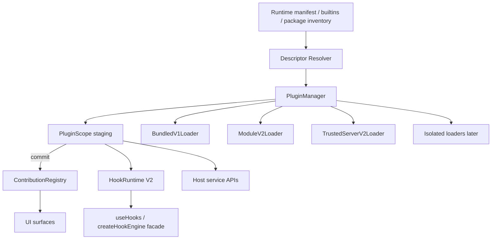

# Design

## Overview

Plugin Runtime V2 is a strangler migration: existing public APIs and import paths stay stable while discovery, activation, contributions, hooks, and package loading move behind a central `PluginManager`, transactional `PluginScope`, `ContributionRegistry` kernel, Hook Engine V2 facade, and versioned loaders. Naming the effort **Plugin Runtime V2** (not Hook Engine V2) matches the real upgrade: ownership and lifecycle.

## Architecture



Strangler path:

```text
Existing plugin code → V1 public APIs → compatibility adapters → V2 manager/scope/registries/hooks/loaders
```

### Components

| Component | Responsibility | Requirements |
|---|---|---|
| Descriptor Resolver | Build immutable descriptors + instance keys | R2 |
| PluginManager | Discover/verify/prepare/commit/activate; status; reconcile | R2, R3, R9 |
| PluginScope | Staged registrations, abort, commit, activate, awaited LIFO dispose | R3 |
| ContributionRegistry | Ownership, batch, conflict, inspect, surface-agnostic kernel | R4 |
| Surface adapters | Schema, normalization, legacy ordering profiles | R1, R4 |
| HookRuntime V2 | Plans, policies, bounded diagnostics behind facade | R5 |
| Auth constraint engine | Deny-only fail-closed (unchanged specialty path) | R5 |
| BundledV1Loader | `import.meta.glob` rebuild-required path | R1, R7 |
| ModuleV2Loader / store | Content-addressed client/server packages | R7 |
| `@or3/plugin-sdk` | Stable contracts; no app-private imports | R6 |
| Isolated loaders | iframe/Worker/process RPC (later) | R8 |

## Components and Interfaces

```ts
const LEGACY_HOOK_POLICY = {
  actionMode: 'series',
  errorPolicy: 'continue',
  filterMode: 'series',
  timeoutMs: null,
  syncThenablePolicy: 'reject-and-continue',
} as const;

interface PluginDescriptor {
  id: string;
  version: string;
  packageDigest: string;
  manifestVersion: 1 | 2;
  pluginApiVersion: string;
  source: 'builtin' | 'extension' | 'package';
  trust: 'trusted-host' | 'isolated-client' | 'isolated-server';
  workspaceId: string;
  policyRevision: string;
  grantsRevision: string;
  client?: PluginClientEntrypoint;
  server?: PluginServerEntrypoint;
  dependencies: PluginDependency[];
}

function pluginInstanceKey(d: PluginDescriptor): string {
  return [
    d.id, d.version, d.packageDigest, d.source, d.workspaceId,
    d.policyRevision, d.grantsRevision, d.pluginApiVersion,
  ].join('|');
}

type PluginRuntimeStatus =
  | 'discovered' | 'verified' | 'blocked' | 'preparing'
  | 'active' | 'stopping' | 'failed' | 'quarantined';

interface PluginScope {
  readonly context: PluginContext;
  readonly state: 'open' | 'committed' | 'active' | 'disposed';
  commit(): Promise<void>;
  activate(): Promise<void>;
  rollback(reason?: unknown): Promise<void>;
  dispose(): Promise<void>;
}

interface ContributionRegistry<T, TContext = void> {
  register(scope: PluginScope, value: T): RegistrationHandle;
  commitBatch(records: readonly ContributionRecord<T>[]): void;
  removeOwner(owner: symbol): number;
  snapshot(context: TContext): readonly T[];
  inspect(): readonly ContributionRecord<T>[];
}
```

### Activation sequences

**V2 (two-phase):** prepare new generation without publishing → validate → atomically commit contributions over old → activate → dispose old (exact-owner safe).

**V1 (conservative):** await old disposal → load/register new → on failure reload retained previous descriptor when possible.

**Legacy adapter:** create scope → `createLegacyWorkspacePluginApi(scope)` → `await plugin.register(api)` → commit → activate; on error rollback.

### Reconciliation

```ts
async function reconcile(manifest: RuntimeManifest): Promise<ReconcileReport> {
  const generation = coordinator.nextGeneration();
  coordinator.abortPreviousGeneration();
  const desired = resolveDescriptors(manifest);
  const plan = diffRuntime(activeInstances, desired);
  await stopRemoved(plan.removed, generation);
  await replaceChanged(plan.changed, generation);
  await startAdded(plan.added, generation);
  return buildReport();
}
```

Changed when any of: version, digest, source, workspaceId, access policy revision, grants revision, pluginApiVersion, isolation, entrypoint, dependency resolution.

### Package store

```text
extensions/
  .store/<id>/<sha256-…>/
  active.json
  plugins/   # V1 layout retained
```

Per-plugin operation lock covers install/update/rollback/uninstall (in-process mutex + advisory file lock for multi-process).

### Feature flags

```ts
pluginRuntimeV2Enabled: boolean;
pluginRuntimeV2WorkspaceIds?: string[];
pluginModuleLoaderV2Enabled: boolean;
hookEngineV2Enabled: boolean;
pluginIsolationEnabled: boolean;
// plus safe-mode: disable non-core plugins before startup
```

## Data Models

- No new Dexie sync tables required for MVP.
- On-disk: `.store` digests, `active.json`, optional quarantine/failure records in admin/workspace settings.
- Keep workspace `plugins.enabled` + access policy as load authority inputs to descriptor `policyRevision`.

## Error Handling

| Scenario | Behavior |
|---|---|
| Setup throws before/after staged regs | Rollback scope; zero contributions |
| Activation throws after commit | Remove by owner; restore previous if two-phase |
| Cleanup Promise / throw | Await; continue remaining; record health |
| Workspace abort mid-import/register | Drop staged work; no commit |
| Incompatible engines / bad digest | `blocked` before import |
| Missing grant (trusted mediated API) | Structured deny; not a sandbox claim |
| Isolation escape attempts | Denied at RPC / process boundary |
| Flag off | Prior loader/engine path |

## Testing Strategy

Aligned to the proposal matrix:

- **Compatibility:** example plugins compile; V1 manifests; ignored handle returns; ID unregister still works
- **Lifecycle:** partial register, activation fail, delayed cleanup, workspace races, digest/version updates, quarantine, deps/cycles
- **Ownership:** stale handle / old generation cannot remove new
- **Hooks:** legacy order/errors; plan cache; bounded diagnostics; no dual exec
- **Packages/routes:** locks, digests, read/write defaults, server reload by digest, rollback
- **Isolation (later):** DOM/network/fs/env escapes, budgets
- **Performance:** dispatch/registry/reconcile baselines in CI artifacts (Milestone 0)

## Design Decisions

1. **Call it Plugin Runtime V2** — Hook engine is one subsystem; lifecycle ownership is the core.
2. **Strangler, not parallel forever** — Adapters over one kernel; no permanent `v2/` duplicate tree.
3. **Lifecycle first** — First slice is manager/scope/reconcile with BundledV1Loader; hooks/packages/isolation later.
4. **Legacy hook policy by default** — Prevents silent series→parallel or continue→throw.
5. **Preserve per-surface ordering profiles** — Do not “fix” sort during registry migration.
6. **access ≠ grants** — Who may use vs what APIs may be called.
7. **Digest-keyed identity** — Version strings alone are insufficient for reload/cache.
8. **No production dual execution** — Shadow may compare plans/metadata only.
9. **P0 fixes are foundations** — Do not reopen inventory/install/auth/route/loadAllowed work.

## Risks & Mitigations

| Risk | Mitigation |
|---|---|
| Accidental semantic drift | Milestone 0 freeze fixtures + legacy policy defaults |
| Incomplete transactional guarantee for V1 | Conservative replace; classify legacy-global |
| ESM cache after file replace | Content-addressed URLs/paths |
| Over-scoping isolation early | Flagged later milestone; trusted-host remains default |
| Registry ordering regressions | Per-surface compatibility profiles + golden tests |
| Flag complexity | Narrow flags; each PR documents rollback |
