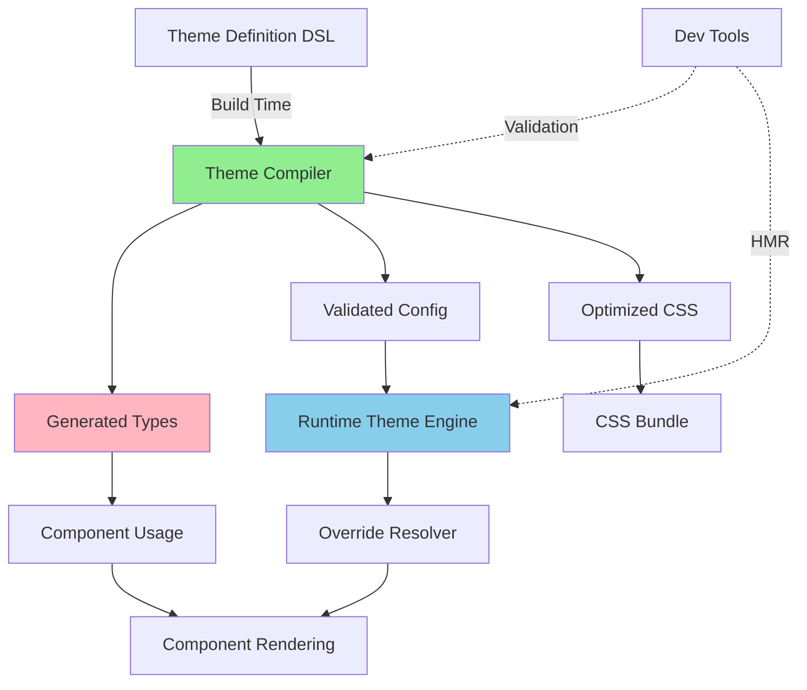

# Refined Theme System - Technical Design

## Overview

This document describes the technical architecture of the refined theme system, focusing on simplification, type safety, and build-time validation while maintaining full customizability.

---

## Architecture Diagram



---

## Core Components

### 1. Theme DSL (`defineTheme`)

**Purpose**: Provide simple, typed API for theme authors.

**Interface**:

```typescript
// app/theme/_shared/define-theme.ts
export interface ThemeDefinition {
    name: string;
    displayName?: string;
    description?: string;

    // Color palette (auto-generates CSS variables)
    colors: {
        // Material Design 3 tokens
        primary: string;
        onPrimary?: string; // Auto-calculated if omitted
        primaryContainer?: string;
        onPrimaryContainer?: string;

        secondary: string;
        tertiary?: string;
        error?: string;

        surface: string;
        surfaceVariant?: string;
        onSurface?: string;
        inverseSurface?: string;

        outline?: string;

        // App-specific tokens
        success?: string;
        warning?: string;

        // Dark mode overrides (optional)
        dark?: Partial<typeof this>;
    };

    // Component overrides using CSS selector syntax
    overrides?: {
        [selector: string]: OverrideProps;
    };

    // Nuxt UI config extensions
    ui?: Record<string, unknown>;
}

/**
 * Override props that can be applied to components.
 * Uses proper Nuxt UI 3 type definitions where available.
 */
export interface OverrideProps {
    /** Component variant (e.g., 'solid', 'outline', 'ghost', 'soft', 'link')
     * For Nuxt UI components: Passed as-is to component
     * For custom components: Mapped to CSS classes via variantMap
     */
    variant?: string;

    /** Component size (e.g., 'xs', 'sm', 'md', 'lg', 'xl', '2xs', '2xl')
     * For Nuxt UI components: Passed as-is to component
     * For custom components: Mapped to CSS classes via sizeMap
     */
    size?: string;

    /** Component color (e.g., 'primary', 'secondary', 'success', 'error', 'warning', 'info')
     * For Nuxt UI components: Passed as-is to component
     * For custom components: Mapped to CSS classes via colorMap
     */
    color?: string;

    /** Additional CSS classes - always applied directly to element */
    class?: string;

    /** Inline styles object - applied directly to element */
    style?: Record<string, string>;

    /** Nuxt UI component-specific config object (passed to :ui prop)
     * Only works with Nuxt UI components
     */
    ui?: Record<string, unknown>;

    /** Allow any additional component-specific props */
    [key: string]: unknown;
}

/**
 * Type-safe override props for specific Nuxt UI components.
 * Import actual component prop types from @nuxt/ui for full type safety.
 */
export type ComponentSpecificOverrides = {
    button?: Partial<import('@nuxt/ui').ButtonProps>;
    input?: Partial<import('@nuxt/ui').InputProps>;
    modal?: Partial<import('@nuxt/ui').ModalProps>;
    card?: Partial<import('@nuxt/ui').CardProps>;
    // Add other Nuxt UI components as needed
    [component: string]: Partial<Record<string, unknown>> | undefined;
};

export function defineTheme(config: ThemeDefinition): ThemeDefinition {
    // Runtime validation in dev
    if (import.meta.dev) {
        validateThemeDefinition(config);
    }
    return config;
}
```

**Example Usage**:

```typescript
// app/theme/nature/theme.ts
export default defineTheme({
    name: 'nature',
    displayName: 'Nature',
    description: 'Organic green theme with natural tones',

    colors: {
        primary: '#3f8452',
        secondary: '#5a7b62',
        tertiary: '#4a7c83',
        surface: '#f5faf5',
        success: '#4a9763',
        warning: '#c8931d',
        error: '#b5473c',

        // Dark mode (optional - auto-generated if omitted)
        dark: {
            primary: '#8dd29a',
            surface: '#0c130d',
        },
    },

    overrides: {
        // Simple global override
        button: {
            variant: 'forestSolid',
            size: 'md',
        },

        // Context-specific (simple syntax - auto-expanded to [data-context="chat"])
        'button.chat': {
            variant: 'mossGhost',
            size: 'sm',
        },

        // Identifier-specific (simple syntax - auto-expanded to [data-id="chat.send"])
        'button#chat.send': {
            variant: 'forestSolid',
            class: 'shadow-glow',
        },

        // State-based
        'button:hover': {
            class: 'shadow-intense',
        },

        // Advanced: Full attribute selector syntax (for power users)
        'input[data-context="chat"][type="text"]': {
            variant: 'neon',
        },

        // You can also mix simple and advanced syntax
        'button.sidebar:hover': {
            class: 'sidebar-hover-effect',
        },
    },
});
```

---

### 2. Theme Compiler (Build Time)

**Purpose**: Transform theme definitions into optimized runtime configs and generate types.

```typescript
// scripts/theme-compiler.ts
export class ThemeCompiler {
    /**
     * Compile all themes in app/theme/*
     */
    async compileAll(): Promise<CompilationResult> {
        const themes = await this.discoverThemes();
        const results: CompilationResult[] = [];

        for (const theme of themes) {
            results.push(await this.compileTheme(theme));
        }

        // Generate unified type definitions
        await this.generateTypes(results);

        return {
            themes: results,
            success: results.every((r) => r.errors.length === 0),
        };
    }

    /**
     * Compile single theme
     */
    private async compileTheme(
        themePath: string
    ): Promise<ThemeCompilationResult> {
        const definition = await import(themePath);
        const errors: ValidationError[] = [];
        const warnings: ValidationWarning[] = [];

        // 1. Validate structure
        this.validateStructure(definition, errors);

        // 2. Generate CSS variables
        const cssVars = this.generateCSSVariables(definition.colors);

        // 3. Compile overrides to runtime format
        const compiledOverrides = this.compileOverrides(definition.overrides);

        // 4. Validate CSS selectors
        this.validateSelectors(compiledOverrides, warnings);

        // 5. Calculate selector specificity
        const withSpecificity = this.addSpecificity(compiledOverrides);

        return {
            name: definition.name,
            cssVariables: cssVars,
            overrides: withSpecificity,
            errors,
            warnings,
        };
    }

    /**
     * Generate CSS variables from color palette
     */
    private generateCSSVariables(colors: ThemeDefinition['colors']): string {
        let css = '.light {\n';

        // Primary
        css += `  --md-primary: ${colors.primary};\n`;
        css += `  --md-on-primary: ${
            colors.onPrimary ?? this.contrast(colors.primary)
        };\n`;

        // Auto-generate missing colors
        // ...

        css += '}\n\n';

        // Dark mode
        if (colors.dark) {
            css += '.dark {\n';
            css += `  --md-primary: ${
                colors.dark.primary ?? this.adjustForDark(colors.primary)
            };\n`;
            // ...
            css += '}\n';
        }

        return css;
    }

    /**
     * Compile overrides from CSS selectors to runtime rules
     */
    private compileOverrides(
        overrides: ThemeDefinition['overrides']
    ): CompiledOverride[] {
        const compiled: CompiledOverride[] = [];

        for (const [selector, props] of Object.entries(overrides ?? {})) {
            // Parse selector
            const parsed = this.parseSelector(selector);

            compiled.push({
                component: parsed.component,
                context: parsed.context,
                state: parsed.state,
                identifier: parsed.identifier,
                attributes: parsed.attributes,
                props,
                selector: selector,
                specificity: this.calculateSpecificity(selector),
            });
        }

        return compiled;
    }

    /**
     * Parse CSS selector into override components
     *
     * Supports multiple syntaxes:
     * - Simple context: 'button.chat' → [data-context="chat"]
     * - Simple identifier: 'button#chat.send' → [data-id="chat.send"]
     * - HTML attributes: 'button[id="submit"]' → matches component with id="submit"
     * - Advanced: 'button[data-context="chat"]' → unchanged
     * - Mixed: 'button.chat:hover' → [data-context="chat"]:hover
     * - Combined: 'button.chat[type="submit"]' → [data-context="chat"][type="submit"]
     */
    private parseSelector(selector: string): ParsedSelector {
        // First, normalize simple syntax to attribute selectors
        let normalized = this.normalizeSelector(selector);

        // Examples after normalization:
        // 'button.chat' → 'button[data-context="chat"]'
        // 'button#chat.send' → 'button[data-id="chat.send"]'
        // 'button[id="x"]' → unchanged (already attribute selector)
        // 'button.chat[type="submit"]' → 'button[data-context="chat"][type="submit"]'

        const component = normalized.match(/^(\w+)/)?.[1] || 'button';
        const context = normalized.match(/data-context="([^"]+)"/)?.[1];
        const identifier = normalized.match(/data-id="([^"]+)"/)?.[1];
        const state = normalized.match(/:(\w+)/)?.[1];

        // Extract HTML attribute selectors (id, class, type, data-*, aria-*, etc.)
        // These are NOT data-context or data-id which are already handled
        const attributeMatchers: AttributeMatcher[] = [];
        const attrRegex = /\[([^=\]]+)((?:[~|^$*]?=)"([^"]+)")?\]/g;
        let match;

        while ((match = attrRegex.exec(normalized)) !== null) {
            const attrName = match[1];
            const operator =
                match[2]?.[0] === '='
                    ? '='
                    : match[2]?.slice(0, -1) || 'exists';
            const attrValue = match[3];

            // Skip data-context and data-id (already handled above)
            if (attrName === 'data-context' || attrName === 'data-id') continue;

            attributeMatchers.push({
                attribute: attrName,
                operator: operator as AttributeOperator,
                value: attrValue,
            });
        }

        return {
            component,
            context,
            identifier,
            state,
            attributes:
                attributeMatchers.length > 0 ? attributeMatchers : undefined,
        };
    }

    /**
     * Normalize simple selector syntax to attribute selectors
     */
    private normalizeSelector(selector: string): string {
        let result = selector;

        // Convert .context to [data-context="context"]
        // Match: button.chat or button.sidebar
        result = result.replace(
            /(\w+)\.(\w+)(?=[:\[]|$)/g,
            (match, component, context) => {
                // Don't convert if it looks like a CSS class (e.g., .btn-primary)
                // Only convert known context names
                const knownContexts = [
                    'chat',
                    'sidebar',
                    'dashboard',
                    'header',
                    'global',
                ];
                if (knownContexts.includes(context)) {
                    return `${component}[data-context="${context}"]`;
                }
                return match; // Keep as-is if not a known context
            }
        );

        // Convert #identifier to [data-id="identifier"]
        // Match: button#chat.send or input#search.bar
        result = result.replace(
            /(\w+)#([\w.]+)(?=[:\[]|$)/g,
            '$1[data-id="$2"]'
        );

        return result;
    }

    /**
     * Calculate CSS selector specificity
     */
    private calculateSpecificity(selector: string): number {
        let specificity = 0;
        specificity += (selector.match(/\[/g) || []).length * 10; // attributes
        specificity += (selector.match(/:/g) || []).length * 10; // pseudo-classes
        specificity += 1; // element
        return specificity;
    }

    /**
     * Generate TypeScript type definitions
     */
    private async generateTypes(results: CompilationResult[]): Promise<void> {
        const identifiers = new Set<string>();
        const themeNames = new Set<string>();

        for (const result of results) {
            themeNames.add(result.name);

            for (const override of result.overrides) {
                if (override.identifier) {
                    identifiers.add(override.identifier);
                }
            }
        }

        const typeFile = `
// Auto-generated by theme compiler - do not edit
export type ThemeName = ${Array.from(themeNames)
            .map((n) => `'${n}'`)
            .join(' | ')};

export type ThemeIdentifier = ${Array.from(identifiers)
            .map((id) => `'${id}'`)
            .join(' | ')};

// Helper type for v-theme directive
export interface ThemeDirective {
  identifier?: ThemeIdentifier;
  context?: 'chat' | 'sidebar' | 'dashboard' | 'global';
}
`;

        await Bun.write('types/theme-generated.d.ts', typeFile);
    }
}
```

**Build Integration**:

```typescript
// vite.config.ts (or nuxt.config.ts)
import { ThemeCompiler } from './scripts/theme-compiler';

export default defineConfig({
    plugins: [
        {
            name: 'theme-compiler',
            async buildStart() {
                const compiler = new ThemeCompiler();
                const result = await compiler.compileAll();

                if (!result.success) {
                    this.error('Theme compilation failed');
                }
            },
            // HMR support
            handleHotUpdate({ file, server }) {
                if (file.includes('/theme/') && file.endsWith('theme.ts')) {
                    console.log('[HMR] Recompiling theme...');
                    new ThemeCompiler().compileAll();
                }
            },
        },
    ],
});
```

---

### 3. Runtime Override Resolver (Simplified)

**Purpose**: Resolve overrides at runtime using compiled config.

```typescript
// app/theme/_shared/runtime-resolver.ts

export type AttributeOperator =
    | 'exists' // [attr]
    | '=' // [attr="value"]
    | '~=' // [attr~="value"] - contains word
    | '|=' // [attr|="value"] - starts with word
    | '^=' // [attr^="value"] - starts with
    | '$=' // [attr$="value"] - ends with
    | '*='; // [attr*="value"] - contains

export interface AttributeMatcher {
    attribute: string;
    operator: AttributeOperator;
    value?: string;
}

export interface ResolveParams {
    component: string;
    context?: string;
    identifier?: string;
    state?: string;
    element?: HTMLElement; // For attribute matching
    isNuxtUI?: boolean; // Whether component is a Nuxt UI component
}

export class RuntimeResolver {
    private overrides: CompiledOverride[];

    constructor(compiledTheme: CompiledTheme) {
        // Sort by specificity (descending)
        this.overrides = [...compiledTheme.overrides].sort(
            (a, b) => b.specificity - a.specificity
        );
    }

    /**
     * Resolve overrides for a component instance
     */
    resolve(params: ResolveParams): ResolvedOverride {
        const matching: CompiledOverride[] = [];

        for (const override of this.overrides) {
            if (this.matches(override, params)) {
                matching.push(override);
            }
        }

        // Merge in specificity order (highest first)
        return this.merge(matching);
    }

    /**
     * Check if override matches component
     */
    private matches(
        override: CompiledOverride,
        params: ResolveParams
    ): boolean {
        // Component type must match
        if (override.component !== params.component) return false;

        // Context must match (if specified)
        if (override.context && override.context !== params.context)
            return false;

        // Identifier must match (if specified)
        if (override.identifier && override.identifier !== params.identifier)
            return false;

        // State must match (if specified)
        if (override.state && override.state !== params.state) return false;

        // HTML attribute matching (if specified)
        if (override.attributes && params.element) {
            for (const matcher of override.attributes) {
                if (!this.matchesAttribute(params.element, matcher)) {
                    return false;
                }
            }
        }

        return true;
    }

    /**
     * Check if an element matches an attribute selector
     */
    private matchesAttribute(
        element: HTMLElement | undefined,
        matcher: AttributeMatcher
    ): boolean {
        if (!element) return false;

        const attrValue = element.getAttribute(matcher.attribute);

        // [attr] - attribute exists
        if (matcher.operator === 'exists') {
            return attrValue !== null;
        }

        if (attrValue === null) return false;
        if (!matcher.value) return false;

        switch (matcher.operator) {
            case '=': // [attr="value"] - exact match
                return attrValue === matcher.value;

            case '~=': // [attr~="value"] - contains word
                return attrValue.split(/\s+/).includes(matcher.value);

            case '|=': // [attr|="value"] - starts with word
                return (
                    attrValue === matcher.value ||
                    attrValue.startsWith(matcher.value + '-')
                );

            case '^=': // [attr^="value"] - starts with
                return attrValue.startsWith(matcher.value);

            case '$=': // [attr$="value"] - ends with
                return attrValue.endsWith(matcher.value);

            case '*=': // [attr*="value"] - contains
                return attrValue.includes(matcher.value);

            default:
                return false;
        }
    }

    /**
     * Merge matching overrides (higher specificity wins)
     */
    private merge(overrides: CompiledOverride[]): ResolvedOverride {
        const merged: Record<string, unknown> = {};

        // Iterate in reverse (lowest specificity first, highest last)
        for (let i = overrides.length - 1; i >= 0; i--) {
            const override = overrides[i];

            for (const [key, value] of Object.entries(override.props)) {
                if (key === 'class') {
                    // Concatenate classes (highest specificity first)
                    merged[key] =
                        value + (merged[key] ? ` ${merged[key]}` : '');
                } else if (key === 'ui') {
                    // Deep merge ui objects
                    merged[key] = { ...merged[key], ...value };
                } else {
                    // Higher specificity wins
                    merged[key] = value;
                }
            }
        }

        return { props: merged };
    }
}
```

---

### 4. Auto-Theme Directive

**Purpose**: Apply theme overrides without wrapper components.

```typescript
// app/plugins/auto-theme.client.ts
export default defineNuxtPlugin((nuxtApp) => {
    const { activeTheme } = useTheme();

    nuxtApp.vueApp.directive('theme', {
        created(el, binding, vnode) {
            const instance = vnode.component;
            if (!instance) return;

            // Get component name
            const componentName =
                instance.type.name?.toLowerCase() ||
                vnode.type.__name?.toLowerCase() ||
                'button';

            // Get identifier from directive value
            const identifier =
                typeof binding.value === 'string'
                    ? binding.value
                    : binding.value?.identifier;

            // Detect context from DOM
            const context = detectContext(el);

            // Get current state (default to 'default')
            const state = ref('default');

            // Resolve overrides
            const resolver = getResolver(activeTheme.value);
            const resolved = resolver.resolve({
                component: componentName,
                context,
                identifier,
                state: state.value,
                element: el, // Pass element for attribute matching
            });

            // Merge with existing props (props win)
            const existingProps = instance.props;
            const mergedProps = { ...resolved.props };

            for (const [key, value] of Object.entries(existingProps)) {
                if (value !== undefined) {
                    if (key === 'class') {
                        mergedProps[key] = `${
                            resolved.props.class || ''
                        } ${value}`.trim();
                    } else {
                        mergedProps[key] = value; // prop wins
                    }
                }
            }

            // Apply to component
            Object.assign(instance.props, mergedProps);

            // Watch for theme changes
            watch(activeTheme, () => {
                const newResolver = getResolver(activeTheme.value);
                const newResolved = newResolver.resolve({
                    component: componentName,
                    context,
                    identifier,
                    state: state.value,
                });
                Object.assign(instance.props, newResolved.props);
            });
        },
    });
});

function detectContext(el: HTMLElement): string {
    if (el.closest('#app-chat-container')) return 'chat';
    if (el.closest('#app-sidebar')) return 'sidebar';
    if (el.closest('#app-dashboard-modal')) return 'dashboard';
    return 'global';
}
```

---

### 5. Test Utilities

**Purpose**: Simplify testing themed components.

```typescript
// tests/utils/theme-test-utils.ts
export function mockTheme(themeName: string = 'default') {
    return {
        install(app: App) {
            app.provide('theme', {
                activeTheme: ref(themeName),
                current: ref('light'),
                // ... other theme plugin methods
            });
        },
    };
}

export function mockThemeOverrides(overrides: Partial<OverrideProps> = {}) {
    return {
        overrides: ref({
            variant: 'solid',
            size: 'md',
            ...overrides,
        }),
        debug: ref({
            component: 'button',
            context: 'global',
            theme: 'default',
            mode: 'light' as const,
            state: 'default' as ComponentState,
            identifier: undefined,
            appliedRules: 0,
            cacheKey: 'mock',
        }),
    };
}

export function setActiveTheme(wrapper: VueWrapper, themeName: string) {
    wrapper.vm.$theme.activeTheme.value = themeName;
}
```

**Usage**:

```typescript
// Component.test.ts
import { mockTheme, mockThemeOverrides } from '@/tests/utils/theme-test-utils';

describe('MyComponent', () => {
    it('applies nature theme overrides', () => {
        const wrapper = mount(MyComponent, {
            global: {
                plugins: [mockTheme('nature')],
            },
        });

        expect(wrapper.classes()).toContain('nature-specific');
    });

    it('handles theme overrides', () => {
        vi.mocked(useThemeOverrides).mockReturnValue(
            mockThemeOverrides({ variant: 'neon', size: 'lg' })
        );

        const wrapper = mount(MyComponent);
        // assertions...
    });
});
```

---

## Selector Syntax Guide

The theme DSL supports both **simple** and **advanced** selector syntax, giving you flexibility based on your needs.

### Simple Syntax (Recommended for most cases)

**Context Targeting:**

```typescript
'button.chat': { variant: 'neon' }
// Auto-expanded to: button[data-context="chat"]
```

**Identifier Targeting:**

```typescript
'button#chat.send': { variant: 'solid' }
// Auto-expanded to: button[data-id="chat.send"]
```

**With States:**

```typescript
'button.chat:hover': { class: 'glow' }
// Auto-expanded to: button[data-context="chat"]:hover
```

**Known Contexts:**

-   `.chat` → `[data-context="chat"]`
-   `.sidebar` → `[data-context="sidebar"]`
-   `.dashboard` → `[data-context="dashboard"]`
-   `.header` → `[data-context="header"]`
-   `.global` → `[data-context="global"]`

### Targeting by HTML Attributes

For more granular control, you can target components by their standard HTML attributes:

**By ID Attribute:**

```typescript
// Target component with specific DOM id
'button[id="submit-form"]': { variant: 'solid', size: 'lg' }
'input[id="search-bar"]': { variant: 'outline' }

// Works with any attribute
'button[id^="delete-"]': { color: 'error' }  // Starts with "delete-"
```

**By Class Attribute:**

```typescript
// Target components with specific CSS class
'button[class*="primary-action"]': { variant: 'solid', color: 'primary' }
'input[class*="search"]': { size: 'lg' }

// Multiple classes
'button[class*="icon"][class*="small"]': { size: 'xs' }
```

**By Other Attributes:**

```typescript
// By type
'input[type="email"]': { variant: 'outline' }
'button[type="submit"]': { variant: 'solid' }

// By data attributes
'button[data-action="confirm"]': { color: 'success' }
'input[data-validation="required"]': { color: 'primary' }

// By aria attributes
'button[aria-label*="delete"]': { color: 'error' }
```

**Combining Attributes:**

```typescript
// Multiple attribute targeting
'button[type="submit"][class*="primary"]': { variant: 'solid', size: 'lg' }
'input[type="text"][class*="search"]': { variant: 'outline' }

// Mix with context/identifier
'button.chat[type="submit"]': { variant: 'neon' }
'input#search.header[type="text"]': { variant: 'ghost' }
```

### Advanced Syntax (For power users)

**Full Attribute Selectors:**

```typescript
'input[data-context="chat"][type="text"]': { variant: 'neon' }
// Used as-is (not expanded)
```

**Complex Combinations:**

```typescript
'button[data-context="chat"][disabled]': { class: 'opacity-50' }
```

### Mixing Both Syntaxes

You can use both in the same theme:

```typescript
overrides: {
  // Simple syntax for common cases
  'button.chat': { variant: 'neon' },
  'input.sidebar': { size: 'sm' },

  // Target by HTML attributes
  'button[id="main-cta"]': { variant: 'solid', size: 'xl' },
  'input[class*="search"]': { variant: 'outline' },

  // Advanced syntax when you need more control
  'button[data-context="chat"][type="submit"]': { variant: 'solid' },
  'input[data-context="sidebar"][disabled]': { class: 'opacity-50' },
}
```

### Attribute Selector Operators

Standard CSS attribute selector operators are supported:

-   `[attr]` - Has attribute
-   `[attr="value"]` - Exact match
-   `[attr~="value"]` - Contains word
-   `[attr|="value"]` - Starts with word
-   `[attr^="value"]` - Starts with string
-   `[attr$="value"]` - Ends with string
-   `[attr*="value"]` - Contains substring

**Examples:**

```typescript
overrides: {
  // Any button with an id
  'button[id]': { variant: 'solid' },

  // Buttons with id starting with "action-"
  'button[id^="action-"]': { color: 'primary' },

  // Inputs with class containing "large"
  'input[class*="large"]': { size: 'lg' },

  // Buttons with aria-label ending with "delete"
  'button[aria-label$="delete"]': { color: 'error' },
}
```

### Specificity Rules

Both syntaxes follow CSS specificity rules:

-   Element: `button` (specificity: 1)
-   With attribute: `button[id="x"]` (specificity: 11)
-   With context: `button.chat` (specificity: 11)
-   With identifier: `button#chat.send` (specificity: 21)
-   With state: `button.chat:hover` (specificity: 21)
-   Multiple attributes: `button[id="x"][class*="y"]` (specificity: 21)

**Higher specificity always wins!**

### Best Practices

1. **Use context/identifier for semantic grouping** - `.chat`, `#chat.send`
2. **Use HTML attributes for one-off styling** - `[id="submit"]`, `[class*="search"]`
3. **Combine both for maximum control** - `button.chat[type="submit"]`
4. **Avoid over-specific selectors** - Keep it simple when possible
5. **Document your attribute conventions** - Especially custom data attributes

---

## Prop-to-Class Mapping for Custom Components

### The Problem

For Nuxt UI components, props like `variant="solid"` and `color="primary"` are native props that the component understands. But for custom HTML elements or non-Nuxt UI components, these props don't mean anything.

### The Solution

The theme system provides automatic prop-to-class mapping for custom components. When a component doesn't recognize a prop (like `variant` or `color`), the resolver converts it to CSS classes.

### Mapping Configuration

```typescript
// app/theme/_shared/prop-class-maps.ts

export const defaultPropMaps = {
    variant: {
        solid: 'variant-solid',
        outline: 'variant-outline',
        ghost: 'variant-ghost',
        soft: 'variant-soft',
        link: 'variant-link',
    },
    size: {
        xs: 'text-xs px-2 py-1',
        sm: 'text-sm px-3 py-1.5',
        md: 'text-base px-4 py-2',
        lg: 'text-lg px-5 py-2.5',
        xl: 'text-xl px-6 py-3',
    },
    color: {
        primary: 'text-primary-600 bg-primary-50 border-primary-300',
        secondary: 'text-secondary-600 bg-secondary-50 border-secondary-300',
        success: 'text-green-600 bg-green-50 border-green-300',
        error: 'text-red-600 bg-red-50 border-red-300',
        warning: 'text-yellow-600 bg-yellow-50 border-yellow-300',
    },
};

// Custom mapping per theme
export const themePropMaps: Record<string, Partial<typeof defaultPropMaps>> = {
    cyberpunk: {
        color: {
            primary:
                'text-cyan-400 bg-cyan-950 border-cyan-500 shadow-cyan-500/50',
            secondary:
                'text-purple-400 bg-purple-950 border-purple-500 shadow-purple-500/50',
            error: 'text-red-400 bg-red-950 border-red-500 shadow-red-500/50',
        },
    },
    nature: {
        color: {
            primary: 'text-green-700 bg-green-100 border-green-400',
            secondary: 'text-emerald-700 bg-emerald-100 border-emerald-400',
        },
    },
};
```

### Runtime Resolution with Mapping

```typescript
// app/theme/_shared/runtime-resolver.ts

export class RuntimeResolver {
    private overrides: CompiledOverride[];
    private propMaps: typeof defaultPropMaps;

    constructor(compiledTheme: CompiledTheme) {
        this.overrides = [...compiledTheme.overrides].sort(
            (a, b) => b.specificity - a.specificity
        );

        // Load prop maps for this theme (with defaults)
        this.propMaps = {
            ...defaultPropMaps,
            ...themePropMaps[compiledTheme.name],
        };
    }

    /**
     * Resolve overrides for a component instance
     */
    resolve(params: ResolveParams): ResolvedOverride {
        const matching: CompiledOverride[] = [];

        for (const override of this.overrides) {
            if (this.matches(override, params)) {
                matching.push(override);
            }
        }

        // Merge in specificity order (highest first)
        const merged = this.merge(matching);

        // Convert semantic props to classes if component is not Nuxt UI
        if (!params.isNuxtUI) {
            return this.mapPropsToClasses(merged);
        }

        return merged;
    }

    /**
     * Convert semantic props (variant, size, color) to CSS classes
     */
    private mapPropsToClasses(override: ResolvedOverride): ResolvedOverride {
        const classes: string[] = [];
        const cleanProps: Record<string, unknown> = {};

        for (const [key, value] of Object.entries(override.props)) {
            // Check if this prop should be mapped to classes
            if (key === 'variant' && typeof value === 'string') {
                const mappedClass = this.propMaps.variant[value];
                if (mappedClass) {
                    classes.push(mappedClass);
                    continue; // Don't include in props
                }
            }

            if (key === 'size' && typeof value === 'string') {
                const mappedClass = this.propMaps.size[value];
                if (mappedClass) {
                    classes.push(mappedClass);
                    continue;
                }
            }

            if (key === 'color' && typeof value === 'string') {
                const mappedClass = this.propMaps.color[value];
                if (mappedClass) {
                    classes.push(mappedClass);
                    continue;
                }
            }

            // Keep all other props (class, style, etc.)
            cleanProps[key] = value;
        }

        // Merge mapped classes with existing class prop
        if (classes.length > 0) {
            const existingClass = (cleanProps.class as string) || '';
            cleanProps.class = [...classes, existingClass]
                .filter(Boolean)
                .join(' ');
        }

        return { props: cleanProps };
    }

    // ... rest of the methods
}
```

### Component Detection

The directive needs to detect whether a component is a Nuxt UI component:

```typescript
// app/plugins/auto-theme.client.ts
export default defineNuxtPlugin((nuxtApp) => {
    const { activeTheme } = useTheme();

    // List of known Nuxt UI component names
    const nuxtUIComponents = new Set([
        'ubutton',
        'uinput',
        'umodal',
        'ucard',
        'ubadge',
        'ualert',
        'uavatar',
        'utable',
        'uselect',
        'utextarea',
        // ... add all Nuxt UI components
    ]);

    nuxtApp.vueApp.directive('theme', {
        created(el, binding, vnode) {
            const instance = vnode.component;
            if (!instance) return;

            // Get component name
            const componentName =
                instance.type.name?.toLowerCase() ||
                vnode.type.__name?.toLowerCase() ||
                'button';

            // Check if this is a Nuxt UI component
            const isNuxtUI = nuxtUIComponents.has(componentName);

            // Get identifier from directive value
            const identifier =
                typeof binding.value === 'string'
                    ? binding.value
                    : binding.value?.identifier;

            // Detect context from DOM
            const context = detectContext(el);

            // Get current state (default to 'default')
            const state = ref('default');

            // Resolve overrides
            const resolver = getResolver(activeTheme.value);
            const resolved = resolver.resolve({
                component: componentName,
                context,
                identifier,
                state: state.value,
                element: el,
                isNuxtUI, // Pass this to resolver
            });

            // Merge with existing props (props win)
            const existingProps = instance.props;
            const mergedProps = { ...resolved.props };

            for (const [key, value] of Object.entries(existingProps)) {
                if (value !== undefined) {
                    if (key === 'class') {
                        mergedProps[key] = `${
                            resolved.props.class || ''
                        } ${value}`.trim();
                    } else {
                        mergedProps[key] = value; // prop wins
                    }
                }
            }

            // Apply to component
            Object.assign(instance.props, mergedProps);

            // Watch for theme changes
            watch(activeTheme, () => {
                const newResolver = getResolver(activeTheme.value);
                const newResolved = newResolver.resolve({
                    component: componentName,
                    context,
                    identifier,
                    state: state.value,
                    element: el,
                    isNuxtUI,
                });
                Object.assign(instance.props, newResolved.props);
            });
        },
    });
});

function detectContext(el: HTMLElement): string {
    if (el.closest('#app-chat-container')) return 'chat';
    if (el.closest('#app-sidebar')) return 'sidebar';
    if (el.closest('#app-dashboard-modal')) return 'dashboard';
    return 'global';
}
```

### Usage Examples

**For Nuxt UI Components (no mapping needed):**

```typescript
overrides: {
  'button.chat': {
    variant: 'solid',  // Passed directly to UButton
    color: 'primary',  // Passed directly to UButton
    size: 'lg',        // Passed directly to UButton
  }
}
```

```vue
<!-- Component receives props as-is -->
<UButton v-theme />
<!-- Renders with variant="solid" color="primary" size="lg" -->
```

**For Custom Components (automatic mapping):**

```typescript
overrides: {
  'button[data-custom]': {
    variant: 'solid',  // Mapped to 'variant-solid' class
    color: 'primary',  // Mapped to 'text-primary-600 bg-primary-50...' classes
    size: 'lg',        // Mapped to 'text-lg px-5 py-2.5' classes
  }
}
```

```vue
<!-- Custom button element -->
<button v-theme data-custom>Click me</button>
<!-- Renders with class="variant-solid text-primary-600 bg-primary-50 border-primary-300 text-lg px-5 py-2.5" -->
```

**For Direct Styling (no mapping):**

```typescript
overrides: {
  'div.custom': {
    class: 'bg-blue-500 text-white rounded-lg p-4',  // Applied directly
    style: { fontWeight: 'bold' },                   // Applied directly
  }
}
```

### Customizing Prop Maps

Themes can override the default prop-to-class mappings:

```typescript
// app/theme/cyberpunk/prop-maps.ts
export default {
    variant: {
        solid: 'variant-neon-solid shadow-neon-lg',
        outline: 'variant-neon-outline border-2 border-neon',
        ghost: 'variant-neon-ghost hover:bg-neon-900/20',
    },
    size: {
        sm: 'text-xs px-3 py-1.5 tracking-wider uppercase',
        md: 'text-sm px-4 py-2 tracking-wider uppercase',
        lg: 'text-base px-6 py-3 tracking-wider uppercase',
    },
    color: {
        primary:
            'text-cyan-400 bg-cyan-950/50 border-cyan-500 shadow-[0_0_15px_rgba(34,211,238,0.3)]',
        secondary:
            'text-purple-400 bg-purple-950/50 border-purple-500 shadow-[0_0_15px_rgba(168,85,247,0.3)]',
    },
};
```

```typescript
// app/theme/cyberpunk/theme.ts
import propMaps from './prop-maps';

export default defineTheme({
    name: 'cyberpunk',
    propMaps, // Custom mappings for this theme
    colors: {
        /* ... */
    },
    overrides: {
        /* ... */
    },
});
```

### Retro Theme Migration Example

The retro theme requires special attention since it's the current default with existing CSS classes:

```typescript
// app/theme/retro/prop-maps.ts
export default {
    variant: {
        solid: 'retro-btn-solid', // Maps to existing retro classes
        outline: 'retro-btn-outline',
        ghost: 'retro-btn-ghost',
        soft: 'retro-btn-soft',
        link: 'retro-btn-link',
    },
    size: {
        xs: 'retro-size-xs',
        sm: 'retro-size-sm',
        md: 'retro-size-md',
        lg: 'retro-size-lg',
        xl: 'retro-size-xl',
    },
    color: {
        primary: 'retro-color-primary',
        secondary: 'retro-color-secondary',
        success: 'retro-color-success',
        error: 'retro-color-error',
        warning: 'retro-color-warning',
    },
};
```

```typescript
// app/theme/retro/theme.ts
import propMaps from './prop-maps';

export default defineTheme({
    name: 'retro',
    displayName: 'Retro (Default)',
    description: 'Classic retro aesthetic with pixel-perfect styling',
    propMaps, // Use existing retro class names

    colors: {
        // Existing retro color palette
        primary: '#ff6b6b',
        secondary: '#4ecdc4',
        tertiary: '#ffe66d',
        surface: '#2d3748',
        success: '#51cf66',
        warning: '#ffa94d',
        error: '#ff6b6b',

        dark: {
            primary: '#ff8787',
            surface: '#1a202c',
        },
    },

    overrides: {
        // Map existing retro styles to new system
        button: {
            variant: 'solid',
            size: 'md',
        },
        'button.chat': {
            variant: 'soft',
        },
        input: {
            variant: 'outline',
            size: 'md',
        },
        // ... more overrides
    },
});
```

**Key Points for Retro Migration:**

1. **Preserve Existing Classes**: Use prop-maps to reference existing `retro-*` CSS classes
2. **Move Styles**: Extract all retro CSS from global stylesheets into `app/theme/retro/styles.css`
3. **Conditional Loading**: Only load retro styles when retro theme is active
4. **Zero Visual Changes**: The retro theme must look identical before and after migration
5. **Generic Styles**: Rename `retro-prose` to `or3-prose` and keep in global styles

```css
/* app/theme/retro/styles.css - Loaded only with retro theme */
.retro-btn-solid {
    /* existing retro button styles */
}

.retro-btn-outline {
    /* existing retro outline styles */
}

/* ... all other retro-specific styles */
```

```css
/* app/assets/css/global.css - Theme-agnostic */
.or3-prose {
    /* Generic prose styles (renamed from retro-prose) */
    /* Works with all themes */
}
```

### Best Practices

1. **For Nuxt UI components**: Use semantic props (`variant`, `color`, `size`) - they work natively
2. **For custom components with v-theme**: Use semantic props - they'll be mapped to classes automatically
3. **For direct styling**: Use `class` and `style` props - they're always applied directly
4. **Mix approaches**: You can use both semantic props and direct classes together
5. **Theme-specific classes**: Use prop-maps to maintain existing theme-specific CSS classes (like retro)

```typescript
overrides: {
  'button.chat': {
    variant: 'solid',              // Mapped to classes for custom components
    color: 'primary',              // Mapped to classes for custom components
    class: 'shadow-lg rounded-xl', // Always applied directly
  }
}
```

---

## Data Flow

### Theme Loading Flow

```typescript
1. Build Time:
   Theme Definition (DSL)
   → Theme Compiler
   → Validated Config + Generated CSS + TypeScript Types

2. Runtime (Initial):
   App Start
   → Load Active Theme Config
   → Initialize Runtime Resolver
   → Apply CSS Variables to :root

3. Component Render:
   Component Mount
   → Detect Context from DOM
   → Get Identifier from v-theme directive (optional)
   → Resolve Overrides via Runtime Resolver
   → Merge with Component Props (props win)
   → Render with Merged Props

4. Theme Switch:
   User Selects New Theme
   → Load New Theme Config (from cache or disk)
   → Swap Runtime Resolver
   → Update CSS Variables
   → Re-resolve All Mounted Components
   → Re-render (Vue reactivity)
```

---

## Error Handling

### Build-Time Errors

```typescript
export interface ValidationError {
    severity: 'error' | 'warning';
    code: string;
    message: string;
    file: string;
    line?: number;
    suggestion?: string;
    docsUrl?: string;
}

// Example errors
const errors = {
    MISSING_COLOR: {
        code: 'THEME_001',
        message: 'Required color "primary" is missing',
        suggestion: 'Add primary: "#hexcolor" to colors object',
        docsUrl: 'https://docs.../themes/colors',
    },

    INVALID_SELECTOR: {
        code: 'THEME_002',
        message: 'Invalid CSS selector syntax',
        suggestion: 'Use format: component[attribute="value"]:state',
        docsUrl: 'https://docs.../themes/selectors',
    },

    UNKNOWN_IDENTIFIER: {
        code: 'THEME_003',
        message: 'Identifier not registered in any theme',
        suggestion: 'Check spelling or add to theme config',
        docsUrl: 'https://docs.../themes/identifiers',
    },
};
```

### Runtime Error Handling

```typescript
// Graceful degradation
try {
    const overrides = resolver.resolve(params);
    return overrides;
} catch (error) {
    if (import.meta.dev) {
        console.error('[theme] Override resolution failed:', error);
    }
    // Return empty overrides - component uses defaults
    return { props: {} };
}
```

---

## Performance Optimizations

### 1. Compiled Overrides

Overrides are pre-compiled at build time with specificity calculated. Runtime only does matching and merging.

### 2. Computed Caching

Vue's computed refs handle caching automatically. No manual cache needed.

### 3. CSS Variables

Use CSS custom properties for colors instead of runtime JS style injection.

### 4. Selector Matching

O(n) linear scan through sorted overrides. Fast enough for n < 100.

---

## Migration Strategy

### Phase 1: Side-by-side

1. Install refined system alongside current system
2. Add `@refined` suffix to new files
3. Migrate one theme to new DSL (e.g., nature)
4. Test thoroughly in production
5. Gather feedback

### Phase 2: Retro Theme Migration (Critical)

**Goal**: Move retro theme from global styles to theme package without visual changes.

1. **Audit Global Styles**

    - Identify all retro-specific classes: `retro-btn`, `retro-input`, `retro-card`, etc.
    - Document all retro-specific CSS custom properties
    - Find all components using retro classes directly

2. **Create Retro Theme Package**

    - Create `app/theme/retro/theme.ts` using new DSL
    - Define prop-to-class mappings for retro aesthetic:
        ```typescript
        // app/theme/retro/prop-maps.ts
        export default {
            variant: {
                solid: 'retro-btn-solid',
                outline: 'retro-btn-outline',
                ghost: 'retro-btn-ghost',
            },
            size: {
                sm: 'retro-size-sm',
                md: 'retro-size-md',
                lg: 'retro-size-lg',
            },
            color: {
                primary: 'retro-color-primary',
                secondary: 'retro-color-secondary',
                // ... etc
            },
        };
        ```
    - Move all retro CSS from global styles to `app/theme/retro/styles.css`
    - Import retro styles only when retro theme is active

3. **Rename Generic Styles**

    - Rename `retro-prose` → `or3-prose` (or `app-prose`)
    - Update all references in components and markdown renderers
    - Keep prose styles in global stylesheet (theme-agnostic)

4. **Remove Global Retro Styles**

    - Delete retro-specific styles from `app/assets/css/global.css`
    - Keep only theme-agnostic base styles
    - Ensure retro styles load conditionally with theme

5. **Visual Regression Testing**
    - Take screenshots of all pages with retro theme before migration
    - Compare pixel-by-pixel after migration
    - Fix any discrepancies immediately
    - Document any intentional changes (should be zero)

### Phase 3: Incremental Component Migration

1. Add compatibility layer to load old configs
2. Migrate components one-by-one from wrapper components to v-theme
3. Update documentation with migration guide
4. Deprecate old APIs but don't remove

### Phase 4: Cleanup

1. Remove wrapper components (ThemeButton, ThemeInput, etc.)
2. Remove old override system
3. Delete compatibility layer
4. Update all documentation

---

## Testing Strategy

### Unit Tests

-   Theme compiler validation
-   CSS selector parsing
-   Override merging logic
-   Type generation

### Integration Tests

-   Component receives correct overrides
-   Context detection works
-   Identifier matching works
-   Theme switching updates components

### E2E Tests

-   Theme switch doesn't break UI
-   Identifiers work in real components
-   Performance benchmarks

---

## Monitoring

### Build Metrics

-   Theme compilation time
-   Generated bundle sizes
-   Number of validation errors/warnings

### Runtime Metrics

-   Override resolution time (p50, p95, p99)
-   Theme switch time
-   Memory usage per theme

### Developer Metrics

-   Time to create new theme (survey)
-   Error rate (theme validation failures)
-   Developer satisfaction (survey)

---

## Future Enhancements

1. **Visual Theme Editor** - GUI for non-developers
2. **Theme Variants** - Light/dark/hc as variants not separate themes
3. **Dynamic Theme Generation** - AI-powered theme creation
4. **Theme Marketplace** - Share and discover themes
5. **Per-User Customization** - Runtime theme tweaking
6. **CSS Variables Fallback** - For older browsers

---

## References

-   Material Design 3 Color System
-   CSS Selector Specificity Rules
-   Vue 3 Directive API
-   Vite Plugin Development Guide
