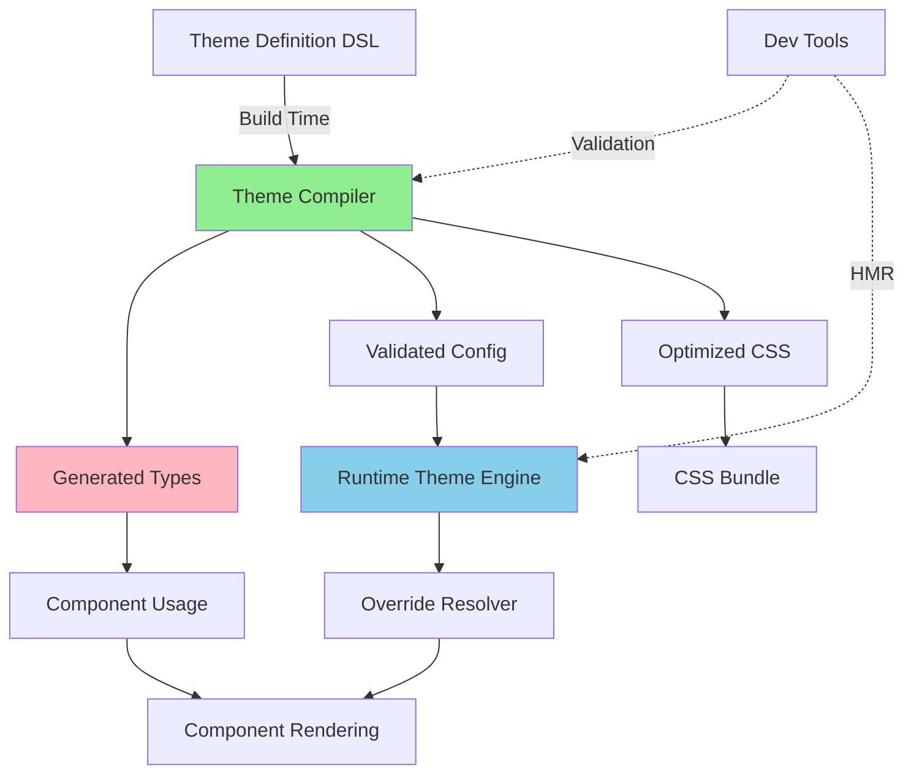

# Refined Theme System - Technical Design

## Overview

This document describes the technical architecture of the refined theme system, focusing on simplification, type safety, and build-time validation while maintaining full customizability.

---

## Architecture Diagram


```mermaid
graph TD
    A[Theme Definition DSL] -->|Build Time| B[Theme Compiler]
    B --> C[Generated Types]
    B --> D[Validated Config]
    B --> E[Optimized CSS]

    D --> F[Runtime Theme Engine]
    C --> G[Component Usage]
    E --> H[CSS Bundle]

    F --> I[Override Resolver]
    I --> J[Component Rendering]
    G --> J

    K[Dev Tools] -.->|Validation| B
    K -.->|HMR| F

    style B fill:#90EE90
    style C fill:#FFB6C1
    style F fill:#87CEEB
```

---

## Core Components

### 1. Theme DSL (`defineTheme`)

**Purpose**: Provide simple, typed API for theme authors.

**Interface**:

```typescript
// app/theme/_shared/define-theme.ts
export interface ThemeDefinition {
    name: string;
    displayName?: string;
    description?: string;

    // Color palette (auto-generates CSS variables)
    colors: {
        // Material Design 3 tokens
        primary: string;
        onPrimary?: string; // Auto-calculated if omitted
        primaryContainer?: string;
        onPrimaryContainer?: string;

        secondary: string;
        tertiary?: string;
        error?: string;

        surface: string;
        surfaceVariant?: string;
        onSurface?: string;

        outline?: string;

        // App-specific tokens
        success?: string;
        warning?: string;

        // Dark mode overrides (optional)
        dark?: Partial<typeof this>;
    };

    // Component overrides using CSS selector syntax
    overrides?: {
        [selector: string]: OverrideProps;
    };

    // Nuxt UI config extensions
    ui?: Record<string, unknown>;
}

/**
 * Override props that can be applied to components.
 * Uses proper Nuxt UI 3 type definitions where available.
 */
export interface OverrideProps {
    /** Component variant (e.g., 'solid', 'outline', 'ghost', 'soft', 'link') */
    variant?: string;

    /** Component size (e.g., 'xs', 'sm', 'md', 'lg', 'xl', '2xs', '2xl') */
    size?: string;

    /** Component color (e.g., 'primary', 'secondary', 'success', 'error', 'warning', 'info') */
    color?: string;

    /** Additional CSS classes */
    class?: string;

    /** Nuxt UI component-specific config object (passed to :ui prop) */
    ui?: Record<string, unknown>;

    /** Allow any additional component-specific props */
    [key: string]: unknown;
}

/**
 * Type-safe override props for specific Nuxt UI components.
 * Import actual component prop types from @nuxt/ui for full type safety.
 */
export type ComponentSpecificOverrides = {
    button?: Partial<import('@nuxt/ui').ButtonProps>;
    input?: Partial<import('@nuxt/ui').InputProps>;
    modal?: Partial<import('@nuxt/ui').ModalProps>;
    card?: Partial<import('@nuxt/ui').CardProps>;
    // Add other Nuxt UI components as needed
    [component: string]: Partial<Record<string, unknown>> | undefined;
};

export function defineTheme(config: ThemeDefinition): ThemeDefinition {
    // Runtime validation in dev
    if (import.meta.dev) {
        validateThemeDefinition(config);
    }
    return config;
}
```

**Example Usage**:

```typescript
// app/theme/nature/theme.ts
export default defineTheme({
    name: 'nature',
    displayName: 'Nature',
    description: 'Organic green theme with natural tones',

    colors: {
        primary: '#3f8452',
        secondary: '#5a7b62',
        tertiary: '#4a7c83',
        surface: '#f5faf5',
        success: '#4a9763',
        warning: '#c8931d',
        error: '#b5473c',

        // Dark mode (optional - auto-generated if omitted)
        dark: {
            primary: '#8dd29a',
            surface: '#0c130d',
        },
    },

    overrides: {
        // Simple global override
        button: {
            variant: 'forestSolid',
            size: 'md',
        },

        // Context-specific (simple syntax - auto-expanded to [data-context="chat"])
        'button.chat': {
            variant: 'mossGhost',
            size: 'sm',
        },

        // Identifier-specific (simple syntax - auto-expanded to [data-id="chat.send"])
        'button#chat.send': {
            variant: 'forestSolid',
            class: 'shadow-glow',
        },

        // State-based
        'button:hover': {
            class: 'shadow-intense',
        },

        // Advanced: Full attribute selector syntax (for power users)
        'input[data-context="chat"][type="text"]': {
            variant: 'neon',
        },

        // You can also mix simple and advanced syntax
        'button.sidebar:hover': {
            class: 'sidebar-hover-effect',
        },
    },
});
```

---

### 2. Theme Compiler (Build Time)

**Purpose**: Transform theme definitions into optimized runtime configs and generate types.

```typescript
// scripts/theme-compiler.ts
export class ThemeCompiler {
    /**
     * Compile all themes in app/theme/*
     */
    async compileAll(): Promise<CompilationResult> {
        const themes = await this.discoverThemes();
        const results: CompilationResult[] = [];

        for (const theme of themes) {
            results.push(await this.compileTheme(theme));
        }

        // Generate unified type definitions
        await this.generateTypes(results);

        return {
            themes: results,
            success: results.every((r) => r.errors.length === 0),
        };
    }

    /**
     * Compile single theme
     */
    private async compileTheme(
        themePath: string
    ): Promise<ThemeCompilationResult> {
        const definition = await import(themePath);
        const errors: ValidationError[] = [];
        const warnings: ValidationWarning[] = [];

        // 1. Validate structure
        this.validateStructure(definition, errors);

        // 2. Generate CSS variables
        const cssVars = this.generateCSSVariables(definition.colors);

        // 3. Compile overrides to runtime format
        const compiledOverrides = this.compileOverrides(definition.overrides);

        // 4. Validate CSS selectors
        this.validateSelectors(compiledOverrides, warnings);

        // 5. Calculate selector specificity
        const withSpecificity = this.addSpecificity(compiledOverrides);

        return {
            name: definition.name,
            cssVariables: cssVars,
            overrides: withSpecificity,
            errors,
            warnings,
        };
    }

    /**
     * Generate CSS variables from color palette
     */
    private generateCSSVariables(colors: ThemeDefinition['colors']): string {
        let css = '.light {\n';

        // Primary
        css += `  --md-primary: ${colors.primary};\n`;
        css += `  --md-on-primary: ${
            colors.onPrimary ?? this.contrast(colors.primary)
        };\n`;

        // Auto-generate missing colors
        // ...

        css += '}\n\n';

        // Dark mode
        if (colors.dark) {
            css += '.dark {\n';
            css += `  --md-primary: ${
                colors.dark.primary ?? this.adjustForDark(colors.primary)
            };\n`;
            // ...
            css += '}\n';
        }

        return css;
    }

    /**
     * Compile overrides from CSS selectors to runtime rules
     */
    private compileOverrides(
        overrides: ThemeDefinition['overrides']
    ): CompiledOverride[] {
        const compiled: CompiledOverride[] = [];

        for (const [selector, props] of Object.entries(overrides ?? {})) {
            // Parse selector
            const parsed = this.parseSelector(selector);

            compiled.push({
                component: parsed.component,
                context: parsed.context,
                state: parsed.state,
                identifier: parsed.identifier,
                props,
                selector: selector,
                specificity: this.calculateSpecificity(selector),
            });
        }

        return compiled;
    }

    /**
     * Parse CSS selector into override components
     *
     * Supports both simple and advanced syntax:
     * - Simple context: 'button.chat' → [data-context="chat"]
     * - Simple identifier: 'button#chat.send' → [data-id="chat.send"]
     * - Advanced: 'button[data-context="chat"]' → unchanged
     * - Mixed: 'button.chat:hover' → [data-context="chat"]:hover
     */
    private parseSelector(selector: string): ParsedSelector {
        // First, normalize simple syntax to attribute selectors
        let normalized = this.normalizeSelector(selector);

        // Examples after normalization:
        // 'button.chat' → 'button[data-context="chat"]'
        // 'button#chat.send' → 'button[data-id="chat.send"]'
        // 'button[data-context="chat"]' → unchanged
        // 'button.chat:hover' → 'button[data-context="chat"]:hover'

        const component = normalized.match(/^(\w+)/)?.[1] || 'button';
        const context = normalized.match(/data-context="([^"]+)"/)?.[1];
        const identifier = normalized.match(/data-id="([^"]+)"/)?.[1];
        const state = normalized.match(/:(\w+)/)?.[1];

        return { component, context, identifier, state };
    }

    /**
     * Normalize simple selector syntax to attribute selectors
     */
    private normalizeSelector(selector: string): string {
        let result = selector;

        // Convert .context to [data-context="context"]
        // Match: button.chat or button.sidebar
        result = result.replace(
            /(\w+)\.(\w+)(?=[:\[]|$)/g,
            (match, component, context) => {
                // Don't convert if it looks like a CSS class (e.g., .btn-primary)
                // Only convert known context names
                const knownContexts = [
                    'chat',
                    'sidebar',
                    'dashboard',
                    'header',
                    'global',
                ];
                if (knownContexts.includes(context)) {
                    return `${component}[data-context="${context}"]`;
                }
                return match; // Keep as-is if not a known context
            }
        );

        // Convert #identifier to [data-id="identifier"]
        // Match: button#chat.send or input#search.bar
        result = result.replace(
            /(\w+)#([\w.]+)(?=[:\[]|$)/g,
            '$1[data-id="$2"]'
        );

        return result;
    }

    /**
     * Calculate CSS selector specificity
     */
    private calculateSpecificity(selector: string): number {
        let specificity = 0;
        specificity += (selector.match(/\[/g) || []).length * 10; // attributes
        specificity += (selector.match(/:/g) || []).length * 10; // pseudo-classes
        specificity += 1; // element
        return specificity;
    }

    /**
     * Generate TypeScript type definitions
     */
    private async generateTypes(results: CompilationResult[]): Promise<void> {
        const identifiers = new Set<string>();
        const themeNames = new Set<string>();

        for (const result of results) {
            themeNames.add(result.name);

            for (const override of result.overrides) {
                if (override.identifier) {
                    identifiers.add(override.identifier);
                }
            }
        }

        const typeFile = `
// Auto-generated by theme compiler - do not edit
export type ThemeName = ${Array.from(themeNames)
            .map((n) => `'${n}'`)
            .join(' | ')};

export type ThemeIdentifier = ${Array.from(identifiers)
            .map((id) => `'${id}'`)
            .join(' | ')};

// Helper type for v-theme directive
export interface ThemeDirective {
  identifier?: ThemeIdentifier;
  context?: 'chat' | 'sidebar' | 'dashboard' | 'global';
}
`;

        await Bun.write('types/theme-generated.d.ts', typeFile);
    }
}
```

**Build Integration**:

```typescript
// vite.config.ts (or nuxt.config.ts)
import { ThemeCompiler } from './scripts/theme-compiler';

export default defineConfig({
    plugins: [
        {
            name: 'theme-compiler',
            async buildStart() {
                const compiler = new ThemeCompiler();
                const result = await compiler.compileAll();

                if (!result.success) {
                    this.error('Theme compilation failed');
                }
            },
            // HMR support
            handleHotUpdate({ file, server }) {
                if (file.includes('/theme/') && file.endsWith('theme.ts')) {
                    console.log('[HMR] Recompiling theme...');
                    new ThemeCompiler().compileAll();
                }
            },
        },
    ],
});
```

---

### 3. Runtime Override Resolver (Simplified)

**Purpose**: Resolve overrides at runtime using compiled config.

```typescript
// app/theme/_shared/runtime-resolver.ts
export class RuntimeResolver {
    private overrides: CompiledOverride[];

    constructor(compiledTheme: CompiledTheme) {
        // Sort by specificity (descending)
        this.overrides = [...compiledTheme.overrides].sort(
            (a, b) => b.specificity - a.specificity
        );
    }

    /**
     * Resolve overrides for a component instance
     */
    resolve(params: ResolveParams): ResolvedOverride {
        const matching: CompiledOverride[] = [];

        for (const override of this.overrides) {
            if (this.matches(override, params)) {
                matching.push(override);
            }
        }

        // Merge in specificity order (highest first)
        return this.merge(matching);
    }

    /**
     * Check if override matches component
     */
    private matches(
        override: CompiledOverride,
        params: ResolveParams
    ): boolean {
        // Component type must match
        if (override.component !== params.component) return false;

        // Context must match (if specified)
        if (override.context && override.context !== params.context)
            return false;

        // Identifier must match (if specified)
        if (override.identifier && override.identifier !== params.identifier)
            return false;

        // State must match (if specified)
        if (override.state && override.state !== params.state) return false;

        return true;
    }

    /**
     * Merge matching overrides (higher specificity wins)
     */
    private merge(overrides: CompiledOverride[]): ResolvedOverride {
        const merged: Record<string, unknown> = {};

        // Iterate in reverse (lowest specificity first, highest last)
        for (let i = overrides.length - 1; i >= 0; i--) {
            const override = overrides[i];

            for (const [key, value] of Object.entries(override.props)) {
                if (key === 'class') {
                    // Concatenate classes (highest specificity first)
                    merged[key] =
                        value + (merged[key] ? ` ${merged[key]}` : '');
                } else if (key === 'ui') {
                    // Deep merge ui objects
                    merged[key] = { ...merged[key], ...value };
                } else {
                    // Higher specificity wins
                    merged[key] = value;
                }
            }
        }

        return { props: merged };
    }
}
```

---

### 4. Auto-Theme Directive

**Purpose**: Apply theme overrides without wrapper components.

```typescript
// app/plugins/auto-theme.client.ts
export default defineNuxtPlugin((nuxtApp) => {
    const { activeTheme } = useTheme();

    nuxtApp.vueApp.directive('theme', {
        created(el, binding, vnode) {
            const instance = vnode.component;
            if (!instance) return;

            // Get component name
            const componentName =
                instance.type.name?.toLowerCase() ||
                vnode.type.__name?.toLowerCase() ||
                'button';

            // Get identifier from directive value
            const identifier =
                typeof binding.value === 'string'
                    ? binding.value
                    : binding.value?.identifier;

            // Detect context from DOM
            const context = detectContext(el);

            // Get current state (default to 'default')
            const state = ref('default');

            // Resolve overrides
            const resolver = getResolver(activeTheme.value);
            const resolved = resolver.resolve({
                component: componentName,
                context,
                identifier,
                state: state.value,
            });

            // Merge with existing props (props win)
            const existingProps = instance.props;
            const mergedProps = { ...resolved.props };

            for (const [key, value] of Object.entries(existingProps)) {
                if (value !== undefined) {
                    if (key === 'class') {
                        mergedProps[key] = `${
                            resolved.props.class || ''
                        } ${value}`.trim();
                    } else {
                        mergedProps[key] = value; // prop wins
                    }
                }
            }

            // Apply to component
            Object.assign(instance.props, mergedProps);

            // Watch for theme changes
            watch(activeTheme, () => {
                const newResolver = getResolver(activeTheme.value);
                const newResolved = newResolver.resolve({
                    component: componentName,
                    context,
                    identifier,
                    state: state.value,
                });
                Object.assign(instance.props, newResolved.props);
            });
        },
    });
});

function detectContext(el: HTMLElement): string {
    if (el.closest('#app-chat-container')) return 'chat';
    if (el.closest('#app-sidebar')) return 'sidebar';
    if (el.closest('#app-dashboard-modal')) return 'dashboard';
    return 'global';
}
```

---

### 5. Test Utilities

**Purpose**: Simplify testing themed components.

```typescript
// tests/utils/theme-test-utils.ts
export function mockTheme(themeName: string = 'default') {
    return {
        install(app: App) {
            app.provide('theme', {
                activeTheme: ref(themeName),
                current: ref('light'),
                // ... other theme plugin methods
            });
        },
    };
}

export function mockThemeOverrides(overrides: Partial<OverrideProps> = {}) {
    return {
        overrides: ref({
            variant: 'solid',
            size: 'md',
            ...overrides,
        }),
        debug: ref({
            component: 'button',
            context: 'global',
            theme: 'default',
            mode: 'light' as const,
            state: 'default' as ComponentState,
            identifier: undefined,
            appliedRules: 0,
            cacheKey: 'mock',
        }),
    };
}

export function setActiveTheme(wrapper: VueWrapper, themeName: string) {
    wrapper.vm.$theme.activeTheme.value = themeName;
}
```

**Usage**:

```typescript
// Component.test.ts
import { mockTheme, mockThemeOverrides } from '@/tests/utils/theme-test-utils';

describe('MyComponent', () => {
    it('applies nature theme overrides', () => {
        const wrapper = mount(MyComponent, {
            global: {
                plugins: [mockTheme('nature')],
            },
        });

        expect(wrapper.classes()).toContain('nature-specific');
    });

    it('handles theme overrides', () => {
        vi.mocked(useThemeOverrides).mockReturnValue(
            mockThemeOverrides({ variant: 'neon', size: 'lg' })
        );

        const wrapper = mount(MyComponent);
        // assertions...
    });
});
```

---

## Selector Syntax Guide

The theme DSL supports both **simple** and **advanced** selector syntax, giving you flexibility based on your needs.

### Simple Syntax (Recommended for most cases)

**Context Targeting:**

```typescript
'button.chat': { variant: 'neon' }
// Auto-expanded to: button[data-context="chat"]
```

**Identifier Targeting:**

```typescript
'button#chat.send': { variant: 'solid' }
// Auto-expanded to: button[data-id="chat.send"]
```

**With States:**

```typescript
'button.chat:hover': { class: 'glow' }
// Auto-expanded to: button[data-context="chat"]:hover
```

**Known Contexts:**

-   `.chat` → `[data-context="chat"]`
-   `.sidebar` → `[data-context="sidebar"]`
-   `.dashboard` → `[data-context="dashboard"]`
-   `.header` → `[data-context="header"]`
-   `.global` → `[data-context="global"]`

### Advanced Syntax (For power users)

**Full Attribute Selectors:**

```typescript
'input[data-context="chat"][type="text"]': { variant: 'neon' }
// Used as-is (not expanded)
```

**Complex Combinations:**

```typescript
'button[data-context="chat"][disabled]': { class: 'opacity-50' }
```

### Mixing Both Syntaxes

You can use both in the same theme:

```typescript
overrides: {
  // Simple syntax for common cases
  'button.chat': { variant: 'neon' },
  'input.sidebar': { size: 'sm' },

  // Advanced syntax when you need more control
  'button[data-context="chat"][type="submit"]': { variant: 'solid' },
  'input[data-context="sidebar"][disabled]': { class: 'opacity-50' },
}
```

### Specificity Rules

Both syntaxes follow CSS specificity rules:

-   Element: `button` (specificity: 1)
-   With context: `button.chat` (specificity: 11)
-   With identifier: `button#chat.send` (specificity: 21)
-   With state: `button.chat:hover` (specificity: 21)

**Higher specificity always wins!**

---

## Data Flow

### Theme Loading Flow

```typescript
1. Build Time:
   Theme Definition (DSL)
   → Theme Compiler
   → Validated Config + Generated CSS + TypeScript Types

2. Runtime (Initial):
   App Start
   → Load Active Theme Config
   → Initialize Runtime Resolver
   → Apply CSS Variables to :root

3. Component Render:
   Component Mount
   → Detect Context from DOM
   → Get Identifier from v-theme directive (optional)
   → Resolve Overrides via Runtime Resolver
   → Merge with Component Props (props win)
   → Render with Merged Props

4. Theme Switch:
   User Selects New Theme
   → Load New Theme Config (from cache or disk)
   → Swap Runtime Resolver
   → Update CSS Variables
   → Re-resolve All Mounted Components
   → Re-render (Vue reactivity)
```

---

## Error Handling

### Build-Time Errors

```typescript
export interface ValidationError {
    severity: 'error' | 'warning';
    code: string;
    message: string;
    file: string;
    line?: number;
    suggestion?: string;
    docsUrl?: string;
}

// Example errors
const errors = {
    MISSING_COLOR: {
        code: 'THEME_001',
        message: 'Required color "primary" is missing',
        suggestion: 'Add primary: "#hexcolor" to colors object',
        docsUrl: 'https://docs.../themes/colors',
    },

    INVALID_SELECTOR: {
        code: 'THEME_002',
        message: 'Invalid CSS selector syntax',
        suggestion: 'Use format: component[attribute="value"]:state',
        docsUrl: 'https://docs.../themes/selectors',
    },

    UNKNOWN_IDENTIFIER: {
        code: 'THEME_003',
        message: 'Identifier not registered in any theme',
        suggestion: 'Check spelling or add to theme config',
        docsUrl: 'https://docs.../themes/identifiers',
    },
};
```

### Runtime Error Handling

```typescript
// Graceful degradation
try {
    const overrides = resolver.resolve(params);
    return overrides;
} catch (error) {
    if (import.meta.dev) {
        console.error('[theme] Override resolution failed:', error);
    }
    // Return empty overrides - component uses defaults
    return { props: {} };
}
```

---

## Performance Optimizations

### 1. Compiled Overrides

Overrides are pre-compiled at build time with specificity calculated. Runtime only does matching and merging.

### 2. Computed Caching

Vue's computed refs handle caching automatically. No manual cache needed.

### 3. CSS Variables

Use CSS custom properties for colors instead of runtime JS style injection.

### 4. Selector Matching

O(n) linear scan through sorted overrides. Fast enough for n < 100.

---

## Migration Strategy

### Phase 1: Side-by-side

1. Install refined system alongside current system
2. Add `@refined` suffix to new files
3. Migrate one theme to new DSL (e.g., nature)
4. Test thoroughly in production
5. Gather feedback

### Phase 2: Incremental Migration

1. Add compatibility layer to load old configs
2. Migrate themes one-by-one
3. Update documentation with migration guide
4. Deprecate old APIs but don't remove

### Phase 3: Cleanup

1. Remove wrapper components
2. Remove old override system
3. Delete compatibility layer
4. Update all documentation

---

## Testing Strategy

### Unit Tests

-   Theme compiler validation
-   CSS selector parsing
-   Override merging logic
-   Type generation

### Integration Tests

-   Component receives correct overrides
-   Context detection works
-   Identifier matching works
-   Theme switching updates components

### E2E Tests

-   Theme switch doesn't break UI
-   Identifiers work in real components
-   Performance benchmarks

---

## Monitoring

### Build Metrics

-   Theme compilation time
-   Generated bundle sizes
-   Number of validation errors/warnings

### Runtime Metrics

-   Override resolution time (p50, p95, p99)
-   Theme switch time
-   Memory usage per theme

### Developer Metrics

-   Time to create new theme (survey)
-   Error rate (theme validation failures)
-   Developer satisfaction (survey)

---

## Future Enhancements

1. **Visual Theme Editor** - GUI for non-developers
2. **Theme Variants** - Light/dark/hc as variants not separate themes
3. **Dynamic Theme Generation** - AI-powered theme creation
4. **Theme Marketplace** - Share and discover themes
5. **Per-User Customization** - Runtime theme tweaking
6. **CSS Variables Fallback** - For older browsers

---

## References

-   Material Design 3 Color System
-   CSS Selector Specificity Rules
-   Vue 3 Directive API
-   Vite Plugin Development Guide
