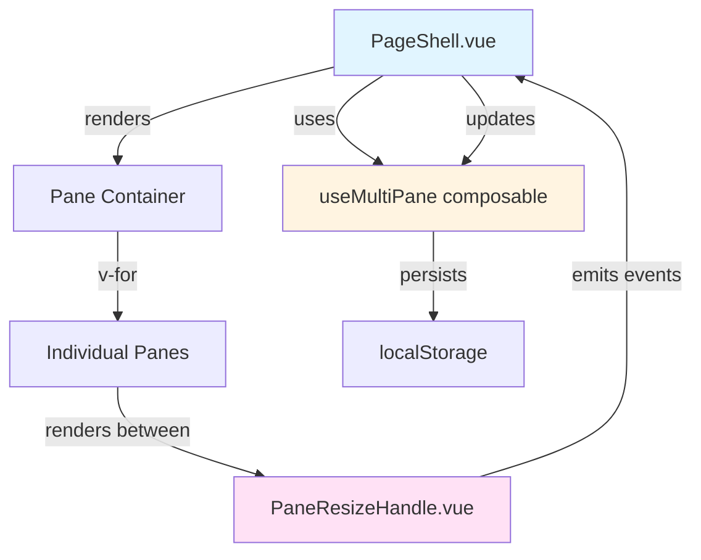
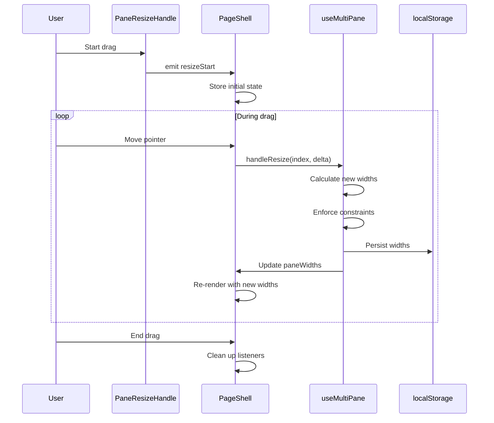

# Resizable Multipane Windows - Technical Design

## Overview

This document describes the technical implementation for making multipane windows resizable in OR3.chat. The application currently uses a `flex-1` layout where panes share available space equally. This design introduces a minimal, performant resizing system that reuses patterns from the existing `ResizableSidebarLayout` component.

### Key Design Principles

1. **Minimal Code**: Reuse existing patterns from `ResizableSidebarLayout.vue` and `ResizeHandle.vue`
2. **Invisible by Default**: Resize handles are completely invisible until hover to avoid visual clutter and content overlap
3. **Precision Hover Zone**: Handles appear when hovering within 1.5-2px of pane borders for intuitive discovery
4. **No Content Overlap**: Indicators positioned exactly on borders, never overlapping pane content
5. **Performance First**: Use CSS-based width updates, avoid unnecessary re-renders
6. **Simple State**: Store pane widths as pixel values, persist to localStorage
7. **Smooth UX**: Smooth transitions for handle appearance/disappearance, 60fps resize performance

### UX Philosophy

Unlike the sidebar resize handle (which is always visible), pane resize handles use an **invisible-by-default** approach:

- **Problem**: Visible handles between panes could overlap UI elements within panes (buttons, text, interactive components)
- **Solution**: Handles are invisible until the user hovers near the border
- **Benefit**: Clean interface with no visual clutter, discoverable on-demand
- **Implementation**: Extended hit area (4px wide) with smooth CSS transitions for indicator appearance

### Technology Stack

- **Framework**: Vue 3 (Composition API) with Nuxt 4
- **Styling**: Tailwind CSS with existing design tokens
- **State Management**: Existing `useMultiPane` composable (minimal modifications)
- **Storage**: localStorage (following existing patterns)
- **Events**: Pointer Events API (same as sidebar resize)

## Architecture

### High-Level Component Flow



### Component Responsibilities

| Component | Responsibility |
|-----------|---------------|
| `PageShell.vue` | Orchestrates pane layout, handles resize events, manages state coordination |
| `PaneResizeHandle.vue` | Renders resize handle UI, captures pointer/keyboard events, provides visual feedback |
| `useMultiPane` (enhanced) | Manages pane widths, enforces constraints, persists state, handles calculations |
| Existing pane components | No changes required - remain unaware of resize functionality |

## Core Components

### 1. PaneResizeHandle Component

Create a new component with an invisible-by-default approach that only shows on hover:

```typescript
// app/components/panes/PaneResizeHandle.vue

<template>
    <div
        v-if="isDesktop && paneCount > 1"
        class="pane-resize-handle absolute top-0 bottom-0 w-1 cursor-col-resize select-none group z-20 -right-0.5"
        @pointerdown="onPointerDown"
        @mouseenter="isHovered = true"
        @mouseleave="isHovered = false"
        role="separator"
        aria-orientation="vertical"
        :aria-label="`Resize pane ${paneIndex + 1}`"
        tabindex="0"
        @keydown="onHandleKeydown"
    >
        <!-- Invisible hit area that extends 1.5-2px on each side -->
        <div
            class="absolute inset-y-0 -left-[2px] -right-[2px] pointer-events-auto"
        ></div>
        
        <!-- Visible indicator (only on hover or focus) -->
        <div
            :class="[
                'absolute inset-y-0 my-auto h-24 rounded-full transition-all duration-200',
                isHovered || isFocused
                    ? 'w-1.5 bg-[var(--md-primary)] opacity-100'
                    : 'w-0 opacity-0'
            ]"
        ></div>
    </div>
</template>

<script setup lang="ts">
import { ref } from 'vue';

interface Props {
    paneIndex: number;
    paneCount: number;
    isDesktop: boolean;
}

const props = defineProps<Props>();

const emit = defineEmits<{
    resizeStart: [event: PointerEvent, paneIndex: number];
    resizeKeydown: [event: KeyboardEvent, paneIndex: number];
}>();

const isHovered = ref(false);
const isFocused = ref(false);

function onPointerDown(e: PointerEvent) {
    emit('resizeStart', e, props.paneIndex);
}

function onHandleKeydown(e: KeyboardEvent) {
    emit('resizeKeydown', e, props.paneIndex);
}

// Track focus state for keyboard users
if (import.meta.client) {
    const handleFocusIn = () => (isFocused.value = true);
    const handleFocusOut = () => (isFocused.value = false);
    
    onMounted(() => {
        const el = document.querySelector('.pane-resize-handle');
        if (el) {
            el.addEventListener('focusin', handleFocusIn);
            el.addEventListener('focusout', handleFocusOut);
        }
    });
    
    onBeforeUnmount(() => {
        const el = document.querySelector('.pane-resize-handle');
        if (el) {
            el.removeEventListener('focusin', handleFocusIn);
            el.removeEventListener('focusout', handleFocusOut);
        }
    });
}
</script>

<style scoped>
.pane-resize-handle {
    /* Position on the exact border */
    transform: translateX(50%);
}
</style>
```

**Key Design Decisions:**
- **Invisible by default**: Handle is transparent (w-0, opacity-0) until hover/focus
- **Extended hit area**: Invisible div extends 2px on each side of border for easy targeting
- **Smooth appearance**: Transitions from invisible to 1.5px wide primary-colored indicator
- **Hover reveals**: When mouse enters the 4px-wide hit area, indicator smoothly appears
- **Focus support**: Keyboard users see the indicator when handle has focus
- **Non-overlapping**: Positioned exactly on the border, won't overlap pane content
- **Primary color on hover**: Uses theme's primary color for consistency with active elements
- Only renders on desktop when multiple panes exist

### 2. Enhanced PageShell Layout

Modify `PageShell.vue` to integrate resize handles:

```typescript
// app/components/PageShell.vue (modified section)

<div
    v-for="(pane, i) in panes"
    :key="pane.id"
    class="relative flex flex-col border-l-2 first:border-l-0 outline-none focus-visible:ring-0"
    :style="{ width: getPaneWidth(i) }"
    :class="[
        i === activePaneIndex && panes.length > 1
            ? 'pane-active border-[var(--md-primary)] bg-[var(--md-surface-variant)]/10'
            : 'border-[var(--md-inverse-surface)]',
        'transition-colors',
    ]"
    tabindex="0"
    @focus="setActive(i)"
    @click="setActive(i)"
>
    <!-- Existing pane content -->
    <div v-if="panes.length > 1" class="absolute top-1 right-1 z-10">
        <!-- Close button (existing) -->
    </div>

    <component
        :is="resolvePaneComponent(pane)"
        v-bind="buildPaneProps(pane, i)"
        class="flex-1 min-h-0"
    />

    <!-- Resize handle (only between panes, not after the last one) -->
    <PaneResizeHandle
        v-if="i < panes.length - 1"
        :pane-index="i"
        :pane-count="panes.length"
        :is-desktop="!isMobile"
        @resize-start="onPaneResizeStart"
        @resize-keydown="onPaneResizeKeydown"
    />
</div>
```

**Key Changes:**
- Replace `flex-1` with dynamic `width` style from `getPaneWidth(i)`
- Add `PaneResizeHandle` component after each pane except the last
- Remove `min-w-0` from pane containers (handled by width constraints)
- Preserve all existing classes, events, and structure

### 3. Enhanced useMultiPane Composable

Add width management to the existing composable:

```typescript
// app/composables/core/useMultiPane.ts (additions)

interface PaneState {
    // ... existing fields
    width?: number; // width in pixels (undefined means use default)
}

interface UseMultiPaneOptions {
    // ... existing options
    defaultPaneWidth?: number;
    minPaneWidth?: number;
    maxPaneWidth?: number;
    storageKey?: string;
}

export function useMultiPane(options: UseMultiPaneOptions) {
    // ... existing code

    // New width management state
    const paneWidths = ref<number[]>([]);
    const minPaneWidth = options.minPaneWidth ?? 280;
    const maxPaneWidth = options.maxPaneWidth ?? 2000;
    const storageKey = options.storageKey ?? 'pane-widths';
    
    // Restore widths from localStorage
    function restoreWidths() {
        if (!process.client) return;
        try {
            const saved = localStorage.getItem(storageKey);
            if (saved) {
                const parsed = JSON.parse(saved);
                if (Array.isArray(parsed)) {
                    paneWidths.value = parsed.map(w => clampWidth(w));
                }
            }
        } catch (e) {
            console.warn('[useMultiPane] Failed to restore widths:', e);
        }
    }

    // Persist widths to localStorage
    function persistWidths() {
        if (!process.client) return;
        try {
            localStorage.setItem(storageKey, JSON.stringify(paneWidths.value));
        } catch (e) {
            console.warn('[useMultiPane] Failed to persist widths:', e);
        }
    }

    // Clamp width to min/max constraints
    function clampWidth(width: number): number {
        return Math.max(minPaneWidth, Math.min(maxPaneWidth, width));
    }

    // Calculate width for a specific pane
    function getPaneWidth(index: number): string {
        if (panes.value.length === 0) return '100%';
        if (panes.value.length === 1) return '100%';
        
        // If we have stored widths matching pane count, use them
        if (paneWidths.value.length === panes.value.length) {
            return `${paneWidths.value[index]}px`;
        }
        
        // Default: equal distribution
        return `${100 / panes.value.length}%`;
    }

    // Handle resize drag
    function handleResize(paneIndex: number, deltaX: number) {
        if (paneIndex >= panes.value.length - 1) return;
        
        // Initialize widths array if needed
        if (paneWidths.value.length !== panes.value.length) {
            initializeWidths();
        }
        
        // Calculate new widths
        const currentWidth = paneWidths.value[paneIndex];
        const nextWidth = paneWidths.value[paneIndex + 1];
        
        const newCurrentWidth = clampWidth(currentWidth + deltaX);
        const actualDelta = newCurrentWidth - currentWidth;
        const newNextWidth = clampWidth(nextWidth - actualDelta);
        
        // Only update if both constraints are satisfied
        if (newCurrentWidth >= minPaneWidth && newNextWidth >= minPaneWidth) {
            paneWidths.value[paneIndex] = newCurrentWidth;
            paneWidths.value[paneIndex + 1] = newNextWidth;
            persistWidths();
        }
    }

    // Initialize widths based on current container size
    function initializeWidths() {
        const container = document.querySelector('.pane-container');
        if (!container) return;
        
        const totalWidth = container.clientWidth;
        const paneCount = panes.value.length;
        const equalWidth = Math.floor(totalWidth / paneCount);
        
        paneWidths.value = new Array(paneCount).fill(clampWidth(equalWidth));
    }

    // Handle pane addition
    function addPane() {
        // ... existing addPane logic
        
        // Adjust widths for new pane
        if (paneWidths.value.length > 0) {
            // Take space proportionally from existing panes
            const totalWidth = paneWidths.value.reduce((sum, w) => sum + w, 0);
            const newPaneWidth = clampWidth(totalWidth / (panes.value.length + 1));
            const reductionPerPane = newPaneWidth / panes.value.length;
            
            paneWidths.value = paneWidths.value.map(w => 
                clampWidth(w - reductionPerPane)
            );
            paneWidths.value.push(newPaneWidth);
            persistWidths();
        }
    }

    // Handle pane removal
    function closePane(index: number) {
        // ... existing closePane logic
        
        // Redistribute width to remaining panes
        if (paneWidths.value.length > index) {
            const removedWidth = paneWidths.value[index];
            paneWidths.value.splice(index, 1);
            
            if (paneWidths.value.length > 0) {
                const additionPerPane = removedWidth / paneWidths.value.length;
                paneWidths.value = paneWidths.value.map(w => 
                    clampWidth(w + additionPerPane)
                );
            }
            persistWidths();
        }
    }

    // Initialize on mount
    onMounted(() => {
        restoreWidths();
        
        // Handle window resize
        const handleWindowResize = () => {
            if (paneWidths.value.length === panes.value.length) {
                // Validate widths still fit in container
                const container = document.querySelector('.pane-container');
                if (container) {
                    const totalWidth = container.clientWidth;
                    const currentTotal = paneWidths.value.reduce((sum, w) => sum + w, 0);
                    
                    if (currentTotal !== totalWidth) {
                        // Proportionally adjust all panes
                        const scale = totalWidth / currentTotal;
                        paneWidths.value = paneWidths.value.map(w => 
                            clampWidth(w * scale)
                        );
                        persistWidths();
                    }
                }
            }
        };
        
        window.addEventListener('resize', handleWindowResize);
        onBeforeUnmount(() => window.removeEventListener('resize', handleWindowResize));
    });

    return {
        // ... existing exports
        getPaneWidth,
        handleResize,
        paneWidths,
    };
}
```

**Key Design Decisions:**
- Store widths as pixel values for precision
- Clamp all width calculations to enforce min/max constraints
- When adding a pane, take space proportionally from all existing panes
- When removing a pane, distribute its space to remaining panes
- Handle window resize by proportionally scaling all panes
- Persist to localStorage after every change

### 4. Resize Event Handling in PageShell

Add resize logic to `PageShell.vue`:

```typescript
// app/components/PageShell.vue (script additions)

// Resize state
let resizingPaneIndex: number | null = null;
let resizeStartX = 0;
let resizeStartWidths: number[] = [];

function onPaneResizeStart(event: PointerEvent, paneIndex: number) {
    if (!isDesktop.value) return;
    
    // Capture pointer to this element
    (event.target as Element).setPointerCapture?.(event.pointerId);
    
    // Store initial state
    resizingPaneIndex = paneIndex;
    resizeStartX = event.clientX;
    resizeStartWidths = [...paneWidths.value];
    
    // Add move and up listeners
    window.addEventListener('pointermove', onPaneResizeMove);
    window.addEventListener('pointerup', onPaneResizeEnd, { once: true });
}

function onPaneResizeMove(event: PointerEvent) {
    if (resizingPaneIndex === null) return;
    
    const deltaX = event.clientX - resizeStartX;
    handleResize(resizingPaneIndex, deltaX);
}

function onPaneResizeEnd() {
    resizingPaneIndex = null;
    window.removeEventListener('pointermove', onPaneResizeMove);
}

function onPaneResizeKeydown(event: KeyboardEvent, paneIndex: number) {
    if (!isDesktop.value) return;
    
    const step = event.shiftKey ? 32 : 16;
    let deltaX = 0;
    
    if (event.key === 'ArrowLeft') {
        event.preventDefault();
        deltaX = -step;
    } else if (event.key === 'ArrowRight') {
        event.preventDefault();
        deltaX = step;
    } else if (event.key === 'Home') {
        event.preventDefault();
        // Set to minimum width - calculate delta
        const currentWidth = paneWidths.value[paneIndex];
        deltaX = minPaneWidth - currentWidth;
    } else if (event.key === 'End') {
        event.preventDefault();
        // Set to maximum possible width
        const nextWidth = paneWidths.value[paneIndex + 1];
        const available = paneWidths.value[paneIndex] + nextWidth - minPaneWidth;
        deltaX = available - paneWidths.value[paneIndex];
    }
    
    if (deltaX !== 0) {
        handleResize(paneIndex, deltaX);
    }
}

// Cleanup on unmount
onBeforeUnmount(() => {
    window.removeEventListener('pointermove', onPaneResizeMove);
    window.removeEventListener('pointerup', onPaneResizeEnd);
});
```

**Key Design Decisions:**
- Use pointer events for consistent mouse/touch handling
- Capture pointer to handle drags that leave the handle area
- Store initial widths to enable potential drag cancellation
- Keyboard support mirrors sidebar resize behavior
- Clean up event listeners on component unmount

## Data Models

### Pane Width Storage

```typescript
// localStorage key: 'pane-widths'
// Value: JSON array of pixel widths

// Example with 2 panes:
[450, 850]

// Example with 3 panes:
[400, 500, 600]
```

### Configuration Constants

```typescript
interface PaneResizeConfig {
    minPaneWidth: 280;        // Minimum pane width in pixels
    maxPaneWidth: 2000;       // Maximum pane width in pixels  
    keyboardStep: 16;         // Pixels to move per arrow key
    keyboardStepLarge: 32;    // Pixels to move per Shift+arrow
    storageKey: 'pane-widths'; // localStorage key
}
```

## State Management Flow



## Error Handling

### Constraint Violations

```typescript
function handleResize(paneIndex: number, deltaX: number) {
    // Guard against invalid index
    if (paneIndex < 0 || paneIndex >= panes.value.length - 1) {
        console.warn('[useMultiPane] Invalid pane index for resize:', paneIndex);
        return;
    }
    
    // Guard against uninitialized state
    if (paneWidths.value.length !== panes.value.length) {
        initializeWidths();
    }
    
    // Calculate with clamping
    const currentWidth = paneWidths.value[paneIndex];
    const nextWidth = paneWidths.value[paneIndex + 1];
    
    const newCurrentWidth = clampWidth(currentWidth + deltaX);
    const actualDelta = newCurrentWidth - currentWidth;
    const newNextWidth = clampWidth(nextWidth - actualDelta);
    
    // Only apply if both constraints satisfied
    if (newCurrentWidth >= minPaneWidth && newNextWidth >= minPaneWidth) {
        paneWidths.value[paneIndex] = newCurrentWidth;
        paneWidths.value[paneIndex + 1] = newNextWidth;
        persistWidths();
    } else {
        // Constraint violation - do nothing (silently ignore)
        if (import.meta.dev) {
            console.debug('[useMultiPane] Resize constraint violated, ignoring delta:', {
                paneIndex,
                deltaX,
                currentWidth,
                nextWidth,
                newCurrentWidth,
                newNextWidth,
                minPaneWidth
            });
        }
    }
}
```

### Storage Failures

```typescript
function persistWidths() {
    if (!process.client) return;
    
    try {
        localStorage.setItem(storageKey, JSON.stringify(paneWidths.value));
    } catch (e) {
        // Handle quota exceeded or disabled localStorage
        if (e instanceof DOMException && e.name === 'QuotaExceededError') {
            console.warn('[useMultiPane] localStorage quota exceeded, widths will not persist');
        } else {
            console.warn('[useMultiPane] Failed to persist widths:', e);
        }
        // Continue without persistence - app remains functional
    }
}

function restoreWidths() {
    if (!process.client) return;
    
    try {
        const saved = localStorage.getItem(storageKey);
        if (!saved) return;
        
        const parsed = JSON.parse(saved);
        if (!Array.isArray(parsed)) {
            console.warn('[useMultiPane] Invalid stored widths format, ignoring');
            return;
        }
        
        // Validate each width
        const valid = parsed.every(w => typeof w === 'number' && w > 0);
        if (!valid) {
            console.warn('[useMultiPane] Invalid stored width values, ignoring');
            return;
        }
        
        paneWidths.value = parsed.map(w => clampWidth(w));
    } catch (e) {
        console.warn('[useMultiPane] Failed to restore widths:', e);
        // Fall back to equal distribution
    }
}
```

### Pane Count Mismatch

```typescript
function getPaneWidth(index: number): string {
    const paneCount = panes.value.length;
    
    // Single pane or no panes
    if (paneCount <= 1) return '100%';
    
    // Stored widths match current pane count
    if (paneWidths.value.length === paneCount && 
        index >= 0 && 
        index < paneWidths.value.length) {
        return `${paneWidths.value[index]}px`;
    }
    
    // Mismatch - fall back to equal distribution
    if (import.meta.dev && paneWidths.value.length > 0) {
        console.debug('[useMultiPane] Pane count mismatch, using equal distribution:', {
            storedCount: paneWidths.value.length,
            actualCount: paneCount
        });
    }
    
    return `${100 / paneCount}%`;
}
```

## Testing Strategy

### Unit Tests

**Test Suite 1: Width Calculations** (`useMultiPane.test.ts`)
- Test `clampWidth` enforces min/max constraints
- Test `getPaneWidth` returns correct values for 1, 2, 3 panes
- Test `handleResize` correctly updates both affected panes
- Test `handleResize` respects minimum width constraints
- Test `handleResize` handles invalid indices gracefully

**Test Suite 2: State Persistence** (`useMultiPane.test.ts`)
- Test `persistWidths` writes to localStorage
- Test `restoreWidths` reads from localStorage
- Test graceful handling of corrupted localStorage data
- Test graceful handling of quota exceeded errors
- Test state remains functional when localStorage is disabled

**Test Suite 3: Pane Addition/Removal** (`useMultiPane.test.ts`)
- Test adding a pane redistributes widths correctly
- Test removing a pane redistributes widths to remaining panes
- Test removing middle pane in 3-pane layout
- Test adding pane when no stored widths exist

### Integration Tests

**Test Suite 4: Component Integration** (`PaneResizeHandle.test.ts`)
- Test resize handle renders between panes
- Test resize handle does not render on mobile
- Test resize handle emits correct events on pointer down
- Test resize handle emits correct events on keyboard input
- Test resize handle has correct ARIA attributes

**Test Suite 5: PageShell Integration** (`PageShell.test.ts`)
- Test panes render with correct widths
- Test dragging resize handle updates pane widths
- Test keyboard resize updates pane widths
- Test window resize adjusts pane widths proportionally
- Test resize interaction doesn't interfere with sidebar

### End-to-End Tests

**Test Suite 6: User Workflows** (Vitest + Testing Library)
- Test user can drag resize handle to adjust pane widths
- Test adjusted widths persist across page reload
- Test adding/removing panes maintains reasonable layout
- Test resize works correctly with 2 and 3 panes
- Test keyboard navigation through resize handles

### Performance Tests

**Test Suite 7: Performance Benchmarks**
- Measure frame rate during resize drag (target: 60fps)
- Measure bundle size increase (target: < 5KB gzipped)
- Measure memory usage during 100 resize operations (no leaks)
- Measure time to restore widths from localStorage (< 10ms)

## Performance Optimizations

### 1. CSS-Based Width Updates

```typescript
// Use inline styles instead of class manipulation
:style="{ width: getPaneWidth(i) }"

// Benefits:
// - Direct style update, no class recalculation
// - No CSS selector matching overhead
// - Browser can optimize style updates
```

### 2. Computed Width Memoization

```typescript
// Cache width calculations to avoid repeated work
const paneWidthCache = new Map<number, string>();

function getPaneWidth(index: number): string {
    const key = `${panes.value.length}-${index}-${paneWidths.value.join(',')}`;
    
    if (paneWidthCache.has(key)) {
        return paneWidthCache.get(key)!;
    }
    
    const width = calculateWidth(index);
    paneWidthCache.set(key, width);
    return width;
}
```

### 3. Throttled Persistence

```typescript
// Avoid excessive localStorage writes during drag
let persistTimer: NodeJS.Timeout | null = null;

function persistWidths() {
    if (!process.client) return;
    
    // Clear existing timer
    if (persistTimer) {
        clearTimeout(persistTimer);
    }
    
    // Debounce persistence by 100ms
    persistTimer = setTimeout(() => {
        try {
            localStorage.setItem(storageKey, JSON.stringify(paneWidths.value));
        } catch (e) {
            console.warn('[useMultiPane] Failed to persist widths:', e);
        }
        persistTimer = null;
    }, 100);
}
```

### 4. Prevent Unnecessary Re-renders

```typescript
// Use watchEffect with flush: 'post' to batch updates
watchEffect(() => {
    // Only update if actually changed
    const newWidths = calculateWidths();
    if (JSON.stringify(newWidths) !== JSON.stringify(paneWidths.value)) {
        paneWidths.value = newWidths;
    }
}, { flush: 'post' });
```

## Accessibility Considerations

### ARIA Attributes

```html
<div
    role="separator"
    aria-orientation="vertical"
    :aria-label="`Resize pane ${paneIndex + 1}`"
    :aria-valuenow="paneWidths[paneIndex]"
    :aria-valuemin="minPaneWidth"
    :aria-valuemax="maxPaneWidth"
    aria-controls="pane-container"
    tabindex="0"
>
```

### Focus Management

- Resize handles included in tab order after pane content
- Visible focus indicator (browser default or custom ring)
- Focus remains on handle during keyboard resize
- Screen reader announces width changes (optional)

### Keyboard Support

| Key | Action |
|-----|--------|
| `Arrow Left/Right` | Resize by 16px |
| `Shift + Arrow Left/Right` | Resize by 32px |
| `Home` | Set to minimum width |
| `End` | Set to maximum width |
| `Escape` | Cancel resize (future enhancement) |
| `Tab` | Move to next focusable element |

## Browser Compatibility

### Supported Browsers
- Chrome 90+
- Firefox 88+
- Safari 14+
- Edge 90+

### Fallback Behavior
- Older browsers without pointer events: Fall back to mouse events
- Browsers without localStorage: Widths default to equal distribution
- Mobile browsers: Resize handles hidden, existing mobile layout used

### Polyfills Required
- None (all APIs are well-supported)

## Migration and Rollout

### Phase 1: Implementation (No User Impact)
1. Create `PaneResizeHandle.vue` component
2. Enhance `useMultiPane` composable with width management
3. Add resize event handlers to `PageShell.vue`
4. Add unit tests for new logic

### Phase 2: Integration (Visual Changes)
1. Integrate resize handles into `PageShell.vue` template
2. Replace `flex-1` with dynamic widths
3. Test on desktop and mobile
4. Validate performance with Chrome DevTools

### Phase 3: Testing and Refinement
1. Conduct integration tests
2. Gather performance metrics
3. Test keyboard accessibility
4. Refine constraints and defaults based on testing

### Phase 4: Documentation
1. Update inline code comments
2. Document new APIs in composable
3. Add usage examples for future developers
4. Update any relevant end-user documentation

## Future Enhancements

### Possible Future Features (Out of Scope)
- Double-click resize handle to reset to equal widths
- Drag cancellation with Escape key
- Visual preview during drag (ghost handle)
- Preset width layouts (e.g., "focus mode" - 70/30 split)
- Per-user preference for default widths
- Responsive breakpoint adjustments (tablet-specific widths)
- Animated width transitions on pane add/remove
- Touch gestures for mobile resize (pinch between panes)

### Performance Monitoring
- Add telemetry for resize operations (frequency, duration)
- Monitor localStorage usage and quota
- Track constraint violation frequency
- Measure real-world frame rates during resize

## Summary

This design provides a minimal, performant implementation for resizable panes by:

1. **Reusing Patterns**: Leveraging existing `ResizeHandle` component design and `ResizableSidebarLayout` resize logic
2. **Minimal Changes**: Only modifying `PageShell.vue` and `useMultiPane.ts`, adding one new component
3. **Simple State**: Storing pixel widths in localStorage, no complex state management
4. **Performance First**: CSS-based updates, throttled persistence, no unnecessary re-renders
5. **Accessible**: Full keyboard support, ARIA attributes, focus management
6. **Robust**: Graceful error handling, constraint enforcement, edge case coverage

The implementation adds approximately 300-400 lines of code total and introduces zero new dependencies, aligning perfectly with the requirements for minimal code and maximum simplicity.
