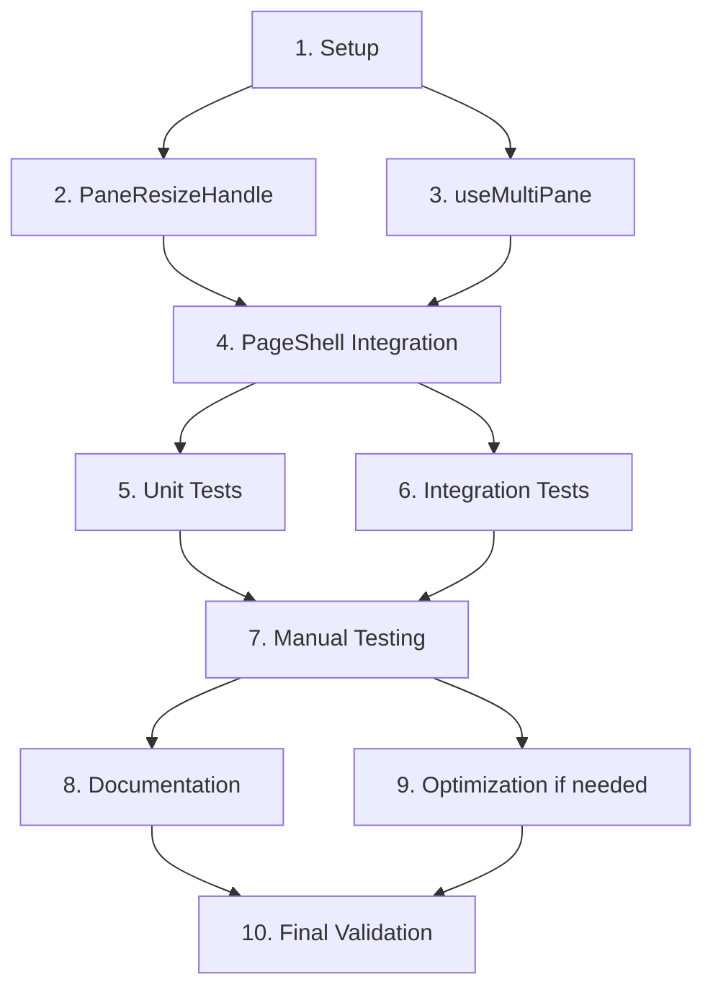

# Resizable Multipane Windows - Implementation Tasks

## Overview

This document provides a detailed, actionable task list for implementing resizable multipane windows in OR3.chat. Tasks are organized sequentially with clear dependencies and mapped to specific requirements from `requirements.md`.

## Task Checklist

### 1. Project Setup and Preparation

- [ ] 1.1 Review existing codebase structure
  - Requirements: 9.1
  - Review `ResizableSidebarLayout.vue` and understand its resize implementation
  - Review `ResizeHandle.vue` component and its patterns
  - Review `useMultiPane.ts` composable and understand pane state management
  - Document current behavior and constraints

- [ ] 1.2 Set up development environment
  - Requirements: 9.1
  - Ensure `bun install` runs successfully
  - Verify `bun run dev` starts development server
  - Verify `bun run test` runs existing tests successfully
  - Check browser DevTools setup for performance monitoring

- [ ] 1.3 Create feature branch and initial structure
  - Requirements: 9.1
  - Create feature branch for resizable panes work
  - Create `/app/components/panes/` directory for new components
  - Document any existing test patterns to follow

### 2. Create PaneResizeHandle Component

- [ ] 2.1 Create basic PaneResizeHandle component
  - Requirements: 1.1, 1.2, 7.2
  - Create `/app/components/panes/PaneResizeHandle.vue`
  - Set up basic template structure with handle element
  - Add conditional rendering (desktop only, multiple panes only)
  - Add absolute positioning styles

- [ ] 2.2 Implement visual styling
  - Requirements: 1.2, 7.1, 7.2
  - Add rounded pill visual indicator
  - Implement color transitions on hover (outline-variant → primary)
  - Add group/hover classes for interactive feedback
  - Match styling patterns from sidebar ResizeHandle

- [ ] 2.3 Add pointer event handlers
  - Requirements: 1.1, 1.2
  - Implement `@pointerdown` event handler
  - Emit `resizeStart` event with pointer event and pane index
  - Set cursor to `col-resize`
  - Add pointer capture on drag start

- [ ] 2.4 Add keyboard event handlers
  - Requirements: 3.1, 3.2
  - Implement `@keydown` event handler
  - Emit `resizeKeydown` event with keyboard event and pane index
  - Add tabindex="0" for focusability
  - Add visible focus indicator styles

- [ ] 2.5 Add ARIA attributes
  - Requirements: 3.2, 9.1
  - Add role="separator"
  - Add aria-orientation="vertical"
  - Add aria-label with pane index
  - Add aria-valuemin, aria-valuemax, aria-valuenow placeholders
  - Document ARIA implementation in component

- [ ] 2.6 Add component documentation
  - Requirements: 9.1
  - Add JSDoc comments for props
  - Add JSDoc comments for emitted events
  - Document component purpose and usage
  - Add inline comments for non-obvious styling decisions

### 3. Enhance useMultiPane Composable

- [ ] 3.1 Add width state management
  - Requirements: 1.1, 2.1
  - Add `paneWidths` ref (array of numbers)
  - Add configuration constants (minPaneWidth, maxPaneWidth, storageKey)
  - Add `clampWidth` utility function
  - Add TypeScript types for new state

- [ ] 3.2 Implement localStorage persistence
  - Requirements: 2.1, 8.1
  - Implement `persistWidths()` function
  - Implement `restoreWidths()` function
  - Add error handling for localStorage failures
  - Add validation for restored data
  - Call `restoreWidths()` in onMounted hook

- [ ] 3.3 Implement width calculation logic
  - Requirements: 1.1, 1.3
  - Implement `getPaneWidth(index)` function
  - Handle single pane case (return 100%)
  - Handle equal distribution fallback (percentage-based)
  - Handle stored widths case (pixel-based)
  - Add pane count mismatch handling

- [ ] 3.4 Implement initializeWidths logic
  - Requirements: 1.1, 1.3
  - Implement `initializeWidths()` function
  - Get container element width
  - Calculate equal distribution in pixels
  - Clamp each width to constraints
  - Store in paneWidths array

- [ ] 3.5 Implement handleResize logic
  - Requirements: 1.1, 1.3, 4.1
  - Implement `handleResize(paneIndex, deltaX)` function
  - Calculate new widths for affected panes
  - Enforce minimum width constraints for both panes
  - Apply width changes only if both constraints satisfied
  - Call `persistWidths()` after successful resize
  - Add error handling for invalid indices

- [ ] 3.6 Implement pane addition logic
  - Requirements: 2.2, 8.2
  - Modify existing `addPane()` function
  - Calculate space to allocate for new pane
  - Proportionally reduce existing pane widths
  - Enforce minimum width constraints
  - Update paneWidths array
  - Call `persistWidths()`

- [ ] 3.7 Implement pane removal logic
  - Requirements: 2.2, 8.2
  - Modify existing `closePane()` function
  - Get width of pane being removed
  - Redistribute width to remaining panes
  - Update paneWidths array
  - Call `persistWidths()`

- [ ] 3.8 Implement window resize handling
  - Requirements: 5.2
  - Add window resize event listener in onMounted
  - Calculate total current width vs container width
  - Proportionally scale all pane widths if mismatch
  - Enforce constraints after scaling
  - Call `persistWidths()` if adjusted
  - Clean up listener in onBeforeUnmount

- [ ] 3.9 Add composable documentation
  - Requirements: 9.1
  - Add JSDoc comments for new functions
  - Document state management approach
  - Add inline comments for complex calculations
  - Document error handling strategy

### 4. Integrate PaneResizeHandle into PageShell

- [ ] 4.1 Import PaneResizeHandle component
  - Requirements: 1.1, 6.2
  - Add import statement in PageShell.vue script
  - Add component to components object if needed

- [ ] 4.2 Modify pane container template
  - Requirements: 1.1, 7.1
  - Replace `flex-1` class with dynamic `:style="{ width: getPaneWidth(i) }"`
  - Keep all existing classes intact
  - Keep all existing event handlers intact
  - Test that active pane highlighting still works

- [ ] 4.3 Add PaneResizeHandle to template
  - Requirements: 1.1, 1.2
  - Add `<PaneResizeHandle>` after each pane component
  - Add `v-if="i < panes.length - 1"` condition
  - Pass required props (paneIndex, paneCount, isDesktop)
  - Add event handlers (@resize-start, @resize-keydown)

- [ ] 4.4 Implement resize start handler
  - Requirements: 1.1, 4.1
  - Create `onPaneResizeStart(event, paneIndex)` function
  - Store resizing state (index, startX, startWidths)
  - Set pointer capture on target element
  - Add pointermove event listener to window
  - Add pointerup event listener to window (once)

- [ ] 4.5 Implement resize move handler
  - Requirements: 1.1, 1.2, 4.1
  - Create `onPaneResizeMove(event)` function
  - Calculate deltaX from start position
  - Call `handleResize(index, deltaX)` from composable
  - Ensure updates happen on every frame (no throttling needed - browser handles this)

- [ ] 4.6 Implement resize end handler
  - Requirements: 1.1
  - Create `onPaneResizeEnd()` function
  - Clear resizing state
  - Remove pointermove event listener
  - Final persistence happens in handleResize

- [ ] 4.7 Implement keyboard resize handler
  - Requirements: 3.1
  - Create `onPaneResizeKeydown(event, paneIndex)` function
  - Handle ArrowLeft/ArrowRight (16px steps)
  - Handle Shift+Arrow (32px steps)
  - Handle Home (set to minimum)
  - Handle End (set to maximum)
  - Call `handleResize(index, deltaX)` for each action
  - Prevent default for all handled keys

- [ ] 4.8 Add cleanup on unmount
  - Requirements: 4.1
  - Add onBeforeUnmount hook
  - Remove pointermove and pointerup listeners
  - Clear any resize state

- [ ] 4.9 Add integration documentation
  - Requirements: 9.1
  - Document resize event flow in comments
  - Add comments explaining state management
  - Document pointer capture approach

### 5. Testing - Unit Tests

- [ ] 5.1 Set up test file structure
  - Requirements: 9.2
  - Create `/app/composables/core/__tests__/useMultiPane-resize.test.ts`
  - Create `/app/components/panes/__tests__/PaneResizeHandle.test.ts`
  - Import necessary testing utilities (vitest, @vue/test-utils)

- [ ] 5.2 Test width clamping
  - Requirements: 1.3, 9.2
  - Test clampWidth with value below minimum
  - Test clampWidth with value above maximum
  - Test clampWidth with value in valid range
  - Test clampWidth with edge values (exactly min/max)

- [ ] 5.3 Test width calculations
  - Requirements: 1.1, 9.2
  - Test getPaneWidth with 1 pane (returns 100%)
  - Test getPaneWidth with 2 panes, equal distribution
  - Test getPaneWidth with 3 panes, equal distribution
  - Test getPaneWidth with stored widths
  - Test getPaneWidth with pane count mismatch

- [ ] 5.4 Test handleResize logic
  - Requirements: 1.1, 1.3, 9.2
  - Test resize increases left pane, decreases right pane
  - Test resize respects minimum width on left pane
  - Test resize respects minimum width on right pane
  - Test resize with invalid pane index
  - Test resize with zero delta (no change)
  - Test resize with large delta (hits constraint)

- [ ] 5.5 Test state persistence
  - Requirements: 2.1, 8.1, 9.2
  - Test persistWidths writes to localStorage
  - Test restoreWidths reads from localStorage
  - Test restoreWidths with no stored data
  - Test restoreWidths with corrupted data
  - Test restoreWidths with invalid data types
  - Mock localStorage to test quota exceeded scenario

- [ ] 5.6 Test pane addition
  - Requirements: 2.2, 9.2
  - Test adding pane redistributes widths proportionally
  - Test adding pane enforces minimum widths
  - Test adding pane updates paneWidths array
  - Test adding pane calls persistWidths

- [ ] 5.7 Test pane removal
  - Requirements: 2.2, 8.2, 9.2
  - Test removing first pane redistributes to remaining
  - Test removing middle pane redistributes to remaining
  - Test removing last pane redistributes to remaining
  - Test removing pane updates paneWidths array
  - Test removing pane calls persistWidths

- [ ] 5.8 Test PaneResizeHandle component
  - Requirements: 1.2, 3.2, 9.2
  - Test component renders on desktop with multiple panes
  - Test component does not render on mobile
  - Test component does not render with single pane
  - Test pointerdown emits resizeStart event
  - Test keydown emits resizeKeydown event
  - Test ARIA attributes are present and correct
  - Test focus management (tabindex)

### 6. Testing - Integration Tests

- [ ] 6.1 Test resize interaction in PageShell
  - Requirements: 1.1, 6.2, 9.2
  - Mount PageShell with 2 panes
  - Simulate drag on resize handle
  - Verify pane widths update
  - Verify localStorage is updated
  - Verify no console errors

- [ ] 6.2 Test keyboard resize in PageShell
  - Requirements: 3.1, 9.2
  - Mount PageShell with 2 panes
  - Focus resize handle
  - Simulate Arrow key presses
  - Verify pane widths update correctly
  - Test Shift+Arrow for larger steps
  - Test Home/End keys

- [ ] 6.3 Test pane addition/removal with resize
  - Requirements: 2.2, 6.2, 9.2
  - Mount PageShell with 2 panes
  - Resize panes to custom widths
  - Add third pane
  - Verify widths redistribute reasonably
  - Remove a pane
  - Verify remaining panes grow to fill space

- [ ] 6.4 Test persistence across remount
  - Requirements: 2.1, 9.2
  - Mount PageShell with 2 panes
  - Resize panes
  - Unmount component
  - Remount component
  - Verify widths are restored from localStorage

- [ ] 6.5 Test mobile responsiveness
  - Requirements: 5.1, 9.2
  - Mock viewport width below 768px
  - Mount PageShell
  - Verify resize handles not rendered
  - Verify panes use existing mobile layout

- [ ] 6.6 Test sidebar interaction
  - Requirements: 6.1, 9.2
  - Mount PageShell with sidebar
  - Resize sidebar
  - Verify pane container width adjusts
  - Resize panes
  - Verify sidebar not affected
  - Test both sidebar and pane resize in same session

### 7. Manual Testing and Validation

- [ ] 7.1 Test in development mode
  - Requirements: 1.1, 1.2, 4.1
  - Start dev server (`bun run dev`)
  - Open app in Chrome DevTools
  - Create 2 panes (chat, document)
  - Drag resize handle and verify smooth resizing
  - Check Performance tab for 60fps during drag
  - Verify no console errors or warnings

- [ ] 7.2 Test visual appearance
  - Requirements: 7.1, 7.2
  - Verify panes look identical to before (borders, colors, spacing)
  - Verify resize handle matches sidebar handle styling
  - Verify hover effects work correctly
  - Verify active pane highlighting still works
  - Test in both light and dark modes

- [ ] 7.3 Test keyboard accessibility
  - Requirements: 3.1, 3.2
  - Tab through interface to resize handle
  - Verify visible focus indicator
  - Test Arrow keys to resize
  - Test Shift+Arrow for larger steps
  - Test Home/End keys
  - Verify focus remains on handle during keyboard resize

- [ ] 7.4 Test persistence
  - Requirements: 2.1
  - Resize panes to specific widths
  - Refresh page
  - Verify widths restored correctly
  - Clear localStorage
  - Verify fallback to equal distribution

- [ ] 7.5 Test edge cases
  - Requirements: 8.1, 8.2
  - Resize to minimum width constraint
  - Attempt to resize beyond minimum (verify blocked)
  - Resize browser window to various sizes
  - Add/remove panes while custom widths exist
  - Test with 1, 2, and 3 panes
  - Test rapid resize operations

- [ ] 7.6 Test in multiple browsers
  - Requirements: Browser Compatibility
  - Test in Chrome (latest)
  - Test in Firefox (latest)
  - Test in Safari (latest)
  - Test in Edge (latest)
  - Verify consistent behavior across browsers

- [ ] 7.7 Performance validation
  - Requirements: 4.1, 4.2
  - Open Chrome DevTools Performance tab
  - Record during resize operation
  - Verify frame rate stays at/near 60fps
  - Check for layout thrashing or forced reflows
  - Verify no memory leaks after 50+ resize operations
  - Check bundle size increase with build analyzer

### 8. Documentation and Refinement

- [ ] 8.1 Update inline code comments
  - Requirements: 9.1
  - Review all new code for clarity
  - Add comments for complex logic
  - Explain any non-obvious patterns
  - Document why certain approaches were chosen

- [ ] 8.2 Update design document
  - Requirements: 9.1
  - Document any deviations from original design
  - Add notes on implementation challenges
  - Document actual performance measurements
  - Update diagrams if needed

- [ ] 8.3 Create usage examples
  - Requirements: 9.1
  - Document how to use resize functionality
  - Document configuration options
  - Document common patterns for developers
  - Add troubleshooting guide if needed

- [ ] 8.4 Review accessibility
  - Requirements: 3.2
  - Run WAVE or axe accessibility checker
  - Verify keyboard navigation is complete
  - Verify ARIA attributes are correct
  - Test with screen reader if possible (optional)

- [ ] 8.5 Code review preparation
  - Requirements: 9.1
  - Self-review all changes
  - Ensure code style matches project conventions
  - Remove any debug console.logs
  - Remove any commented-out code
  - Verify all tests pass
  - Run type-check: `bun run type-check`

### 9. Performance Optimization (If Needed)

- [ ] 9.1 Profile resize performance
  - Requirements: 4.1, 4.2
  - Use Chrome DevTools Performance profiler
  - Identify any bottlenecks during resize
  - Check for unnecessary re-renders
  - Measure actual frame rate during drag

- [ ] 9.2 Optimize if below 60fps
  - Requirements: 4.1
  - Implement requestAnimationFrame if needed
  - Reduce redundant calculations
  - Optimize state updates
  - Consider using CSS transforms if helpful

- [ ] 9.3 Optimize localStorage writes
  - Requirements: 4.2
  - Implement debouncing if writes are too frequent
  - Batch multiple updates if possible
  - Measure localStorage write performance

- [ ] 9.4 Bundle size optimization
  - Requirements: 4.2
  - Run bundle analyzer: `bun run analyze`
  - Verify size increase is < 5KB gzipped
  - Remove any unnecessary imports
  - Consider code splitting if needed

### 10. Final Validation

- [ ] 10.1 Run all tests
  - Requirements: 9.2
  - Run unit tests: `bun run test`
  - Verify all tests pass
  - Check test coverage for new code
  - Fix any flaky tests

- [ ] 10.2 Comprehensive manual test
  - Requirements: 1.1, 1.2, 1.3, 2.1, 2.2
  - Test complete user workflow from start to finish
  - Test all edge cases again
  - Test in all supported browsers
  - Test mobile behavior
  - Verify performance in production build

- [ ] 10.3 Regression testing
  - Requirements: 6.2
  - Test existing features still work:
    - Adding panes
    - Closing panes
    - Switching between panes
    - Pane navigation with Shift+Arrow
    - Sidebar resize
    - Chat functionality
    - Document editor functionality
  - Verify no visual regressions

- [ ] 10.4 Create demo recording
  - Requirements: 9.1
  - Record short video showing resize functionality
  - Include both mouse and keyboard resize
  - Show persistence across refresh
  - Include in PR description or docs

- [ ] 10.5 Final checklist before merge
  - Requirements: All
  - All tests pass
  - Type checking passes
  - No console errors or warnings
  - Performance targets met (60fps, < 5KB)
  - Accessibility requirements met
  - Code documentation complete
  - Manual testing complete
  - Browser compatibility verified

## Task Dependencies

## Estimated Time per Section

| Section | Estimated Time |
|---------|---------------|
| 1. Setup | 1-2 hours |
| 2. PaneResizeHandle | 3-4 hours |
| 3. useMultiPane | 4-6 hours |
| 4. PageShell Integration | 3-4 hours |
| 5. Unit Tests | 4-5 hours |
| 6. Integration Tests | 3-4 hours |
| 7. Manual Testing | 2-3 hours |
| 8. Documentation | 2-3 hours |
| 9. Optimization (if needed) | 0-4 hours |
| 10. Final Validation | 2-3 hours |
| **Total** | **24-38 hours** |

## Notes for Implementer

### Critical Success Factors
1. **Reuse existing patterns**: The ResizableS Layoutidebar component provides a proven pattern - follow it closely
2. **Test incrementally**: Don't write all code then test - test each piece as you build it
3. **Performance matters**: Profile early and often to catch performance issues before they become embedded
4. **Accessibility is not optional**: Keyboard support and ARIA attributes must be complete
5. **Edge cases matter**: The difference between good and great is handling edge cases gracefully

### Common Pitfalls to Avoid
1. Don't use flexbox grow factors - use explicit pixel widths for precision
2. Don't forget to clamp values - always enforce min/max constraints
3. Don't skip mobile testing - ensure resize is properly disabled
4. Don't over-engineer - keep it simple and focused
5. Don't ignore localStorage errors - handle gracefully

### Testing Tips
1. Use Chrome DevTools Performance tab to validate 60fps
2. Test with 3 panes to catch edge cases with middle pane
3. Test rapid operations (quick add/remove, fast resizing)
4. Test with browser zoom at 50%, 100%, 200%
5. Test with very small and very large browser windows

### When in Doubt
- Refer to `ResizableSidebarLayout.vue` for patterns
- Keep changes minimal - resist adding "nice to have" features
- Prioritize smoothness and reliability over features
- Ask for code review early if uncertain about approach
