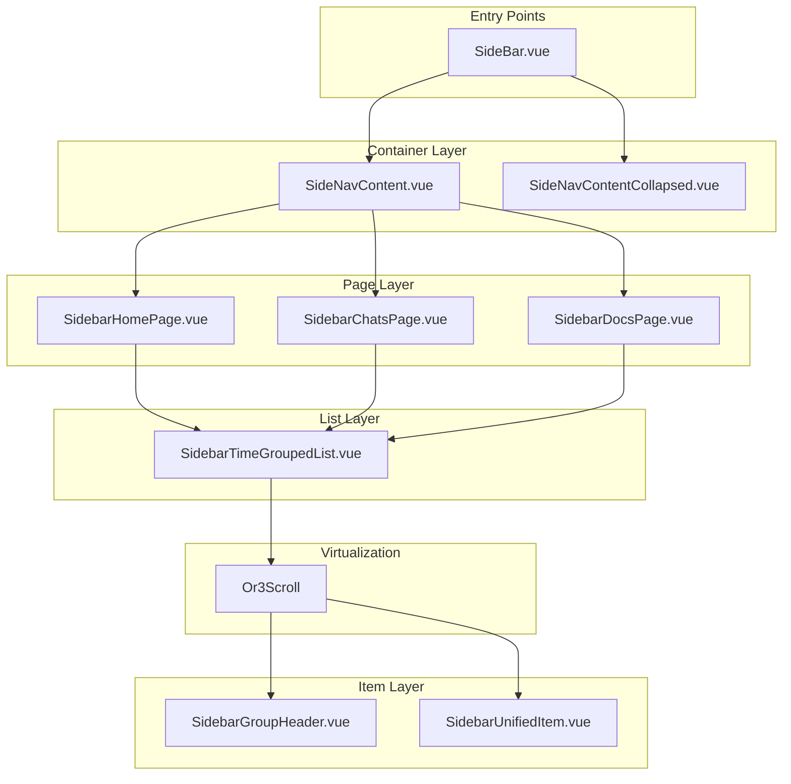
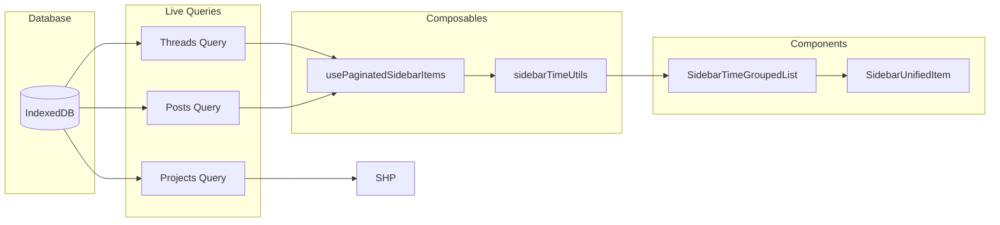
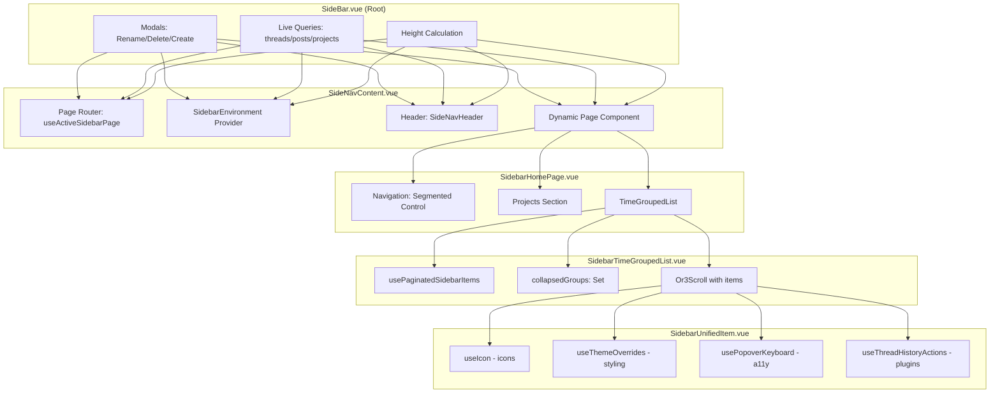
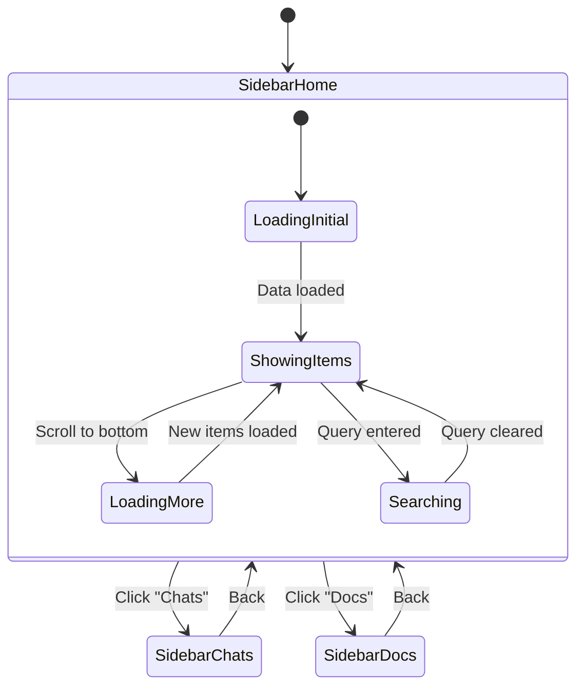
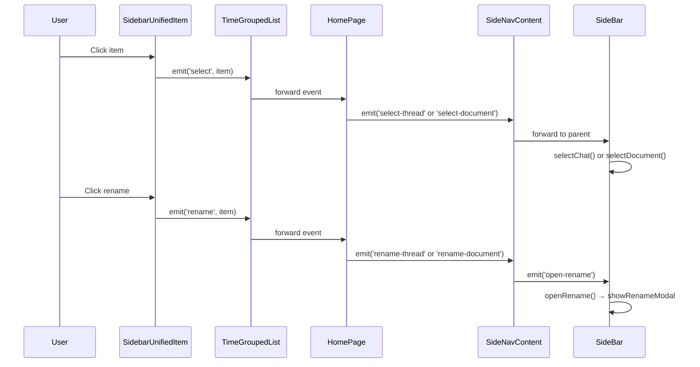
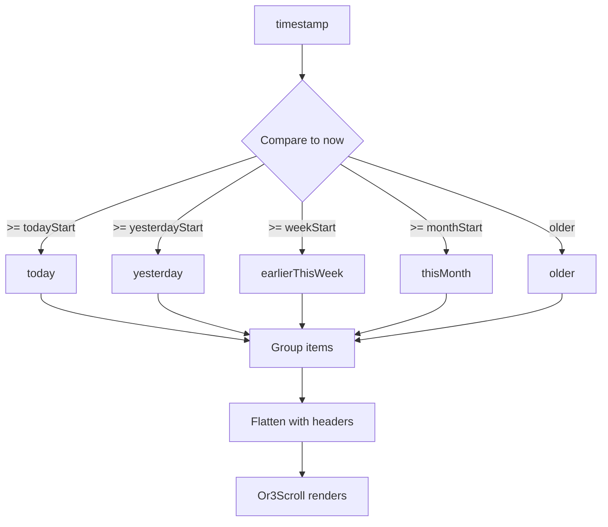
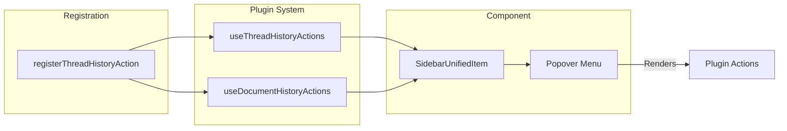

# Sidebar Homepage Rework - Architecture

## System Overview



---

## Data Flow



---

## Component Hierarchy



---

## State Management



---

## Event Flow



---

## Time Grouping Logic



---

## Plugin Integration



---

## File Structure

```
app/
├── components/sidebar/
│   ├── SideBar.vue                    # Root, modals, queries
│   ├── SideNavContent.vue             # Page router, environment
│   ├── SideNavHeader.vue              # Search, nav buttons
│   ├── SidebarHomePage.vue            # Home with projects + list
│   ├── SidebarChatsPage.vue           # [NEW] Chats only
│   ├── SidebarDocsPage.vue            # [NEW] Docs only
│   ├── SidebarTimeGroupedList.vue     # [NEW] Or3Scroll + grouping
│   ├── SidebarGroupHeader.vue         # [NEW] Collapsible header
│   ├── SidebarUnifiedItem.vue         # [NEW] Thread/doc item
│   ├── SidebarVirtualList.vue         # [DELETE] Replaced
│   └── ...
├── composables/sidebar/
│   ├── useSidebarEnvironment.ts       # Dependency injection
│   ├── useActiveSidebarPage.ts        # Page state
│   ├── usePaginatedSidebarItems.ts    # [NEW] Pagination
│   └── ...
└── utils/sidebar/
    └── sidebarTimeUtils.ts            # [NEW] Time grouping
```

---

## Key Interfaces

```typescript
// Unified item for both threads and documents
interface UnifiedSidebarItem {
  id: string;
  type: 'thread' | 'document';
  title: string;
  updatedAt: number;
  forked?: boolean;      // thread only
  postType?: string;     // document only
}

// Time groups
type TimeGroup = 'today' | 'yesterday' | 'earlierThisWeek' | 'thisMonth' | 'older';

// Flattened list item (for virtualization)
type FlatItem = 
  | { type: 'header'; key: string; label: string; groupKey: TimeGroup }
  | (UnifiedSidebarItem & { key: string; groupKey: TimeGroup });

// Pagination state
interface PaginationState {
  items: UnifiedSidebarItem[];
  hasMore: boolean;
  loading: boolean;
  cursor: number | null;
}
```
