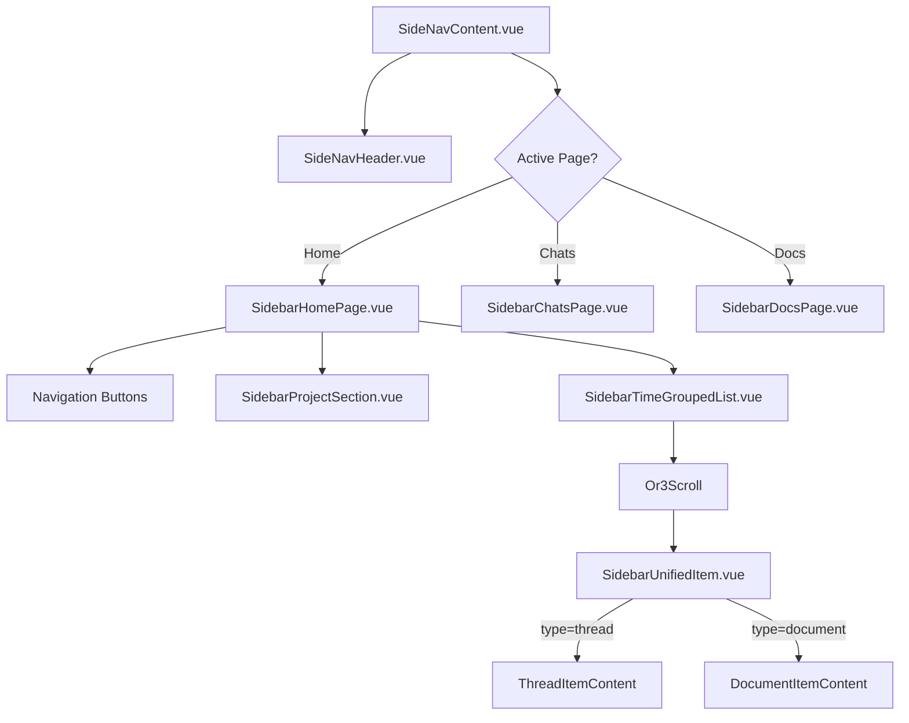

# Sidebar Homepage Rework - Technical Design

## Overview

This document details the technical implementation for the sidebar homepage rework. The primary goals are:
1. Replace `virtua` Virtualizer with `or3-scroll` for reliable virtualization
2. Implement time-based grouping of mixed threads/documents
3. Add sub-page navigation (Chats Only, Docs Only)
4. Optimize performance through pagination and lightweight data structures

---

## Architecture

### High-Level Component Flow



---

## Core Components

### 1. SidebarHomePage.vue (Modified)

**Current State:** Renders `SidebarVirtualList` with virtua Virtualizer.

**New Design:**
- Remove `SidebarVirtualList` component reference
- Add navigation buttons for "Chats" and "Docs" sub-pages
- Render `SidebarProjectSection` for projects
- Render `SidebarTimeGroupedList` for unified thread/document list

```typescript
// New structure
interface SidebarHomePageProps {
  projects: SidebarProject[];
  expandedProjects: string[];
  activeThreadIds: string[];
  activeDocumentIds: string[];
  // ...other existing props
}

// Navigation handler
function navigateToChats() {
  setActivePage('sidebar-chats');
}

function navigateToDocs() {
  setActivePage('sidebar-docs');
}
```

---

### 2. SidebarTimeGroupedList.vue (New Component)

Replaces `SidebarVirtualList` for the homepage. Uses `or3-scroll` and groups items by time.

```typescript
interface TimeGroupedListProps {
  items: UnifiedSidebarItem[];
  activeThreadIds: string[];
  activeDocumentIds: string[];
}

interface UnifiedSidebarItem {
  id: string;
  type: 'thread' | 'document';
  title: string;
  updatedAt: number; // timestamp in seconds
  // Thread-specific
  lastModel?: string;
  forked?: boolean;
  // Document-specific
  postType?: string;
}

// Time groups calculation
type TimeGroup = 
  | 'recentlyOpened' // Within 24 hours
  | 'today'
  | 'yesterday'
  | 'earlierThisWeek'
  | 'thisMonth'
  | 'older';

function computeTimeGroup(timestamp: number): TimeGroup {
  const now = Date.now() / 1000;
  const diff = now - timestamp;
  const today = getStartOfDay(now);
  const yesterday = today - 86400;
  const weekStart = getStartOfWeek(now);
  const monthStart = getStartOfMonth(now);
  
  if (diff < 86400) return 'recentlyOpened';
  if (timestamp >= today) return 'today';
  if (timestamp >= yesterday) return 'yesterday';
  if (timestamp >= weekStart) return 'earlierThisWeek';
  if (timestamp >= monthStart) return 'thisMonth';
  return 'older';
}
```

**Template Structure:**
```vue
<template>
  <div class="flex flex-col h-full">
    <Or3Scroll
      ref="scroller"
      :items="flattenedItems"
      :item-key="(item) => item.key"
      :estimate-height="56"
      :overscan="200"
      class="flex-1"
    >
      <template #default="{ item }">
        <!-- Section Header -->
        <SidebarGroupHeader
          v-if="item.type === 'header'"
          :label="item.label"
          :collapsed="collapsedGroups.has(item.groupKey)"
          @toggle="toggleGroup(item.groupKey)"
        />
        <!-- Unified Item -->
        <SidebarUnifiedItem
          v-else
          :item="item"
          :active="isActive(item)"
          :time-display="getTimeDisplay(item)"
          @select="handleSelect(item)"
          @rename="handleRename(item)"
          @delete="handleDelete(item)"
          @add-to-project="handleAddToProject(item)"
        />
      </template>
    </Or3Scroll>
  </div>
</template>
```

---

### 3. SidebarUnifiedItem.vue (New Component)

A single component that renders both thread and document items with consistent layout.

```typescript
interface UnifiedItemProps {
  item: UnifiedSidebarItem;
  active: boolean;
  timeDisplay: string; // "2:14 PM" | "Monday" | "Jan 5"
}

// Icon configuration
const iconConfig = computed(() => {
  if (props.item.type === 'thread') {
    return {
      name: 'lucide:message-square',
      bgClass: 'bg-primary/15',
    };
  }
  return {
    name: 'lucide:file-text',
    bgClass: 'bg-secondary/15', // or different color
  };
});

// Subtitle (model for threads, type for docs)
const subtitle = computed(() => {
  if (props.item.type === 'thread') {
    return props.item.lastModel || 'Default model';
  }
  return props.item.postType || 'Document';
});
```

**Template Layout:**
```vue
<template>
  <RetroGlassBtn
    class="w-full flex items-center gap-3 px-2 py-2 group"
    :class="{ 'active-element bg-primary/25 ring-1 ring-primary/50': active }"
    @click="emit('select', item.id)"
  >
    <!-- Icon with background -->
    <div 
      class="shrink-0 w-8 h-8 rounded-lg flex items-center justify-center"
      :class="iconConfig.bgClass"
    >
      <UIcon :name="iconConfig.name" class="w-4 h-4" />
    </div>
    
    <!-- Content -->
    <div class="flex-1 min-w-0 flex flex-col">
      <div class="flex items-center justify-between gap-2">
        <span class="truncate font-medium">{{ item.title || 'Untitled' }}</span>
        <span class="shrink-0 text-xs opacity-60">{{ timeDisplay }}</span>
      </div>
      <div class="flex items-center justify-between gap-2">
        <span class="text-xs opacity-50 truncate">{{ subtitle }}</span>
        <!-- Actions - show on hover (desktop) or always (mobile) -->
        <UPopover>
          <span 
            class="opacity-0 group-hover:opacity-100 md:opacity-0 
                   transition-opacity cursor-pointer p-1"
            @click.stop
          >
            <UIcon name="lucide:more-horizontal" class="w-4 h-4" />
          </span>
          <!-- popover content with rename/delete/add-to-project -->
        </UPopover>
      </div>
    </div>
  </RetroGlassBtn>
</template>
```

---

### 4. SidebarChatsPage.vue (New Page)

Dedicated page showing only chat threads.

```typescript
interface SidebarChatsPageProps extends SidebarPageProps {
  // Inherits pageId, isActive, setActivePage, resetToDefault
}

// Uses SidebarEnvironment to access threads
const env = useSidebarEnvironment();
const threads = env.getThreads();

// Time-grouped display same as homepage but threads only
const timeGroupedThreads = computed(() => 
  groupByTime(threads.value.filter(t => !t.deleted))
);
```

---

### 5. SidebarDocsPage.vue (New Page)

Dedicated page showing only documents.

```typescript
interface SidebarDocsPageProps extends SidebarPageProps {
  // Inherits pageId, isActive, setActivePage, resetToDefault
}

const env = useSidebarEnvironment();
const documents = env.getDocuments();

const timeGroupedDocs = computed(() =>
  groupByTime(documents.value.filter(d => !d.deleted))
);
```

---

### 6. SideNavHeader.vue (Modified)

Remove the filter button, adapt search behavior based on active page.

```typescript
// Current props + new
interface SideNavHeaderProps {
  sidebarQuery: string;
  activeSections: {...}; // Can be removed if filter button goes
  projects: Project[];
  activePage?: string; // NEW: to determine search scope
}

// Search handler adapts to context
const searchPlaceholder = computed(() => {
  switch (props.activePage) {
    case 'sidebar-chats': return 'Search chats...';
    case 'sidebar-docs': return 'Search documents...';
    default: return 'Search all...';
  }
});
```

---

## Data Flow & Pagination

### Paginated Loading Strategy

Instead of loading all threads/documents at once, implement cursor-based pagination:

```typescript
// New composable: usePaginatedSidebarItems
interface PaginatedItemsState {
  items: UnifiedSidebarItem[];
  hasMore: boolean;
  loading: boolean;
  cursor: number | null; // timestamp of last loaded item
}

async function loadMore() {
  if (state.loading || !state.hasMore) return;
  
  state.loading = true;
  const newItems = await fetchItemsBefore(state.cursor, PAGE_SIZE);
  
  if (newItems.length < PAGE_SIZE) {
    state.hasMore = false;
  }
  
  state.items.push(...newItems);
  state.cursor = newItems[newItems.length - 1]?.updatedAt ?? null;
  state.loading = false;
}

// Database queries
async function fetchItemsBefore(cursor: number | null, limit: number) {
  const threads = await db.threads
    .where('updated_at')
    .below(cursor ?? Infinity)
    .reverse()
    .limit(limit / 2)
    .toArray();
    
  const docs = await db.posts
    .where('updated_at')
    .below(cursor ?? Infinity)
    .reverse()
    .limit(limit / 2)
    .toArray();
    
  return mergeAndSort([...threads, ...docs]);
}
```

### Or3Scroll Integration

```typescript
// Watch for scroll-to-bottom to trigger pagination
function onReachBottom() {
  loadMore();
}
```

---

## Search Implementation

### Context-Aware Search

```typescript
interface SearchConfig {
  scope: 'all' | 'chats' | 'docs';
  query: string;
}

async function performSearch({ scope, query }: SearchConfig) {
  const results: UnifiedSidebarItem[] = [];
  
  if (scope === 'all' || scope === 'chats') {
    const threads = await searchThreadsByTitle(query);
    results.push(...threads.map(toUnifiedItem));
  }
  
  if (scope === 'all' || scope === 'docs') {
    const docs = await searchDocumentsByTitle(query);
    results.push(...docs.map(toUnifiedItem));
  }
  
  if (scope === 'all') {
    const projects = await searchProjectsByName(query);
    // Projects shown separately or mixed in
  }
  
  // Sort by relevance (title match quality + recency)
  return sortByRelevance(results, query);
}
```

---

## File Changes Summary

### New Files
| File | Purpose |
|------|---------|
| `SidebarTimeGroupedList.vue` | Main list with or3-scroll and time grouping |
| `SidebarUnifiedItem.vue` | Single component for thread/doc items |
| `SidebarGroupHeader.vue` | Collapsible section header component |
| `SidebarChatsPage.vue` | Chats-only sub-page |
| `SidebarDocsPage.vue` | Documents-only sub-page |
| `usePaginatedSidebarItems.ts` | Pagination composable |
| `sidebarTimeUtils.ts` | Time grouping utility functions |

### Modified Files
| File | Changes |
|------|---------|
| `SidebarHomePage.vue` | Add nav buttons, replace virtual list with TimeGroupedList |
| `SideNavHeader.vue` | Remove filter button, add context-aware search |
| `SideNavContent.vue` | Register new pages in page system |
| `useSidebarPages.ts` | Add page definitions for chats/docs pages |

### Deleted Files
| File | Reason |
|------|--------|
| `SidebarVirtualList.vue` | Replaced by SidebarTimeGroupedList with or3-scroll |

---

## Error Handling

```typescript
// ServiceResult pattern for database operations
interface ServiceResult<T> {
  success: boolean;
  data?: T;
  error?: string;
}

// Graceful degradation
async function loadItems(): Promise<ServiceResult<UnifiedSidebarItem[]>> {
  try {
    const items = await fetchItems();
    return { success: true, data: items };
  } catch (e) {
    console.error('Failed to load sidebar items', e);
    return { 
      success: false, 
      error: 'Failed to load items. Please try again.' 
    };
  }
}
```

---

## Testing Strategy

### Unit Tests

**SidebarTimeGroupedList.vue:**
- Correctly groups items by time period
- Handles empty item lists
- Correctly identifies active items
- Collapses/expands groups properly

**SidebarUnifiedItem.vue:**
- Renders thread icon for thread items
- Renders document icon for document items
- Shows correct time format based on group
- Shows/hides action menu on hover (desktop)

**sidebarTimeUtils.ts:**
- `computeTimeGroup()` returns correct group for various timestamps
- `formatTimeDisplay()` formats correctly per group
- Edge cases: midnight boundary, timezone handling

### Integration Tests

**SideNavContent.vue:**
- Navigation between pages works correctly
- Search adapts to active page context
- State persists correctly with KeepAlive

### Manual Verification

1. **Scroll smoothness**: Scroll rapidly through a list of 500+ items
2. **Time grouping**: Verify items appear in correct sections
3. **Navigation**: Click Chats/Docs buttons, verify correct filtering
4. **Search**: Test search on each page type
5. **Hover actions**: Verify settings button appears on hover (desktop)

---

## Performance Considerations

1. **Initial Load**: Only load first 50-100 items
2. **Scroll-based Loading**: Use `reachBottom` event from or3-scroll
3. **Lightweight Items**: Strip `content` field from documents before sidebar display
4. **Debounced Search**: 300ms debounce on search input
5. **Computed Caching**: Use `shallowRef` for large lists

---

## Migration Path

1. Keep `SidebarVirtualList` temporarily alongside new components
2. Feature flag to switch between old/new implementation
3. Once verified stable, remove old code
4. Update tests to use new component structure
