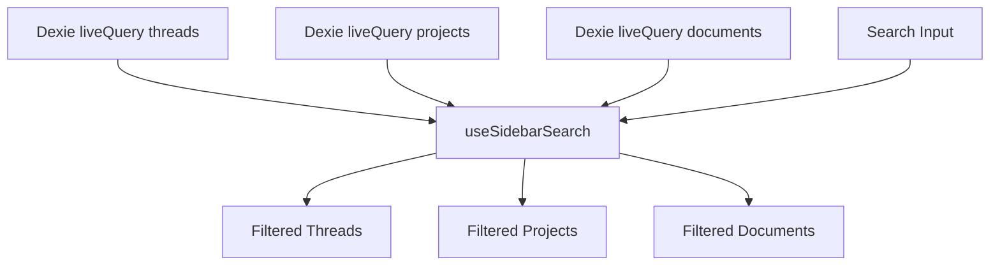

# design.md

artifact_id: 0d4a4c41-9f7e-4e5b-9f38-a8b82825dd55

## Overview

Extend existing sidebar to support unified search across Threads, Projects, and Documents using a single reactive query. Reuse the lightweight Orama in-memory index pattern from `useThreadSearch` but with a merged schema. Provide graceful fallback to plain substring match.

Keep it minimal: one new composable `useSidebarSearch(threadsRef, projectsRef, documentsRef)` returning filtered arrays. Integration: wire existing sidebar input v-model to the unified search query instead of only thread search.

## Architecture

```
[Dexie liveQuery] -> reactive arrays (threads, projects, docs)
        \        \        \
         \        \        -> useSidebarSearch
          \        -> builds Orama index (debounced) on size/clock change
           -> returns {query, threadResults, projectResults, documentResults, ready, busy}
Sidebar input v-model -> query -> debounced runSearch -> results feed UI filtering logic
```

### Mermaid



## Data & Index

Schema (flat) used for index:

```ts
interface IndexDoc {
    kind: 'thread' | 'project' | 'doc';
    id: string; // original id
    title: string; // thread.title | project.name | doc.title
    updated_at: number; // for optional sorting tie-break
    parentId?: string; // only for project entries referencing membership (not needed initially)
}
```

Orama schema:

```ts
{ id: 'string', kind: 'string', title: 'string', updated_at: 'number' }
```

We only index top-level project names and standalone documents; threads already indexed but we merge all into one DB to reduce overhead (one search call). After search we partition results by kind into maps for quick membership filtering.

## Composable API

```ts
export function useSidebarSearch(
    threads: Ref<Thread[]>,
    projects: Ref<ProjectWithData[]>,
    documents: Ref<PostDoc[]>
) {
    return {
        query: Ref<string>,
        threadResults: Ref<Thread[]>,
        projectResults: Ref<ProjectWithData[]>,
        documentResults: Ref<PostDoc[]>,
        ready: Ref<boolean>,
        busy: Ref<boolean>,
        runSearch: () => Promise<void>,
        rebuild: () => Promise<void>,
    };
}
```

## Filtering Logic

-   Empty query: return original arrays unchanged (pass-through).
-   Non-empty: If index available -> Orama `search(term: raw, limit: 500)`.
-   Partition hits by kind -> sets of ids.
-   Threads list becomes only matching thread ids.
-   Projects list: include a project if (project.id in project hit set) OR project.data contains an entry with id in thread/doc match sets. Within each retained project, show only matching entries when query non-empty (UI will filter entries just-in-time with a computed).
-   Documents: subset of original documents whose ids appear in doc hit set.
-   If Orama search throws: fallback single pass substring (lowercase contains) across the three categories; sets computed identically.

## Rebuild Trigger

Use a simple numeric signature: `${threads.length}:${projects.length}:${documents.length}:${latestUpdatedAt}` tracked; if it changes -> rebuild index. Avoid rebuilding on every reactive mutation if counts/time unchanged.

## State & Debounce

-   Debounce query changes at 120ms (matches existing thread search) for consistency.
-   Abort outdated searches via incrementing token (race protection like `lastQueryToken`).

## Integration Steps (Minimal)

1. Create new composable `useSidebarSearch.ts` placed alongside `useThreadSearch.ts`.
2. Replace direct usage of `useThreadSearch` in `SideNavContent.vue` with `useSidebarSearch` (will still internally feed threads results; keep existing prop names minimal changes: use `displayThreads` computed referencing `threadResults`).
3. Add computed wrappers to filter project entries when query active.
4. Provide small placeholders for empty states.
5. ESC key handler on input to clear `query` when not empty.

## Error Handling

-   Wrap Orama import/build calls in try/catch -> on failure set `indexFailed` flag (optional) and fallback to substring.
-   Log warning once per session to avoid log spam.

## Performance Notes

-   Single index reduces multiple search invocations.
-   Partitioning via simple loops; no nested loops > O(n).
-   Limit inclusive 500 results (safe over typical visible items; adjustable).

## Testing Strategy (Lean)

Unit tests (Vitest assumed):

1. Empty query returns originals.
2. Query matches thread + doc but not project name -> project retained because child matches.
3. Query matches project name -> entire project retained; only entries filtered if some non-matching entries present.
4. Fallback path invoked when mocked search throws.
5. Clear query restores full arrays and expansion state not mutated by composable.
   Performance test: create 1500 mixed docs, measure initial build + first search (<500ms in CI acceptable, target <300ms locally).

## Estimated Size

Composable ~140 LoC; sidebar integration diff <40 LoC.

## Risks / Mitigations

-   Risk: Over-filtering project entries -> Mitigate by isolating filtering to computed in sidebar, preserving original project data.
-   Risk: Bundle size from Orama duplication -> Reuse dynamic import (tree-shaken) just like existing thread search.
-   Risk: Race conditions with liveQuery updates -> Use token guard and rebuild signature.

## Simplifications

-   No fuzzy scoring weighting; rely on Orama default.
-   No multi-term highlighting.
-   No storing previous queries.
