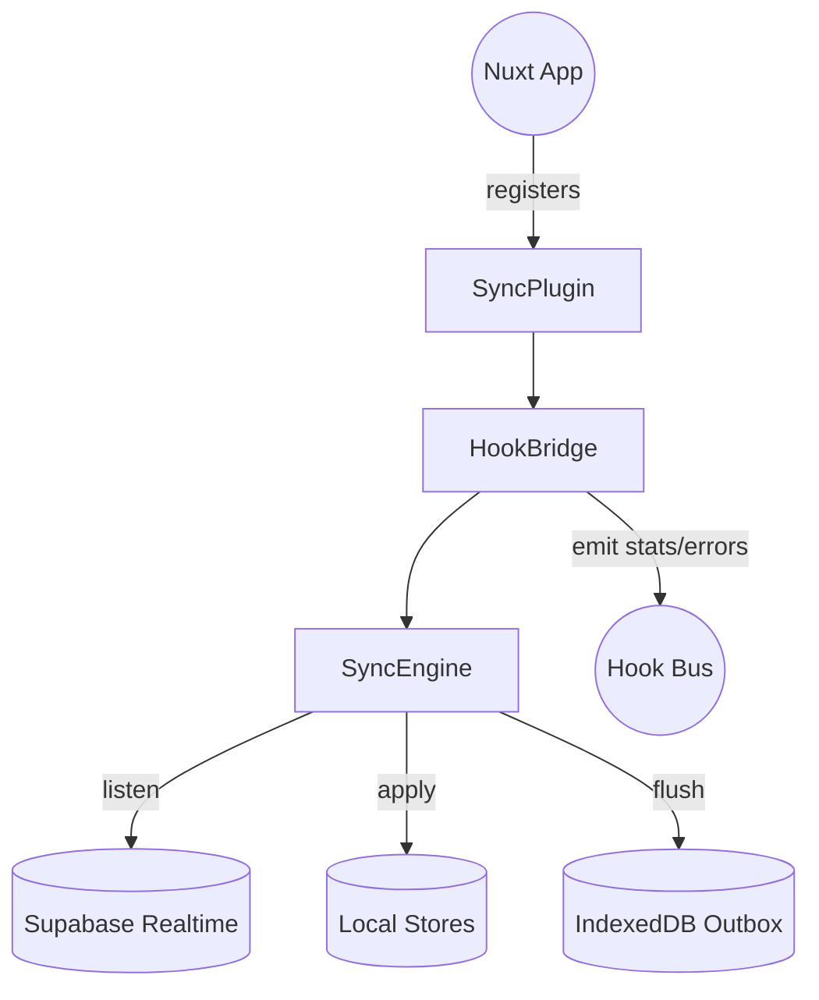

artifact_id: 9fa01afc-757f-4235-a4b4-5d1d5f1df41f
content_type: text/markdown

# design.md

## Overview

The Supabase sync engine ships as a single Nuxt plugin that wires into the existing hook bus to keep local stores and the remote Supabase database aligned. Instead of building new orchestration surfaces, it leans on the app’s existing composables and hook events, which keeps the footprint small and makes the feature easy to reason about. The engine stays invisible to end users, reacting to hook-based mutations, realtime changes, and connectivity updates in the background.

Two guiding principles shaped the design:

-   **Configuration over code** — feature teams describe their datasets through small adapter objects; no bespoke sync logic lives inside pages or stores.
-   **Pluggable transport** — transport responsibilities live behind a provider interface so swapping Supabase for Firebase, SQLite, or MongoDB requires only a different provider factory. The core engine never learns about HTTP verbs, WebSockets, or vendor-specific payloads.

This approach keeps the initial Supabase implementation straightforward while giving us an exit hatch if priorities or infrastructure change later.

## Architecture

The plugin instantiates a `SupabaseSyncEngine` with three helpers: subscription manager, outbound queue, and hook bridge. All work happens client-side.



### Core Flow

-   Plugin factory acquires Supabase client (`useSupabaseClient`) and hook registry (`useHookBus`). Pulling dependencies from composables keeps the plugin tree-shakeable and avoids hard imports.
-   Engine loads `topics` config describing tables and per-table transformers. Topics capture the minimal metadata needed to sync a data model; adding a table is a config change, not new engine code.
-   Subscription manager invokes the provider to register realtime observers per topic and forwards payloads to the engine. Delegating to the provider makes realtime semantics provider-specific without leaking into the core.
-   Engine hands payloads to the adapter to upsert/delete in the local store. Adapters own knowledge of local schema and let different tables normalize data however they need.
-   Hook bridge listens to local `db:*` mutation hooks and enqueues outbound deltas. Reusing existing change events prevents duplicate observers and ensures we mirror the same lifecycle other features use.
-   Outbound queue batches writes and hands them to the provider for transport-specific persistence. Batching is configurable but defaults to 250ms, striking a balance between responsiveness and network efficiency.
-   Connectivity monitor toggles queue flushing based on `navigator.onLine` and Supabase status events. This keeps the user unaware of outages while guaranteeing we never drop local mutations silently.

## Components and Interfaces

```ts
type SyncDirection = 'inbound' | 'outbound';

interface SyncAdapter<TLocal, TRemote = Record<string, unknown>> {
    table: string; // declares which table the adapter owns
    selectColumns?: string[]; // narrows payload size when providers support projection
    toLocal(remote: TRemote, ctx: SyncContext): Promise<TLocal> | TLocal; // normalize remote payloads
    toRemote(delta: TLocal, ctx: SyncContext): Promise<TRemote> | TRemote; // expand local diffs to provider format
    applyLocal(change: SyncChange<TLocal>): Promise<void>; // writes into local stores
    deleteLocal(id: string): Promise<void>;
    hookFilter?: (event: HookEvent) => boolean; // optional guard when local hooks are noisy
}

interface SyncTopicConfig {
    adapter: SyncAdapter<unknown>;
    realtimeFilter?: {
        schema?: string;
        channel?: string; // defaults to table
    };
}

interface SyncProviderHandlers {
    onChange(change: SyncChange<unknown>): void; // called by provider when a remote event arrives
    onError(error: Error, rawPayload?: unknown): void; // lets providers surface failures without throwing
}

interface SyncProvider {
    start(
        topic: SyncTopicConfig,
        handlers: SyncProviderHandlers
    ): Promise<void>; // register realtime observers
    stop(topic: SyncTopicConfig): Promise<void>; // unregister observers
    pushBatch(
        topic: SyncTopicConfig,
        changes: SyncChange<unknown>[]
    ): Promise<void>; // flush local mutations
    dispose(): Promise<void>; // teardown when the session ends
}

type SyncProviderFactory = (ctx: SyncContext) => SyncProvider;

interface SyncPluginOptions {
    topics: SyncTopicConfig[];
    batchWindowMs?: number; // default 250
    retryDelaysMs?: number[]; // default [250, 1000, 3000]
    maxQueueBytes?: number; // default 5 * 1024 * 1024
    provider?: SyncProviderFactory; // defaults to Supabase provider
}

interface SyncContext {
    supabase: SupabaseClient;
    emit: (event: SyncHookEvent) => void;
    now: () => number; // injected clock for deterministic testing
}

interface SyncChange<T> {
    type: 'insert' | 'update' | 'delete';
    id: string;
    payload?: T;
}

type SyncHookEvent =
    | { type: 'sync:stats'; pending: number; lastFlushAt: number | null }
    | {
          type: 'sync:error';
          direction: SyncDirection;
          message: string;
          data?: unknown;
      }
    | { type: 'sync:retry'; table: string; attempt: number; error: string }
    | { type: 'sync:queue:overflow'; dropped: number };

class SupabaseSyncEngine {
    constructor(
        private readonly options: SyncPluginOptions,
        private readonly ctx: SyncContext
    ) {}
    start(): Promise<void> {
        /* subscribe + bridge hooks */ return Promise.resolve();
    }
    stop(): Promise<void> {
        /* unsubscribe + flush */ return Promise.resolve();
    }
}
```

Supporting utilities stay tiny: `createSubscriptionManager`, `createOutboxQueue`, and `createHookBridge` each yield an object with `start()`/`stop()` methods so they can be activated or disposed with the session lifecycle.

### Provider Abstraction

-   `createSupabaseProvider(ctx)` implements `SyncProvider` using Supabase Realtime and REST APIs. It converts table names into channel subscriptions and RPC calls.
-   Alternate providers implement only the interface: e.g., `createFirestoreProvider`, `createSqliteProvider`. Each stays focused on translating a `SyncChange` into the provider’s API call.
-   The engine receives a provider instance via options; swapping backends means changing the factory passed into the plugin. No other module needs editing because adapters speak in neutral payloads.
-   Provider-specific setup (API keys, connection strings) stays within the provider factory and does not leak into adapters or engine internals. This lets deployment teams configure secrets without touching sync logic.
-   Providers share the same handler callbacks, so instrumentation (`sync:error`, `sync:stats`) works uniformly regardless of backend.

## Data Models

### Topic Configuration

The plugin expects a constant `syncTopics` defined in `app/config/sync-topics.ts`:

```ts
export const syncTopics: SyncTopicConfig[] = [
    {
        adapter: projectAdapter, // wraps local project store helpers
    },
    {
        adapter: threadAdapter,
        realtimeFilter: { schema: 'public', channel: 'threads' },
    },
    // additional topics share the same structure
];
```

### IndexedDB Outbox

Outbound buffering reuses the existing Dexie database (if present) or a minimal store created under `app/db/sync-outbox.ts`:

```ts
interface OutboxRecord {
    id: string; // uuid
    table: string;
    op: 'insert' | 'update' | 'delete';
    payload: Record<string, unknown> | null;
    createdAt: number;
}

export const syncOutbox = db.table<OutboxRecord>('sync_outbox');
```

No upstream schema changes are required; Supabase tables already exist, and the engine simply mirrors them.

### Provider Configuration

Provider factories accept their own option objects without modifying engine code:

```ts
export const supabaseSyncPlugin = defineSupabaseSyncPlugin({
    topics: syncTopics,
    provider: (ctx) => createSupabaseProvider(ctx, { schema: 'public' }),
});

// Swapping to Firebase later only replaces the factory:
export const firebaseSyncPlugin = defineSupabaseSyncPlugin({
    topics: syncTopics,
    provider: (ctx) => createFirestoreProvider(ctx, { projectId: '...' }),
});
```

The example highlights the only change point when switching transports: inject an alternate provider factory. Adapters and hook wiring remain untouched, so QA can reuse existing regression suites.

## Error Handling

Errors are normalized through a light `ServiceResult` helper:

```ts
type ServiceResult<T> = { ok: true; value: T } | { ok: false; error: Error };

function wrap<T>(promise: Promise<T>): Promise<ServiceResult<T>> {
    return promise.then(
        (value) => ({ ok: true, value }),
        (error) => ({
            ok: false,
            error: error instanceof Error ? error : new Error(String(error)),
        })
    );
}
```

-   Realtime payload parsing failures emit `sync:error` and skip the change.
-   Outbound writes retry with `retryDelaysMs`; the final failure emits `sync:error` with direction `outbound`.
-   Queue overflow emits `sync:queue:overflow` and prunes oldest entries before enqueuing the new one.
-   Hook bridge guards against re-entrant loops by tagging outbound events and ignoring mirrored inbound payloads for the same revision.

## Design Rationale & Benefits

-   **Hook-first integration** keeps the plugin agnostic of UI layers and reduces bundle size. It also means every feature consuming the hook bus automatically benefits from sync instrumentation.
-   **Adapters encapsulate table knowledge**, preventing the engine from assuming column shape or local store mechanics. Teams can evolve individual stores without refactoring the core engine.
-   **Provider interface isolates vendor logic**, letting us iterate on backend choices, run A/B tests, or operate in hybrid environments (e.g., local SQLite in desktop apps, Supabase in web) with the same engine.
-   **Outbox + batching** ensure outbound writes remain efficient while preserving ordering—key for multi-tab collaboration scenarios.
-   **Explicit error surfaces** (`sync:error`, `sync:retry`) give observability without leaking provider-specific exceptions into unrelated parts of the app.
-   **Config-driven topics** accelerate onboarding: adding a new dataset is an adapter + config entry, with no risk of touching synchronization plumbing.

## Testing Strategy

-   **Unit**: mock adapters to verify toLocal/toRemote conversions, queue size enforcement, retry delay sequencing, and that hook filters short-circuit correctly.
-   **Integration**: run the plugin with a mocked Supabase client that simulates realtime and RPC responses; assert that hooks are registered/unregistered and local stores receive updates.
-   **End-to-end**: Cypress/Vitest-driven browser test that performs concurrent edits across two tabs, validating that both converge without manual refresh.
-   **Performance**: script 1k payload bursts to confirm batch window keeps network calls under configured limits and CPU stays below the 5% budget.
