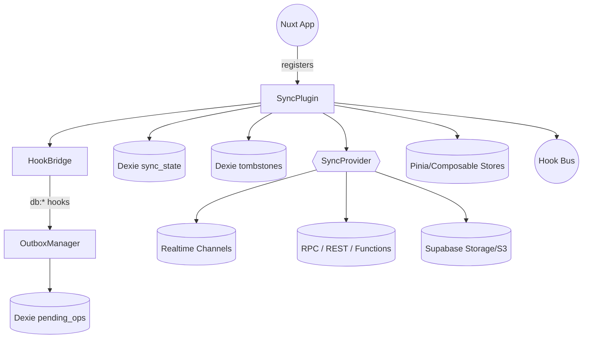
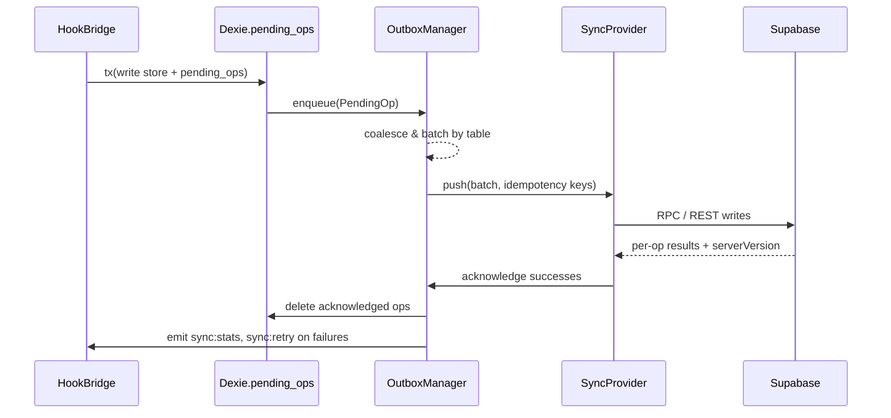
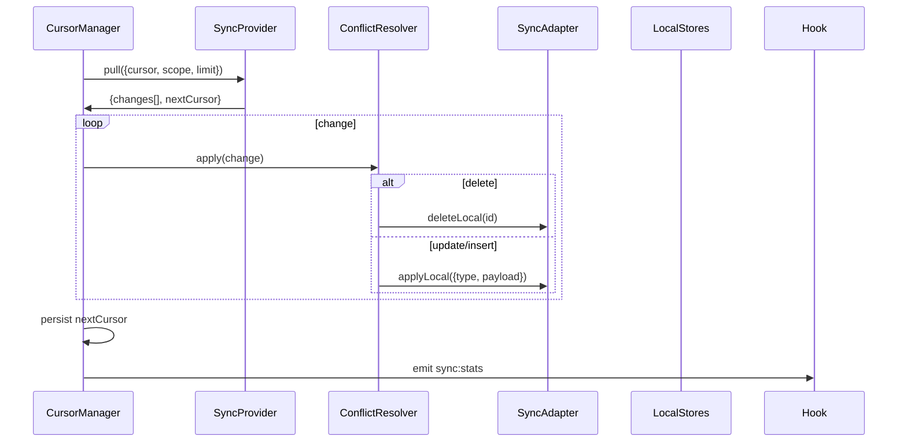

artifact_id: 9fa01afc-757f-4235-a4b4-5d1d5f1df41f
content_type: text/markdown

# design.md

## Overview

The Dexie ⇄ Supabase sync engine runs as a Nuxt client plugin that bootstraps once per authenticated session, wires into the existing hook bus, and coordinates three loops:

1. **Capture loop** — intercept local mutations, persist them in a Dexie outbox, and broadcast optimistic UI updates.
2. **Push loop** — batch pending ops, enforce ordering/idempotency, and push via a provider abstraction (Supabase-first, but Firebase-ready).
3. **Pull loop** — maintain per-table cursors, stream realtime deltas, and periodically reconcile via cursor-based pulls/backfills.

The second draft deepens the plan around conflicts, causality, partial sync, observability, and payload limits. The architecture must be deterministic, debuggable, and future-proof enough to swap remote transports with only provider changes.

## System Topology



Key contracts:

-   **Topic adapters** own schema transforms and conflict policies.
-   **SyncProvider** hides transport details (channel wiring, REST endpoints, Firebase vs Supabase).
-   **Dexie stores** persist pending ops, tombstones, cursors, sync run telemetry.
-   **Hook bus** delivers instrumentation (`sync:*` events) and captures outbound mutations.

## Core Modules

### 1. Plugin Bootstrap (`app/plugins/supabase-sync.client.ts`)

-   Resolves Supabase client + hook bus + Dexie handles via composables.
-   Observes auth session (Supabase `onAuthStateChange`). Starts engine when session exists; stops & flushes on sign-out.
-   Handles HMR disposal by calling `engine.stop()` to avoid duplicate subscriptions.

### 2. Engine (`SupabaseSyncEngine`)

Responsibilities split into dedicated helpers:

| Helper                 | Purpose                                                                                                                   |
| ---------------------- | ------------------------------------------------------------------------------------------------------------------------- |
| `HookBridge`           | Subscribes to `db:*:mutated` hooks, filters noise, enriches with ChangeStamp, writes to outbox.                           |
| `OutboxManager`        | Persists `PendingOp`, coalesces diffs, enforces queue byte limit, schedules batch flushes, tracks retries.                |
| `SubscriptionManager`  | Registers realtime listeners per topic, handles backpressure/coalescing, remaps provider payloads into adapters.          |
| `CursorManager`        | Persists `SyncState` per table, drives pull pagination, triggers rescan/backfill flows.                                   |
| `ConflictResolver`     | Applies per-topic policies (LWW / merge / CRDT), emits conflicts when human intervention is needed.                       |
| `RecoveryOrchestrator` | Runs rescan, rebase, and kill-switch scenarios; coordinates with HookBridge to re-apply pending ops atop fresh snapshots. |

### 3. Provider Abstraction

```ts
interface SyncProviderFactory {
    (ctx: ProviderContext): SyncProvider;
}

interface SyncProvider {
    subscribe(topic: SyncTopicConfig, cb: ProviderChangeHandler): Promise<void>;
    unsubscribe(topic: SyncTopicConfig): Promise<void>;
    pull(request: PullRequest): Promise<PullResponse>;
    push(batch: PushBatch): Promise<PushResult>;
    uploadAttachment?(payload: AttachmentPayload): Promise<AttachmentResult>;
    dispose(): Promise<void>;
}
```

-   `ProviderContext` contains the Supabase client (for default provider), session token, scoped fetch helper, and event emitter.
-   Providers emit raw change + metadata; engine translates to `SyncChange`.
-   Alternate providers (Firebase) implement the same surface; only plugin options change.

### 4. Topic Configuration & Adapters

```ts
interface SyncTopicConfig<TLocal = unknown, TRemote = unknown> {
    adapter: SyncAdapter<TLocal, TRemote>;
    policy: ConflictPolicy;
    scope: SyncScopeDescriptor; // tenant/workspace filters
    attachments?: AttachmentDescriptor[];
    realtime?: RealtimeFilter;
}
```

-   `SyncScopeDescriptor` expresses tenant → workspace → project boundaries so both provider queries and hook filters stay scoped.
-   Adapters encapsulate `toLocal`, `toRemote`, `applyLocal`, `deleteLocal`, `mergeFields`, `fieldsRequiringLww`.
-   Each adapter must supply `estimateSize()` so queue byte accounting is accurate.

## Data Flows

### Capture & Push Sequence



Guarantees:

-   Pending ops persist durably before local UI updates commit.
-   Engine tags each op with `ChangeStamp`. Provider echoes back `serverVersion` so queue can advance per-table checkpoints.
-   Partial failure returns per-op status; queue only deletes successes.

### Pull & Reconcile Sequence



Realtime events flow through the same resolver path but skip `pull`.

### Rescan / Rebase (staged, no evaporation)

1. Engine detects lost cursor or user triggers manual resync and enters rescan mode (`sync:rescan:starting`).
2. `RecoveryOrchestrator` pauses outbound push and snapshots the current `pending_ops`. UI continues to read-your-writes from the active dataset.
3. Build a staged snapshot: populate mirror Dexie tables (e.g., `threads_stage`, `messages_stage`, `posts_stage`, …) via paged pulls. Do not mutate the active tables yet.
4. Rebase: apply the pending ops snapshot onto the staged tables in timestamp order (idempotent).
5. Atomic view swap: flip a single `activeDataset` flag so selectors start reading from the staged tables (`sync:rescan:swap`). No rows disappear because reads were gated; pending overlays remain applied throughout.
6. Cleanup: truncate/replace old tables in the background and exit rescan mode (`sync:rescan:completed`). Resume normal loops and pushes.
7. If staging fails, abort safely, keep the current dataset active, and emit `sync:rescan:error`.

#### Selector gating (read-your-writes)

-   All read selectors compose "base tables + pending overlays". During rescan, the overlay is applied both before and after the swap, ensuring continuous read-your-writes.
-   A reactive `activeDataset: 'live' | 'stage'` controls which base tables are visible; switching is instant and transaction-free for UI consumers.
-   Writers keep appending to `pending_ops` during rescan (until `sync:queue:full`). The orchestrator includes those ops in the rebase step using the pending snapshot captured at the start; new ops after the snapshot will appear via the overlay immediately after the swap.

## Conflict Handling

-   **LWW**: Compare `serverVersion` (preferred) or HLC; greater wins.
-   **Merge**: Merge map derived from adapter, e.g., `tags = union`, `participants = mergeById`, `title = remoteIfNewer`.
-   **CRDT**: When adapter declares `policy: 'crdt'`, engine forwards payloads to adapter’s CRDT merge routine (e.g., Yjs doc).
-   Each applied change records `lastWriter` (deviceId + opId). When inbound change matches local `lastWriter`, engine skips to prevent echo loops.
-   Conflicts emit `sync:conflict` with `{ table, id, local, remote, policy }`.

## Partial Sync & Cursors

-   `SyncState` Dexie table stores per-topic `{ lastServerVersion, lastCursor, lastFullRescanAt }`.
-   Provider `pull()` accepts `scope` (tenant/workspace) and `cursor`.
-   Cursor format for Supabase: `serverVersion::uuid` where `serverVersion` is a monotonic bigint from Postgres sequence; fallback to `(hlc, id)` tuple.
-   On cold start, engine requests `/sync/bootstrap?scope=...&limit=...` endpoint that streams deterministic pages.
-   Cursor drift detection: if server responds with `410 Gone` / `cursor_expired`, engine enqueues rescan.

## Offline & Queue Management

-   Outbox persists in Dexie with `maxQueueBytes` (default 50 MB) and SHALL NOT drop pending operations. When approaching the cap, the queue first coalesces per-PK update ops and trims redundant patches. If still over, the engine emits `sync:queue:full` and applies simple, user-facing backpressure (surface a banner, pause non-critical background writes) until space frees up or connectivity resumes. Optional lightweight compression for large patches can be enabled, but no automatic data loss occurs.
-   Connectivity monitor listens to `navigator.onLine`, Supabase realtime connection state, and fetch errors. Offline mode pauses pushes but continues capturing ops (subject to backpressure if the queue is full).
-   Upon reconnect, queue flushes in FIFO order. For large backlogs, queue splits into pages to avoid exceeding payload size.
-   Visibility integration: when tab hidden, timers slow to 1s tick except when flush is in-flight, honoring battery constraints.

## Tombstones & History

-   Deletes never remove local rows immediately; they set `deletedAt` and push tombstones.
-   Tombstones stored in Dexie (`db.tombstones`). Purge job runs during idle windows, checking `SyncState.lastServerVersion` across all known devices (persisted via device registry). Only after every device version > tombstone version can we purge.
-   Full resync honors tombstones first to avoid resurrecting data.

## Large Payloads & Attachments

-   Attachment descriptors tell the engine which fields represent blobs. On outbound writes, engine uploads attachments first (`provider.uploadAttachment`) and swaps fields for `{ url, hash, size }`.
-   Text fields >256 KB chunked using content-defined chunking to minimize duplicates; reassembled before `applyLocal`.
-   Provider push enforces 8 MB body limit. If batch exceeds, queue splits and retries sequentially.
-   Compression toggled via `Accept-Encoding` header when backend supports gzipped JSON.

## Observability & Recovery

-   `sync_runs` Dexie table captures metrics per push/pull cycle.
-   `HookBridge` emits: `sync:stats`, `sync:retry`, `sync:conflict`, `sync:queue:full`, `sync:auth:blocked`, `sync:rescan:starting`, `sync:rescan:progress`, `sync:rescan:swap`, `sync:rescan:completed`, `sync:rescan:error`.
-   Debug overlay (dev only) can subscribe to these events and render counts without shipping UI components to production.
-   Recovery orchestrator exposes commands:
    -   `triggerRescan(table?)`
    -   `triggerRebase()`
    -   `pausePush()` / `resumePush()`
    -   `clearQueue()`

## Supabase Provider Notes

-   **Realtime**: use channel per table (`supabase.channel('public:table')`). Apply row-level filters for tenant scope.
-   **Pull**: expose RPC `sync_pull(scope jsonb, cursor bigint, limit int)` that reads from `change_log` table ordered by `server_version`.
-   **Push**: call edge function `sync_push` that dedupes by `op_id`, applies mutations in transaction, updates `server_version`, and returns per-op status.
-   **Change Log**: Postgres trigger writes to `change_log(table, pk, op, payload, server_version, hlc, tenant_id)`. Pull endpoint streams from this log.
-   **Attachments**: use Supabase Storage bucket per tenant; provider ensures signed URLs expire and are refreshed via hook if stale.

## Firebase / Future Providers

To replace Supabase:

1. Implement `createFirestoreProvider` translating `subscribe/push/pull` into Firestore listeners and batched writes.
2. Provide serverVersion equivalent via synthetic counter (Cloud Function, monotonic ID).
3. Reuse adapters unchanged—the only difference is provider factory injected into plugin options.
4. Ensure security rules enforce tenant scope; adapter scopes stay identical.

## Testing Strategy

-   **Unit**:
    -   Conflict policy matrix (LWW vs merge vs CRDT).
    -   Queue overflow, retry backoff, ChangeStamp generation.
    -   Tombstone purge gating logic.
-   **Integration**:
    -   Mock provider to simulate realtime bursts, partial failures, attachment uploads.
    -   Verify cursors update correctly when provider returns `nextCursor`.
    -   Ensure pending ops survive reload (Dexie open/close).
    -   Simulate auth expiry to confirm `sync:auth:blocked`.
-   **E2E**:
    -   Multi-tab editing scenario verifying conflict surfacing.
    -   Offline flight mode test: edit while offline, reconnect, ensure pushes flush in order.
    -   Backfill scenario loading 50k rows verifying progress events and memory usage.

## Open Questions / Follow-ups

-   Device registry: best storage for cross-device checkpoint status (Supabase table vs edge function).
-   CRDT scope: do we need Yjs documents for long-form notes at launch or is LWW acceptable initially?
-   Attachment hashing: pick Murmur3 vs SHA-256 given browser performance.
-   Should kill switch gating pushes be remote-configurable (feature flag) or purely client-side?
