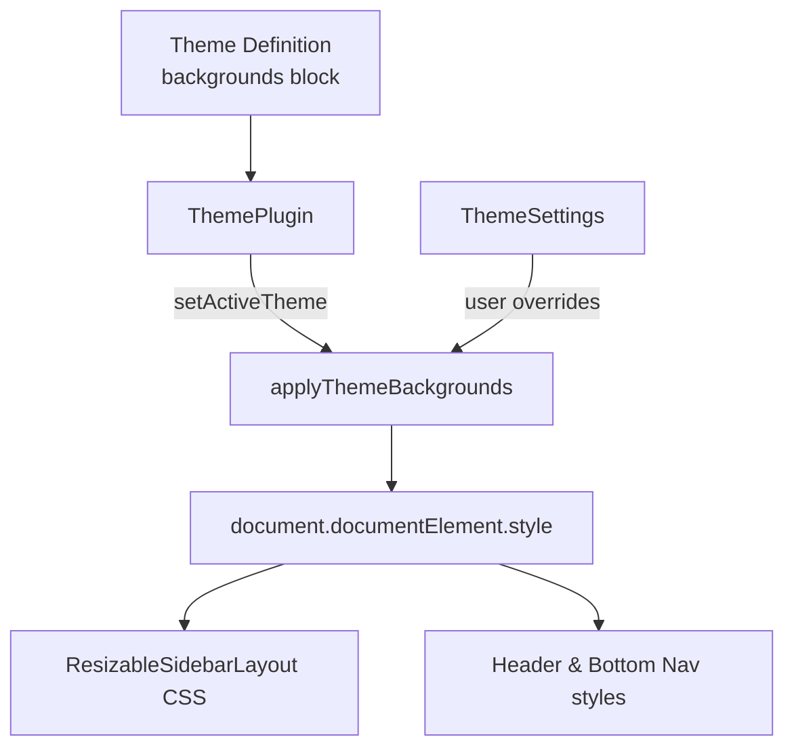

artifact_id: 5cbb52be-d86c-4e1f-9f6b-e9649200fb17
content_type: text/markdown

# design.md

## Overview

We will extend the refined theme DSL to describe background layers and use the existing theme plugin to hydrate CSS custom properties whenever the active theme changes. The goal is to reuse the current variable-based styling (`--app-content-bg-*`, `--app-sidebar-bg-*`, gradients) so that components such as `ResizableSidebarLayout` and sidebar headers inherit background changes without additional watchers or prop plumbing.

Key principles:

-   **Single point of truth**: Themes publish background data; runtime applies it by updating root-level CSS variables.
-   **Minimal code**: Reuse `theme-apply.ts` helpers (e.g., `setBgVar`) by extracting them into a shared utility invoked by both the theme plugin and dashboard settings.
-   **Compatibility first**: Theme settings remain the final source of overrides; theme defaults simply seed the same variables.

## Architecture



## Components & Interfaces

### Theme DSL additions

```typescript
// app/theme/_shared/types.ts
export interface ThemeBackgroundLayer {
    image?: string | null; // Supports public URLs or internal-file tokens
    color?: string; // Optional fallback tint
    opacity?: number; // 0..1
    repeat?: 'repeat' | 'no-repeat' | 'repeat-x' | 'repeat-y';
    size?: string; // e.g., '150px', 'cover'
    fit?: 'cover' | 'contain'; // convenience, converted to size
}

export interface ThemeBackgrounds {
    content?: {
        base?: ThemeBackgroundLayer; // maps to --app-content-bg-1*
        overlay?: ThemeBackgroundLayer; // maps to --app-content-bg-2*
    };
    sidebar?: ThemeBackgroundLayer; // maps to --app-sidebar-bg-1*
    headerGradient?: ThemeBackgroundLayer; // gradient image + repeat
    bottomNavGradient?: ThemeBackgroundLayer;
}

export interface ThemeDefinition {
    // ...existing fields
    backgrounds?: ThemeBackgrounds;
}
```

### Runtime application helper

```typescript
// app/core/theme/backgrounds.ts
export async function applyThemeBackgrounds(
    backgrounds: ThemeBackgrounds | undefined,
    options: { resolveToken: (token: string) => Promise<string | null> }
): Promise<void> {
    const rootStyle = document.documentElement.style;

    const map: Record<string, ThemeBackgroundLayer | undefined> = {
        '--app-content-bg-1': backgrounds?.content?.base,
        '--app-content-bg-2': backgrounds?.content?.overlay,
        '--app-sidebar-bg-1': backgrounds?.sidebar,
    };

    const setBg = async (cssVar: string, layer?: ThemeBackgroundLayer) => {
        if (!layer || layer.image === null) {
            rootStyle.setProperty(cssVar, 'none');
            rootStyle.removeProperty(`${cssVar}-opacity`);
            return;
        }

        const url = layer.image
            ? await options.resolveToken(layer.image)
            : null;
        rootStyle.setProperty(cssVar, url ? `url("${url}")` : 'none');
        rootStyle.setProperty(`${cssVar}-opacity`, String(layer.opacity ?? 1));
        // repeat & size keys mapped similarly
    };

    await Promise.all(
        Object.entries(map).map(([cssVar, layer]) => setBg(cssVar, layer))
    );

    // Gradients use plain strings (no async tokens expected)
    applyGradient('--app-header-gradient', backgrounds?.headerGradient);
    applyGradient('--app-bottomnav-gradient', backgrounds?.bottomNavGradient);
}
```

Both `applyThemeBackgrounds` and the existing dashboard settings flow will import a shared `resolveToken` (the internal-file logic already lives in `theme-apply.ts`). We will extract that helper into `background-token.ts` to avoid duplication.

## Data Models

-   **ThemeBackgroundLayer** → serializable config stored in theme definitions.
-   **ThemeBackgrounds** → optional block hung off `ThemeDefinition`.
-   **BackgroundVariableMap** → runtime mapping from semantic slots (`content.base`) to CSS custom properties (`--app-content-bg-1`, `--app-content-bg-1-opacity`, `--app-content-bg-1-repeat`, `--app-content-bg-1-size`).

The mapping deliberately mirrors existing `ThemeSettings` keys so that overrides can reuse the same property names without migration churn.

## Error Handling

-   If `resolveToken()` rejects (e.g., missing internal file), log a dev warning and fall back to `'none'` while keeping the previous solid color intact.
-   Invalid repeat/size strings are ignored; we clamp to known defaults (`repeat`, `150px`, opacity `1`).
-   When the DOM is unavailable (SSR), helper becomes a no-op.

## Performance Considerations

-   Background application runs only on theme switches (typically rare). Promise batching ensures we do not sequence redundant `resolveToken` awaits.
-   Object URL caching already exists in `theme-apply.ts`; extraction into a shared utility means no additional allocations beyond first resolution.
-   Removing hard-coded URLs from CSS eliminates duplicated paints on non-retro themes.

## Testing Strategy

-   **Unit**: Add Vitest coverage for `applyThemeBackgrounds` to verify CSS variables set and cleared correctly, including repeat/size fallbacks and internal-file token resolution.
-   **Integration**: Extend an existing Playwright smoke test (or add a lightweight one) that switches between `retro` and a neutral mock theme and asserts background URLs update.
-   **Regression**: Update dashboard theme settings tests to confirm user overrides still take precedence after theme defaults run.

## Rollout Notes

-   Ship behind the existing theme feature flag (no new toggles). Once background migration lands, future theme settings work can build on the same `ThemeBackgrounds` structure to edit defaults safely.
