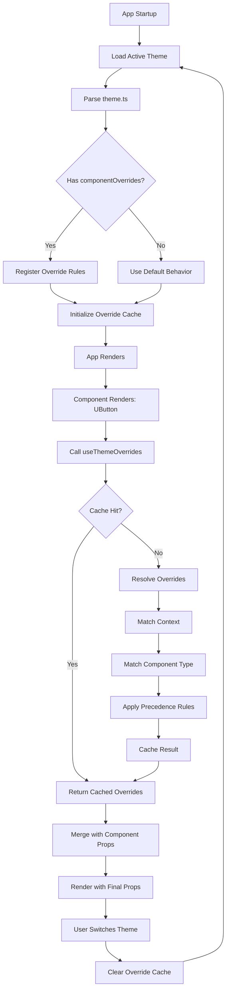

# Theme Override System - Technical Design

## Overview

This document outlines the technical architecture for a theme override system that allows themes to customize Nuxt UI component props through declarative configuration. The system provides a simple, performant way to override colors, sizes, variants, and other properties on UButton, UInput, UModal, and other Nuxt UI components without modifying application code.

### Goals
- **Simplicity**: Theme developers define overrides in theme.ts using clear, declarative syntax
- **Performance**: Zero measurable impact on component render time
- **Type Safety**: Full TypeScript support with autocomplete and validation
- **Flexibility**: Support global, context-specific, and state-based overrides

### Architecture Principles
1. **Props Win**: Component-specific props always override theme overrides
2. **Context Matters**: More specific contexts take precedence over global overrides
3. **Fail Gracefully**: Invalid overrides are ignored without breaking the app
4. **Cache Aggressively**: Override resolution results are cached for performance

---

## Architecture

### High-Level System Flow



### Directory Structure

```
app/
├── theme/
│   ├── default/
│   │   ├── theme.ts                    # MODIFIED: Add componentOverrides
│   │   └── ...
│   ├── _shared/
│   │   ├── override-resolver.ts        # NEW: Override resolution logic
│   │   ├── override-types.ts           # NEW: TypeScript types
│   │   └── override-cache.ts           # NEW: Caching layer
│   └── minimal/
│       └── theme.ts                    # MODIFIED: Example overrides
├── composables/
│   ├── useThemeOverrides.ts            # NEW: Composable for override access
│   └── useThemeSettings.ts             # EXISTING: User customizations
├── plugins/
│   └── theme.client.ts                 # MODIFIED: Register overrides on load
└── components/
    └── ...                              # Use useThemeOverrides in templates
```

---

## Core Components

### 1. Override Configuration Schema

**File**: `app/theme/_shared/override-types.ts`

**Purpose**: Define TypeScript types for theme override configuration.

#### Interfaces

```typescript
import type { ButtonProps, InputProps, ModalProps, CardProps } from '@nuxt/ui';

/**
 * Context selector for targeting specific UI areas
 */
export type ContextSelector = 
  | 'global'       // Apply to all components
  | 'chat'         // Apply within #app-chat-container
  | 'sidebar'      // Apply within #app-sidebar
  | 'dashboard'    // Apply within #app-dashboard-modal
  | 'header'       // Apply within #app-header
  | string;        // Custom CSS selector

/**
 * Component type for targeting specific Nuxt UI components
 */
export type ComponentType = 
  | 'button' 
  | 'input' 
  | 'textarea'
  | 'modal' 
  | 'card'
  | 'badge'
  | 'tooltip'
  | 'dropdown'
  | string;        // Any Nuxt UI component name

/**
 * Component state for state-based overrides
 */
export type ComponentState = 
  | 'default'
  | 'hover'
  | 'active'
  | 'disabled'
  | 'loading'
  | 'focus';

/**
 * Override rule defines what props to apply to which components
 */
export interface OverrideRule<TProps = Record<string, unknown>> {
  /** Component type to target */
  component: ComponentType;
  
  /** Context selector (default: 'global') */
  context?: ContextSelector;
  
  /** State to apply overrides (default: 'default') */
  state?: ComponentState;
  
  /** Props to override */
  props: Partial<TProps>;
  
  /** Optional priority (higher wins, default: 0) */
  priority?: number;
  
  /** Optional condition function */
  condition?: (context: OverrideContext) => boolean;
}

/**
 * Context information passed to condition functions
 */
export interface OverrideContext {
  /** Current theme mode */
  mode: 'light' | 'dark' | 'light-hc' | 'dark-hc' | 'light-mc' | 'dark-mc';
  
  /** Active theme name */
  theme: string;
  
  /** Component element (if available) */
  element?: HTMLElement;
  
  /** Component props */
  componentProps: Record<string, unknown>;
}

/**
 * Component overrides configuration in theme.ts
 */
export interface ComponentOverrides {
  /** Global overrides (apply to all instances) */
  global?: {
    button?: OverrideRule<ButtonProps>[];
    input?: OverrideRule<InputProps>[];
    modal?: OverrideRule<ModalProps>[];
    card?: OverrideRule<CardProps>[];
    [key: string]: OverrideRule[];
  };
  
  /** Context-specific overrides */
  contexts?: {
    chat?: ComponentOverrides['global'];
    sidebar?: ComponentOverrides['global'];
    dashboard?: ComponentOverrides['global'];
    [key: string]: ComponentOverrides['global'];
  };
  
  /** State-based overrides */
  states?: {
    hover?: ComponentOverrides['global'];
    active?: ComponentOverrides['global'];
    disabled?: ComponentOverrides['global'];
    loading?: ComponentOverrides['global'];
    [key: string]: ComponentOverrides['global'];
  };
}

/**
 * Resolved override result
 */
export interface ResolvedOverride {
  /** Merged props to apply */
  props: Record<string, unknown>;
  
  /** Applied rules (for debugging) */
  rules: OverrideRule[];
  
  /** Cache key */
  cacheKey: string;
}
```

---

### 2. Override Resolver

**File**: `app/theme/_shared/override-resolver.ts`

**Purpose**: Core logic for resolving which overrides apply to a component.

#### Implementation

```typescript
import type { 
  ComponentOverrides, 
  OverrideRule, 
  ResolvedOverride, 
  OverrideContext,
  ComponentType,
  ContextSelector 
} from './override-types';

export class OverrideResolver {
  private overrides: ComponentOverrides;
  private cache: Map<string, ResolvedOverride>;
  
  constructor(overrides: ComponentOverrides) {
    this.overrides = overrides;
    this.cache = new Map();
  }
  
  /**
   * Resolve overrides for a component
   */
  resolve(
    componentType: ComponentType,
    context: ContextSelector,
    overrideContext: OverrideContext
  ): ResolvedOverride {
    // Generate cache key
    const cacheKey = this.getCacheKey(componentType, context, overrideContext);
    
    // Check cache first
    if (this.cache.has(cacheKey)) {
      return this.cache.get(cacheKey)!;
    }
    
    // Collect applicable rules
    const rules = this.collectRules(componentType, context, overrideContext);
    
    // Sort by priority (higher priority wins)
    rules.sort((a, b) => (b.priority ?? 0) - (a.priority ?? 0));
    
    // Merge props from all rules
    const props = this.mergeProps(rules);
    
    // Cache result
    const result: ResolvedOverride = {
      props,
      rules,
      cacheKey,
    };
    
    this.cache.set(cacheKey, result);
    
    return result;
  }
  
  /**
   * Collect all applicable override rules
   */
  private collectRules(
    componentType: ComponentType,
    context: ContextSelector,
    overrideContext: OverrideContext
  ): OverrideRule[] {
    const rules: OverrideRule[] = [];
    
    // 1. Global overrides (lowest priority)
    if (this.overrides.global?.[componentType]) {
      rules.push(...this.overrides.global[componentType]);
    }
    
    // 2. Context-specific overrides
    if (context !== 'global' && this.overrides.contexts?.[context]?.[componentType]) {
      rules.push(...this.overrides.contexts[context][componentType]);
    }
    
    // 3. State-based overrides (highest priority)
    // Note: State is determined by component, handled separately
    
    // 4. Filter by condition
    return rules.filter(rule => {
      if (!rule.condition) return true;
      return rule.condition(overrideContext);
    });
  }
  
  /**
   * Merge props from multiple rules
   */
  private mergeProps(rules: OverrideRule[]): Record<string, unknown> {
    const merged: Record<string, unknown> = {};
    
    for (const rule of rules) {
      for (const [key, value] of Object.entries(rule.props)) {
        if (key === 'class') {
          // Concatenate classes
          merged[key] = merged[key] 
            ? `${merged[key]} ${value}` 
            : value;
        } else if (key === 'ui' && typeof value === 'object') {
          // Deep merge ui objects
          merged[key] = this.deepMerge(merged[key] as object ?? {}, value as object);
        } else {
          // Override with latest value
          merged[key] = value;
        }
      }
    }
    
    return merged;
  }
  
  /**
   * Deep merge objects
   */
  private deepMerge(target: object, source: object): object {
    const result = { ...target };
    
    for (const [key, value] of Object.entries(source)) {
      if (value && typeof value === 'object' && !Array.isArray(value)) {
        result[key] = this.deepMerge(result[key] as object ?? {}, value);
      } else {
        result[key] = value;
      }
    }
    
    return result;
  }
  
  /**
   * Generate cache key
   */
  private getCacheKey(
    componentType: ComponentType,
    context: ContextSelector,
    overrideContext: OverrideContext
  ): string {
    return `${componentType}:${context}:${overrideContext.mode}:${overrideContext.theme}`;
  }
  
  /**
   * Clear cache (call on theme switch)
   */
  clearCache(): void {
    this.cache.clear();
  }
  
  /**
   * Get cache statistics (for debugging)
   */
  getCacheStats(): { size: number; keys: string[] } {
    return {
      size: this.cache.size,
      keys: Array.from(this.cache.keys()),
    };
  }
}

/**
 * Singleton resolver instance
 */
let resolverInstance: OverrideResolver | null = null;

export function getOverrideResolver(): OverrideResolver | null {
  return resolverInstance;
}

export function setOverrideResolver(overrides: ComponentOverrides): void {
  resolverInstance = new OverrideResolver(overrides);
}

export function clearOverrideResolver(): void {
  resolverInstance?.clearCache();
  resolverInstance = null;
}
```

---

### 3. Theme Overrides Composable

**File**: `app/composables/useThemeOverrides.ts`

**Purpose**: Provide reactive access to theme overrides for components.

#### Implementation

```typescript
import type { ComponentType, ContextSelector } from '~/theme/_shared/override-types';
import { getOverrideResolver } from '~/theme/_shared/override-resolver';

/**
 * Composable for accessing theme overrides
 */
export function useThemeOverrides(
  componentType: ComponentType,
  context: ContextSelector = 'global'
) {
  const { $theme } = useNuxtApp();
  
  // Build override context
  const overrideContext = computed(() => ({
    mode: $theme.current.value,
    theme: $theme.activeTheme.value,
    componentProps: {},
  }));
  
  // Resolve overrides
  const overrides = computed(() => {
    const resolver = getOverrideResolver();
    if (!resolver) {
      return {};
    }
    
    const result = resolver.resolve(
      componentType,
      context,
      overrideContext.value
    );
    
    return result.props;
  });
  
  // Debug info (only in dev)
  if (import.meta.dev) {
    const debugInfo = computed(() => {
      const resolver = getOverrideResolver();
      if (!resolver) return null;
      
      const result = resolver.resolve(
        componentType,
        context,
        overrideContext.value
      );
      
      return {
        component: componentType,
        context,
        appliedRules: result.rules.length,
        cacheKey: result.cacheKey,
      };
    });
    
    // Log when overrides change
    watch(overrides, (newVal, oldVal) => {
      if (JSON.stringify(newVal) !== JSON.stringify(oldVal)) {
        console.log('[useThemeOverrides]', debugInfo.value);
      }
    });
  }
  
  return {
    overrides: readonly(overrides),
  };
}

/**
 * Auto-detect context from DOM hierarchy
 */
export function useAutoContext(): ContextSelector {
  const element = ref<HTMLElement | null>(null);
  
  onMounted(() => {
    element.value = getCurrentInstance()?.proxy?.$el as HTMLElement;
  });
  
  const context = computed<ContextSelector>(() => {
    if (!element.value) return 'global';
    
    // Check for known context IDs
    if (element.value.closest('#app-chat-container')) return 'chat';
    if (element.value.closest('#app-sidebar')) return 'sidebar';
    if (element.value.closest('#app-dashboard-modal')) return 'dashboard';
    if (element.value.closest('#app-header')) return 'header';
    
    return 'global';
  });
  
  return context;
}

/**
 * Merge theme overrides with component props
 */
export function mergeOverrides(
  themeProps: Record<string, unknown>,
  componentProps: Record<string, unknown>
): Record<string, unknown> {
  const merged = { ...themeProps };
  
  // Component props win
  for (const [key, value] of Object.entries(componentProps)) {
    if (value === undefined) continue;
    
    if (key === 'class') {
      // Concatenate classes
      merged[key] = themeProps[key] 
        ? `${themeProps[key]} ${value}` 
        : value;
    } else if (key === 'ui' && typeof value === 'object') {
      // Deep merge ui objects
      merged[key] = deepMerge(themeProps[key] as object ?? {}, value as object);
    } else {
      // Component prop wins
      merged[key] = value;
    }
  }
  
  return merged;
}

function deepMerge(target: object, source: object): object {
  const result = { ...target };
  
  for (const [key, value] of Object.entries(source)) {
    if (value && typeof value === 'object' && !Array.isArray(value)) {
      result[key] = deepMerge(result[key] as object ?? {}, value);
    } else {
      result[key] = value;
    }
  }
  
  return result;
}
```

---

### 4. Theme Plugin Enhancement

**File**: `app/plugins/theme.client.ts` (Modified)

**Purpose**: Initialize override resolver when theme loads.

#### Modifications

```typescript
import { setOverrideResolver, clearOverrideResolver } from '~/theme/_shared/override-resolver';

export default defineNuxtPlugin((nuxtApp) => {
  // ... existing theme mode logic ...
  
  // Initialize override resolver
  const initializeOverrides = (themeConfig: any) => {
    // Clear old resolver
    clearOverrideResolver();
    
    // Check if theme has component overrides
    if (themeConfig?.componentOverrides) {
      console.log('[theme] Initializing component overrides');
      setOverrideResolver(themeConfig.componentOverrides);
    }
  };
  
  // Load theme and initialize overrides
  const loadAndValidateTheme = async (themeName: string, injectCss = true) => {
    // ... existing load logic ...
    
    const result = await loadTheme(themeName);
    
    // Initialize overrides from theme config
    if (result?.config) {
      initializeOverrides(result.config);
    }
    
    // ... rest of existing logic ...
  };
  
  // Call on initial load
  loadAndValidateTheme(activeTheme.value);
  
  // Enhanced switchTheme to reinitialize overrides
  const switchTheme = async (themeName: string) => {
    const success = await loadAndValidateTheme(themeName);
    if (success) {
      apply(current.value);
    }
    return success;
  };
  
  // ... rest of plugin ...
});
```

---

## Data Models

### Theme Configuration Example

**File**: `app/theme/minimal/theme.ts`

```typescript
export default defineAppConfig({
  ui: {
    // Existing Nuxt UI config
    button: {
      slots: {
        base: 'rounded-full font-bold',
      },
    },
  },
  
  // NEW: Component overrides
  componentOverrides: {
    // Global overrides (apply everywhere)
    global: {
      button: [
        {
          component: 'button',
          props: {
            color: 'primary',
            size: 'md',
            variant: 'solid',
          },
        },
      ],
      input: [
        {
          component: 'input',
          props: {
            color: 'primary',
            size: 'md',
            variant: 'outline',
          },
        },
      ],
    },
    
    // Context-specific overrides
    contexts: {
      chat: {
        button: [
          {
            component: 'button',
            props: {
              color: 'secondary',
              size: 'sm',
              class: 'chat-action-btn',
            },
            priority: 10,
          },
        ],
      },
      sidebar: {
        button: [
          {
            component: 'button',
            props: {
              variant: 'ghost',
              color: 'gray',
            },
            priority: 10,
          },
        ],
      },
    },
    
    // State-based overrides
    states: {
      disabled: {
        button: [
          {
            component: 'button',
            props: {
              color: 'gray',
              ui: {
                base: 'opacity-50 cursor-not-allowed',
              },
            },
          },
        ],
      },
    },
  },
});
```

---

## Component Usage Patterns

### Pattern 1: Manual Override Application

```vue
<template>
  <UButton v-bind="buttonProps">
    Click Me
  </UButton>
</template>

<script setup lang="ts">
const { overrides } = useThemeOverrides('button', 'chat');

const buttonProps = computed(() => ({
  ...overrides.value,
  // Component-specific props win
  color: 'primary',
}));
</script>
```

### Pattern 2: Auto-Context Detection

```vue
<template>
  <UButton v-bind="buttonProps">
    Click Me
  </UButton>
</template>

<script setup lang="ts">
const context = useAutoContext();
const { overrides } = useThemeOverrides('button', context);

const buttonProps = overrides;
</script>
```

### Pattern 3: Wrapper Component

```vue
<!-- ThemeButton.vue -->
<template>
  <UButton v-bind="mergedProps">
    <slot />
  </UButton>
</template>

<script setup lang="ts">
const props = defineProps<{
  color?: string;
  size?: string;
  variant?: string;
  [key: string]: any;
}>();

const context = useAutoContext();
const { overrides } = useThemeOverrides('button', context);

const mergedProps = computed(() => 
  mergeOverrides(overrides.value, props)
);
</script>
```

---

## Error Handling

### Validation Strategy

```typescript
export function validateComponentOverrides(
  overrides: ComponentOverrides
): { valid: boolean; errors: string[] } {
  const errors: string[] = [];
  
  // Check structure
  if (typeof overrides !== 'object') {
    errors.push('componentOverrides must be an object');
    return { valid: false, errors };
  }
  
  // Validate global overrides
  if (overrides.global) {
    for (const [component, rules] of Object.entries(overrides.global)) {
      if (!Array.isArray(rules)) {
        errors.push(`global.${component} must be an array`);
      }
    }
  }
  
  // Validate contexts
  if (overrides.contexts) {
    for (const [context, contextOverrides] of Object.entries(overrides.contexts)) {
      if (typeof contextOverrides !== 'object') {
        errors.push(`contexts.${context} must be an object`);
      }
    }
  }
  
  return {
    valid: errors.length === 0,
    errors,
  };
}
```

### Fallback Strategy

```typescript
try {
  const resolver = getOverrideResolver();
  if (!resolver) {
    // No overrides configured, use defaults
    return {};
  }
  
  const result = resolver.resolve(componentType, context, overrideContext);
  return result.props;
} catch (error) {
  console.error('[useThemeOverrides] Resolution failed:', error);
  
  // Return empty object, component uses defaults
  return {};
}
```

---

## Performance Optimization

### Caching Strategy

1. **Cache Key Generation**: Combine component type, context, mode, and theme
2. **Cache Invalidation**: Clear on theme switch
3. **Cache Size Limit**: Max 100 entries, LRU eviction
4. **Cache Hit Rate**: Target >90% in typical usage

### Performance Targets

| Operation | Target Time | Notes |
|-----------|-------------|-------|
| Resolve overrides (cache hit) | < 0.1ms | Return cached result |
| Resolve overrides (cache miss) | < 1ms | Compute and cache |
| Theme switch | < 50ms | Clear cache and reinitialize |
| Component render overhead | < 5% | Compared to no overrides |

---

## Testing Strategy

### Unit Tests

**File**: `app/composables/__tests__/useThemeOverrides.test.ts`

```typescript
describe('useThemeOverrides', () => {
  it('should return empty object when no overrides configured', () => {
    const { overrides } = useThemeOverrides('button');
    expect(overrides.value).toEqual({});
  });
  
  it('should resolve global overrides', () => {
    // Mock override resolver
    const { overrides } = useThemeOverrides('button', 'global');
    expect(overrides.value).toHaveProperty('color');
  });
  
  it('should resolve context-specific overrides', () => {
    const { overrides } = useThemeOverrides('button', 'chat');
    expect(overrides.value.color).toBe('secondary');
  });
  
  it('should prioritize context over global', () => {
    const { overrides } = useThemeOverrides('button', 'chat');
    expect(overrides.value.color).not.toBe('primary'); // Chat overrides global
  });
});
```

### Integration Tests

**File**: `tests/integration/theme-overrides.test.ts`

```typescript
describe('Theme Override Integration', () => {
  it('should apply overrides to rendered UButton', async () => {
    const wrapper = mount(TestComponent);
    const button = wrapper.findComponent(UButton);
    
    expect(button.props('color')).toBe('primary');
  });
  
  it('should switch overrides when theme changes', async () => {
    const wrapper = mount(TestComponent);
    await switchTheme('cyberpunk');
    
    const button = wrapper.findComponent(UButton);
    expect(button.props('color')).toBe('cyan'); // Cyberpunk theme color
  });
});
```

---

## Migration Guide

### For Existing Themes

1. **Add componentOverrides to theme.ts**:
   ```typescript
   export default defineAppConfig({
     ui: { /* existing */ },
     componentOverrides: { /* new */ },
   });
   ```

2. **Move inline prop customizations to overrides**:
   ```typescript
   // Before: Hardcoded in component
   <UButton color="primary" size="md" />
   
   // After: In theme.ts
   componentOverrides: {
     global: {
       button: [{ component: 'button', props: { color: 'primary', size: 'md' } }]
     }
   }
   ```

3. **Test theme in isolation**: Ensure overrides don't conflict with component props

---

## Future Enhancements

1. **Visual Override Editor**: GUI for creating overrides without editing theme.ts
2. **Override Inheritance**: Themes extend parent theme overrides
3. **Conditional Overrides**: Apply based on route, user preference, or custom logic
4. **Override Templates**: Pre-built override sets for common customizations
5. **Performance Profiling**: Built-in tools to measure override resolution time

---

This design provides a flexible, performant foundation for theme-based component customization while maintaining simplicity for theme developers.
