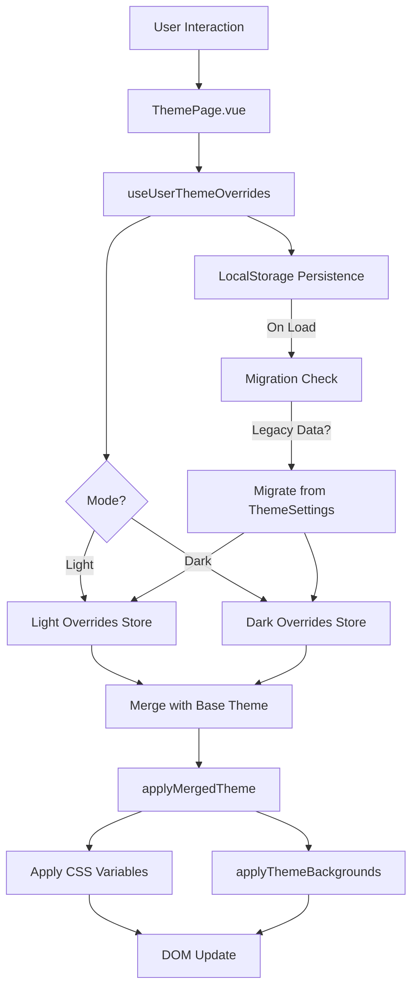

# Theme Page Modernization - Technical Design

## Overview

This document provides the technical design for migrating the theme customization system from the legacy `ThemeSettings` approach to a modern `UserThemeOverrides` system that aligns with the refined theme DSL (`defineTheme`). The new system will treat user customizations as runtime theme extensions that merge with base themes using the existing resolver infrastructure.

### Key Design Principles

1. **Composability**: User overrides compose with base themes via deep merging
2. **Consistency**: Use the same data structures as theme.ts files
3. **Backward Compatibility**: Migrate existing localStorage data automatically
4. **Performance**: Minimize DOM updates and cache blob URLs
5. **Simplicity**: Reduce code complexity by removing redundant abstractions

---

## Architecture

### High-Level Flow



### Component Interactions

1. **ThemePage.vue**: UI component with sliders, pickers, upload controls
2. **useUserThemeOverrides**: Composable managing override state and persistence
3. **applyMergedTheme**: Helper applying merged theme to DOM
4. **Migration Helper**: One-time migration from legacy ThemeSettings
5. **Theme Plugin**: Existing plugin (01.theme.client.ts) - no changes needed

---

## Core Components

### 1. User Theme Overrides Data Structure

**File**: `app/core/theme/user-overrides-types.ts`

```typescript
import type { ThemeBackgrounds } from './theme-types';

/**
 * User theme overrides - aligns with ThemeDefinition structure
 * Stored per mode (light/dark) in localStorage
 */
export interface UserThemeOverrides {
  /** Color palette overrides (Material Design colors) */
  colors?: {
    enabled?: boolean; // master toggle for palette overrides
    primary?: string;
    secondary?: string;
    error?: string;
    surfaceVariant?: string;
    border?: string;
    surface?: string;
  };

  /** Background layer overrides */
  backgrounds?: {
    enabled?: boolean; // master toggle for custom background colors
    content?: {
      base?: Partial<ThemeBackgroundLayer>;
      overlay?: Partial<ThemeBackgroundLayer>;
    };
    sidebar?: Partial<ThemeBackgroundLayer>;
    headerGradient?: {
      enabled?: boolean; // true = show, false = hide
    };
    bottomNavGradient?: {
      enabled?: boolean;
    };
  };

  /** Typography overrides */
  typography?: {
    baseFontPx?: number; // 14-24
    useSystemFont?: boolean;
  };

  /** UI-specific settings (not in theme DSL) */
  ui?: {
    reducePatternsInHighContrast?: boolean;
  };
}

/** Structure of a background layer in user overrides */
export interface ThemeBackgroundLayer {
  /** Image URL (public path, blob:, or internal-file://) */
  url: string | null;
  /** Opacity 0-1 */
  opacity: number;
  /** Background size in pixels (or 'cover' if fit enabled) */
  sizePx: number;
  /** Use background-size: cover instead of fixed size */
  fit: boolean;
  /** CSS background-repeat value */
  repeat: 'repeat' | 'no-repeat';
  /** Fallback color (hex) */
  color: string;
}

/** Empty override set (used for defaults) */
export const EMPTY_USER_OVERRIDES: UserThemeOverrides = {
  colors: { enabled: false },
  backgrounds: { enabled: false },
  typography: {},
  ui: {},
};
```

---

### 2. User Overrides Composable

**File**: `app/core/theme/useUserThemeOverrides.ts`

```typescript
import { ref, watch, computed } from 'vue';
import type { UserThemeOverrides, ThemeBackgroundLayer } from './user-overrides-types';
import { EMPTY_USER_OVERRIDES } from './user-overrides-types';
import { applyMergedTheme } from './apply-merged-theme';
import { migrateFromLegacy } from './migrate-legacy-settings';

// Storage keys
const STORAGE_KEY_LIGHT = 'or3:user-theme-overrides:light';
const STORAGE_KEY_DARK = 'or3:user-theme-overrides:dark';

// HMR-safe singleton
const g: any = globalThis;
if (!g.__or3UserThemeOverrides) {
  g.__or3UserThemeOverrides = {
    light: ref<UserThemeOverrides>({ ...EMPTY_USER_OVERRIDES }),
    dark: ref<UserThemeOverrides>({ ...EMPTY_USER_OVERRIDES }),
    activeMode: ref<'light' | 'dark'>('light'),
    loaded: false,
  };
}

const store = g.__or3UserThemeOverrides as {
  light: ReturnType<typeof ref<UserThemeOverrides>>;
  dark: ReturnType<typeof ref<UserThemeOverrides>>;
  activeMode: ReturnType<typeof ref<'light' | 'dark'>>;
  loaded: boolean;
};

const isBrowser = () => typeof window !== 'undefined';

function detectModeFromHtml(): 'light' | 'dark' {
  if (!isBrowser()) return 'light';
  const cls = document.documentElement.className;
  return /\bdark\b/.test(cls) ? 'dark' : 'light';
}

function loadFromStorage(mode: 'light' | 'dark'): UserThemeOverrides | null {
  if (!isBrowser()) return null;
  try {
    const key = mode === 'light' ? STORAGE_KEY_LIGHT : STORAGE_KEY_DARK;
    const raw = localStorage.getItem(key);
    if (!raw) return null;
    return JSON.parse(raw);
  } catch (e) {
    console.warn('[user-theme-overrides] Failed to parse stored data', e);
    return null;
  }
}

function saveToStorage(mode: 'light' | 'dark', overrides: UserThemeOverrides) {
  if (!isBrowser()) return;
  try {
    const key = mode === 'light' ? STORAGE_KEY_LIGHT : STORAGE_KEY_DARK;
    localStorage.setItem(key, JSON.stringify(overrides));
  } catch (e) {
    console.warn('[user-theme-overrides] Failed to save', e);
  }
}

export function useUserThemeOverrides() {
  // Initialize on first use
  if (!store.loaded && isBrowser()) {
    // Check for legacy data and migrate if present
    const { lightOverrides, darkOverrides } = migrateFromLegacy();
    
    // Load or use migrated data
    const loadedLight = loadFromStorage('light') || lightOverrides;
    const loadedDark = loadFromStorage('dark') || darkOverrides;
    
    if (loadedLight) store.light.value = loadedLight;
    if (loadedDark) store.dark.value = loadedDark;
    
    store.activeMode.value = detectModeFromHtml();
    
    // Apply initial theme
    applyMergedTheme(store.activeMode.value, current.value);
    
    // Watch for mode changes (html class mutations)
    const mo = new MutationObserver(() => {
      const mode = detectModeFromHtml();
      if (mode !== store.activeMode.value) {
        store.activeMode.value = mode;
        applyMergedTheme(mode, current.value);
      }
    });
    mo.observe(document.documentElement, {
      attributes: true,
      attributeFilter: ['class'],
    });
    
    if (import.meta.hot) {
      import.meta.hot.dispose(() => mo.disconnect());
    }
    
    store.loaded = true;
  }

  const current = computed<UserThemeOverrides>(() => 
    store.activeMode.value === 'light' ? store.light.value : store.dark.value
  );

  function set(patch: Partial<UserThemeOverrides>) {
    const mode = store.activeMode.value;
    const base = mode === 'light' ? store.light.value : store.dark.value;
    const merged = deepMerge(base, patch);
    
    if (mode === 'light') store.light.value = merged;
    else store.dark.value = merged;
    
    applyMergedTheme(mode, merged);
    saveToStorage(mode, merged);
  }

  function reset(mode?: 'light' | 'dark') {
    const target = mode || store.activeMode.value;
    const empty = { ...EMPTY_USER_OVERRIDES };
    
    if (target === 'light') {
      store.light.value = empty;
      saveToStorage('light', empty);
    } else {
      store.dark.value = empty;
      saveToStorage('dark', empty);
    }
    
    if (target === store.activeMode.value) {
      applyMergedTheme(target, empty);
    }
  }

  function resetAll() {
    reset('light');
    reset('dark');
  }

  function switchMode(mode: 'light' | 'dark') {
    if (mode === store.activeMode.value) return;
    store.activeMode.value = mode;
    const overrides = mode === 'light' ? store.light.value : store.dark.value;
    applyMergedTheme(mode, overrides);
    
    // Also update theme plugin to sync classes
    if (isBrowser()) {
      const nuxtApp: any = useNuxtApp();
      nuxtApp?.$theme?.set(mode);
    }
  }

  function reapply() {
    applyMergedTheme(store.activeMode.value, current.value);
  }

  // Watch for changes and persist
  if (isBrowser()) {
    watch(() => store.light.value, (v) => {
      if (store.activeMode.value === 'light') applyMergedTheme('light', v);
      saveToStorage('light', v);
    }, { deep: true });
    
    watch(() => store.dark.value, (v) => {
      if (store.activeMode.value === 'dark') applyMergedTheme('dark', v);
      saveToStorage('dark', v);
    }, { deep: true });
  }

  return {
    overrides: current,
    light: store.light,
    dark: store.dark,
    activeMode: store.activeMode,
    set,
    reset,
    resetAll,
    switchMode,
    reapply,
  };
}

/** Deep merge helper for user overrides */
function deepMerge<T>(base: T, patch: Partial<T>): T {
  const result: any = { ...base };
  for (const key in patch) {
    if (patch[key] !== undefined) {
      if (typeof patch[key] === 'object' && !Array.isArray(patch[key]) && patch[key] !== null) {
        result[key] = deepMerge(result[key] || {}, patch[key] as any);
      } else {
        result[key] = patch[key];
      }
    }
  }
  return result;
}
```

---

### 3. Theme Merging & Application

**File**: `app/core/theme/apply-merged-theme.ts`

```typescript
import type { UserThemeOverrides } from './user-overrides-types';
import type { ThemeBackgrounds } from './theme-types';
import { applyThemeBackgrounds, createThemeBackgroundTokenResolver } from './backgrounds';
import { useTheme } from '~/composables/useThemeResolver';

const isBrowser = () => typeof window !== 'undefined';
const backgroundTokenResolver = createThemeBackgroundTokenResolver();

export function applyMergedTheme(mode: 'light' | 'dark', overrides: UserThemeOverrides) {
  if (!isBrowser()) return;
  
  // Get active base theme (from theme plugin registry)
  const { theme } = useTheme();
  const baseTheme = theme.value;
  
  if (!baseTheme) {
    console.warn('[apply-merged-theme] No base theme loaded');
    return;
  }
  
  const r = document.documentElement.style;
  
  // 1. Apply typography
  if (overrides.typography?.baseFontPx) {
    r.setProperty('--app-font-size-root', overrides.typography.baseFontPx + 'px');
  } else {
    r.removeProperty('--app-font-size-root'); // use theme default
  }
  
  if (overrides.typography?.useSystemFont !== undefined) {
    const useSystem = overrides.typography.useSystemFont;
    r.setProperty('--app-font-sans-current', useSystem 
      ? 'ui-sans-serif, system-ui, sans-serif'
      : '"VT323", ui-sans-serif, system-ui, sans-serif'
    );
    r.setProperty('--app-font-heading-current', useSystem
      ? 'ui-sans-serif, system-ui, sans-serif'
      : '"Press Start 2P", ui-sans-serif, system-ui, sans-serif'
    );
  } else {
    r.removeProperty('--app-font-sans-current');
    r.removeProperty('--app-font-heading-current');
  }
  
  // 2. Apply color palette overrides
  if (overrides.colors?.enabled) {
    const colorMap: Array<[keyof typeof overrides.colors, string]> = [
      ['primary', '--md-primary'],
      ['secondary', '--md-secondary'],
      ['error', '--md-error'],
      ['surfaceVariant', '--md-surface-variant'],
      ['border', '--md-inverse-surface'],
      ['surface', '--md-surface'],
    ];
    for (const [key, cssVar] of colorMap) {
      const val = overrides.colors[key];
      if (val) r.setProperty(cssVar, val);
    }
  } else {
    // Remove overrides to let base theme values cascade
    r.removeProperty('--md-primary');
    r.removeProperty('--md-secondary');
    r.removeProperty('--md-error');
    r.removeProperty('--md-surface-variant');
    r.removeProperty('--md-inverse-surface');
    r.removeProperty('--md-surface');
  }
  
  // 3. Build merged backgrounds
  const mergedBackgrounds = buildMergedBackgrounds(baseTheme.backgrounds, overrides);
  void applyThemeBackgrounds(mergedBackgrounds, {
    resolveToken: backgroundTokenResolver,
  });
  
  // 4. Apply background color overrides (if enabled)
  if (overrides.backgrounds?.enabled) {
    const bgColorMap: Array<[string, string]> = [
      [overrides.backgrounds.content?.base?.color || '', '--app-content-bg-1-color'],
      [overrides.backgrounds.content?.overlay?.color || '', '--app-content-bg-2-color'],
      [overrides.backgrounds.sidebar?.color || '', '--app-sidebar-bg-color'],
    ];
    for (const [color, cssVar] of bgColorMap) {
      if (color) r.setProperty(cssVar, color);
    }
  } else {
    r.removeProperty('--app-content-bg-1-color');
    r.removeProperty('--app-content-bg-2-color');
    r.removeProperty('--app-sidebar-bg-color');
  }
  
  // 5. Handle gradient visibility (UI-specific)
  if (overrides.backgrounds?.headerGradient?.enabled !== undefined) {
    r.setProperty('--app-header-gradient-display', 
      overrides.backgrounds.headerGradient.enabled ? 'block' : 'none'
    );
  }
  if (overrides.backgrounds?.bottomNavGradient?.enabled !== undefined) {
    r.setProperty('--app-bottomnav-gradient-display',
      overrides.backgrounds.bottomNavGradient.enabled ? 'block' : 'none'
    );
  }
  
  // 6. High-contrast pattern reduction
  if (overrides.ui?.reducePatternsInHighContrast && isHighContrastActive()) {
    clampBackgroundOpacities();
  }
}

function buildMergedBackgrounds(
  base: ThemeBackgrounds | undefined, 
  overrides: UserThemeOverrides
): ThemeBackgrounds {
  const result: ThemeBackgrounds = {
    content: {
      base: { ...base?.content?.base },
      overlay: { ...base?.content?.overlay },
    },
    sidebar: { ...base?.sidebar },
    headerGradient: { ...base?.headerGradient },
    bottomNavGradient: { ...base?.bottomNavGradient },
  };
  
  // Merge user override layers
  if (overrides.backgrounds?.content?.base) {
    Object.assign(result.content.base, convertLayerToThemeFormat(overrides.backgrounds.content.base));
  }
  if (overrides.backgrounds?.content?.overlay) {
    Object.assign(result.content.overlay, convertLayerToThemeFormat(overrides.backgrounds.content.overlay));
  }
  if (overrides.backgrounds?.sidebar) {
    Object.assign(result.sidebar, convertLayerToThemeFormat(overrides.backgrounds.sidebar));
  }
  
  return result;
}

function convertLayerToThemeFormat(layer: Partial<any>): any {
  return {
    url: layer.url,
    opacity: layer.opacity,
    size: layer.fit ? 'cover' : (layer.sizePx ? layer.sizePx + 'px' : undefined),
    repeat: layer.repeat,
  };
}

function isHighContrastActive(): boolean {
  if (!isBrowser()) return false;
  return /high-contrast/.test(document.documentElement.className);
}

function clampBackgroundOpacities() {
  const r = document.documentElement.style;
  const clamp = (v: string) => String(Math.min(parseFloat(v) || 0, 0.04));
  const vars = [
    '--app-content-bg-1-opacity',
    '--app-content-bg-2-opacity',
    '--app-sidebar-bg-1-opacity',
  ];
  for (const v of vars) {
    const current = r.getPropertyValue(v);
    if (current) r.setProperty(v, clamp(current));
  }
}
```

---

### 4. Legacy Data Migration

**File**: `app/core/theme/migrate-legacy-settings.ts`

```typescript
import type { UserThemeOverrides } from './user-overrides-types';

const LEGACY_KEY_LIGHT = 'or3:theme-settings:light';
const LEGACY_KEY_DARK = 'or3:theme-settings:dark';
const LEGACY_KEY_COMBINED = 'or3:theme-settings';

export function migrateFromLegacy(): {
  lightOverrides: UserThemeOverrides | null;
  darkOverrides: UserThemeOverrides | null;
} {
  if (typeof window === 'undefined') return { lightOverrides: null, darkOverrides: null };
  
  try {
    // Check if new format already exists (skip migration)
    const hasNew = localStorage.getItem('or3:user-theme-overrides:light') || 
                   localStorage.getItem('or3:user-theme-overrides:dark');
    if (hasNew) return { lightOverrides: null, darkOverrides: null };
    
    // Load legacy data
    const legacyLight = loadLegacy(LEGACY_KEY_LIGHT) || loadLegacy(LEGACY_KEY_COMBINED);
    const legacyDark = loadLegacy(LEGACY_KEY_DARK);
    
    if (!legacyLight && !legacyDark) {
      return { lightOverrides: null, darkOverrides: null };
    }
    
    console.info('[migrate-legacy] Migrating legacy ThemeSettings...');
    
    const lightOverrides = legacyLight ? convertToOverrides(legacyLight) : null;
    const darkOverrides = legacyDark ? convertToOverrides(legacyDark) : null;
    
    // Clean up legacy keys
    localStorage.removeItem(LEGACY_KEY_LIGHT);
    localStorage.removeItem(LEGACY_KEY_DARK);
    localStorage.removeItem(LEGACY_KEY_COMBINED);
    
    return { lightOverrides, darkOverrides };
  } catch (e) {
    console.warn('[migrate-legacy] Migration failed', e);
    return { lightOverrides: null, darkOverrides: null };
  }
}

function loadLegacy(key: string): any {
  try {
    const raw = localStorage.getItem(key);
    return raw ? JSON.parse(raw) : null;
  } catch {
    return null;
  }
}

function convertToOverrides(legacy: any): UserThemeOverrides {
  return {
    colors: {
      enabled: legacy.paletteEnabled || false,
      primary: legacy.palettePrimary,
      secondary: legacy.paletteSecondary,
      error: legacy.paletteError,
      surfaceVariant: legacy.paletteSurfaceVariant,
      border: legacy.paletteBorder,
      surface: legacy.paletteSurface,
    },
    backgrounds: {
      enabled: legacy.customBgColorsEnabled || false,
      content: {
        base: {
          url: legacy.contentBg1,
          opacity: legacy.contentBg1Opacity || 0,
          sizePx: legacy.contentBg1SizePx || 240,
          fit: legacy.contentBg1Fit || false,
          repeat: legacy.contentBg1Repeat || 'repeat',
          color: legacy.contentBg1Color || '',
        },
        overlay: {
          url: legacy.contentBg2,
          opacity: legacy.contentBg2Opacity || 0,
          sizePx: legacy.contentBg2SizePx || 240,
          fit: legacy.contentBg2Fit || false,
          repeat: legacy.contentBg2Repeat || 'repeat',
          color: legacy.contentBg2Color || '',
        },
      },
      sidebar: {
        url: legacy.sidebarBg,
        opacity: legacy.sidebarBgOpacity || 0,
        sizePx: legacy.sidebarBgSizePx || 240,
        fit: legacy.sidebarBgFit || false,
        repeat: legacy.sidebarRepeat || 'repeat',
        color: legacy.sidebarBgColor || '',
      },
      headerGradient: {
        enabled: legacy.showHeaderGradient !== false,
      },
      bottomNavGradient: {
        enabled: legacy.showBottomBarGradient !== false,
      },
    },
    typography: {
      baseFontPx: legacy.baseFontPx,
      useSystemFont: legacy.useSystemFont || false,
    },
    ui: {
      reducePatternsInHighContrast: legacy.reducePatternsInHighContrast || false,
    },
  };
}
```

---

### 5. ThemePage.vue Refactor (Key Changes)

**File**: `app/components/dashboard/ThemePage.vue`

Changes needed:

1. Replace `useThemeSettings()` with `useUserThemeOverrides()`
2. Update reactive properties to map to new structure
3. Adjust `set()` calls to use nested paths (e.g., `set({ colors: { primary: '#ff0000' } })`)
4. Keep all existing UI controls and event handlers (minimal changes)

Example diff (simplified):

```typescript
// BEFORE
import { useThemeSettings } from '~/core/theme/useThemeSettings';
const themeApi = useThemeSettings();
const settings = themeApi.settings;
set({ palettePrimary: '#ff0000' });

// AFTER
import { useUserThemeOverrides } from '~/core/theme/useUserThemeOverrides';
const themeApi = useUserThemeOverrides();
const overrides = themeApi.overrides;
set({ colors: { primary: '#ff0000' } });
```

Detailed mapping:

| Legacy ThemeSettings Field | New UserThemeOverrides Path |
|----------------------------|----------------------------|
| `paletteEnabled` | `colors.enabled` |
| `palettePrimary` | `colors.primary` |
| `customBgColorsEnabled` | `backgrounds.enabled` |
| `contentBg1` | `backgrounds.content.base.url` |
| `contentBg1Opacity` | `backgrounds.content.base.opacity` |
| `baseFontPx` | `typography.baseFontPx` |
| `useSystemFont` | `typography.useSystemFont` |
| `showHeaderGradient` | `backgrounds.headerGradient.enabled` |
| `reducePatternsInHighContrast` | `ui.reducePatternsInHighContrast` |

---

## Data Flow

### 1. User Adjusts Slider (Opacity Example)

```
User drags opacity slider
  → onOpacityRange() debounced handler (70ms)
  → set({ backgrounds: { content: { base: { opacity: 0.5 } } } })
  → useUserThemeOverrides deep merges patch
  → applyMergedTheme() called
  → CSS variable --app-content-bg-1-opacity updated
  → saveToStorage() persists to localStorage
  → Visual feedback rendered
```

### 2. User Uploads Image

```
User drops image on thumbnail
  → onDrop() handler
  → Validate file (MIME, size)
  → createOrRefFile() stores in IndexedDB
  → Returns hash
  → set({ backgrounds: { content: { base: { url: 'internal-file://[hash]' } } } })
  → applyMergedTheme() called
  → applyThemeBackgrounds() resolves token to blob URL (cached)
  → CSS background-image updated
  → Image displayed
```

### 3. App Load Flow

```
App initializes
  → useUserThemeOverrides() first call
  → migrateFromLegacy() checks for old data
    → IF legacy data exists:
        → Convert to UserThemeOverrides format
        → Delete legacy keys
  → loadFromStorage() loads light/dark overrides
  → detectModeFromHtml() determines active mode
  → applyMergedTheme() applies initial theme
  → MutationObserver watches for mode changes
```

---

## Error Handling

### LocalStorage Quota Exceeded

```typescript
function saveToStorage(mode: 'light' | 'dark', overrides: UserThemeOverrides) {
  try {
    const key = mode === 'light' ? STORAGE_KEY_LIGHT : STORAGE_KEY_DARK;
    localStorage.setItem(key, JSON.stringify(overrides));
  } catch (e) {
    if (e instanceof DOMException && e.name === 'QuotaExceededError') {
      console.error('[user-theme-overrides] LocalStorage quota exceeded. Theme changes will not persist.');
      // Optionally: notify user via toast
    } else {
      console.warn('[user-theme-overrides] Failed to save', e);
    }
  }
}
```

### Corrupted LocalStorage Data

```typescript
function loadFromStorage(mode: 'light' | 'dark'): UserThemeOverrides | null {
  try {
    const key = mode === 'light' ? STORAGE_KEY_LIGHT : STORAGE_KEY_DARK;
    const raw = localStorage.getItem(key);
    if (!raw) return null;
    const parsed = JSON.parse(raw);
    // Basic validation
    if (typeof parsed !== 'object') throw new Error('Invalid format');
    return parsed;
  } catch (e) {
    console.warn('[user-theme-overrides] Failed to parse stored data, using defaults', e);
    // Clear corrupted data
    try {
      const key = mode === 'light' ? STORAGE_KEY_LIGHT : STORAGE_KEY_DARK;
      localStorage.removeItem(key);
    } catch {}
    return null;
  }
}
```

### Image Upload Failures

```typescript
async function onUpload(ev: Event, which: 'content.base' | 'content.overlay' | 'sidebar') {
  const file = (ev.target as HTMLInputElement).files?.[0];
  if (!file) return;
  
  try {
    // Validate
    if (!file.type.startsWith('image/')) {
      throw new Error('Invalid file type. Please upload an image.');
    }
    if (file.size > 2 * 1024 * 1024) {
      throw new Error('File too large. Maximum size is 2MB.');
    }
    
    // Store
    const meta = await createOrRefFile(file, file.name);
    const token = `internal-file://${meta.hash}`;
    
    // Apply
    set({ backgrounds: { [which]: { url: token } } });
    
    notify('Success', 'Background image uploaded');
  } catch (e: any) {
    console.error('[theme-page] Upload failed', e);
    notify('Upload Failed', e?.message || 'Unknown error');
  } finally {
    (ev.target as HTMLInputElement).value = ''; // reset input
  }
}
```

---

## Testing Strategy

### Unit Tests

**File**: `app/core/theme/__tests__/user-overrides.test.ts`

```typescript
import { describe, it, expect, beforeEach, vi } from 'vitest';
import { useUserThemeOverrides } from '../useUserThemeOverrides';
import { migrateFromLegacy } from '../migrate-legacy-settings';

describe('useUserThemeOverrides', () => {
  beforeEach(() => {
    localStorage.clear();
    globalThis.__or3UserThemeOverrides = undefined;
  });

  it('should initialize with empty overrides', () => {
    const { overrides } = useUserThemeOverrides();
    expect(overrides.value.colors?.enabled).toBe(false);
  });

  it('should merge partial updates correctly', () => {
    const { overrides, set } = useUserThemeOverrides();
    set({ colors: { enabled: true, primary: '#ff0000' } });
    expect(overrides.value.colors?.enabled).toBe(true);
    expect(overrides.value.colors?.primary).toBe('#ff0000');
    expect(overrides.value.typography).toBeDefined(); // other sections preserved
  });

  it('should persist to localStorage on set', () => {
    const { set } = useUserThemeOverrides();
    set({ typography: { baseFontPx: 18 } });
    const stored = JSON.parse(localStorage.getItem('or3:user-theme-overrides:light')!);
    expect(stored.typography.baseFontPx).toBe(18);
  });

  it('should load from localStorage on init', () => {
    localStorage.setItem('or3:user-theme-overrides:light', JSON.stringify({
      colors: { enabled: true, primary: '#00ff00' },
    }));
    globalThis.__or3UserThemeOverrides = undefined; // reset singleton
    const { overrides } = useUserThemeOverrides();
    expect(overrides.value.colors?.primary).toBe('#00ff00');
  });

  it('should switch between light and dark modes', () => {
    const { switchMode, activeMode, set, overrides } = useUserThemeOverrides();
    set({ colors: { primary: '#lightcolor' } });
    switchMode('dark');
    expect(activeMode.value).toBe('dark');
    set({ colors: { primary: '#darkcolor' } });
    expect(overrides.value.colors?.primary).toBe('#darkcolor');
    switchMode('light');
    expect(overrides.value.colors?.primary).toBe('#lightcolor');
  });

  it('should reset only the active mode', () => {
    const { set, reset, overrides, switchMode } = useUserThemeOverrides();
    set({ colors: { primary: '#lightcolor' } });
    switchMode('dark');
    set({ colors: { primary: '#darkcolor' } });
    reset(); // resets dark
    expect(overrides.value.colors?.primary).toBeUndefined();
    switchMode('light');
    expect(overrides.value.colors?.primary).toBe('#lightcolor');
  });
});

describe('migrateFromLegacy', () => {
  beforeEach(() => {
    localStorage.clear();
  });

  it('should migrate legacy ThemeSettings to UserThemeOverrides', () => {
    localStorage.setItem('or3:theme-settings:light', JSON.stringify({
      paletteEnabled: true,
      palettePrimary: '#legacy',
      contentBg1: '/old-bg.webp',
      contentBg1Opacity: 0.5,
      baseFontPx: 16,
    }));
    const { lightOverrides } = migrateFromLegacy();
    expect(lightOverrides?.colors?.enabled).toBe(true);
    expect(lightOverrides?.colors?.primary).toBe('#legacy');
    expect(lightOverrides?.backgrounds?.content?.base?.url).toBe('/old-bg.webp');
    expect(lightOverrides?.backgrounds?.content?.base?.opacity).toBe(0.5);
    expect(lightOverrides?.typography?.baseFontPx).toBe(16);
  });

  it('should delete legacy keys after migration', () => {
    localStorage.setItem('or3:theme-settings:light', JSON.stringify({ paletteEnabled: true }));
    migrateFromLegacy();
    expect(localStorage.getItem('or3:theme-settings:light')).toBeNull();
  });

  it('should skip migration if new format exists', () => {
    localStorage.setItem('or3:user-theme-overrides:light', JSON.stringify({ colors: { enabled: true } }));
    localStorage.setItem('or3:theme-settings:light', JSON.stringify({ paletteEnabled: false }));
    const { lightOverrides } = migrateFromLegacy();
    expect(lightOverrides).toBeNull(); // no migration
  });
});
```

### Integration Tests

**File**: `tests/e2e/theme-page.spec.ts`

```typescript
import { test, expect } from '@playwright/test';

test.describe('ThemePage', () => {
  test.beforeEach(async ({ page }) => {
    await page.goto('/dashboard/theme');
  });

  test('should switch between light and dark modes', async ({ page }) => {
    await page.click('button:has-text("Dark")');
    await expect(page.locator('html')).toHaveClass(/dark/);
    await page.click('button:has-text("Light")');
    await expect(page.locator('html')).not.toHaveClass(/dark/);
  });

  test('should adjust base font size', async ({ page }) => {
    const slider = page.locator('input[type="range"]').first();
    await slider.fill('20');
    await page.waitForTimeout(100); // debounce
    const fontSize = await page.evaluate(() => 
      getComputedStyle(document.documentElement).getPropertyValue('--app-font-size-root')
    );
    expect(fontSize).toBe('20px');
  });

  test('should enable palette overrides and change primary color', async ({ page }) => {
    await page.check('input[type="checkbox"]:has-text("Enable palette overrides")');
    // Interact with color picker or hex input
    await page.fill('input[placeholder="#RRGGBB"]', '#ff5500');
    await page.waitForTimeout(100);
    const primary = await page.evaluate(() =>
      getComputedStyle(document.documentElement).getPropertyValue('--md-primary')
    );
    expect(primary).toBe('#ff5500');
  });

  test('should upload background image', async ({ page }) => {
    const fileInput = page.locator('input[type="file"]').first();
    await fileInput.setInputFiles('tests/fixtures/test-bg.png');
    await page.waitForTimeout(500); // upload + apply
    const bgImage = await page.evaluate(() =>
      getComputedStyle(document.documentElement).getPropertyValue('--app-content-bg-1-url')
    );
    expect(bgImage).toContain('blob:');
  });

  test('should persist settings across reloads', async ({ page }) => {
    await page.check('input[type="checkbox"]:has-text("Enable palette overrides")');
    await page.fill('input[aria-label="Primary hex color"]', '#123456');
    await page.reload();
    await expect(page.locator('input[aria-label="Primary hex color"]')).toHaveValue('#123456');
  });

  test('should reset only current mode', async ({ page }) => {
    await page.fill('input[aria-label="Primary hex color"]', '#aabbcc');
    await page.click('button:has-text("Reset light")');
    await page.click('button:has-text("OK")'); // confirm dialog
    await expect(page.locator('input[aria-label="Primary hex color"]')).toHaveValue('');
  });
});
```

### Performance Tests

- **Theme Application Time**: Measure `applyMergedTheme()` execution (target <100ms)
- **Slider Responsiveness**: Verify debounced updates occur within 50ms after last input
- **Blob URL Caching**: Ensure internal-file:// tokens don't trigger redundant DB queries

---

## Deployment & Rollback

### Deployment Steps

1. **Deploy New Code**: Push updated composables, migration helper, refactored ThemePage.vue
2. **Monitor Errors**: Watch for localStorage errors, migration failures in logs
3. **User Feedback**: Confirm no regressions in theme customization UX

### Rollback Plan

If critical issues arise:

1. **Revert Code**: Deploy previous version of ThemePage.vue and composables
2. **Restore Legacy Keys**: Migration helper preserves legacy keys until new format is confirmed working
3. **Clear New Keys**: If needed, instruct users to clear `or3:user-theme-overrides:*` keys to force re-migration

---

## Migration Timeline

1. **Phase 1**: Implement new composables and migration helper (3-5 days)
2. **Phase 2**: Refactor ThemePage.vue to use new system (2-3 days)
3. **Phase 3**: Write unit and integration tests (2-3 days)
4. **Phase 4**: Manual QA testing (1-2 days)
5. **Phase 5**: Deploy and monitor (1 day)
6. **Phase 6**: Remove legacy code after 2 weeks of stability (1 day)

**Total Estimated Time**: 9-14 days
