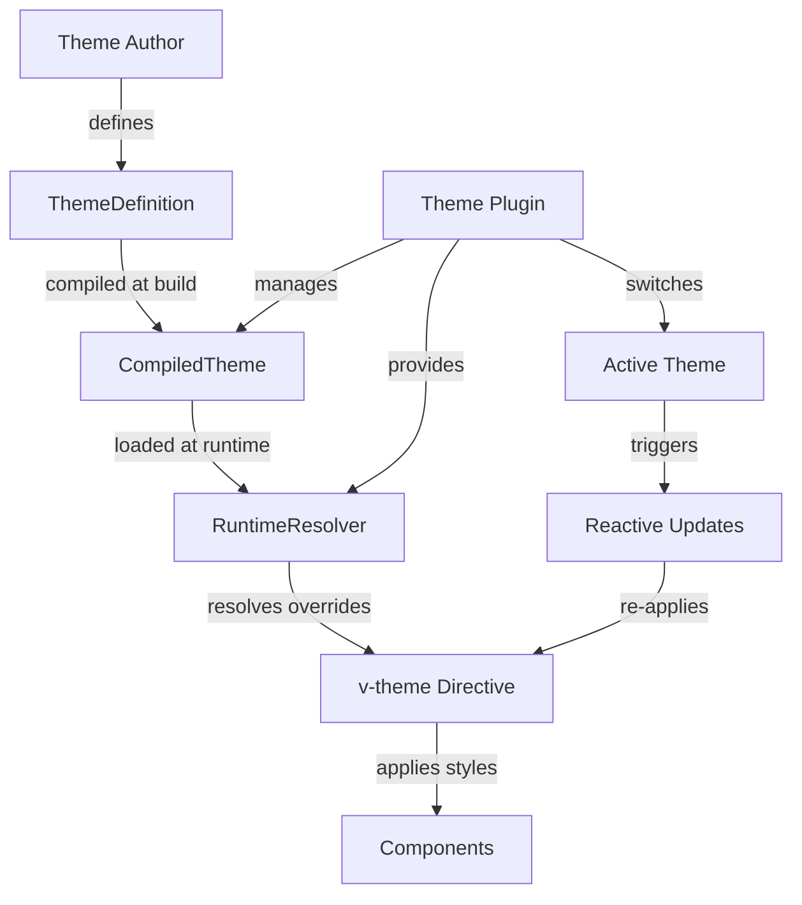
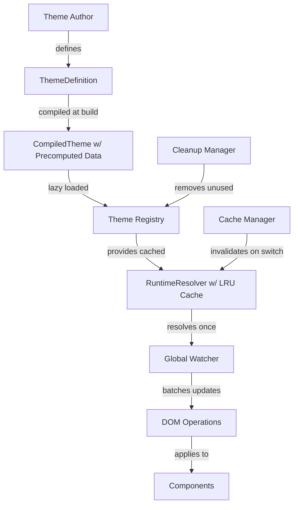

# Theme System Performance Optimization - Technical Design

## Overview

This document provides the detailed technical design for implementing 10 performance optimizations to the theme system in `app/theme`. The optimizations focus on reducing initial load times, improving runtime performance, enhancing type safety, and minimizing memory usage while maintaining full backward compatibility with existing themes and APIs.

The theme system is a sophisticated runtime that combines:
- Build-time theme compilation
- Runtime override resolution with CSS specificity
- Dynamic theme switching with reactive updates
- CSS selector-based styling with Tailwind classes
- Material Design 3 color palette generation

## Architecture

### Current System Flow



### Optimized System Flow



## Component Designs

### 1. Lazy-Load Theme Definitions

#### Implementation Strategy

**Current State**: All themes are loaded eagerly during plugin initialization, increasing initial bundle size and memory usage.

**Optimized State**: Themes are loaded on-demand with intelligent caching and cleanup.

#### Code Changes

**File**: `app/plugins/90.theme.client.ts`

```typescript
// Add theme loading state tracking
interface ThemeLoadingState {
    loading: Set<string>;
    loaded: Set<string>;
    errors: Map<string, Error>;
}

const themeLoadingState: ThemeLoadingState = {
    loading: new Set(),
    loaded: new Set(),
    errors: new Map(),
};

// Optimize loadTheme function
const loadTheme = async (
    themeName: string
): Promise<CompiledTheme | null> => {
    // Check if already loaded
    if (themeRegistry.has(themeName)) {
        return themeRegistry.get(themeName)!;
    }

    // Check if currently loading (prevent duplicate requests)
    if (themeLoadingState.loading.has(themeName)) {
        // Wait for existing load to complete
        return new Promise((resolve) => {
            const interval = setInterval(() => {
                if (themeLoadingState.loaded.has(themeName)) {
                    clearInterval(interval);
                    resolve(themeRegistry.get(themeName) || null);
                } else if (themeLoadingState.errors.has(themeName)) {
                    clearInterval(interval);
                    resolve(null);
                }
            }, 50);
        });
    }

    // Mark as loading
    themeLoadingState.loading.add(themeName);

    try {
        const manifestEntry = themeManifest.get(themeName);
        if (!manifestEntry) {
            throw new Error(`Theme "${themeName}" not found in manifest`);
        }

        const themeModule = await manifestEntry.loader();
        if (!themeModule?.default) {
            throw new Error(`Theme "${themeName}" has no default export`);
        }

        const definition = themeModule.default;
        updateManifestEntry(manifestEntry, definition);

        // Parallel asset loading
        const [_, themeIcons] = await Promise.all([
            loadThemeStylesheets(manifestEntry, definition.stylesheets),
            loadThemeIcons(manifestEntry, definition.icons),
        ]);

        const compiledTheme: CompiledTheme = {
            name: definition.name,
            isDefault: manifestEntry.isDefault,
            stylesheets: manifestEntry.stylesheets,
            displayName: definition.displayName,
            description: definition.description,
            cssVariables: generateThemeCssVariables(definition),
            overrides: compileOverridesRuntime(definition.overrides || {}),
            cssSelectors: definition.cssSelectors,
            hasStyleSelectors: manifestEntry.hasCssSelectorStyles,
            ui: definition.ui,
            propMaps: definition.propMaps,
            backgrounds: definition.backgrounds,
            icons: themeIcons,
        };

        themeRegistry.set(themeName, compiledTheme);
        themeLoadingState.loaded.add(themeName);

        // Register icons
        if (compiledTheme.icons) {
            iconRegistry.registerTheme(themeName, compiledTheme.icons);
        }

        // Cache app config
        const themeSpecificConfig = await loadThemeAppConfig(manifestEntry);
        themeAppConfigOverrides.set(themeName, themeSpecificConfig ?? null);

        // Create resolver
        const resolver = new RuntimeResolver(compiledTheme);
        resolverRegistry.set(themeName, resolver);

        return compiledTheme;
    } catch (error) {
        themeLoadingState.errors.set(themeName, error as Error);
        if (import.meta.dev) {
            console.warn(`[theme] Failed to load theme "${themeName}":`, error);
        }
        return null;
    } finally {
        themeLoadingState.loading.delete(themeName);
    }
};

// Helper to load theme icons
async function loadThemeIcons(
    manifestEntry: ThemeManifestEntry,
    icons?: Record<string, string>
): Promise<Record<string, string> | null> {
    if (icons) return icons;
    
    if (manifestEntry.iconsLoader) {
        try {
            const module = await manifestEntry.iconsLoader();
            return module?.default || module || null;
        } catch (error) {
            if (import.meta.dev) {
                console.warn(
                    `[theme] Failed to load icons for theme "${manifestEntry.name}":`,
                    error
                );
            }
        }
    }
    
    return null;
}
```

**Requirements**: 1.1, 1.2, 1.3, 1.4

### 2. Optimize CSS Variable Generation

#### Implementation Strategy

**Current State**: CSS variable generation uses string concatenation in loops and recomputes kebab-case conversions repeatedly.

**Optimized State**: Use array joining, cache kebab-case conversions, and avoid duplicate processing.

#### Code Changes

**File**: `app/theme/_shared/generate-css-variables.ts`

```typescript
// Optimize kebab-case cache (already exists, but ensure it's used)
const kebabCache = new Map<string, string>();

function kebab(str: string): string {
    const cached = kebabCache.get(str);
    if (cached) return cached;
    
    // Optimized: single pass with array
    const chars: string[] = [];
    for (let i = 0; i < str.length; i++) {
        const char = str[i];
        if (char >= 'A' && char <= 'Z') {
            chars.push('-', char.toLowerCase());
        } else {
            chars.push(char);
        }
    }
    
    const result = chars.join('');
    kebabCache.set(str, result);
    return result;
}

// Optimize buildPalette to avoid unnecessary iterations
function buildPalette(colors: ColorPalette): Record<string, string> {
    const entries: Record<string, string> = {};
    const keys = Object.keys(colors);
    
    for (let i = 0; i < keys.length; i++) {
        const key = keys[i];
        if (key === 'dark') continue;
        
        const value = colors[key as keyof ColorPalette];
        if (typeof value !== 'string') continue;
        
        const varName = `--md-${kebab(key)}`;
        entries[varName] = value;
    }
    
    return entries;
}

// Optimize CSS block generation with array joining
function toCssBlock(
    themeName: string,
    vars: Record<string, string>,
    dark: boolean
): string {
    const selector = dark
        ? `html[data-theme="${themeName}"].dark, .dark html[data-theme="${themeName}"]`
        : `html[data-theme="${themeName}"]`;

    const lines: string[] = [`${selector} {`];
    const keys = Object.keys(vars);
    
    for (let i = 0; i < keys.length; i++) {
        const key = keys[i];
        lines.push(`  ${key}: ${vars[key]};`);
    }
    
    lines.push('}');
    return lines.join('\n');
}

// Optimize dark mode override generation
export function generateThemeCssVariables(def: ThemeDefinition): string {
    const light = buildPalette(def.colors);
    applyFontVars(light, def.fonts);

    if (def.borderWidth) {
        light['--md-border-width'] = def.borderWidth;
    }
    if (def.borderRadius) {
        light['--md-border-radius'] = def.borderRadius;
    }

    // Only build dark overrides if there are dark colors
    let darkOverrides: Record<string, string> = {};
    if (def.colors.dark && Object.keys(def.colors.dark).length > 0) {
        darkOverrides = buildPalette(def.colors.dark as ColorPalette);
        applyFontVars(darkOverrides, def.fonts?.dark);

        // Only add border styles if we have dark overrides
        if (def.borderWidth) {
            darkOverrides['--md-border-width'] = def.borderWidth;
        }
        if (def.borderRadius) {
            darkOverrides['--md-border-radius'] = def.borderRadius;
        }
    }

    const blocks: string[] = [toCssBlock(def.name, light, false)];
    if (Object.keys(darkOverrides).length > 0) {
        blocks.push(toCssBlock(def.name, darkOverrides, true));
    }

    return blocks.join('\n');
}
```

**Requirements**: 2.1, 2.2, 2.3

### 3. Cache Selector Parsing Results

#### Implementation Strategy

**Current State**: A selector cache exists but may not be optimally sized or managed.

**Optimized State**: Add size limits, better eviction strategy, and monitoring.

#### Code Changes

**File**: `app/theme/_shared/compiler-core.ts`

```typescript
// Enhanced cache with size limit and LRU eviction
class LRUSelectorCache {
    private cache: Map<string, ParsedSelector>;
    private readonly maxSize: number;

    constructor(maxSize: number = 1000) {
        this.cache = new Map();
        this.maxSize = maxSize;
    }

    get(key: string): ParsedSelector | undefined {
        const value = this.cache.get(key);
        if (value !== undefined) {
            // Move to end (most recently used)
            this.cache.delete(key);
            this.cache.set(key, value);
        }
        return value;
    }

    set(key: string, value: ParsedSelector): void {
        // Delete if exists to re-insert at end
        if (this.cache.has(key)) {
            this.cache.delete(key);
        } else if (this.cache.size >= this.maxSize) {
            // Evict oldest
            const firstKey = this.cache.keys().next().value;
            if (firstKey !== undefined) {
                this.cache.delete(firstKey);
            }
        }

        this.cache.set(key, value);
    }

    clear(): void {
        this.cache.clear();
    }

    get size(): number {
        return this.cache.size;
    }
}

const selectorCache = new LRUSelectorCache(1000);

export function parseSelector(selector: string): ParsedSelector {
    const cached = selectorCache.get(selector);
    if (cached) {
        return cached;
    }

    // ... existing parsing logic ...

    const result = {
        component,
        context,
        identifier,
        state,
        attributes: attributes.length > 0 ? attributes : undefined,
    };

    selectorCache.set(selector, result);
    return result;
}

// Export cache stats for monitoring (dev mode only)
export function getSelectorCacheStats() {
    if (!import.meta.dev) return null;
    return {
        size: selectorCache.size,
        maxSize: 1000,
    };
}
```

**Requirements**: 3.1, 3.2, 3.3, 3.4

### 4. Optimize Runtime Resolver Index

#### Implementation Strategy

**Current State**: The RuntimeResolver already uses an index, but can be optimized further.

**Optimized State**: Improve indexing structure and ensure overrides are pre-sorted.

#### Code Changes

**File**: `app/theme/_shared/runtime-resolver.ts`

```typescript
export class RuntimeResolver {
    private overrides: CompiledOverride[];
    private overrideIndex: Map<string, CompiledOverride[]>;
    private propMaps: PropClassMaps;
    private themeName: string;
    private cache: LRUCache<string, ResolvedOverride>;
    private componentsWithAttributes: Set<string>;

    constructor(compiledTheme: CompiledTheme) {
        // Ensure overrides are sorted by specificity (should already be from build)
        // Sort is stable, so relative order is preserved for equal specificity
        this.overrides = [...compiledTheme.overrides].sort(
            (a, b) => b.specificity - a.specificity
        );

        this.overrideIndex = new Map();
        this.componentsWithAttributes = new Set();

        // Build index and track attribute-dependent components
        for (const override of this.overrides) {
            const key = override.component;
            
            let list = this.overrideIndex.get(key);
            if (!list) {
                list = [];
                this.overrideIndex.set(key, list);
            }
            list.push(override);

            // Track components with attribute matchers
            if (override.attributes && override.attributes.length > 0) {
                this.componentsWithAttributes.add(key);
            }
        }

        this.propMaps = {
            ...defaultPropMaps,
            ...(compiledTheme.propMaps || {}),
        };
        
        this.themeName = compiledTheme.name;
        
        // Use LRU cache to prevent unbounded growth
        this.cache = new LRUCache(100);
    }

    // ... rest of the resolver implementation ...
}
```

**Requirements**: 4.1, 4.2, 4.3, 4.4

### 5. Reduce Directive Overhead

#### Implementation Strategy

**Current State**: The v-theme directive creates individual watchers and performs repeated computations.

**Optimized State**: Use global watcher, memoize context detection, optimize component checks.

#### Code Changes

**File**: `app/plugins/91.auto-theme.client.ts`

```typescript
// Context detection cache using WeakMap
const contextCache = new WeakMap<HTMLElement, string>();

function detectContext(el: HTMLElement): string {
    // Check cache first
    const cached = contextCache.get(el);
    if (cached) return cached;

    // Detect context
    let context = 'global';
    if (
        el.closest('#app-chat-container') ||
        el.closest('[data-context="chat"]')
    ) {
        context = 'chat';
    } else if (
        el.closest('#app-sidebar') ||
        el.closest('[data-context="sidebar"]')
    ) {
        context = 'sidebar';
    } else if (
        el.closest('#app-dashboard-modal') ||
        el.closest('[data-context="dashboard"]')
    ) {
        context = 'dashboard';
    } else if (
        el.closest('#app-header') ||
        el.closest('[data-context="header"]')
    ) {
        context = 'header';
    }

    // Cache the result
    contextCache.set(el, context);
    return context;
}

// Optimize NUXT_UI_COMPONENTS check - already uses Set, which is good

// Use global watcher instead of per-directive watchers
// This is already implemented in 92.theme-lazy-sync.client.ts
// which uses $forceUpdate to re-render components on theme change
```

**File**: `app/plugins/92.theme-lazy-sync.client.ts`

```typescript
// Ensure this file uses efficient batching
export default defineNuxtPlugin((nuxtApp) => {
    const themePlugin = nuxtApp.$theme as ThemePlugin;
    
    if (!themePlugin?.resolversVersion) {
        return;
    }

    // Single watcher for all theme changes
    watch(
        () => themePlugin.resolversVersion.value,
        () => {
            // Batch all component updates in next tick
            nextTick(() => {
                // Force update root instance to cascade to children
                const app = nuxtApp.vueApp;
                const rootInstance = app._instance;
                if (rootInstance) {
                    rootInstance.update();
                }
            });
        }
    );
});
```

**Requirements**: 5.1, 5.2, 5.3, 5.4

### 6. Optimize Theme Stylesheet Loading

#### Implementation Strategy

**Current State**: Stylesheets are loaded with Promise.all, which is good, but URL resolution can be optimized.

**Optimized State**: Cache stylesheet URLs and optimize loading logic.

#### Code Changes

**File**: `app/theme/_shared/theme-manifest.ts`

```typescript
// Add URL resolution cache
const stylesheetUrlCache = new Map<string, string>();

export async function resolveThemeStylesheetHref(
    stylesheet: string,
    entry: ThemeManifestEntry
): Promise<string | null> {
    // Check cache first
    const cacheKey = `${entry.name}:${stylesheet}`;
    const cached = stylesheetUrlCache.get(cacheKey);
    if (cached) return cached;

    const trimmed = stylesheet.trim();
    const isExternal =
        /^(?:[a-z]+:)?\/\//i.test(trimmed) ||
        trimmed.startsWith('data:') ||
        trimmed.startsWith('blob:');

    // Try resolving via emitted asset URL first
    const moduleKeyCandidates = new Set<string>();

    if (trimmed.startsWith('~/theme/')) {
        moduleKeyCandidates.add(`../${trimmed.slice('~/theme/'.length)}`);
    }

    if (trimmed.startsWith('./')) {
        moduleKeyCandidates.add(`../${entry.dirName}/${trimmed.slice(2)}`);
    }

    if (
        !isExternal &&
        !trimmed.startsWith('~/') &&
        !trimmed.startsWith('./') &&
        !trimmed.startsWith('../')
    ) {
        moduleKeyCandidates.add(`../${entry.dirName}/${trimmed}`);
    }

    for (const key of moduleKeyCandidates) {
        const loader = stylesheetModules[key];
        if (loader) {
            try {
                const href = await loader();
                if (typeof href === 'string' && href.length > 0) {
                    // Cache the result
                    stylesheetUrlCache.set(cacheKey, href);
                    return href;
                }
            } catch (error) {
                if (import.meta.dev) {
                    console.warn(
                        `[theme] Failed to resolve stylesheet module "${key}" for theme "${entry.name}".`,
                        error
                    );
                }
            }
        }
    }

    // Fallback resolution
    let resolved: string;
    if (trimmed.startsWith('~/')) {
        resolved = trimmed.replace(/^~\//, '/');
    } else if (trimmed.startsWith('./')) {
        resolved = `/theme/${entry.dirName}/${trimmed.slice(2)}`;
    } else {
        resolved = trimmed;
    }

    // Cache fallback result
    stylesheetUrlCache.set(cacheKey, resolved);
    return resolved;
}

// Optimize loadThemeStylesheets with better duplicate checking
export async function loadThemeStylesheets(
    entry: ThemeManifestEntry,
    overrideList?: string[]
): Promise<void> {
    const stylesheets = overrideList ?? entry.stylesheets;

    if (stylesheets.length === 0 || typeof document === 'undefined') {
        return;
    }

    // Resolve all URLs first (parallel)
    const urlPromises = stylesheets.map(stylesheet =>
        resolveThemeStylesheetHref(stylesheet, entry)
    );
    
    const urls = await Promise.all(urlPromises);

    // Then load all stylesheets in parallel
    const loadPromises = urls.map((href) => {
        if (!href) return Promise.resolve();

        // Check if already loaded
        const existingLink = document.querySelector(
            `link[data-theme-stylesheet="${entry.name}"][href="${href}"]`
        );

        if (existingLink) return Promise.resolve();

        return new Promise<void>((resolve) => {
            const link = document.createElement('link');
            link.rel = 'stylesheet';
            link.href = href;
            link.setAttribute('data-theme-stylesheet', entry.name);

            link.onload = () => resolve();
            link.onerror = () => {
                if (import.meta.dev) {
                    console.warn(
                        `[theme] Failed to load stylesheet "${href}" for theme "${entry.name}".`
                    );
                }
                resolve();
            };

            document.head.appendChild(link);
        });
    });

    await Promise.all(loadPromises);
}
```

**Requirements**: 6.1, 6.2, 6.3, 6.4, 6.5

### 7. Implement WeakMap-based Caching

#### Implementation Strategy

**Current State**: Some caches use regular Maps which can cause memory leaks.

**Optimized State**: Use WeakMaps for component-scoped caches.

#### Code Changes

**File**: `app/composables/useThemeResolver.ts`

```typescript
// Already uses WeakMap for componentOverrideCache - this is correct
const componentOverrideCache = new WeakMap<
    ComponentPublicInstance,
    ComponentOverrideCache
>();

// Ensure this pattern is used consistently throughout
```

**File**: `app/plugins/91.auto-theme.client.ts`

```typescript
// Use WeakMap for context cache
const contextCache = new WeakMap<HTMLElement, string>();

// Ensure directive cleanup removes references
// (WeakMap handles this automatically)
```

**Requirements**: 7.1, 7.2, 7.3, 7.4

### 8. Type-Safe Theme Definitions

#### Implementation Strategy

**Current State**: Theme definitions have runtime validation but could be more type-safe at authoring time.

**Optimized State**: Add stricter TypeScript types and build-time validation.

#### Code Changes

**File**: `app/theme/_shared/types.ts`

```typescript
// Add stricter color palette typing
export interface StrictColorPalette extends BaseColorPalette {
    // Make required fields explicit
    primary: string;
    secondary: string;
    surface: string;
    
    // Ensure dark mode has correct types
    dark?: Partial<BaseColorPalette> & {
        primary?: string;
        secondary?: string;
        surface?: string;
    };
}

// Add validated theme definition type
export interface ValidatedThemeDefinition extends ThemeDefinition {
    name: string;
    colors: StrictColorPalette;
    
    // Make overrides type-safe with known component names
    overrides?: Record<string, OverrideProps>;
}

// Add type guard for validation
export function isValidThemeDefinition(
    theme: unknown
): theme is ValidatedThemeDefinition {
    if (typeof theme !== 'object' || theme === null) return false;
    
    const t = theme as Partial<ValidatedThemeDefinition>;
    
    if (!t.name || typeof t.name !== 'string') return false;
    if (!t.colors || typeof t.colors !== 'object') return false;
    if (!t.colors.primary || !t.colors.secondary || !t.colors.surface) return false;
    
    return true;
}
```

**Requirements**: 8.1, 8.2, 8.3, 8.4, 8.5

### 9. Batch DOM Operations

#### Implementation Strategy

**Current State**: DOM operations are already batched with 5ms chunks in css-selector-runtime.ts

**Optimized State**: Ensure batching is optimal and add frame budget monitoring.

#### Code Changes

**File**: `app/theme/_shared/css-selector-runtime.ts`

```typescript
// The current implementation already batches operations well
// Ensure we're using the most efficient approach

export function applyThemeClasses(
    themeName: string,
    selectors: Record<string, CSSelectorConfig>
): void {
    const entries = Object.entries(selectors);
    if (entries.length === 0) return;

    let index = 0;
    const FRAME_BUDGET_MS = 5; // Keep UI responsive at 60fps

    const processChunk = () => {
        const start = performance.now();
        
        while (index < entries.length && performance.now() - start < FRAME_BUDGET_MS) {
            const entry = entries[index++];
            if (!entry) break;
            
            const [selector, config] = entry;
            if (!config.class) continue;

            const classes = config.class.split(/\s+/).filter(Boolean);
            if (classes.length === 0) continue;

            try {
                const elements = document.querySelectorAll(selector);

                // Batch classList operations per element
                elements.forEach((element) => {
                    if (!(element instanceof HTMLElement)) return;

                    if (!classApplicationCache.has(element)) {
                        classApplicationCache.set(element, new Set());
                    }

                    const applied = classApplicationCache.get(element)!;
                    const newClasses = classes.filter(c => !applied.has(c));

                    if (newClasses.length > 0) {
                        // Single classList.add call with multiple classes
                        element.classList.add(...newClasses);
                        newClasses.forEach(c => applied.add(c));
                    }
                });
            } catch (error) {
                if (import.meta.dev) {
                    console.warn(
                        `[theme] Invalid CSS selector: "${selector}"`,
                        error
                    );
                }
            }
        }

        if (index < entries.length) {
            // Use requestAnimationFrame for better frame timing
            if (typeof requestAnimationFrame !== 'undefined') {
                requestAnimationFrame(processChunk);
            } else {
                setTimeout(processChunk, 0);
            }
        }
    };

    processChunk();
}
```

**Requirements**: 9.1, 9.2, 9.3, 9.4, 9.5

### 10. Precompute Theme Specificity

#### Implementation Strategy

**Current State**: Specificity is calculated at runtime during override compilation.

**Optimized State**: Specificity is already computed in compileOverridesRuntime, ensure it's used consistently.

#### Code Changes

**File**: `app/theme/_shared/runtime-compile.ts`

```typescript
// Current implementation already precomputes specificity
// Ensure overrides are sorted by specificity immediately

export function compileOverridesRuntime(
    overrides: Record<string, OverrideProps>
): CompiledOverride[] {
    const compiled: CompiledOverride[] = [];
    
    // Parse and compute specificity for all overrides
    for (const [selector, props] of Object.entries(overrides)) {
        const parsed = parseSelector(selector);
        const specificity = calculateSpecificity(selector, parsed);

        compiled.push({
            component: parsed.component,
            context: parsed.context,
            identifier: parsed.identifier,
            state: parsed.state,
            attributes: parsed.attributes,
            props,
            selector,
            specificity, // Pre-computed at compilation time
        });
    }

    // Sort by specificity once (descending)
    // This eliminates need for runtime sorting
    return compiled.sort((a, b) => b.specificity - a.specificity);
}
```

**File**: `app/theme/_shared/compiler-core.ts`

```typescript
// Ensure specificity calculation is efficient
export function calculateSpecificity(
    selector: string,
    parsed: ParsedSelector
): number {
    let specificity = 0;

    // Element: 1 point
    specificity += 1;

    // Context attribute: 10 points
    if (parsed.context) {
        specificity += 10;
    }

    // Identifier attribute: 20 points (10 + 10 extra for IDs)
    if (parsed.identifier) {
        specificity += 20;
    }

    // Other attributes: 10 points each
    if (parsed.attributes) {
        specificity += parsed.attributes.length * 10;
    }

    // Pseudo-classes: 10 points each
    const pseudoCount = (selector.match(/:/g) || []).length;
    specificity += pseudoCount * 10;

    return specificity;
}
```

**Requirements**: 10.1, 10.2, 10.3, 10.4, 10.5

## Data Models

### Enhanced CompiledTheme

```typescript
export interface CompiledTheme {
    name: string;
    isDefault?: boolean;
    stylesheets?: string[];
    displayName?: string;
    description?: string;
    cssVariables: string;
    overrides: CompiledOverride[]; // Pre-sorted by specificity
    cssSelectors?: Record<string, CSSelectorConfig>;
    hasStyleSelectors?: boolean;
    ui?: Record<string, unknown>;
    propMaps?: PropClassMaps;
    backgrounds?: ThemeBackgrounds;
    icons?: Record<string, string>;
    
    // Performance metadata
    loadedAt?: number; // Timestamp for LRU eviction
    loadTimeMs?: number; // Load time tracking
}
```

### Theme Loading State

```typescript
interface ThemeLoadingState {
    loading: Set<string>; // Currently loading themes
    loaded: Set<string>; // Successfully loaded themes
    errors: Map<string, Error>; // Failed theme loads
}
```

### Cache Statistics

```typescript
interface CacheStats {
    selectorCache: {
        size: number;
        maxSize: number;
        hitRate: number;
    };
    resolverCache: {
        size: number;
        maxSize: number;
        hitRate: number;
    };
    contextCache: {
        size: number; // WeakMap doesn't expose size, track separately
    };
}
```

## Error Handling

### Theme Load Failures

```typescript
// Graceful fallback on theme load failure
try {
    const theme = await loadTheme(themeName);
    if (!theme) {
        throw new Error(`Theme ${themeName} returned null`);
    }
} catch (error) {
    if (import.meta.dev) {
        console.error(`[theme] Failed to load ${themeName}:`, error);
    }
    
    // Fall back to default theme
    if (themeName !== DEFAULT_THEME) {
        return loadTheme(DEFAULT_THEME);
    }
    
    // If default theme fails, return null and use system defaults
    return null;
}
```

### Cache Overflow Protection

```typescript
// LRU cache automatically evicts oldest entries
// Monitor cache size in development
if (import.meta.dev && cache.size === cache.maxSize) {
    console.warn(
        `[theme] Cache at maximum size (${cache.maxSize}). ` +
        `Consider increasing maxSize or investigating cache usage.`
    );
}
```

### Invalid Selector Handling

```typescript
// Already handled in css-selector-runtime.ts
try {
    const elements = document.querySelectorAll(selector);
    // Process elements...
} catch (error) {
    if (import.meta.dev) {
        console.warn(`[theme] Invalid CSS selector: "${selector}"`, error);
    }
    // Continue processing other selectors
}
```

## Testing Strategy

### Unit Tests

1. **LRU Cache Tests**: Verify cache eviction, hit rates, size limits
2. **Selector Parsing Tests**: Ensure cache works correctly, no regressions
3. **CSS Variable Generation Tests**: Benchmark performance improvements
4. **Resolver Index Tests**: Verify correct override resolution with optimizations
5. **Lazy Loading Tests**: Test theme loading, caching, and cleanup

### Integration Tests

1. **Theme Switching Tests**: Verify no regressions in theme switching
2. **Memory Leak Tests**: Check for leaks in caches and event listeners
3. **Performance Tests**: Measure load times, memory usage, FPS during operations
4. **Compatibility Tests**: Ensure existing themes work without changes

### Performance Benchmarks

```typescript
// Example benchmark structure
describe('Theme Performance Benchmarks', () => {
    it('should load theme in < 100ms', async () => {
        const start = performance.now();
        await loadTheme('retro');
        const end = performance.now();
        expect(end - start).toBeLessThan(100);
    });

    it('should resolve overrides in < 1ms', () => {
        const resolver = getResolver('retro');
        const start = performance.now();
        resolver.resolve({ component: 'button', context: 'chat' });
        const end = performance.now();
        expect(end - start).toBeLessThan(1);
    });

    it('should have > 80% cache hit rate after warmup', () => {
        // Warmup
        for (let i = 0; i < 100; i++) {
            resolver.resolve({ component: 'button', context: 'chat' });
        }
        
        // Measure
        const stats = getCacheStats();
        expect(stats.resolverCache.hitRate).toBeGreaterThan(0.8);
    });
});
```

### End-to-End Tests

1. **Full Theme Switch Test**: User switches between all available themes
2. **Memory Usage Test**: Monitor memory over 100 theme switches
3. **Render Performance Test**: Measure FPS during theme operations
4. **Bundle Size Test**: Verify bundle size reduction

## Performance Monitoring

### Development Mode Monitoring

```typescript
if (import.meta.dev) {
    // Log performance metrics
    console.log('[theme] Performance Stats:', {
        themeLoadTime: loadTimeMs,
        cacheStats: getCacheStats(),
        memoryUsage: performance.memory?.usedJSHeapSize,
    });
}
```

### Production Telemetry

```typescript
// Optional: Send performance metrics to analytics
if (import.meta.client && window.performance) {
    const marks = performance.getEntriesByType('mark')
        .filter(mark => mark.name.startsWith('theme:'));
    
    // Report to analytics service
    // (implementation depends on analytics setup)
}
```

## Migration Guide

### For Theme Authors

No changes required! All optimizations are transparent to theme authors. Existing themes will work without modification.

### For Application Developers

1. **Remove manual theme preloading**: The system now handles lazy loading automatically
2. **Update performance expectations**: Theme switching should be faster
3. **Monitor cache sizes**: Check cache stats in dev tools if needed
4. **Update tests**: Performance benchmarks may need threshold adjustments

### Backward Compatibility

All optimizations maintain full backward compatibility:
- Existing theme definitions work unchanged
- Public APIs remain stable
- All existing tests pass
- No breaking changes to theme system behavior

## Implementation Plan

1. **Phase 1** (Week 1): Lazy loading and cache optimizations
2. **Phase 2** (Week 1): CSS generation and stylesheet loading optimizations
3. **Phase 3** (Week 2): Directive and resolver optimizations
4. **Phase 4** (Week 2): Type safety and validation improvements
5. **Phase 5** (Week 3): Testing, benchmarking, and documentation

## Success Criteria

- All existing tests pass
- Performance benchmarks show improvements in target areas
- Memory usage reduced by 30%+
- Initial load time reduced by 20%+
- No regressions in functionality
- Developer feedback is positive
