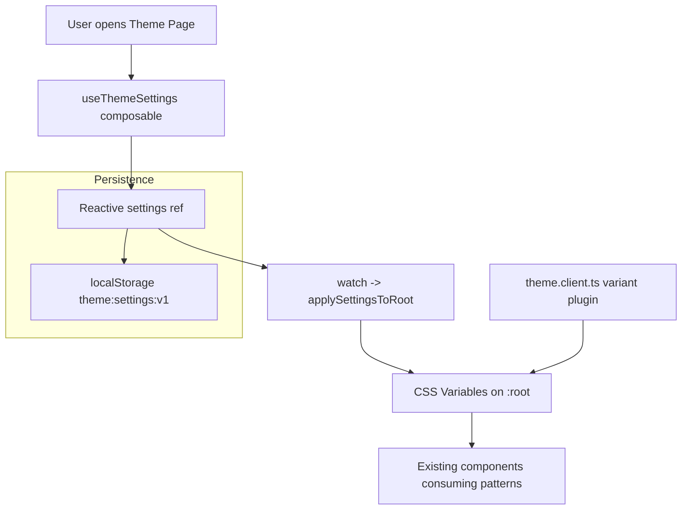

# Theme Customization Design

artifact_id: 6c32b6ca-82f8-4e58-b06c-4aa2b4fe704e

## 1. Overview

Adds a user-configurable theme layer on top of existing variant system (`light`, `dark`, etc.). We do **not** alter color token mechanics. Instead we introduce a small reactive settings store persisted in `localStorage` and applied via CSS custom properties. The Theme Page UI manipulates these values for: root font size, background images (content layers 1 & 2 + sidebar), opacity, repeat behavior, and an accessibility option to attenuate patterns in high contrast modes.

## 2. Architecture

### 2.1 High-Level Flow



### 2.2 Components / Modules

| Component                    | Responsibility                                                                                         |
| ---------------------------- | ------------------------------------------------------------------------------------------------------ |
| `theme.client.ts`            | Existing variant toggling; unchanged.                                                                  |
| `useThemeSettings.ts`        | Load, expose, validate, update & persist settings; apply CSS variables.                                |
| `theme-settings.client.ts`   | Early client plugin to hydrate & apply settings before UI interactions.                                |
| `ThemePage.vue`              | User interface to edit settings.                                                                       |
| `ResizableSidebarLayout.vue` | Updated to consume CSS vars for backgrounds instead of hardcoded URLs & opacities.                     |
| Global CSS (`main.css`)      | Declares default variable values and replaces hardcoded font-size + backgrounds with var() references. |

## 3. Data Model

```ts
export interface ThemeSettings {
    baseFontPx: number; // 14..24 (inclusive)
    contentBg1: string | null; // url or 'data:image/...'
    contentBg2: string | null; // optional second layer
    contentBg1Opacity: number; // 0..1
    contentBg2Opacity: number; // 0..1
    sidebarBg: string | null; // sidebar texture
    sidebarBgOpacity: number; // 0..1
    sidebarRepeat: 'repeat' | 'no-repeat';
    contentRepeat: 'repeat' | 'no-repeat';
    reducePatternsInHighContrast: boolean;
}

export const DEFAULT_THEME_SETTINGS: ThemeSettings = {
    baseFontPx: 20,
    contentBg1: '/bg-repeat.webp',
    contentBg2: '/bg-repeat-2.webp',
    contentBg1Opacity: 0.08,
    contentBg2Opacity: 0.125,
    sidebarBg: '/sidebar-repeater.webp',
    sidebarBgOpacity: 0.1,
    sidebarRepeat: 'repeat',
    contentRepeat: 'repeat',
    reducePatternsInHighContrast: true,
};
```

## 4. CSS Variable Contract

Declared in `main.css` root scope (initial values mirror defaults):

```css
:root {
    --app-font-size-root: 20px;
    --app-content-bg-1: url('/bg-repeat.webp');
    --app-content-bg-2: url('/bg-repeat-2.webp');
    --app-content-bg-1-opacity: 0.08;
    --app-content-bg-2-opacity: 0.125;
    --app-content-bg-repeat: repeat;
    --app-sidebar-bg-1: url('/sidebar-repeater.webp');
    --app-sidebar-bg-1-opacity: 0.1;
    --app-sidebar-bg-repeat: repeat;
}
```

Usage Replacements:

-   `html, body { font-size: var(--app-font-size-root, 20px); }`
-   Sidebar pseudo: `background-image: var(--app-sidebar-bg-1); opacity: var(--app-sidebar-bg-1-opacity); background-repeat: var(--app-sidebar-bg-repeat);`
-   Content layers: swap `url(...)` & literal opacity with variables; add `background-repeat: var(--app-content-bg-repeat);` for both.
-   If image var equals `none` **or** opacity = 0 the layer becomes effectively disabled.

## 5. Composable Logic (`useThemeSettings`)

### 5.1 API

```ts
interface UseThemeSettings {
    settings: Ref<ThemeSettings>;
    set(patch: Partial<ThemeSettings>): void; // merges + validates + persists
    reset(): void; // restore defaults and persist
    load(): ThemeSettings; // re-read from storage
}
```

### 5.2 Validation Rules

| Field         | Rule                                                                        |
| ------------- | --------------------------------------------------------------------------- |
| baseFontPx    | clamp 14..24                                                                |
| Opacities     | clamp 0..1, round to 3 decimals                                             |
| Image strings | must start with '/', 'blob:', 'data:image/' OR 'http(s)://' (future remote) |
| Repeat flags  | enum enforced                                                               |

### 5.3 Application

```ts
watch(settings, (s) => applyToRoot(s), { deep: true });

function applyToRoot(s: ThemeSettings) {
    const r = document.documentElement.style;
    r.setProperty('--app-font-size-root', s.baseFontPx + 'px');
    r.setProperty(
        '--app-content-bg-1',
        s.contentBg1 ? `url("${s.contentBg1}")` : 'none'
    );
    r.setProperty(
        '--app-content-bg-2',
        s.contentBg2 ? `url("${s.contentBg2}")` : 'none'
    );
    r.setProperty('--app-content-bg-1-opacity', String(s.contentBg1Opacity));
    r.setProperty('--app-content-bg-2-opacity', String(s.contentBg2Opacity));
    r.setProperty(
        '--app-sidebar-bg-1',
        s.sidebarBg ? `url("${s.sidebarBg}")` : 'none'
    );
    r.setProperty('--app-sidebar-bg-1-opacity', String(s.sidebarBgOpacity));
    r.setProperty('--app-sidebar-bg-repeat', s.sidebarRepeat);
    r.setProperty('--app-content-bg-repeat', s.contentRepeat);
    maybeClampForHighContrast(s);
}

function maybeClampForHighContrast(s: ThemeSettings) {
    const cls = document.documentElement.className;
    if (!s.reducePatternsInHighContrast) return;
    if (/high-contrast/.test(cls)) {
        const r = document.documentElement.style;
        const clamp = (v: number) => Math.min(v, 0.04);
        r.setProperty(
            '--app-content-bg-1-opacity',
            String(clamp(s.contentBg1Opacity))
        );
        r.setProperty(
            '--app-content-bg-2-opacity',
            String(clamp(s.contentBg2Opacity))
        );
        r.setProperty(
            '--app-sidebar-bg-1-opacity',
            String(clamp(s.sidebarBgOpacity))
        );
    }
}
```

### 5.4 Persistence

-   Key: `theme:settings:v1`.
-   Stored JSON after validation.
-   Quota errors caught; toast: "Theme settings not persisted (storage full)"; continue ephemeral.

## 6. Client Plugin (`theme-settings.client.ts`)

Executed after variant plugin; loads settings, applies once, sets ready flag.

```ts
export default defineNuxtPlugin(() => {
    const { settings, load } = useThemeSettings();
    load(); // ensures ref sync
    // applyToRoot already triggered by watch immediate (inside composable)
});
```

## 7. Theme Page UI (`ThemePage.vue`)

### 7.1 Layout Sections

1. Typography
2. Content Background
3. Sidebar Background
4. Accessibility
5. Reset

### 7.2 Controls

| Control                            | Binding                                |
| ---------------------------------- | -------------------------------------- |
| Font size slider (14–24)           | settings.baseFontPx                    |
| Content Bg 1 presets               | set({ contentBg1: preset })            |
| Content Bg 1 upload                | set({ contentBg1: objectURL/dataURI }) |
| Content Bg 1 opacity slider        | set({ contentBg1Opacity })             |
| Toggle second layer                | set({ contentBg2: default or null })   |
| Content Bg 2 upload / opacity      | analogous                              |
| Repeat toggle                      | set({ contentRepeat })                 |
| Sidebar image preset/upload/remove | settings.sidebarBg/opacity/repeat      |
| Reduce patterns checkbox           | reducePatternsInHighContrast           |
| Reset All button                   | reset()                                |

### 7.3 Presets

Use the shipped images: `/bg-repeat.webp`, `/bg-repeat-2.webp`, `/sidebar-repeater.webp`, plus `gradient-x.webp` for experimentation.

### 7.4 Upload Handling

```ts
function onUpload(file: File, target: 'content1'|'content2'|'sidebar') {
  if (!/^image\//.test(file.type) || file.size > 2*1024*1024) { toast.error(...); return; }
  const useData = file.size < 300*1024; // threshold
  const apply = (uri: string) => {
     const patch: Partial<ThemeSettings> = {};
     if (target==='content1') patch.contentBg1 = uri;
     else if (target==='content2') patch.contentBg2 = uri;
     else patch.sidebarBg = uri;
     set(patch);
  };
  if (useData) {
     const reader = new FileReader();
     reader.onload = () => apply(reader.result as string);
     reader.readAsDataURL(file);
  } else {
     const url = URL.createObjectURL(file);
     activeBlobUrls.push(url); // tracked for revoke
     apply(url);
  }
}
```

On composable dispose (HMR), revoke stored blob URLs.

## 8. Error Handling Strategy

| Scenario                                              | Response                                  |
| ----------------------------------------------------- | ----------------------------------------- |
| Invalid file type / size                              | Toast + no state mutation                 |
| Image load error (optional on UI preview)             | Revert last value + toast                 |
| Storage quota exceeded                                | Toast warning, still apply runtime change |
| High contrast clamp conflict (user sets high opacity) | Clamp silently while variant active       |

## 9. Testing Strategy

### 9.1 Unit (Vitest)

-   `useThemeSettings` default initialization → matches constants.
-   set({ baseFontPx: 10 }) clamps to 14.
-   set invalid image path ignored.
-   High contrast class present clamps opacities when reducePatternsInHighContrast true.

### 9.2 Integration

-   Mount ThemePage, simulate upload (mock FileReader) → CSS var updated.
-   Toggle repeat → style background-repeat reflects.

### 9.3 E2E (Deferred)

-   Manual checklist from requirements.

### 9.4 Performance

-   Measure number of style updates per slider drag (bounded by debounce). (Optional log instrumentation in dev.)

## 10. Edge Cases

| Case                             | Handling                                           |
| -------------------------------- | -------------------------------------------------- |
| User removes both content layers | Both variables set to none; layout unaffected      |
| User sets all opacities to 0     | Acceptable (transparent)                           |
| Switch theme variant repeatedly  | Re-application watch triggers; clamp logic re-runs |
| HMR re-import of composable      | Global guard ensures single application & listener |

## 11. Future Extensions (Documented for clarity, not implemented)

-   Add color palette editing mapped to `--md-*` tokens (requires regeneration strategy & contrast checks).
-   Export/import JSON (serialize settings + version key).
-   Server sync keyed by user account.
-   Named profiles (quick switch sets).

## 12. Traceability Matrix

| Requirement | Design Section                |
| ----------- | ----------------------------- |
| R1          | 2,3,5,6                       |
| R2          | 3,4,5,7                       |
| R3          | 3,4,5,7,8                     |
| R4          | 3,4,5,7                       |
| R5          | 3,4,5,7                       |
| R6          | 4,5,7                         |
| R7          | 5 (maybeClampForHighContrast) |
| R8          | 5,7                           |
| R9          | 5 (reset)                     |
| R10         | 5,8                           |
| R11         | 4,5                           |

## 13. Implementation Notes

-   Ensure new plugin loads after existing `theme.client.ts` (filename order alphabetical: `theme-settings.client.ts` > still after because we rely only on root class presence; safe either way).
-   Debounce: use `useDebounceFn` (if available) or simple custom timer around set() for sliders.
-   Keep patch minimal: do not refactor existing `ResizableSidebarLayout` logic beyond background substitution.
