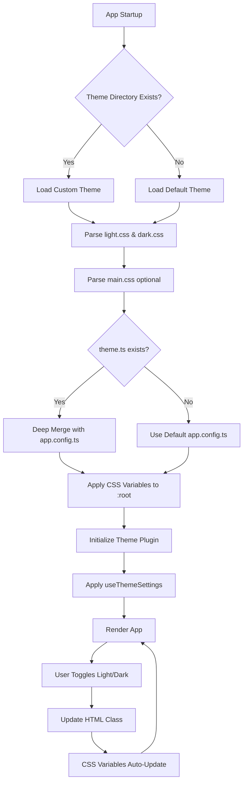

# Theming System Refactor - Technical Design

## Overview

This document outlines the technical architecture for refactoring the theming system to achieve WordPress-level simplicity while maintaining performance and flexibility. The refactor consolidates scattered theme files into a unified `app/theme/` directory structure with clear separation of concerns.

### Goals
- **Simplicity**: Theme developers need only edit CSS variables and optionally override component configs
- **Performance**: Zero regression in load time or theme switching speed
- **Maintainability**: Clear file structure makes it easy to understand and extend
- **Backward Compatibility**: Existing user customizations continue to work

### Architecture Principles
1. **Convention over Configuration**: Default theme works without any config files
2. **Progressive Enhancement**: Basic themes need only CSS, advanced themes can add TypeScript
3. **Fail Gracefully**: Missing or invalid theme files fall back to defaults
4. **CSS-First**: Leverage CSS custom properties for maximum flexibility

---

## Architecture

### High-Level System Flow



### Directory Structure

```
app/
├── theme/                          # NEW: Centralized theme directory
│   ├── default/                    # Default theme (extracted from current)
│   │   ├── light.css              # Light mode CSS variables
│   │   ├── dark.css               # Dark mode CSS variables  
│   │   ├── light-hc.css           # Light high-contrast
│   │   ├── dark-hc.css            # Dark high-contrast
│   │   ├── light-mc.css           # Light medium-contrast
│   │   ├── dark-mc.css            # Dark medium-contrast
│   │   ├── main.css               # Utility classes, retro styles, prose
│   │   ├── theme.ts               # Nuxt UI component overrides
│   │   └── README.md              # Theme documentation
│   ├── _shared/                    # Shared theme utilities
│   │   ├── nuxt-ui-map.css        # MD -> Nuxt UI token mapping
│   │   └── theme-loader.ts        # Theme loading utilities
│   └── [custom-theme]/             # User can add custom themes here
│       ├── light.css
│       ├── dark.css
│       ├── main.css (optional)
│       └── theme.ts (optional)
├── assets/
│   └── css/
│       └── main.css               # MODIFIED: Imports from theme/
├── app.config.ts                   # MODIFIED: Becomes baseline, merged with theme.ts
└── plugins/
    ├── theme.client.ts            # MODIFIED: Loads active theme
    └── theme-settings.client.ts   # Existing: Applies user customizations
```

---

## Core Components

### 1. Theme Loader Module

**File**: `app/theme/_shared/theme-loader.ts`

**Purpose**: Detect, validate, and load theme files at build time and runtime.

#### Interface

```typescript
export interface ThemeManifest {
  name: string;
  path: string;
  hasLight: boolean;
  hasDark: boolean;
  hasMain: boolean;
  hasConfig: boolean;
  variants: ('light' | 'dark' | 'light-hc' | 'dark-hc' | 'light-mc' | 'dark-mc')[];
}

export interface ThemeLoadResult {
  manifest: ThemeManifest;
  lightCss?: string;
  darkCss?: string;
  mainCss?: string;
  config?: Partial<AppConfig>;
  errors: ThemeError[];
  warnings: ThemeWarning[];
}

export interface ThemeError {
  file: string;
  line?: number;
  message: string;
  severity: 'error' | 'warning';
}

/** Scans app/theme directory and returns available themes */
export function discoverThemes(): ThemeManifest[];

/** Loads specified theme with validation */
export async function loadTheme(themeName: string): Promise<ThemeLoadResult>;

/** Validates CSS variables presence (optional, for warnings) */
export function validateThemeVariables(css: string, mode: 'light' | 'dark'): ThemeError[];

/** Deep merge theme.ts config with default app.config.ts */
export function mergeThemeConfig(base: AppConfig, override: Partial<AppConfig>): AppConfig;
```

#### Implementation Notes

- **Build-time Discovery**: Nuxt plugin scans `app/theme/` during build, generates manifest
- **Runtime Loading**: Theme CSS is injected via Vite/Nuxt's CSS handling
- **Validation**: Check for required CSS variables (--md-primary, --md-surface, etc.), warn if missing
- **Error Handling**: Invalid theme files log errors but don't break the app; fall back to default

#### CSS Variable Validation

```typescript
const REQUIRED_LIGHT_VARS = [
  '--md-primary', '--md-on-primary',
  '--md-secondary', '--md-on-secondary', 
  '--md-surface', '--md-on-surface',
  '--md-error', '--md-on-error',
  '--md-background', '--md-on-background',
];

const REQUIRED_DARK_VARS = [...REQUIRED_LIGHT_VARS]; // Same set for dark

function validateThemeVariables(css: string, mode: 'light' | 'dark'): ThemeError[] {
  const required = mode === 'light' ? REQUIRED_LIGHT_VARS : REQUIRED_DARK_VARS;
  const errors: ThemeError[] = [];
  
  for (const varName of required) {
    if (!css.includes(varName)) {
      errors.push({
        file: `${mode}.css`,
        message: `Missing required CSS variable: ${varName}`,
        severity: 'warning', // Warning not error - fallback exists
      });
    }
  }
  
  return errors;
}
```

---

### 2. Theme Configuration Merger

**File**: `app/theme/_shared/config-merger.ts`

**Purpose**: Deep merge theme.ts overrides with default app.config.ts.

#### Interface

```typescript
export function mergeThemeConfig(
  base: AppConfig, 
  override: Partial<AppConfig>
): AppConfig;
```

#### Implementation

```typescript
import { defu } from 'defu'; // Nuxt's deep merge utility

export function mergeThemeConfig(
  base: AppConfig,
  override: Partial<AppConfig>
): AppConfig {
  // defu performs deep merge with override taking precedence
  // Arrays are replaced, not merged (desired behavior for component slots)
  return defu(override, base) as AppConfig;
}
```

#### Merge Behavior

- **Objects**: Deep merged (e.g., `ui.button.slots` merges key by key)
- **Arrays**: Override replaces base (e.g., button size variants replace entirely if provided)
- **Primitives**: Override wins (e.g., `errors.maxToasts` replaces default)

**Example**:

```typescript
// app.config.ts (base)
{
  ui: {
    button: {
      slots: { base: 'retro-btn', label: 'uppercase' },
      variants: { size: { sm: '32px', md: '40px' } }
    }
  }
}

// theme.ts (override)
{
  ui: {
    button: {
      slots: { label: 'lowercase' }, // Merges, keeps 'base'
      variants: { color: { primary: 'bg-blue' } } // Adds to size variants
    }
  }
}

// Result
{
  ui: {
    button: {
      slots: { base: 'retro-btn', label: 'lowercase' },
      variants: { 
        size: { sm: '32px', md: '40px' },
        color: { primary: 'bg-blue' }
      }
    }
  }
}
```

---

### 3. CSS Import Strategy

**File**: `app/assets/css/main.css` (Modified)

#### Current Structure
```css
@import "tailwindcss";
@plugin "@tailwindcss/typography";
@import "@nuxt/ui";
@source "../../../app.config.ts";
@import "./theme.css";           /* Loads light.css, dark.css, etc. */
@import "./nuxt-ui-map.css";
@import "./retro.css";
/* ... fonts, global styles ... */
```

#### New Structure
```css
@import "tailwindcss";
@plugin "@tailwindcss/typography";
@import "@nuxt/ui";
@source "../../../app.config.ts";
@source "../../theme/default/theme.ts"; /* Scan theme config too */

/* Theme CSS variables (scoped by .light, .dark classes) */
@import "~/theme/default/light.css";
@import "~/theme/default/dark.css";
@import "~/theme/default/light-hc.css";
@import "~/theme/default/dark-hc.css";
@import "~/theme/default/light-mc.css";
@import "~/theme/default/dark-mc.css";

/* Nuxt UI token mapping (must come after theme variables) */
@import "~/theme/_shared/nuxt-ui-map.css";

/* Theme utility classes and custom styles */
@import "~/theme/default/main.css";

/* Global styles (fonts, base element styles) */
:root {
  --font-sans: "VT323", ui-sans-serif, system-ui, sans-serif;
  --font-heading: "Press Start 2P", ui-sans-serif, system-ui, sans-serif;
  --app-font-sans-current: var(--font-sans);
  --app-font-heading-current: var(--font-heading);
  --ui-radius: 3px;
  
  /* Dynamic variables set by useThemeSettings (user customizations) */
  --app-font-size-root: 20px;
  --app-content-bg-1: url('/bg-repeat.webp');
  /* ... etc ... */
}

html, body {
  font-family: var(--app-font-sans-current, var(--font-sans)) !important;
  font-size: var(--app-font-size-root, 20px);
  /* ... */
}
```

**Key Changes**:
1. Theme CSS now imported from `~/theme/default/` instead of `./`
2. `nuxt-ui-map.css` moved to `_shared/` and imported after theme variables
3. `retro.css` and `prose-retro.css` merged into `theme/default/main.css`
4. Order ensures proper cascade: Tailwind → Nuxt UI → Theme Vars → UI Map → Theme Utilities

---

### 4. Theme Plugin Enhancements

**File**: `app/plugins/theme.client.ts` (Modified)

#### Current Behavior
- Reads theme mode from localStorage or system preference
- Applies theme class to `<html>` element
- Provides `$theme` helper

#### Enhanced Behavior
- **Load Active Theme**: Check localStorage for `activeTheme` key (default: 'default')
- **Inject Theme CSS**: If custom theme selected, dynamically inject its CSS
- **Validate Theme**: Log warnings for missing variables
- **Expose Theme API**: Add methods to switch themes at runtime

#### Interface Extension

```typescript
declare module '#app' {
  interface NuxtApp {
    $theme: {
      set: (mode: string) => void;
      toggle: () => void;
      get: () => string;
      system: () => string;
      current: Ref<string>;
      // NEW: Multi-theme support
      activeTheme: Ref<string>;
      availableThemes: Ref<ThemeManifest[]>;
      switchTheme: (themeName: string) => Promise<void>;
      reloadTheme: () => Promise<void>;
    };
  }
}
```

#### Implementation Additions

```typescript
import { loadTheme, discoverThemes } from '~/theme/_shared/theme-loader';

export default defineNuxtPlugin(async (nuxtApp) => {
  // Existing mode switching logic...
  
  // NEW: Theme selection
  const activeTheme = ref(localStorage.getItem('activeTheme') || 'default');
  const availableThemes = ref<ThemeManifest[]>(discoverThemes());
  
  async function switchTheme(themeName: string) {
    const result = await loadTheme(themeName);
    if (result.errors.length > 0) {
      console.warn('[theme] Errors loading theme:', result.errors);
    }
    
    // Inject CSS dynamically (Vite handles this in dev, pre-bundled in prod)
    // For now, theme switching requires page reload (future enhancement: dynamic injection)
    activeTheme.value = themeName;
    localStorage.setItem('activeTheme', themeName);
    
    // TODO: Dynamic CSS injection or prompt user to reload
    if (import.meta.dev) {
      console.info('[theme] Theme switched. Reload to see changes.');
    }
  }
  
  nuxtApp.provide('theme', {
    ...existingApi,
    activeTheme,
    availableThemes,
    switchTheme,
    reloadTheme: () => switchTheme(activeTheme.value),
  });
});
```

**Note**: Full dynamic theme switching (without reload) is a future enhancement. Initial implementation will require page reload when switching themes.

---

### 5. Component ID and Class Additions

#### Strategy
- Add `id` attributes to singleton UI elements (sidebar, header, content area)
- Add `app-*` prefixed classes to repeated components (messages, pane items, etc.)
- Use `data-*` attributes for state (e.g., `data-pane-id`, `data-message-role`)

#### Implementation Checklist

**Singleton IDs** (Components needing unique `id` attribute):

| Component | File | ID | Notes |
|-----------|------|-----|-------|
| Sidebar | `ResizableSidebarLayout.vue` | `app-sidebar` | Add to `<aside>` element |
| Main Content | `ResizableSidebarLayout.vue` | `app-content` | Add to `<main>` wrapper |
| Header | `SidebarHeader.vue` | `app-header` | Add to header container |
| Bottom Nav | `SideBottomNav.vue` | `app-bottom-nav` | Add to nav container |
| Chat Container | `ChatContainer.vue` | `app-chat-container` | Add to root `<main>` |
| Dashboard Modal | `Dashboard.vue` | `app-dashboard-modal` | Add to modal root |

**Component Classes** (Repeated elements needing semantic classes):

| Component | File | Class | Additional Classes |
|-----------|------|-------|-------------------|
| Chat Message | `ChatMessage.vue` | `app-chat-message` | `app-chat-message--user` or `app-chat-message--assistant` |
| Sidebar Item | `ThreadListItem.vue` | `app-sidebar-item` | `app-sidebar-item--active` when selected |
| Pane | `PageShell.vue` (pane rendering) | `app-pane` | `data-pane-id` attribute |
| Prompt Item | `PromptsList.vue` | `app-prompt-item` | - |
| Document Item | `DocumentsList.vue` | `app-document-item` | - |
| Model Catalog Card | `ModelCatalog.vue` | `app-model-card` | - |
| Theme Section | `ThemePage.vue` | `app-theme-section` | - |

#### Implementation Example

**Before** (`ChatContainer.vue`):
```vue
<template>
  <main class="flex flex-col h-full relative overflow-hidden">
    <!-- content -->
  </main>
</template>
```

**After**:
```vue
<template>
  <main 
    id="app-chat-container"
    class="flex flex-col h-full relative overflow-hidden"
  >
    <!-- content -->
  </main>
</template>
```

**Before** (`ChatMessage.vue`):
```vue
<div :class="['message', role === 'user' ? 'user-msg' : 'assistant-msg']">
```

**After**:
```vue
<div 
  :class="[
    'app-chat-message', 
    `app-chat-message--${role}`,
    'message', 
    role === 'user' ? 'user-msg' : 'assistant-msg'
  ]"
  :data-message-role="role"
>
```

---

## Data Models

### Theme Manifest Schema

```typescript
export interface ThemeManifest {
  /** Unique theme identifier (folder name) */
  name: string;
  
  /** Display name for UI */
  displayName?: string;
  
  /** Theme author */
  author?: string;
  
  /** Theme version */
  version?: string;
  
  /** Theme description */
  description?: string;
  
  /** Path relative to app/theme/ */
  path: string;
  
  /** Required files presence */
  hasLight: boolean;
  hasDark: boolean;
  
  /** Optional files presence */
  hasMain: boolean;
  hasConfig: boolean;
  
  /** Available contrast variants */
  variants: ThemeVariant[];
  
  /** Preview screenshot URL (optional) */
  preview?: string;
}

export type ThemeVariant = 
  | 'light' 
  | 'dark' 
  | 'light-hc' 
  | 'dark-hc' 
  | 'light-mc' 
  | 'dark-mc';
```

### Theme Config Schema (theme.ts)

```typescript
// theme.ts exports a partial AppConfig
export default defineAppConfig({
  ui: {
    // Override any Nuxt UI component config
    button: {
      slots: {
        base: 'custom-btn-class',
      },
      variants: {
        color: {
          'theme-primary': 'bg-theme-primary text-white',
        },
      },
    },
    modal: {
      slots: {
        content: 'custom-modal-styles',
      },
    },
  },
  // Can also override app-specific config
  errors: {
    maxToasts: 3,
  },
});
```

---

## Error Handling

### Error Categories

1. **Missing Theme Files**: Warning logged, fallback to default
2. **Invalid CSS**: Parse errors logged, invalid rules ignored
3. **Missing CSS Variables**: Warnings logged with fallback values
4. **Invalid theme.ts**: TypeScript errors at build time, runtime error caught and logged
5. **Theme Load Failure**: Graceful degradation to default theme

### Error Service Pattern

```typescript
export class ThemeErrorService {
  private errors: ThemeError[] = [];
  private warnings: ThemeWarning[] = [];
  
  logError(error: ThemeError) {
    this.errors.push(error);
    console.error('[theme]', error.message, error.file);
  }
  
  logWarning(warning: ThemeWarning) {
    this.warnings.push(warning);
    if (import.meta.dev) {
      console.warn('[theme]', warning.message, warning.file);
    }
  }
  
  getErrors() { return this.errors; }
  getWarnings() { return this.warnings; }
  clear() { this.errors = []; this.warnings = []; }
}

export const themeErrors = new ThemeErrorService();
```

### Fallback Strategy

```typescript
async function loadTheme(name: string): Promise<ThemeLoadResult> {
  try {
    const manifest = await getThemeManifest(name);
    if (!manifest.hasLight || !manifest.hasDark) {
      themeErrors.logError({
        file: name,
        message: 'Theme missing required light.css or dark.css',
        severity: 'error',
      });
      // Fall back to default theme
      return loadTheme('default');
    }
    
    // Load and validate CSS
    const lightCss = await readCssFile(`${manifest.path}/light.css`);
    const darkCss = await readCssFile(`${manifest.path}/dark.css`);
    
    const lightErrors = validateThemeVariables(lightCss, 'light');
    const darkErrors = validateThemeVariables(darkCss, 'dark');
    
    lightErrors.forEach(e => themeErrors.logWarning(e));
    darkErrors.forEach(e => themeErrors.logWarning(e));
    
    return {
      manifest,
      lightCss,
      darkCss,
      errors: [...lightErrors, ...darkErrors],
      warnings: [],
    };
  } catch (err) {
    themeErrors.logError({
      file: name,
      message: `Failed to load theme: ${err.message}`,
      severity: 'error',
    });
    
    // Ultimate fallback: return inline default theme
    return getInlineDefaultTheme();
  }
}
```

---

## Testing Strategy

### Unit Tests

#### Theme Loader Tests
- **File**: `app/theme/_shared/__tests__/theme-loader.test.ts`
- **Coverage**:
  - `discoverThemes()` correctly scans theme directory
  - `loadTheme()` loads valid theme without errors
  - `loadTheme()` handles missing files gracefully
  - `validateThemeVariables()` detects missing CSS variables
  - Error logging works correctly

#### Config Merger Tests
- **File**: `app/theme/_shared/__tests__/config-merger.test.ts`
- **Coverage**:
  - Deep merge preserves base config
  - Override config takes precedence
  - Nested objects merge correctly
  - Arrays are replaced (not merged)
  - Edge cases: null, undefined, empty objects

#### Theme Plugin Tests
- **File**: `app/plugins/__tests__/theme.test.ts`
- **Coverage**:
  - Theme mode switching (light/dark/variants)
  - localStorage persistence
  - System preference detection
  - Theme switching API (when implemented)

### Integration Tests

#### Theme Application Tests
- **File**: `tests/integration/theming.test.ts`
- **Coverage**:
  - Custom theme CSS variables applied to :root
  - Nuxt UI components reflect theme colors
  - useThemeSettings overrides layer correctly
  - Light/dark mode toggle updates all components
  - High-contrast mode works with custom themes

#### Component ID/Class Tests
- **File**: `tests/integration/component-targeting.test.ts`
- **Coverage**:
  - All expected IDs present in DOM
  - Component classes applied correctly
  - Classes don't conflict with Tailwind
  - `data-*` attributes set properly

### End-to-End Tests

#### Theme Switching Flow
- **File**: `tests/e2e/theme-switching.spec.ts`
- **Scenarios**:
  1. User opens app, default theme loads
  2. User switches to dark mode, variables update
  3. User opens theme settings, changes primary color
  4. User reloads page, customizations persist
  5. User switches to custom theme (future), layout updates

#### Error Recovery Flow
- **File**: `tests/e2e/theme-errors.spec.ts`
- **Scenarios**:
  1. Custom theme with missing light.css → falls back to default
  2. Custom theme with invalid CSS → logs errors, continues
  3. theme.ts with syntax error → logs error, uses default config
  4. Missing CSS variables → warnings logged, app functional

### Performance Tests

#### Load Time Benchmark
- **File**: `tests/performance/theme-load.bench.ts`
- **Metrics**:
  - Time to load default theme: < 5ms
  - Time to load custom theme: < 20ms
  - Time to apply CSS variables: < 1ms
  - Time to switch light/dark: < 16ms (one frame)
  - Memory overhead of theme system: < 100KB

#### Runtime Performance
- **Metrics**:
  - No forced layout recalculation on theme switch
  - No excessive re-renders
  - CSS variable updates don't block main thread

---

## Migration Plan

### Phase 1: Setup & Default Theme Extraction (Week 1)

**Tasks**:
1. Create `app/theme/` directory structure
2. Move `app/assets/css/light.css` → `app/theme/default/light.css`
3. Move `app/assets/css/dark.css` → `app/theme/default/dark.css`
4. Move contrast variant CSS files similarly
5. Merge `retro.css` + `prose-retro.css` → `app/theme/default/main.css`
6. Extract UI overrides from `app.config.ts` → `app/theme/default/theme.ts`
7. Update import paths in `app/assets/css/main.css`
8. Create `theme-loader.ts` with basic discovery/loading
9. Create `config-merger.ts` with deep merge logic
10. Write unit tests for loader and merger

**Deliverables**:
- Default theme in new structure
- Theme loading infrastructure
- All existing functionality works identically

### Phase 2: Component ID/Class Additions (Week 2)

**Tasks**:
1. Add `id` attributes to singleton components (see checklist above)
2. Add `app-*` classes to repeated components
3. Add `data-*` attributes where needed
4. Create `component-ids-classes.md` documentation
5. Write integration tests to verify IDs/classes present
6. Update component snapshots if using visual regression tests

**Deliverables**:
- All major UI elements have IDs/classes
- Documentation of available selectors
- Tests passing

### Phase 3: Theme Plugin Enhancement (Week 3)

**Tasks**:
1. Modify `theme.client.ts` to load active theme from localStorage
2. Implement `switchTheme()` API (with page reload initially)
3. Add theme validation and error logging
4. Expose theme API on `$theme` helper
5. Write tests for enhanced theme plugin
6. Create theme preview/switcher UI in Dashboard (optional)

**Deliverables**:
- Theme switching infrastructure
- API for runtime theme management
- Tests passing

### Phase 4: Documentation & Examples (Week 4)

**Tasks**:
1. Write theming quickstart guide
2. Document all CSS variables with examples
3. Create theme.ts override examples
4. Create 2-3 example themes (minimal, cyberpunk, nature)
5. Write migration guide for existing contributors
6. Create video walkthrough of theme creation (optional)

**Deliverables**:
- Comprehensive theming documentation
- Example themes for reference
- Migration guide

### Phase 5: Component Refactoring (Ongoing)

**Tasks**:
1. Audit components for hardcoded colors (use grep for `bg-[`, `text-[`, `border-[`)
2. Replace hardcoded colors with CSS variable references
3. Prioritize high-impact components (ChatMessage, Sidebar, Buttons, Modals)
4. Create tracking issue with checklist
5. Refactor incrementally, testing after each component

**Priority Components**:
1. **High Priority** (used everywhere):
   - `ChatContainer.vue` - Main chat UI
   - `ChatMessage.vue` - Message rendering
   - `ResizableSidebarLayout.vue` - Sidebar chrome
   - `SidebarHeader.vue` - Header styles
   - `SideBottomNav.vue` - Mobile nav
   
2. **Medium Priority** (frequently used):
   - `ModelCatalog.vue` - Model selection
   - `ThemePage.vue` - Theme settings UI
   - `Dashboard.vue` - Dashboard layout
   - `PromptEditor.vue` - Prompt editing
   
3. **Low Priority** (edge cases or infrequent):
   - Plugin example components
   - Test fixtures
   - One-off pages

**Refactoring Pattern**:

Before:
```vue
<div class="bg-[var(--md-surface)] dark:bg-[var(--md-surface-container)]">
```

After:
```vue
<div class="bg-[var(--app-content-bg-color)]">
```

And in CSS:
```css
:root {
  --app-content-bg-color: var(--md-surface);
}
.dark {
  --app-content-bg-color: var(--md-surface-container);
}
```

---

## Performance Considerations

### CSS Variable Performance
- **Reality**: CSS variables are fast; no measurable performance impact
- **Strategy**: Use variables liberally; browser caching handles it
- **Optimization**: Group related variables for better minification

### Theme Switching Performance
- **Target**: < 16ms (one frame) for theme class change
- **Implementation**: Class toggle on `<html>` triggers CSS cascade, no JavaScript recalculation needed
- **Monitoring**: Use Performance API to measure `$theme.set()` execution time

### Load Time Impact
- **Goal**: Zero regression on initial page load
- **Strategy**: 
  - Theme CSS inlined in critical path (already true)
  - theme.ts loaded asynchronously if large
  - Custom fonts preloaded with `font-display: swap`
- **Measurement**: Lighthouse performance score must remain ≥ 95

### Memory Footprint
- **Estimate**: Theme system adds ~50KB uncompressed (~10KB gzipped)
- **Breakdown**:
  - CSS variables: ~20KB
  - theme.ts config: ~15KB
  - Loader infrastructure: ~15KB
- **Acceptable**: < 100KB total overhead

---

## Security Considerations

### User-Generated Themes
- **Risk**: XSS via `<style>` injection if themes loaded from external sources
- **Mitigation**: Only load themes from `app/theme/` directory (trusted)
- **Future**: If community theme marketplace is added, use strict CSP and sanitization

### CSS Variable Injection
- **Risk**: Malicious CSS variables could break layout or hide UI elements
- **Mitigation**: Validate variable values (reject non-color values for color vars)
- **Future**: Implement CSS sanitizer if loading themes from user input

### localStorage Poisoning
- **Risk**: Invalid theme name in localStorage could break theme loading
- **Mitigation**: Validate theme name exists before loading; fall back to default
- **Current**: Already implemented in theme plugin

---

## Future Enhancements

### Dynamic Theme Switching (No Reload)
- **Goal**: Switch themes without page reload
- **Implementation**: 
  - Load theme CSS into `<style>` tag dynamically
  - Use `document.adoptedStyleSheets` API (modern browsers)
  - Merge new theme config and re-render affected components
- **Complexity**: Medium; requires careful CSS injection and HMR integration

### Theme Marketplace
- **Goal**: Community-contributed themes installable via UI
- **Implementation**:
  - GitHub repo with themes
  - Dashboard page to browse/install themes
  - Download theme to `app/theme/[name]` and activate
- **Complexity**: High; requires sandboxing and security review

### Theme Editor UI
- **Goal**: Visual theme editor in Dashboard
- **Implementation**:
  - Color picker for each CSS variable
  - Live preview pane
  - Export theme as downloadable folder
- **Complexity**: High; significant UI work

### Per-Pane Themes
- **Goal**: Different themes per chat pane
- **Implementation**:
  - Scope CSS variables to pane container
  - Load multiple themes simultaneously
  - Manage theme state per pane
- **Complexity**: Very High; impacts entire architecture

---

## Rollback Plan

If critical issues arise post-deployment:

1. **Immediate**: Revert `app/assets/css/main.css` import paths to old structure
2. **Short-term**: Keep old CSS files in `app/assets/css/` as backups for 1 release cycle
3. **Long-term**: Fix issues in theme system and re-deploy

**Rollback Checklist**:
- [ ] Revert `main.css` imports to use `./light.css`, `./dark.css`, etc.
- [ ] Restore `app.config.ts` to include full UI config (not extracted)
- [ ] Disable theme loader plugin
- [ ] Verify app loads and functions correctly
- [ ] Notify users of temporary rollback

---

## Success Metrics

The refactor is successful if:

1. **Functionality**: All existing features work identically
2. **Performance**: No measurable regression (<5ms load time increase)
3. **Usability**: Theme developer can create basic theme in <10 minutes
4. **Adoption**: 2+ community themes created within 1 month
5. **Maintainability**: Team reports easier theming in retrospective

**Tracking**:
- GitHub issue templates for theme creation help
- Analytics on theme switching (if applicable)
- Developer surveys post-launch

---

## Appendix: CSS Variable Reference

### Material Design Core Variables (Required)

| Variable | Purpose | Example (Light) | Example (Dark) |
|----------|---------|-----------------|----------------|
| `--md-primary` | Primary brand color | `#2c638b` | `#99ccf9` |
| `--md-on-primary` | Text on primary | `#ffffff` | `#003352` |
| `--md-secondary` | Secondary accent | `#51606f` | `#b8c8da` |
| `--md-on-secondary` | Text on secondary | `#ffffff` | `#283441` |
| `--md-error` | Error color | `#ba1a1a` | `#ffb4ab` |
| `--md-on-error` | Text on error | `#ffffff` | `#690005` |
| `--md-surface` | Surface background | `#f7f9ff` | `#101418` |
| `--md-on-surface` | Text on surface | `#181c20` | `#e0e2e8` |
| `--md-background` | Page background | `#f7f9ff` | `#101418` |
| `--md-outline` | Border color | `#71787e` | `#8c9198` |

### Application-Specific Variables (Optional)

| Variable | Purpose | Default |
|----------|---------|---------|
| `--app-content-bg-1` | Primary content pattern | `url('/bg-repeat.webp')` |
| `--app-content-bg-2` | Secondary content pattern | `url('/bg-repeat-2.webp')` |
| `--app-sidebar-bg-1` | Sidebar pattern | `url('/sidebar-repeater.webp')` |
| `--app-header-gradient` | Header gradient image | `url('/gradient-x.webp')` |
| `--app-font-sans-current` | Body font | `"VT323"` |
| `--app-font-heading-current` | Heading font | `"Press Start 2P"` |

### Nuxt UI Token Variables (Auto-Generated)

These are generated from MD variables via `nuxt-ui-map.css` and don't need to be set manually:

- `--ui-primary`, `--ui-secondary`, `--ui-error`, `--ui-success`, `--ui-warning`, `--ui-info`
- `--ui-text`, `--ui-bg`, `--ui-border`
- `--ui-text-muted`, `--ui-bg-muted`, `--ui-border-muted`

---

## Appendix: Example Theme Files

### Minimal Theme Example

**app/theme/minimal/light.css**
```css
.light {
  --md-primary: #000000;
  --md-on-primary: #ffffff;
  --md-secondary: #666666;
  --md-on-secondary: #ffffff;
  --md-error: #ff0000;
  --md-on-error: #ffffff;
  --md-surface: #ffffff;
  --md-on-surface: #000000;
  --md-background: #ffffff;
  --md-outline: #cccccc;
}
```

**app/theme/minimal/dark.css**
```css
.dark {
  --md-primary: #ffffff;
  --md-on-primary: #000000;
  --md-secondary: #999999;
  --md-on-secondary: #000000;
  --md-error: #ff6666;
  --md-on-error: #000000;
  --md-surface: #000000;
  --md-on-surface: #ffffff;
  --md-background: #000000;
  --md-outline: #333333;
}
```

**app/theme/minimal/main.css** (optional)
```css
/* Remove patterns */
:root {
  --app-content-bg-1: none;
  --app-content-bg-2: none;
  --app-sidebar-bg-1: none;
}

/* Sharper borders */
.retro-btn {
  border-radius: 0 !important;
  box-shadow: none !important;
}
```

**app/theme/minimal/theme.ts** (optional)
```typescript
export default defineAppConfig({
  ui: {
    button: {
      slots: {
        base: 'transition-none', // Remove transitions
      },
    },
  },
});
```

---

This design provides a clear path forward while maintaining flexibility for future enhancements. The phased approach ensures we can validate each step before moving forward.
