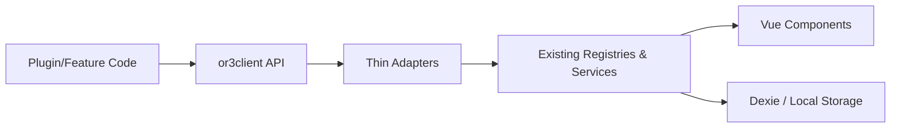
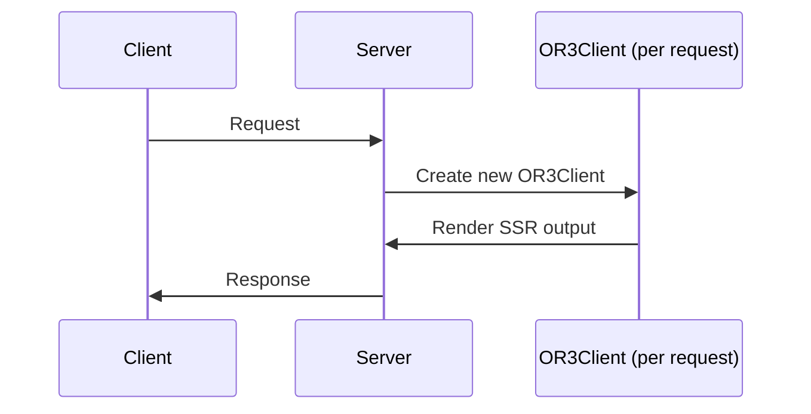
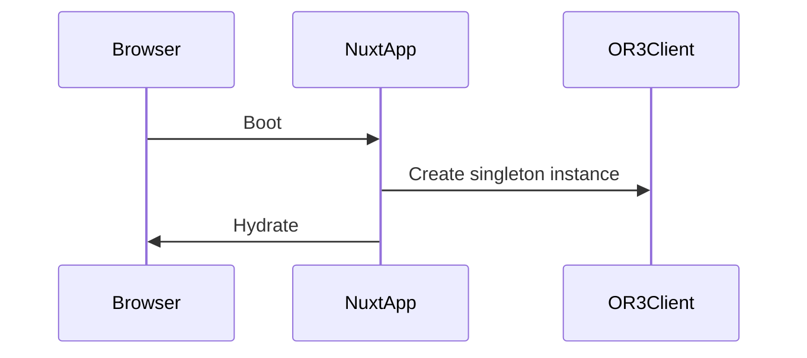

# Unified Registry Architecture (Deep Dive)

## 1) Architecture Goals
- **Discoverability:** a single `or3client` API surface for all extension points.
- **Safety:** preserve validation, ordering, and HMR behaviors of existing registries.
- **SSR correctness:** no shared state across server requests; client remains singleton.
- **Extensibility:** new systems plug into or3client via adapters, not core rewrites.

---

## 2) Layered Architecture (Conceptual Model)

**Key rule:** adapters are **thin wrappers**. They do not replace or fork existing logic; they call existing composables/services directly.

---

## 3) Component Responsibilities

### 3.1 `or3client` (API layer)
- Owns **namespace structure** (ui / ai / core).
- Provides typed, discoverable entry points.
- Does **not** contain business logic.

### 3.2 Adapter Layer
- **Registry adapters** delegate to `createRegistry`-based composables.
- **Service adapters** delegate to stateful services (multi‑pane, tools, hooks).

### 3.3 Existing Registries & Services (Source of Truth)
- **Registries:** sidebar sections, header actions, message actions, editor toolbar, etc.
- **Complex registries:** dashboard plugins/pages, sidebar pages, tool registry.
- **Services:** multi‑pane, hooks, chat input bridge.

---

## 4) SSR Architecture

### 4.1 Server isolation model

**Implementation note:** The server must create a new `OR3Client` instance for each request; shared global registries should not be mutated on server paths.

### 4.2 Client singleton model

---

## 5) HMR Considerations
- Existing registries use `globalThis` to persist across HMR.
- or3client should not introduce its own caches that could conflict with these global stores.

Example: composer actions use manual registry syncing; adapters should call existing functions rather than re‑implementing a new registry structure. 【F:app/composables/sidebar/useComposerActions.ts†L74-L182】

---

## 6) Subsystem Architecture Notes

### 6.1 Sidebar Pages
- **Why special:** validation + async component wrapping + lifecycle hooks.
- **Adapter design:** wrap the existing composable API, do not flatten to a generic registry.

### 6.2 Dashboard
- **Why special:** dual registries (plugins + pages), navigation state, and component caching.
- **Adapter design:** expose a `navigation` service + `plugins/pages` registries.

### 6.3 Tool Registry
- **Why special:** localStorage persistence, timeout execution, validation.
- **Adapter design:** service adapter that exposes `registerTool`, `executeTool`, `getEnabledDefinitions`, and state access.

### 6.4 Editor Extensions
- **Why special:** three registries + lazy loader.
- **Adapter design:** expose sub‑clients: `nodes`, `marks`, `extensions`, and `loader`.

### 6.5 Pane Apps vs Multi‑pane Manager
- **Why special:** pane apps is a registry; multi‑pane is a stateful runtime.
- **Adapter design:** keep two separate APIs under `ui.panes`.

---

## 7) Extending the System (Future‑proofing)
When a new extension point is added, follow this pattern:
1. Build a composable/service in its own module (source of truth).
2. Add a thin adapter to or3client.
3. Re‑export its types in `or3client/types.ts`.
4. Update documentation (docmap entry + usage examples).

---

## 8) Risk Matrix
| Risk | Impact | Mitigation |
| --- | --- | --- |
| SSR state leakage | High | per‑request OR3Client, no server‑side mutation of global registries |
| Regression in registry behavior | High | adapters call existing composables; no new sorting/validation logic |
| HMR duplication | Medium | rely on globalThis registry patterns already used |
| Type drift | Medium | re‑export types directly from source modules |

