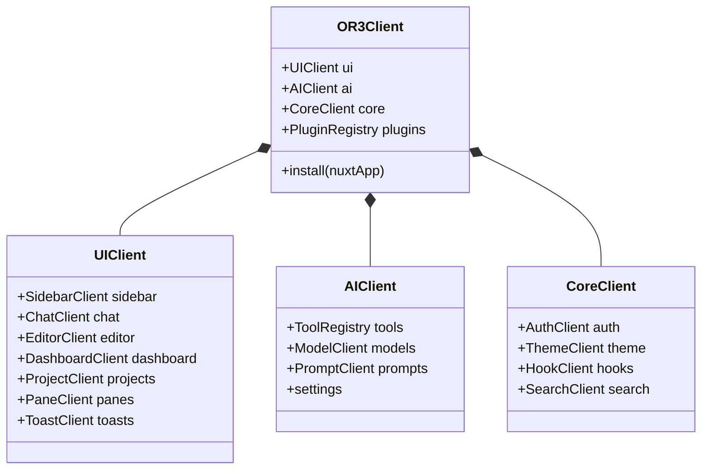
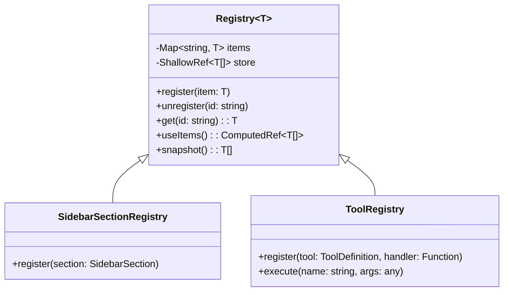
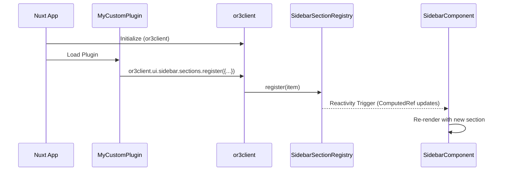
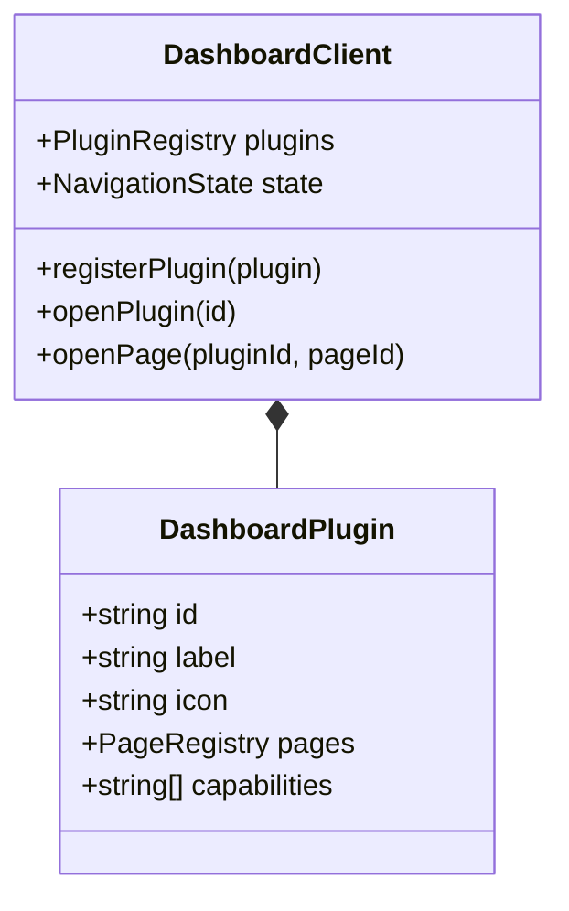

# Unified Registry Architecture

This document visualizes the architecture of the proposed `or3client` Unified Registry System.

## High-Level Overview

The `or3client` is a global singleton that acts as the entry point for all client-side extensibility and core services. It is hierarchically organized to improve discoverability.



## Registry Pattern

All extendable lists (actions, sections, tools) inherit from a generic `Registry<T>` class.



## Registration Flow (Plugin Lifecycle)

How a generic Nuxt plugin interacts with `or3client`.



## Dashboard System Integration

The Dashboard system is complex (plugins + pages + navigation). It will be refactored into `or3client.ui.dashboard`.



## Client vs Server (SSR)

Since Nuxt runs on both server and client, `or3client` handles both environments.

```mermaid
flowchart LR
    subgraph Server["Server (Nitro/Node)"]
        A[Incoming Request] --> B[Nuxt SSR Context]
        B --> C[Initialize or3client]
        C --> D[Register Default Plugins]
        D --> E[Render HTML]
    end

    subgraph Client["Browser"]
        F[Hydration] --> G[Initialize or3client]
        G --> H[Restore State (if any)]
        H --> I[Register Client-side Plugins]
        I --> J[Reactive UI]
    end
```
