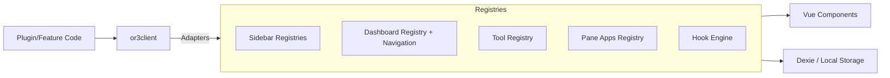
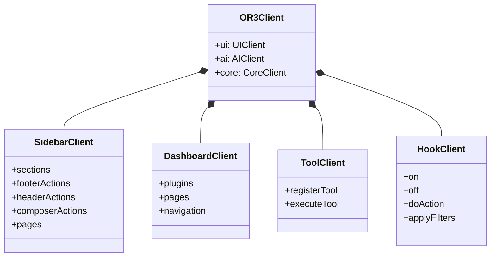

# Unified Registry Architecture (Deep Dive)

## 1) Architecture Goals
- Provide **one discoverable API** for all extension points.
- Avoid rewriting existing systems; **wrap, don’t replace**.
- Preserve **validation**, **ordering**, **async component loading**, **localStorage persistence**, and **SSR safety**.

---

## 2) High‑Level Component Graph

---

## 3) Layered Architecture
### 3.1 Public API Layer (or3client)
- Typed, namespaced, autocompletion‑friendly.
- Thin adapter layer only; no direct business logic.

### 3.2 Adapter Layer
Adapters delegate to the *actual* registry/composable to preserve behavior.

### 3.3 Existing Implementation Layer (source of truth)
- `createRegistry` (generic list)
- Custom registries (Dashboard, Sidebar Pages, Tool Registry)
- Service composables (Multi‑pane, Chat Input Bridge)

**Critical rule:** or3client must **not** fork or re‑implement these behaviors.

---

## 4) SSR + HMR Strategy
### 4.1 SSR isolation
- Each SSR request must receive a **fresh OR3Client instance**.
- Global registries using `globalThis` **must not** be mutated on SSR paths (or must be no‑op).
  - Example: Sidebar Pages intentionally no‑ops on server. 【F:app/composables/sidebar/useSidebarPages.ts†L178-L238】

### 4.2 HMR durability
- Registries already store state on `globalThis` for hot reload. or3client should not wrap with extra mutable caches.
- Where a registry has manual reactivity (e.g., composer actions), adapters should simply call existing functions. 【F:app/composables/sidebar/useComposerActions.ts†L74-L182】

---

## 5) Subsystem Notes (Architecture‑Level)

### 5.1 Sidebar Pages (Async + Lifecycle)
- Must keep Zod validation, async component wrapping, `canActivate`, `onActivate`, and `onDeactivate` hooks. 【F:app/composables/sidebar/useSidebarPages.ts†L12-L292】
- or3client adapter should surface these lifecycles unchanged.

### 5.2 Dashboard Navigation
- Must keep page component caching, navigation state, and error handling. 【F:app/composables/dashboard/useDashboardPlugins.ts†L90-L620】
- Adapter must expose `openPlugin`, `openPage`, `goBack`, and the resolved component ref.

### 5.3 Tool Registry
- Must preserve localStorage persistence, validation, and timeout behavior. 【F:app/utils/chat/tool-registry.ts†L1-L357】
- or3client should expose both “definition” and “execution” APIs (for tools + UI).

### 5.4 Pane Apps + Multi‑pane
- Pane apps registry + multi‑pane manager are **separate** concepts. 【F:app/composables/core/usePaneApps.ts†L1-L176】【F:app/composables/core/useMultiPane.ts†L1-L240】
- or3client should expose both: `ui.panes.apps` and `ui.panes.manager`.

### 5.5 Editor Extensions
- Nodes/marks/extensions are separate registries with lazy extension loader. 【F:app/composables/editor/useEditorNodes.ts†L1-L170】【F:app/composables/editor/useEditorExtensionLoader.ts†L1-L132】
- or3client should expose `ui.editor.nodes`, `ui.editor.marks`, `ui.editor.extensions`, and `ui.editor.loader`.

---

## 6) Extension Path for New Systems
When adding new extendable systems, add:
1. A small composable or service (source of truth).
2. A typed registry adapter in or3client.
3. A type export in the central type file.
4. A doc entry in `public/_documentation/docmap.json` (if public).

---

## 7) Risks & Mitigations
| Risk | Mitigation |
| --- | --- |
| SSR state leakage | Keep server `OR3Client` per request; no global mutation. |
| Breaking registry behavior | Adapters call existing composables; no re‑implementation. |
| Performance regression | Avoid extra reactive copies; reuse existing computed refs. |
| Type drift | Re‑export types from their actual source files; avoid duplicating. |

