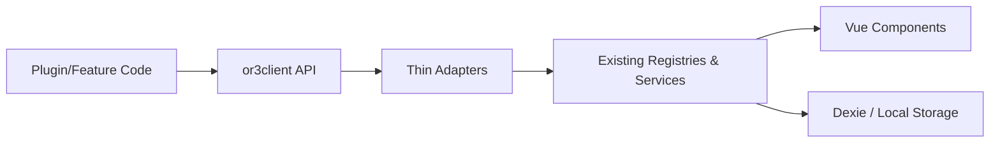
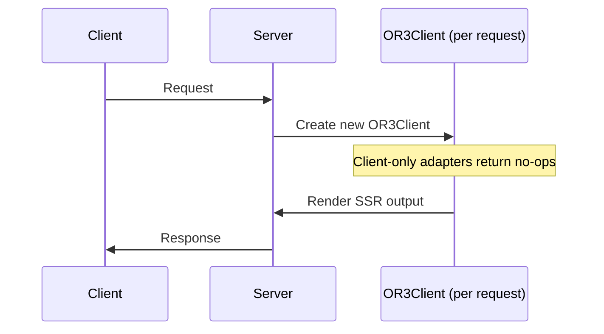
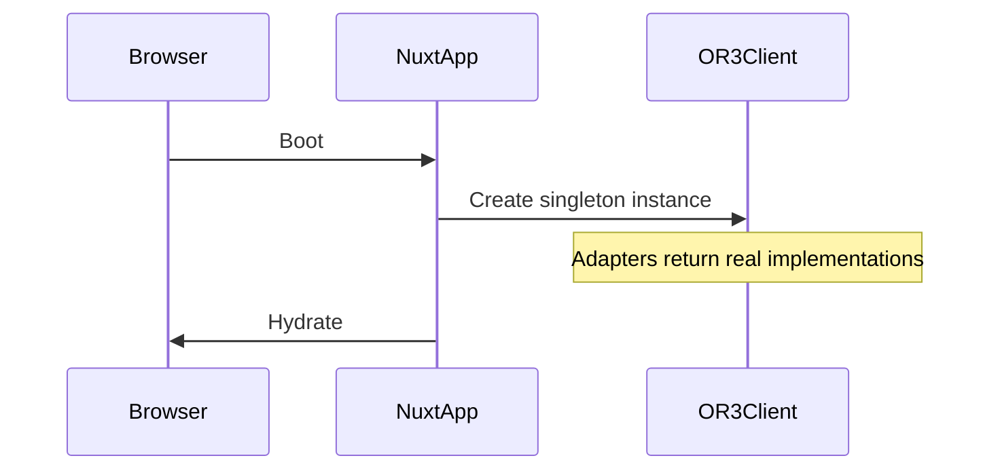

# Unified Registry Architecture (Deep Dive)

## 1) Architecture Goals
- **Discoverability:** a single `or3client` API surface for all extension points.
- **Safety:** preserve validation, ordering, and HMR behaviors of existing registries.
- **SSR correctness:** no shared state across server requests; client remains singleton.
- **Extensibility:** new systems plug into or3client via adapters, not core rewrites.
- **No circular dependencies:** adapter imports must not create import cycles.

---

## 2) Layered Architecture (Conceptual Model)



**Key rule:** adapters are **thin wrappers**. They do not replace or fork existing logic; they call existing composables/services directly.

---

## 3) Directory Structure

```
app/core/or3client/
├── index.ts              # Main export: useOR3Client, OR3Client interface
├── client.ts             # OR3Client class implementation
├── types.ts              # Re-exports types from source modules (NO DUPLICATION)
├── utils.ts              # clientOnlyAdapter, RegistryAdapter, ServiceAdapter interfaces
├── define.ts             # defineX helpers (defineSidebarPage, defineTool, etc.)
└── adapters/
    ├── index.ts          # Barrel export for all adapters
    ├── sidebar-sections.ts
    ├── sidebar-footer-actions.ts
    ├── sidebar-header-actions.ts
    ├── sidebar-composer-actions.ts
    ├── sidebar-pages.ts
    ├── dashboard-plugins.ts
    ├── dashboard-pages.ts
    ├── dashboard-navigation.ts
    ├── pane-apps.ts
    ├── multi-pane.ts
    ├── message-actions.ts
    ├── chat-input-bridge.ts
    ├── editor-toolbar.ts
    ├── editor-nodes.ts
    ├── editor-marks.ts
    ├── editor-extensions.ts
    ├── editor-loader.ts
    ├── project-tree-actions.ts
    ├── thread-history-actions.ts
    ├── document-history-actions.ts
    ├── tools.ts
    └── hooks.ts
```

---

## 4) Component Responsibilities

### 4.1 `or3client` (API layer)
- Owns **namespace structure** (ui / ai / core).
- Provides typed, discoverable entry points.
- Does **not** contain business logic.
- Includes `version: 1` for compatibility checks.

### 4.2 Adapter Layer
- **Registry adapters** delegate to `createRegistry`-based composables.
- **Service adapters** delegate to stateful services (multi‑pane, tools, hooks).
- Adapters must use `clientOnlyAdapter` wrapper for SSR safety when needed.

### 4.3 Existing Registries & Services (Source of Truth)
- **Simple registries:** sidebar sections, header actions, message actions, editor toolbar, tree actions.
- **Complex registries:** dashboard plugins/pages, sidebar pages, pane apps (require Zod validation).
- **Services:** multi‑pane, hooks, tool registry, chat input bridge.

---

## 5) SSR Architecture

### 5.1 Server isolation model



**Implementation note:** The server must create a new `OR3Client` instance for each request; shared global registries should not be mutated on server paths.

### 5.2 Client singleton model



### 5.3 Which adapters need SSR guards?

| Adapter | Needs `clientOnlyAdapter`? | Reason |
|---------|---------------------------|--------|
| Sidebar pages | ✅ Yes | Registration is client-only |
| Tool registry | ✅ Yes | localStorage persistence |
| Multi-pane | ✅ Yes | Dexie integration |
| Dashboard plugins | ❌ No | Can pre-register on server |
| Editor nodes/marks/extensions | ❌ No | Static registration works on server |
| Message actions | ❌ No | Static registration |
| Sidebar sections | ❌ No | Static registration |

---

## 6) HMR Considerations

- Existing registries use `globalThis` to persist across HMR.
- or3client should not introduce its own caches that could conflict with these global stores.
- Adapters must be stateless wrappers that re-call composables on each use.

Example: composer actions use manual registry syncing; adapters should call existing functions rather than re‑implementing a new registry structure. 【F:app/composables/sidebar/useComposerActions.ts†L74-L182】

---

## 7) Import Graph Rules (Preventing Circular Dependencies)

### 7.1 The Problem

Phase 5 proxy migration can create circular dependencies:

```
useOR3Client() 
  → imports adapters 
    → adapters import existing composables 
      → existing composables (now proxied) import useOR3Client() 
        → CIRCULAR!
```

### 7.2 The Solution

**Rule 1:** Adapters import composables, but composables do NOT import or3client at module level.

**Rule 2:** Proxy migration uses lazy imports:

```ts
// WRONG - creates circular dependency
import { useOR3Client } from '~/core/or3client';

export function registerSidebarSection(section: SidebarSection) {
  return useOR3Client().ui.sidebar.sections.register(section);
}

// CORRECT - lazy import breaks cycle
export function registerSidebarSection(section: SidebarSection) {
  // Import at call-time, not module-load-time
  const { useOR3Client } = await import('~/core/or3client');
  return useOR3Client().ui.sidebar.sections.register(section);
}

// BETTER - use Nuxt's useNuxtApp() which is always available
export function registerSidebarSection(section: SidebarSection) {
  const { $or3client } = useNuxtApp();
  return $or3client.ui.sidebar.sections.register(section);
}
```

**Rule 3:** Run import graph check before Phase 5 merge:

```bash
# Check for circular dependencies
npx madge --circular app/core/or3client/
```

---

## 8) Subsystem Architecture Notes

### 8.1 Sidebar Pages

**Why special:** validation + async component wrapping + lifecycle hooks.

**Preserved behaviors:**
- Zod validates: id pattern (`^[a-z][a-z0-9-]*$`), label length (1-50), order (0-1000)
- Async components wrapped with `defineAsyncComponent({ retry: 3, timeout: 10000 })`
- Lifecycle hooks: `provideContext`, `canActivate`, `onActivate`, `onDeactivate`
- SSR: registration is complete no-op on server

**Adapter design:** wrap the existing composable API, do not flatten to a generic registry.

### 8.2 Dashboard

**Why special:** dual registries (plugins + pages), navigation state, and component caching.

**Preserved behaviors:**
- Plugin registration accepts inline pages (auto-normalized)
- Page components cached to avoid repeated async loads
- Navigation state with error handling: `{ state, error, currentPlugin, currentPage }`

**Adapter design:** expose a `navigation` service + `plugins/pages` registries.

### 8.3 Tool Registry

**Why special:** localStorage persistence, timeout execution, validation.

**Preserved behaviors:**
- Enabled state persisted to localStorage (debounced 500ms)
- Tool execution with 30s timeout
- JSON schema validation for tool arguments
- Last error stored per tool

**Adapter design:** service adapter that exposes `registerTool`, `executeTool`, `getEnabledDefinitions`, and state access.

### 8.4 Editor Extensions

**Why special:** three registries + lazy loader.

**Preserved behaviors:**
- Nodes, marks, extensions registered separately with ordering
- Lazy factories resolved at load time
- Failed extensions logged and skipped (don't crash editor)

**Adapter design:** expose sub‑clients: `nodes`, `marks`, `extensions`, and `loader`.

### 8.5 Pane Apps vs Multi‑pane Manager

**Why special:** pane apps is a registry; multi‑pane is a stateful runtime.

**Preserved behaviors for pane apps:**
- Zod validates id pattern, label length, order
- Async component factories supported
- Custom `postType` and `createInitialRecord` handlers

**Preserved behaviors for multi-pane:**
- Dexie integration for persistence
- Hook emissions for pane events
- Reactive pane state

**Adapter design:** keep two separate APIs under `ui.panes`.

### 8.6 Composer Actions

**Why special:** Uses manual Map, not `createRegistry`. TipTap editor context.

**Preserved behaviors:**
- Manual Map + shallowRef (not globalThis pattern)
- Freezes action payloads
- Visibility/disabled computed from TipTap editor state

**Adapter design:** Must call existing composable functions, not create parallel registry.

---

## 9) Extending the System (Future‑proofing)

When a new extension point is added, follow this pattern:

1. **Build a composable/service in its own module** (source of truth).
2. **Add a thin adapter** to `app/core/or3client/adapters/`.
3. **Re‑export its types** in `or3client/types.ts`.
4. **Add to client interface** in `client.ts`.
5. **Update documentation** (docmap entry + usage examples).

---

## 10) Risk Matrix

| Risk | Impact | Mitigation |
| --- | --- | --- |
| SSR state leakage | High | per‑request OR3Client, clientOnlyAdapter for client-only registries |
| Regression in registry behavior | High | adapters call existing composables; no new sorting/validation logic |
| HMR duplication | Medium | rely on globalThis registry patterns already used; adapters are stateless |
| Type drift | Medium | re‑export types directly from source modules |
| Circular dependencies (Phase 5) | High | lazy imports in proxied composables, import graph check before merge |
| Proxy migration breaks production | High | feature flag rollback (see design.md Section 11) |
