# Overview

Refactor targeted browser utilities to VueUse and Nuxt composables while preserving exact behavior. Objectives: shrink custom code, improve SSR safety, guarantee cleanup, and maintain performance parity (equal or faster). No storage keys, API shapes, or breakpoint values change.

# Implementation Playbook (follow in order)

1. Debounce/throttle swaps → 2) Scroll lock → 3) Clipboard/file flows → 4) Storage → 5) Breakpoints → 6) Observers/listeners → 7) Data fetching → 8) Tests. Finish one bucket at a time; keep delays/keys unchanged; run targeted tests after each bucket.

# Architecture

```mermaid
flowchart TD
  subgraph Storage
    A[useAiSettings]
    B[useMultiPane]
    C[useActiveSidebarPage]
    D[ChatInputDropper]
  end
  subgraph UI
    E[ResizableSidebarLayout]
    F[SideBar]
    G[PageShell]
    H[DocumentationShell]
    I[ChatMessage]
    J[WorkflowChatMessage]
    K[ThemePage]
    L[SearchPanelRoot]
    M[PromptEditor]
  end
  subgraph Services
    N[useResponsiveState]
    O[useScrollLock]
    P[useDocumentsStore]
    Q[useSidebarSearch]
    R[useThreadSearch]
    S[useAi]
  end
  A & B & C & D --> |useLocalStorage + useState| StorageLayer[(VueUse Storage)]
  N & E --> Breakpoints[(useBreakpoints/useMediaQuery)]
  F & E & G & H & D --> Observers[(useEventListener/useResizeObserver/useMutationObserver)]
  I & J & K --> Clipboard[(useClipboard)]
  D --> Files[(useFileDialog/useDropZone)]
  Q & R & P & L & K & M --> Debounce[(useDebounceFn/watchDebounced)]
  S & H --> Fetch[(useFetch/useAsyncData)]
  G --> ScrollLock[(useScrollLock)]
```



# Components and Interfaces

## Storage Layer (VueUse + Nuxt)

```ts
// Shared helper for keyed local storage with SSR-safe singleton
export function useStoredState<T>(key: string, defaultValue: T) {
    const state = useState<T>(`storage:${key}`, () =>
        useLocalStorage<T>(key, defaultValue, { listenToStorageChanges: false })
    );
    return state;
}

// Example: AI settings retains same key/defaults
export function useAiSettings() {
    const settings = useStoredState<AiSettings>('ai-settings', DEFAULTS);
    return { settings };
}
```

-   Keys unchanged; serializers only added when current code stores objects.
-   `listenToStorageChanges: false` preserves existing behavior (no cross-tab sync unless already present).

Step-by-step for each file

-   `useAiSettings.ts`: replace manual localStorage access with `useStoredState`; keep default shape; remove window guards.
-   `useMultiPane.ts`: wrap pane width map in `useStoredState('pane-widths', defaults)`; keep setters the same; drop JSON stringify/parse.
-   `useActiveSidebarPage.ts`: replace storage calls with `useStoredState('active-sidebar-page', 'home')`; keep exposed ref name.
-   `ResizableSidebarLayout.vue`: consume the composable instead of touching localStorage directly; ensure initial mount uses stored widths.
-   `ChatInputDropper.vue`: use `useLocalStorage('last-model', defaultModel)`; do not change key; reuse when seeding dropdown.

Safety checks

-   Do not rename keys; do not change default values.
-   For objects/arrays, pass a serializer if current code uses JSON; otherwise VueUse handles it.
-   In SSR, VueUse defers storage until client; remove manual `process.client` guards that only wrap storage (keep any other guards needed for logic).

## Debounce/Throttle Utilities

-   Use `useDebounceFn` for functions and `watchDebounced` for reactive sources.
-   Preserve existing delay constants; keep call sites identical except timer cleanup removal.

```ts
const runSearch = useDebounceFn(() => doSearch(), QUERY_DELAY_MS);
watch(query, () => runSearch());
```

Step-by-step per file

-   `useSidebarSearch.ts`: swap rebuild/query timers to `useDebounceFn`/`watchDebounced`; delete timer refs and onUnmount cleanup.
-   `useThreadSearch.ts`: replace setTimeout with `watchDebounced(query, runSearch, { debounce: 120 })`.
-   `useDocumentsStore.ts`: create `debouncedFlush = useDebounceFn((id) => flush(id), 750)`; remove timer on state.
-   `SearchPanelRoot.vue`: wrap search call in `useDebounceFn`; keep delay 120ms.
-   `ThemePage.vue`: replace custom debounce helper with `useDebounceFn` for commitFontSize/commitOpacity/commitSize at 160ms.
-   `PromptEditor.vue`: use `useDebounceFn` for autosave (600ms); remove manual clearTimeout.

Safety checks

-   Keep delays identical; do not change function bodies.
-   Remove manual cleanup only when it exclusively handled the old timers (VueUse disposes automatically).
-   Use fake timers in unit tests to confirm call counts stay the same.

## Scroll Lock

-   Replace custom body overflow logic with VueUse `useScrollLock(target)`; expose the same API.

```ts
export function useScrollLockBridge(
    target: MaybeRef<HTMLElement | undefined> = useBody()
) {
    const isLocked = useScrollLock(target);
    const lock = () => (isLocked.value = true);
    const unlock = () => (isLocked.value = false);
    return { isLocked, lock, unlock };
}
```

Step-by-step

-   `useScrollLock.ts`: import `useScrollLock`; set default target to `document?.body` via `useElementById`/`useBody`; expose `{ isLocked, lock, unlock }` just like current API names.
-   Remove manual style writes/resets; rely on VueUse disposal.

Safety checks

-   Confirm initial locked state matches previous default.
-   Add unit test: lock → body overflow hidden; dispose → overflow restored.

## Clipboard

-   Use `useClipboard({ source })`; expose `copy`, `copied`, `isSupported`, `error`.

```ts
const { copy, copied, isSupported, error } = useClipboard();
const onCopy = async (text: string) => {
    await copy(text);
};
```

Step-by-step

-   `ChatMessage.vue`, `WorkflowChatMessage.vue`, `ThemePage.vue`: replace `navigator.clipboard.writeText` with `useClipboard`; keep existing toasts/state. Example:
    -   `const { copy, copied, error } = useClipboard();`
    -   `await copy(text);` then reuse existing success UI; on `error.value` call existing error handler.

Safety checks

-   Preserve button states/ARIA; do not change emitted events.
-   If the previous code suppressed errors, keep UX the same but log via existing handler when available.

## File Dialog / Drop Zone

-   `useFileDialog({ accept, multiple })` for button-triggered selection; `useDropZone` for drop areas; reuse existing validation before enqueueing files.

```ts
const { files, open, reset } = useFileDialog({
    accept: 'image/*',
    multiple: true,
});
watch(files, (f) => f && handleFiles(f));
```

Step-by-step

-   `ChatInputDropper.vue`: replace manual `<input type="file">` refs and listeners with `useFileDialog`.
    -   Keep the same `accept` and `multiple` values.
    -   Wire existing “attach” button to `open()`.
    -   `watch(files, ...)` and pass through current validation pipeline before enqueue.
    -   If drop is supported, wrap drop zone with `useDropZone(target, { onDrop })` and reuse existing handler logic.

Safety checks

-   Preserve drag/drop CSS classes and events; keep last-model cache behavior (paired with storage work).
-   Ensure reset after successful attach if current code resets input.

## Responsive Breakpoints

-   Centralize breakpoints to avoid duplicate `useBreakpoints` instantiation.

```ts
const breakpoints = useBreakpoints({ sm: 640, md: 768, lg: 1024, xl: 1280 });
export const useIsMobile = () => breakpoints.smaller('md');
```

-   SSR default: treat as desktop (matches current behavior) to prevent hydration mismatch.

Step-by-step

-   Add helper `useBreakpointsShared.ts` exporting a singleton `breakpoints` and helpers (`isMobile`, etc.).
-   `useResponsiveState.ts`: replace matchMedia with shared breakpoints; remove manual listener add/remove.
-   `ResizableSidebarLayout.vue`: consume shared breakpoint refs; delete global sync flags; ensure initial computed matches previous default (desktop).

Safety checks

-   Breakpoint values must match existing CSS/media queries; do not alter numbers.
-   In SSR, ensure default ref mirrors old behavior (likely desktop=false for mobile flag).

## Event/Observer Management

-   Swap `addEventListener`/`removeEventListener` with `useEventListener` scoped to component lifecycle.
-   Replace manual `ResizeObserver` and `MutationObserver` with VueUse counterparts.

```ts
useEventListener(window, 'resize', onResize);
useResizeObserver(target, onResize);
useMutationObserver(el, onMutate, { childList: true, subtree: true });
```

Step-by-step

-   `SideBar.vue`: replace window resize and any element observers with `useEventListener`/`useResizeObserver`; keep handler logic untouched.
-   `ResizableSidebarLayout.vue`: swap ResizeObserver + window events to VueUse; ensure drag/resize behavior stays identical.
-   `PageShell.vue`: wrap pointer/keydown listeners and MutationObserver with VueUse helpers; register inside setup to auto-clean on unmount/HMR.
-   `DocumentationShell.vue`: replace MutationObserver with `useMutationObserver` using same options.
-   `ChatInputDropper.vue`: replace ResizeObserver with `useResizeObserver` on the observed element.

Safety checks

-   Make sure composables are created after refs are available (inside onMounted or with template refs + watch).
-   Confirm options (subtree, attributes) match current observers.

## Data Fetching (Nuxt)

-   Use `useFetch`/`useAsyncData`/`useLazyAsyncData` per current lifecycle intent.
-   Keep URLs, params, and parsing the same; include `{ server: true|false }` flags to mirror existing client-only logic.

```ts
const { data, error, refresh, pending } = await useFetch('/api/docs-map', {
    server: true,
});
```

Step-by-step

-   `DocumentationShell.vue`: wrap doc map/markdown fetch in `useFetch` (SSR-enabled). If current logic is client-only, set `{ server: false }` to avoid SSR mismatch. Preserve caching/dedupe expectations (Nuxt does this by default).
-   `HelpChat.vue`: convert fetch to `useFetch`/`useAsyncData`; if call depends on user input, consider `useLazyAsyncData`; keep same endpoint and params.
-   `useAi.ts`: replace raw fetches for assets with `useFetch`; if these should only run client-side, pass `{ server: false }`. Keep error handling the same; surface `error` ref where needed.

Safety checks

-   Do not change endpoints, headers, or payload shapes.
-   Preserve any existing guards (route checks, feature flags); only replace the transport layer.

# Data Models

-   Storage schemas remain unchanged (same keys, JSON shapes). No database schema changes.
-   Breakpoint values mirror existing media queries (sm/md/lg/xl as currently used).

# Error Handling

-   Prefer `ServiceResult`-style returns where functions already expose status.

```ts
type ServiceResult<T> = { ok: true; data: T } | { ok: false; error: Error };
```

-   Clipboard/file/fetch composables propagate errors via returned refs; surface to existing UI handlers without new UX.

# Testing Strategy

-   **Unit:**
    -   Storage composables: initialize with defaults, ensure serialization, SSR guard (mock window undefined).
    -   Debounced functions: assert call counts/timing with fake timers.
    -   Scroll lock: verify body style restored on scope dispose.
-   **Integration (Vitest + Vue Test Utils):**
    -   Components using clipboard/file dialog: simulate copy success/failure; file selection/drop flows maintain validation.
    -   Responsive layouts: mock matchMedia to assert breakpoint refs.
    -   Observer usage: ensure handlers run and cleanup on unmount (no duplicate calls after remount).
-   **E2E (Playwright):**
    -   Search panels and prompt editor still save/search with same delays.
    -   Chat copy buttons and file dropper behave identically.
    -   Documentation/help pages load data both SSR and client navigation without flicker.
-   **Performance:**
    -   Measure search debounce paths to confirm no regressions; ensure no additional renders or slower fetch.

# Rollout & Risk Mitigation

-   Sequence by lowest risk first: debounce/throttle → scroll lock → clipboard/file → storage → breakpoints → observers → data fetching.
-   Keep delays/keys/breakpoints unchanged; add feature flags only if needed for data fetching.
-   Use incremental PRs per bucket with focused regression tests.

# Quick Test Checklist per bucket

-   Debounce: fake timers; ensure same call counts and delays.
-   Scroll lock: lock/unlock, unmount restores body overflow.
-   Clipboard/file: copy still triggers success UI; file attach validates and uploads same as before.
-   Storage: reload page and confirm persisted values match prior behavior; SSR render does not crash.
-   Breakpoints: toggle viewport sizes (devtools) and confirm layout/panes behave identically.
-   Observers: resize/mutate and confirm handlers fire once; HMR/unmount leaves no duplicate events (inspect listeners if needed).
-   Data fetch: SSR + client nav render same data; errors surface through existing UI paths; no double-fetch.
