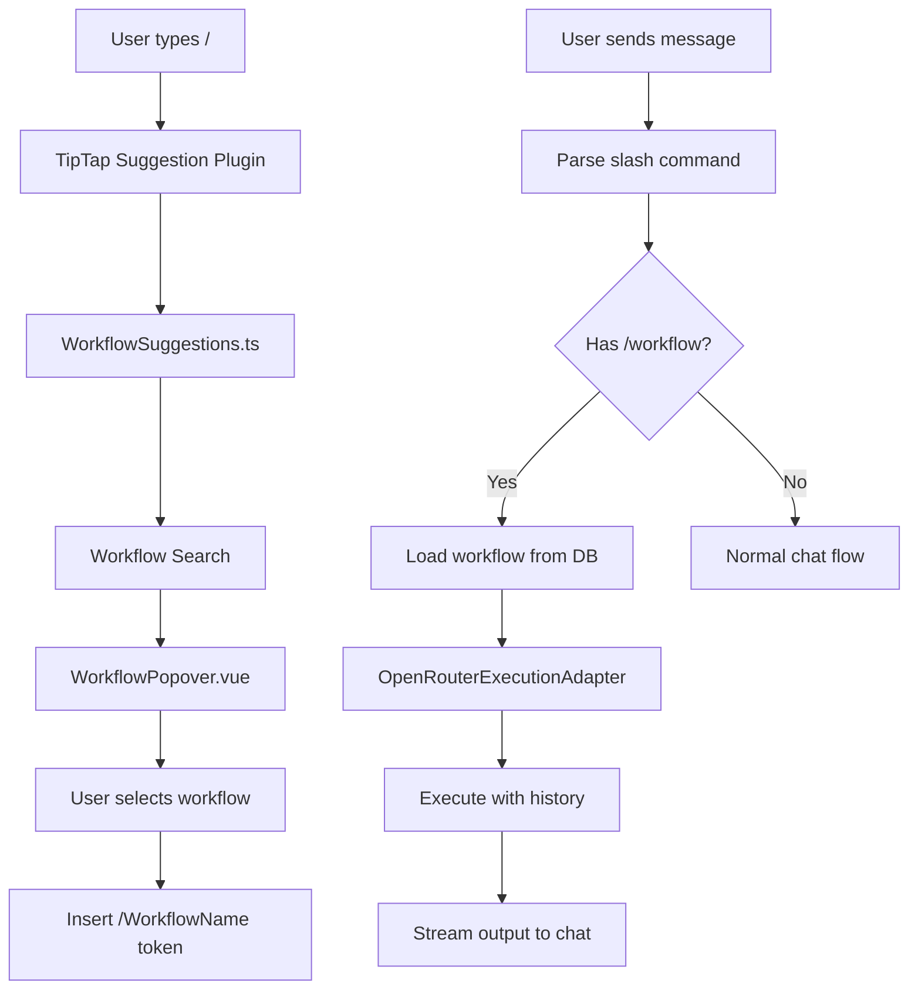

# Workflow Slash Commands - Technical Design

## Overview

This document describes the technical design for implementing workflow slash commands in the chat input. The feature follows the existing ChatMentions pattern, using TipTap's suggestion plugin system with a custom trigger character (`/` instead of `@`).

---

## Architecture



---

## Components

### 1. WorkflowSlashCommands Plugin (`app/plugins/workflow-slash-commands.client.ts`)

A Nuxt client plugin that:
- Registers with the hooks system
- Lazy-loads the workflow search module
- Provides a TipTap extension for `/` triggers
- Intercepts message send to detect workflow invocations

```typescript
// Plugin structure
export default defineNuxtPlugin(async () => {
    const hooks = useHooks();
    
    // Register extension on editor init
    hooks.on('editor:request-extensions', async () => {
        const SlashCommandExtension = configureSlashCommand();
        hooks.on('ui.chat.editor:filter:extensions', (existing) => {
            return [...existing, SlashCommandExtension];
        });
    });
    
    // Intercept sends to check for workflow invocation
    hooks.on('ai.chat.messages:filter:before_send', async (payload) => {
        return await handleWorkflowCommand(payload);
    });
});
```

### 2. Workflow Search (`app/plugins/WorkflowSlashCommands/useWorkflowSlashCommands.ts`)

```typescript
export interface WorkflowItem {
    id: string;
    label: string;       // Workflow title
    updatedAt: number;   // Last update timestamp
}

// Search workflows by query
export async function searchWorkflows(query: string): Promise<WorkflowItem[]> {
    const { db } = await import('~/db');
    
    const workflows = await db.posts
        .where('postType')
        .equals('or3-workflow')
        .and((p: any) => !p.deleted)
        .toArray();
    
    const q = query.toLowerCase();
    return workflows
        .filter(w => w.title.toLowerCase().includes(q))
        .map(w => ({
            id: w.id,
            label: w.title || 'Untitled',
            updatedAt: w.updated_at,
        }))
        .slice(0, 10); // Limit results
}

// Get workflow by exact name (for execution)
export async function getWorkflowByName(name: string): Promise<WorkflowPost | null> {
    const { db } = await import('~/db');
    
    const workflow = await db.posts
        .where('postType')
        .equals('or3-workflow')
        .and((p: any) => !p.deleted && p.title === name)
        .first();
    
    return workflow || null;
}
```

### 3. Suggestions Config (`app/plugins/WorkflowSlashCommands/suggestions.ts`)

Similar to ChatMentions, creates a TipTap suggestion configuration:

```typescript
import { VueRenderer } from '@tiptap/vue-3';
import WorkflowPopover from './WorkflowPopover.vue';

export function createSlashCommandSuggestion(
    searchFn: (query: string) => Promise<WorkflowItem[]>
) {
    return {
        char: '/',
        // Only trigger at start of line or after whitespace
        allowedPrefixes: [null, ' ', '\n'],
        items: async ({ query }: { query: string }) => {
            return await searchFn(query);
        },
        render: () => {
            let component: VueRenderer;
            
            return {
                onStart: (props: any) => {
                    component = new VueRenderer(WorkflowPopover, {
                        editor: props.editor,
                        props: {
                            items: props.items,
                            command: props.command,
                            getReferenceClientRect: props.clientRect,
                            open: true,
                        },
                    });
                    document.body.appendChild(component.element);
                },
                
                onUpdate(props: any) {
                    component.updateProps({
                        items: props.items,
                        command: props.command,
                        getReferenceClientRect: props.clientRect,
                    });
                },
                
                onKeyDown(props: any) {
                    return component.ref?.onKeyDown?.(props);
                },
                
                onExit() {
                    component.element?.remove();
                    component.destroy();
                },
            };
        },
    };
}
```

### 4. WorkflowPopover Component (`app/plugins/WorkflowSlashCommands/WorkflowPopover.vue`)

A simplified version of MentionsPopover focused only on workflows:

```vue
<template>
    <UPopover :open="open" :dismissible="false" :content="popoverContentProps">
        <template #content>
            <WorkflowList
                ref="listRef"
                :items="items"
                :command="handleCommand"
            />
        </template>
    </UPopover>
</template>
```

### 5. WorkflowList Component (`app/plugins/WorkflowSlashCommands/WorkflowList.vue`)

Displays the list of matching workflows:

```vue
<template>
    <div class="w-[320px] max-h-[300px] bg-[var(--md-surface)] flex flex-col border rounded shadow">
        <div v-if="items.length === 0" class="p-4 text-center text-sm opacity-70">
            No workflows found
        </div>
        <div v-else class="overflow-y-auto">
            <button
                v-for="(item, idx) in items"
                :key="item.id"
                :class="{ 'bg-[var(--md-primary-container)]': idx === selectedIndex }"
                @click="selectItem(idx)"
            >
                <UIcon name="tabler:binary-tree-2" />
                <div>
                    <span class="font-medium">{{ item.label }}</span>
                    <span class="text-xs opacity-60">{{ formatTime(item.updatedAt) }}</span>
                </div>
            </button>
        </div>
    </div>
</template>
```

### 6. Workflow Execution Service (`app/plugins/WorkflowSlashCommands/executeWorkflow.ts`)

Handles the actual workflow execution:

```typescript
import { OpenRouterExecutionAdapter } from '@or3/workflow-core';
import type { WorkflowData, ExecutionCallbacks, ChatMessage } from '@or3/workflow-core';

export interface WorkflowExecutionOptions {
    workflow: WorkflowData;
    prompt: string;
    conversationHistory: ChatMessage[];
    apiKey: string;
    onToken: (token: string) => void;
    onNodeStart?: (nodeId: string) => void;
    onNodeFinish?: (nodeId: string, output: string) => void;
    onError?: (error: Error) => void;
}

export async function executeWorkflow(options: WorkflowExecutionOptions) {
    const { workflow, prompt, conversationHistory, apiKey, onToken } = options;
    
    // Create OpenRouter client
    const OpenRouter = (await import('@openrouter/sdk')).default;
    const client = new OpenRouter({ apiKey });
    
    // Create execution adapter
    const adapter = new OpenRouterExecutionAdapter(client, {
        defaultModel: 'openai/gpt-4o-mini',
        preflight: true,
    });
    
    // Build callbacks
    const callbacks: ExecutionCallbacks = {
        onNodeStart: options.onNodeStart || (() => {}),
        onNodeFinish: options.onNodeFinish || (() => {}),
        onNodeError: (nodeId, error) => options.onError?.(error),
        onToken: (_nodeId, token) => onToken(token),
    };
    
    // Execute with conversation history
    const result = await adapter.execute(
        {
            ...workflow,
            input: prompt,
            conversationHistory,
        },
        { text: prompt },
        callbacks
    );
    
    return result;
}
```

---

## Data Flow

### 1. Slash Command Input Flow

```
User types "/"
    ↓
TipTap detects suggestion trigger
    ↓
Calls items({ query: "" })
    ↓
searchWorkflows("") returns all workflows
    ↓
WorkflowPopover renders list
    ↓
User types "proof"
    ↓
searchWorkflows("proof") filters results
    ↓
User selects "Proofreader"
    ↓
command({ id, label }) inserts "/Proofreader " as node
```

### 2. Send Flow with Workflow

```
User sends "/Proofreader fix this text"
    ↓
hooks.on('ai.chat.messages:filter:before_send')
    ↓
Parse message: workflowName="Proofreader", prompt="fix this text"
    ↓
Load workflow from DB by name
    ↓
Get conversation history from thread
    ↓
executeWorkflow({ workflow, prompt, history })
    ↓
Stream tokens via onToken callback
    ↓
Insert assistant message with output
```

---

## Integration Points

### Hook Registration

| Hook | Purpose |
|------|---------|
| `editor:request-extensions` | Register TipTap extension |
| `ui.chat.editor:filter:extensions` | Add slash command extension |
| `ai.chat.messages:filter:before_send` | Intercept and execute workflow |

### Database Access

Uses existing Dexie `posts` table:
- Filter by `postType === 'or3-workflow'`
- Match by `title` for name lookup
- Load `meta` field for workflow JSON

---

## Error Handling

| Scenario | Response |
|----------|----------|
| Workflow not found | Toast: "Workflow 'X' not found" |
| Validation failure | Toast with validation errors |
| Execution failure | Toast with node error details |
| No API key | Prompt OpenRouter login |
| Network error | Toast: "Failed to execute workflow" |

---

## Testing Strategy

### Unit Tests
- `searchWorkflows` returns correct results
- `parseSlashCommand` extracts name and prompt
- `getWorkflowByName` handles edge cases

### Integration Tests
- Slash command popover appears on `/`
- Workflow selection inserts correct text
- Workflow executes with conversation history
- Streaming tokens appear in chat

### E2E Tests
- Full flow: create workflow → type `/` → select → send → see output
